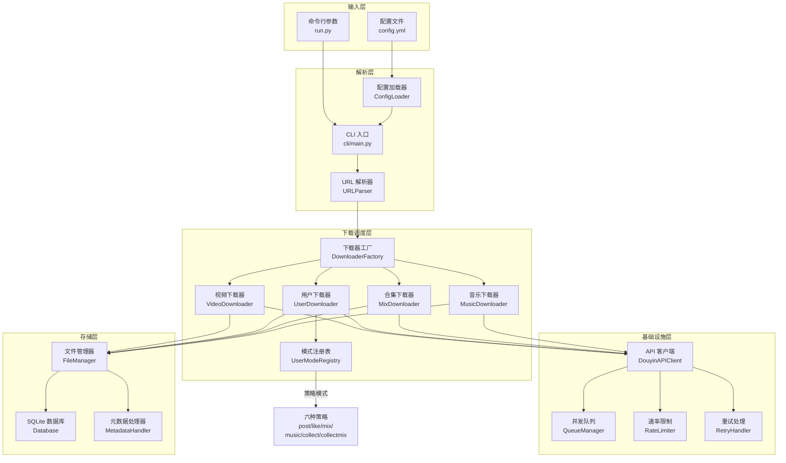
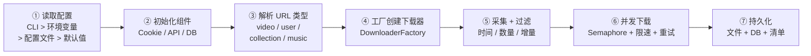

欢迎使用 **抖音批量下载工具（Douyin Downloader V2.0）** 的开发者文档。本文档面向希望理解项目设计意图、整体架构和核心能力的初学者开发者。你将在这里了解这个工具"能做什么"、"为什么这样设计"以及"代码组织成什么样子"，为后续深入各模块细节奠定全局认知基础。

Sources: [README.zh-CN.md](README.zh-CN.md#L1-L11), [__init__.py](__init__.py#L1-L2)

## 设计目标：为什么需要这个工具

抖音平台提供了丰富的短视频、图文、音乐、合集等内容，但在批量获取与管理这些媒体资产时，开发者面临几个核心痛点：**API 签名反爬机制复杂**（X-Bogus / A-Bogus）、**分页采集易被限流**、**大量下载时需要可靠的并发与重试控制**、**重复下载浪费带宽与存储**。本工具的设计目标正是系统性地解决这些问题：

- **全类型覆盖**：支持视频、图文、合集、音乐、用户主页批量、收藏夹等几乎所有抖音内容类型的下载
- **无水印优先**：自动选择无水印视频源，确保下载质量
- **生产级可靠性**：内置 SQLite 去重、指数退避重试、下载完整性校验（Content-Length 比对）等多层保障机制
- **反爬对抗**：集成 X-Bogus / A-Bogus 签名、msToken 自动生成、User-Agent 随机轮换，以及 API 分页受限时的浏览器兜底采集
- **开箱即用**：YAML 配置文件 + 命令行参数双层驱动，Docker 一键部署，降低上手门槛

Sources: [README.zh-CN.md](README.zh-CN.md#L14-L38), [PROJECT_SUMMARY.md](PROJECT_SUMMARY.md#L1-L11)

## 核心能力一览

下表汇总了工具当前版本（V2.0）支持的所有核心能力，帮助你在宏观层面快速建立认知：

| 能力类别 | 具体功能 | 说明 |
|---------|---------|------|
| **单条内容下载** | 单个视频 | `/video/{aweme_id}` |
| | 单个图文 | `/note/{note_id}`、`/gallery/{note_id}` |
| | 单个合集 | `/collection/{mix_id}`、`/mix/{mix_id}` |
| | 单个音乐 | `/music/{music_id}`（优先原声，缺失时回退首条关联作品） |
| | 短链解析 | `https://v.douyin.com/...` 自动解析为真实 URL |
| **用户批量下载** | 作品模式 | `/user/{sec_uid}` + `mode: post` |
| | 点赞模式 | `/user/{sec_uid}` + `mode: like` |
| | 合集模式 | `/user/{sec_uid}` + `mode: mix` |
| | 音乐模式 | `/user/{sec_uid}` + `mode: music` |
| | 收藏夹模式 | `/user/self?showTab=favorite_collection` + `mode: collect/collectmix` |
| **下载质量** | 无水印优先 | 自动选择无水印视频源 |
| | 附加资产 | 封面图、音乐、头像、JSON 元数据 |
| | 完整性校验 | Content-Length 比对，不完整文件自动清理并重试 |
| **流量控制** | 并发下载 | 可配置并发数，默认 5 |
| | 速率限制 | 默认 2 请求/秒 + 随机抖动 |
| | 指数退避重试 | 延迟序列 1s → 2s → 5s |
| **数据持久化** | SQLite 去重 | 数据库 + 本地文件双重去重 |
| | 增量下载 | 支持 `post/like/mix/music` 四种增量模式 |
| | 下载清单 | `download_manifest.jsonl`（append-only） |
| **扩展能力** | 视频转写 | 调用 OpenAI Transcriptions API |
| | 浏览器兜底 | API 分页受限时启动 Playwright 采集 |
| | Cookie 抓取 | Playwright 自动化获取登录态 |
| | Docker 部署 | 提供 Dockerfile，一键容器化运行 |

Sources: [README.zh-CN.md](README.zh-CN.md#L14-L38), [PROJECT_SUMMARY.md](PROJECT_SUMMARY.md#L11-L35)

## 整体架构：从 URL 到文件落盘

理解一个下载工具的最佳方式，是追踪一条 URL 从输入到文件保存的完整旅程。下图展示了本工具的核心数据流：



**核心数据流可以这样理解**：用户通过命令行或配置文件提供 URL 列表 → `URLParser` 解析 URL 类型（视频/用户/合集/音乐等） → `DownloaderFactory` 根据类型创建对应下载器 → 下载器调用 `DouyinAPIClient` 获取数据并通过 `FileManager` 落盘 → 过程中由 `QueueManager`、`RateLimiter`、`RetryHandler` 三大控制组件保障稳定性。

Sources: [cli/main.py](cli/main.py#L31-L126), [core/downloader_factory.py](core/downloader_factory.py#L17-L57), [core/url_parser.py](core/url_parser.py#L9-L48)

## 模块划分与职责

项目代码按职责划分为 **8 个顶层模块**，每个模块承担明确的单一职责。下表帮助你快速理解"哪个目录管什么"：

| 模块目录 | 职责 | 核心文件 | 一句话概括 |
|---------|------|---------|-----------|
| `cli/` | 命令行入口与进度展示 | `main.py`、`progress_display.py` | 用户交互的"门面" |
| `core/` | 下载主流程、URL 解析、API 客户端 | `api_client.py`、`url_parser.py`、`downloader_*.py` | 下载的"大脑" |
| `core/user_modes/` | 用户批量下载的策略模式 | `base_strategy.py`、`post_strategy.py` 等 | 用户模式的"可插拔策略" |
| `auth/` | Cookie 与 Token 管理 | `cookie_manager.py`、`ms_token_manager.py` | 认证的"钥匙" |
| `control/` | 并发、限速、重试控制 | `queue_manager.py`、`rate_limiter.py`、`retry_handler.py` | 流量的"红绿灯" |
| `storage/` | 文件管理、数据库、元数据 | `file_manager.py`、`database.py`、`metadata_handler.py` | 数据的"仓库" |
| `config/` | 配置加载与默认值 | `config_loader.py`、`default_config.py` | 运行参数的"词典" |
| `utils/` | 日志、校验、签名等通用工具 | `logger.py`、`validators.py`、`xbogus.py` | 各模块的"工具箱" |
| `tools/` | 辅助工具（Cookie 抓取） | `cookie_fetcher.py` | 开发者的"瑞士军刀" |
| `tests/` | 自动化测试 | 27 个 `test_*.py` 文件 | 质量的"守护者" |

Sources: [PROJECT_SUMMARY.md](PROJECT_SUMMARY.md#L38-L48), [core/user_mode_registry.py](core/user_mode_registry.py#L16-L35)

## 项目结构可视化

以下是项目根目录的完整文件树（省略虚拟环境和测试文件），帮助你建立空间认知：

```
douyin-downloader/
├── run.py                     # 🚀 程序入口
├── __init__.py                # 版本号定义
├── pyproject.toml             # 打包配置与依赖声明
├── requirements.txt           # pip 依赖清单
├── Dockerfile                 # Docker 容器化配置
├── config/                    # ⚙️ 配置系统
│   ├── config_loader.py       #   配置加载器（合并策略）
│   └── default_config.py      #   默认配置字典
├── cli/                       # 🖥️ 命令行界面
│   ├── main.py                #   CLI 主流程
│   ├── progress_display.py    #   Rich 进度条
│   └── whisper_transcribe.py  #   本地转写工具
├── core/                      # 🧠 核心下载逻辑
│   ├── api_client.py          #   抖音 API 客户端
│   ├── url_parser.py          #   URL 解析器
│   ├── downloader_base.py     #   下载器抽象基类
│   ├── downloader_factory.py  #   下载器工厂
│   ├── video_downloader.py    #   视频/图文下载器
│   ├── user_downloader.py     #   用户主页下载器
│   ├── mix_downloader.py      #   合集下载器
│   ├── music_downloader.py    #   音乐下载器
│   ├── transcript_manager.py  #   视频转写管理器
│   ├── user_mode_registry.py  #   用户模式注册表
│   └── user_modes/            #   策略模式实现
│       ├── base_strategy.py
│       ├── post_strategy.py
│       ├── like_strategy.py
│       ├── mix_strategy.py
│       ├── music_strategy.py
│       ├── collect_strategy.py
│       └── collect_mix_strategy.py
├── auth/                      # 🔑 认证管理
│   ├── cookie_manager.py      #   Cookie 管理器
│   └── ms_token_manager.py    #   msToken 自动生成
├── control/                   # 🚦 流量控制
│   ├── queue_manager.py       #   并发队列（Semaphore）
│   ├── rate_limiter.py        #   速率限制器
│   └── retry_handler.py       #   指数退避重试
├── storage/                   # 💾 数据持久化
│   ├── file_manager.py        #   文件路径构建与异步下载
│   ├── database.py            #   SQLite 数据库
│   └── metadata_handler.py    #   元数据与清单写入
├── utils/                     # 🔧 通用工具
│   ├── xbogus.py              #   X-Bogus 签名
│   ├── abogus.py              #   A-Bogus 签名
│   ├── cookie_utils.py        #   Cookie 工具函数
│   ├── validators.py          #   URL 校验与文件名清理
│   ├── helpers.py             #   通用辅助函数
│   └── logger.py              #   日志系统
└── tools/                     # 🛠️ 辅助工具
    └── cookie_fetcher.py      #   Playwright Cookie 抓取
```

Sources: [PROJECT_SUMMARY.md](PROJECT_SUMMARY.md#L38-L48), [pyproject.toml](pyproject.toml#L50-L54)

## 技术栈概览

本工具基于 **Python 3.8+** 构建，采用纯异步（`asyncio`）架构，所有网络请求和文件 I/O 均为异步操作。核心依赖如下：

| 依赖 | 版本要求 | 用途 |
|------|---------|------|
| `aiohttp` | ≥3.9.0 | 异步 HTTP 客户端，所有网络请求的基础 |
| `aiofiles` | ≥23.2.1 | 异步文件写入 |
| `aiosqlite` | ≥0.19.0 | 异步 SQLite 数据库操作 |
| `rich` | ≥13.7.0 | 终端进度条与美化输出 |
| `pyyaml` | ≥6.0.1 | YAML 配置文件解析 |
| `python-dateutil` | ≥2.8.2 | 时间解析与格式化 |
| `gmssl` | ≥3.2.2 | 国密算法库（用于签名） |
| `playwright` | 可选 | 浏览器自动化（Cookie 抓取 / 兜底采集） |
| `openai-whisper` | 可选 | 本地视频转写 |

项目采用 **MIT 开源协议**，意味着你可以自由使用、修改和分发。

Sources: [pyproject.toml](pyproject.toml#L24-L49), [requirements.txt](requirements.txt#L1-L8), [LICENSE](LICENSE#L1-L22)

## 核心设计模式

本工具在架构上运用了几个经典设计模式，理解它们有助于你快速阅读代码：

**工厂模式** —— [`DownloaderFactory`](core/downloader_factory.py) 根据解析出的 URL 类型（`video` / `user` / `collection` / `music` / `gallery`）创建对应的下载器实例。新增内容类型时只需添加工厂分支，不影响已有逻辑。

**策略模式** —— 用户批量下载场景下，[`UserModeRegistry`](core/user_mode_registry.py) 注册了六种下载策略（`post` / `like` / `mix` / `music` / `collect` / `collectmix`），每种策略独立实现"采集 → 过滤 → 下载"的完整流程。用户通过配置文件的 `mode` 字段选择策略，运行时由注册表动态分发。

**模板方法模式** —— [`BaseDownloader`](core/downloader_base.py) 定义了去重判断（`_should_download`）、时间过滤（`_filter_by_time`）、资产下载（`_download_assets`）等通用流程骨架，各具体下载器（`VideoDownloader`、`UserDownloader` 等）只需实现 `download()` 抽象方法即可复用全部基础设施。

Sources: [core/downloader_factory.py](core/downloader_factory.py#L17-L57), [core/user_mode_registry.py](core/user_mode_registry.py#L16-L35), [core/downloader_base.py](core/downloader_base.py#L43-L133)

## 运行流程一瞥

从用户执行 `python run.py -c config.yml` 到下载完成，核心流程可概括为 7 个步骤：



**步骤 ①** 中，配置加载遵循优先级覆盖原则：命令行参数 > 环境变量 > YAML 配置文件 > `default_config.py` 中的默认值。这意味着你可以用一份基础配置文件，再通过命令行参数临时调整并发数或下载路径。

**步骤 ⑤** 是智能过滤的核心：时间过滤（`start_time` / `end_time`）筛选发布日期范围，数量限制（`number.post` 等）控制下载上限，增量模式（`increase.post` 等）在检测到已下载作品时自动停止——三者协同工作，确保"只下载你需要的"。

Sources: [cli/main.py](cli/main.py#L128-L220), [config/default_config.py](config/default_config.py#L3-L55)

## 当前限制

作为 V2.0 版本，工具仍有部分能力边界需要了解：

- **浏览器兜底**：当前仅对 `post` 模式完整验证，`like / mix / music` 主要依赖 API 正常分页
- **收藏夹模式**：`collect` / `collectmix` 仅支持当前已登录 Cookie 对应的账号，且必须单独使用
- **增量截断**：收藏夹模式不支持增量停止，会拉取全部内容
- **兼容别名**：`number.allmix` / `increase.allmix` 作为 V1 兼容别名保留，运行时会归一化为 `mix`

Sources: [README.zh-CN.md](README.zh-CN.md#L40-L46)

## 下一步阅读建议

本页面帮助你建立了项目的全局认知。根据你的学习目标，建议按以下路径继续阅读：

**如果你是首次接触本项目**，建议按顺序阅读"快速入门"系列：
1. [快速启动：环境准备、安装依赖与首次运行](2-kuai-su-qi-dong-huan-jing-zhun-bei-an-zhuang-yi-lai-yu-shou-ci-yun-xing) — 动手把项目跑起来
2. [配置文件详解：config.yml 全字段说明与典型场景示例](3-pei-zhi-wen-jian-xiang-jie-config-yml-quan-zi-duan-shuo-ming-yu-dian-xing-chang-jing-shi-li) — 理解每个配置项的含义
3. [命令行参数与运行模式](4-ming-ling-xing-can-shu-yu-yun-xing-mo-shi) — 掌握命令行交互方式

**如果你想深入理解架构设计**，建议从架构全景开始：
1. [整体架构：模块划分与数据流全景](6-zheng-ti-jia-gou-mo-kuai-hua-fen-yu-shu-ju-liu-quan-jing) — 深入理解模块间协作
2. [URL 解析与路由分发机制](7-url-jie-xi-yu-lu-you-fen-fa-ji-zhi) — 理解请求如何被路由到正确的下载器