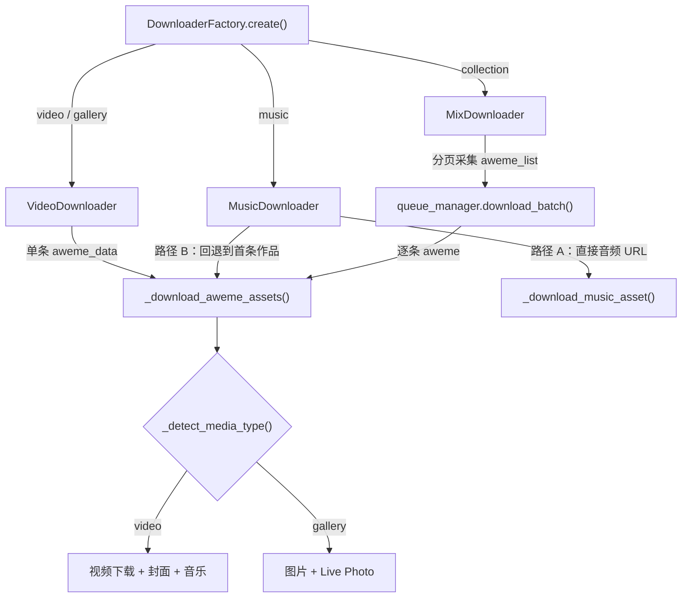

本文深入分析 `VideoDownloader`、`MusicDownloader` 和 `MixDownloader` 三个具体下载器的实现逻辑。它们均继承自 [基础下载器（BaseDownloader）](9-ji-chu-xia-zai-qi-basedownloader-de-zi-chan-xia-zai-yu-qu-zhong-luo-ji)，通过覆写 `download()` 抽象方法，分别处理单条视频/图文、音乐原声、以及合集（Collection）三种 URL 类型。核心的资产下载、去重、文件保存逻辑统一收敛在基类的 `_download_aweme_assets()` 方法中，三个子类各自负责**数据获取策略**和**下载流程编排**。

Sources: [video_downloader.py](core/video_downloader.py#L1-L51), [music_downloader.py](core/music_downloader.py#L1-L223), [mix_downloader.py](core/mix_downloader.py#L1-L123), [downloader_base.py](core/downloader_base.py#L235-L447)

## 工厂路由：URL 类型到下载器的映射

[下载器工厂](8-xia-zai-qi-gong-han-mo-shi-an-url-lei-xing-chuang-jian-xia-zai-qi) 根据 [URL 解析器](7-url-jie-xi-yu-lu-you-fen-fa-ji-zhi) 产出的 `url_type` 字符串创建对应的下载器实例。下表展示了三种 URL 类型与下载器的对应关系：

| `url_type` | 下载器类 | 说明 |
|---|---|---|
| `video` | `VideoDownloader` | 单条视频/图文作品 |
| `gallery` | `VideoDownloader` | 图文合集，复用同一下载器 |
| `music` | `MusicDownloader` | 音乐原声页面 |
| `collection` | `MixDownloader` | 用户合集/收藏夹 |

**关键设计决策**：`gallery` 类型并未分配独立的下载器，而是与 `video` 共享 `VideoDownloader`。原因在于图文与视频的区分并非在工厂层完成，而是延迟到基类 `_download_aweme_assets()` 内部的 `_detect_media_type()` 方法——该方法根据 `aweme_data` 中的字段（`image_post_info`、`images`、`aweme_type`）动态判定媒体类型，再分别走视频或图文的下载分支。

Sources: [downloader_factory.py](core/downloader_factory.py#L44-L56), [downloader_base.py](core/downloader_base.py#L484-L502)

## 三种下载器的协作关系



上图展示了三种下载器的核心差异：**VideoDownloader 是"单条直取"，MusicDownloader 是"双路径回退"，MixDownloader 是"分页批量并发"**。但无论哪种路径，最终的文件保存都汇聚到基类的 `_download_aweme_assets()` 方法。

Sources: [downloader_factory.py](core/downloader_factory.py#L17-L56), [downloader_base.py](core/downloader_base.py#L235-L447)

## VideoDownloader：单条作品的精简管道

`VideoDownloader` 是三个下载器中逻辑最精简的一个，其 `download()` 方法本质上是一个五步管道：

1. **提取 aweme_id** — 从 `parsed_url` 字典中取出作品唯一标识，缺失则直接返回空结果
2. **初始化进度** — 设定 `total=1`，通知进度条进入"单视频下载"步骤
3. **去重检查** — 调用 `_should_download(aweme_id)` 同时查数据库和本地文件索引，已存在则标记 `skipped`
4. **获取详情** — 通过 `api_client.get_video_detail(aweme_id)` 获取完整的作品数据
5. **下载资产** — 委托 `_download_aweme()` → `_download_aweme_assets()` 执行实际的文件下载

```python
# VideoDownloader.download() 的核心流程（简化）
async def download(self, parsed_url):
    aweme_id = parsed_url.get('aweme_id')
    if not await self._should_download(aweme_id):
        return result  # skipped

    await self.rate_limiter.acquire()
    aweme_data = await self.api_client.get_video_detail(aweme_id)
    success = await self._download_aweme(aweme_data)
    # 统计 success / failed
```

`_download_aweme()` 方法仅从 `aweme_data` 中提取 `author_name`，然后立即调用基类的 `_download_aweme_assets()`。这意味着 **VideoDownloader 自身不包含任何文件 I/O 逻辑**，它纯粹是一个 API 调用 + 去重判断的编排层。

Sources: [video_downloader.py](core/video_downloader.py#L9-L51)

## 基类 _download_aweme_assets()：统一的资产下载引擎

`_download_aweme_assets()` 是整个下载系统的核心方法，被三个子类共享调用。它承担了从数据解析到文件保存的全部工作，按以下阶段执行：

### 第一阶段：路径构建与媒体类型检测

方法首先从 `aweme_data` 中提取 `desc`（标题）、`create_time`（发布时间戳），构建格式化的文件名 `{日期}_{标题}_{aweme_id}`，并通过 `file_manager.get_save_path()` 确定保存目录。随后调用 `_detect_media_type()` 判定内容类型。

**媒体类型检测**采用两级策略：

| 优先级 | 检测条件 | 结果 |
|---|---|---|
| 1 | `image_post_info` / `images` / `image_list` 字段存在 | `gallery` |
| 2 | `aweme_type` ∈ {2, 68, 150} | `gallery` |
| 3 | 其他所有情况 | `video` |

Sources: [downloader_base.py](core/downloader_base.py#L235-L302), [downloader_base.py](core/downloader_base.py#L484-L502)

### 第二阶段：按媒体类型分发下载

**视频分支**（`media_type == "video"`）执行三步下载：

1. **无水印视频** — `_build_no_watermark_url()` 从 `play_addr.url_list` 中优先选取带 `watermark=0` 的 URL；若 URL 位于 `douyin.com` 域名下，则调用 `api_client.sign_url()` 进行 X-Bogus 签名；若无可用 URL，则构造 `/aweme/v1/play/` 签名路径作为兜底
2. **封面图**（配置 `cover=true`）— 从 `video.cover` 提取 URL，以 `optional=True` 下载（失败不影响整体结果）
3. **背景音乐**（配置 `music=true`）— 从 `music.play_url` 提取 URL，同样可选下载

**图文分支**（`media_type == "gallery"`）通过 `_collect_image_urls()` 和 `_collect_image_live_urls()` 分别提取静态图片和 Live Photo（实况照片）的 URL 列表。图片按序号命名 `{stem}_{index}.webp`，Live Photo 以 `{stem}_live_{index}.mp4` 保存。图片 URL 的提取优先级为：`download_url` > `download_addr` > `download_url_list` > 对象本身 > `display_image` > `owner_watermark_image`。

Sources: [downloader_base.py](core/downloader_base.py#L272-L374), [downloader_base.py](core/downloader_base.py#L504-L604)

### 第三阶段：附加资产与持久化

主资产下载成功后，方法依次执行以下可选操作：

| 配置项 | 行为 | 文件命名 |
|---|---|---|
| `avatar=true` | 下载作者头像 | `{stem}_avatar.jpg` |
| `json=true` | 保存完整元数据 | `{stem}_data.json` |
| （始终执行） | 写入数据库记录 | — |
| （始终执行） | 追加下载清单（Manifest） | `download_manifest.jsonl` |
| （视频类型） | 触发视频转写 | 由 TranscriptManager 处理 |

最后调用 `_mark_local_aweme_downloaded()` 将 `aweme_id` 加入内存索引，避免同一次运行中重复下载。

Sources: [downloader_base.py](core/downloader_base.py#L376-L447)

## MusicDownloader：双路径回退的音乐下载策略

`MusicDownloader` 是三个下载器中策略最复杂的一个。它的核心挑战在于：**抖音的音乐详情 API 并非总能直接返回可播放的音频 URL**。为此，它设计了一个主路径 + 回退路径的双层策略。

### 路径 A：直接音频下载

首先调用 `_get_music_detail()` 获取音乐详情，然后通过 `_extract_music_url()` 从返回数据的多层嵌套结构中提取音频 URL。提取顺序覆盖了六种可能的数据路径：

```
detail.play_url → detail.play_url_lowbr → detail.audio_url
→ detail.music.play_url → detail.music.play_url_lowbr
→ detail.music_info.play_url
```

找到 URL 后，进入 `_download_music_asset()` 方法完成下载。该方法与基类的 `_download_aweme_assets()` 类似但独立实现，主要差异在于：

- **文件命名**：使用 `{日期}_{标题}_music_{music_id}` 格式，其中 `music_id` 带 `music_` 前缀以区别于普通作品
- **扩展名推断**：`_infer_audio_extension()` 从 URL 路径中解析真实扩展名，支持 `.mp3`、`.m4a`、`.aac`、`.wav`、`.flac`、`.ogg`、`.opus`，无法识别时默认 `.mp3`
- **数据库记录**：`aweme_type` 固定为 `"music"`，`record_id` 使用 `music_{id}` 格式

### 路径 B：回退到首条使用该音乐的作品

当 `_extract_music_url()` 返回 `None`（即音乐详情中不包含可直接播放的链接）时，下载器进入回退模式：

1. 调用 `_get_first_music_aweme()` 通过 `get_music_aweme(music_id, cursor=0, count=1)` 获取使用该音乐的第一条作品
2. 对该作品执行去重检查（`_should_download`）
3. 调用基类的 `_download_aweme_assets(aweme, author, mode="music")`，以 `mode="music"` 标记下载来源

这种设计确保了即使音乐 API 不返回直接链接，用户仍能通过关联作品获取音频内容。

Sources: [music_downloader.py](core/music_downloader.py#L18-L63), [music_downloader.py](core/music_downloader.py#L65-L223)

## MixDownloader：分页采集与并发下载的合集处理器

`MixDownloader` 处理的是合集（Collection）类型的 URL，其特点是需要先**分页采集**所有作品条目，再**并发下载**。这使得它是三个下载器中唯一使用 `queue_manager.download_batch()` 进行批量并发调度的下载器。

### 分页采集阶段

`_collect_mix_aweme_list()` 实现了一个标准的游标分页循环：

```
while has_more:
    page = await get_mix_aweme(mix_id, cursor, count=20)
    items = normalize_page_data(page)
    → 提取 aweme → 追加到列表
    → 检查 number.mix 数量限制
    → 更新 cursor 和 has_more
    → 防死循环：cursor 未前进时中断
```

关键设计要点：

- **每页 20 条**：固定 `count=20`，与抖音 API 的推荐分页大小一致
- **数量限制**：读取 `config.number.mix` 配置，达到限制时立即截断列表并退出循环
- **防死循环保护**：当 `has_more=True` 但 `cursor` 未前进时，记录警告并主动中断，避免无限循环
- **数据标准化**：使用 `BaseUserModeStrategy._normalize_page_data()` 统一不同 API 返回格式的分页数据

### 并发下载阶段

采集完成后，下载器通过 `queue_manager.download_batch()` 对 `aweme_list` 进行并发处理。每个条目的处理函数 `_process_aweme` 执行标准的去重 → 下载流程：

```python
async def _process_aweme(item):
    aweme_id = item.get("aweme_id")
    if not await self._should_download(str(aweme_id)):
        return {"status": "skipped", "aweme_id": aweme_id}
    success = await self._download_aweme_assets(item, author_name, mode="mix")
    return {"status": "success" if success else "failed", "aweme_id": aweme_id}
```

值得注意的是，**合集的作者名称**统一从 `get_mix_detail()` 获取，而非从每条作品中单独提取。这确保了合集中所有文件保存到同一作者目录下。

### 嵌套数据提取

`_extract_aweme_from_item()` 处理了抖音 API 返回数据的三种嵌套格式：

| 数据结构 | 提取路径 |
|---|---|
| 扁平结构 | `item.aweme_id` 直接存在 |
| 嵌套 aweme | `item.aweme.aweme_id` |
| 嵌套 aweme_info | `item.aweme_info.aweme_id` |
| 嵌套 aweme_detail | `item.aweme_detail.aweme_id` |

Sources: [mix_downloader.py](core/mix_downloader.py#L12-L123)

## 三种下载器的横向对比

| 维度 | VideoDownloader | MusicDownloader | MixDownloader |
|---|---|---|---|
| **输入标识** | `aweme_id` | `music_id` | `mix_id` |
| **API 调用** | `get_video_detail` ×1 | `get_music_detail` + 可选 `get_music_aweme` | `get_mix_aweme` ×N + `get_mix_detail` ×1 |
| **下载策略** | 单条直取 | 双路径回退 | 分页采集 + 并发批量 |
| **核心下载方法** | `_download_aweme_assets()` | `_download_music_asset()` 或 `_download_aweme_assets()` | `_download_aweme_assets()` |
| **并发支持** | 无（单条） | 无（单条） | `queue_manager.download_batch()` |
| **速率控制** | 下载前 `rate_limiter.acquire()` | 无显式调用（依赖 API 层） | 分页循环中每次 `rate_limiter.acquire()` |
| **去重检查** | ✅ `_should_download` | 仅回退路径 | ✅ 每条 `_should_download` |
| **代码行数** | ~50 行 | ~220 行 | ~120 行 |

Sources: [video_downloader.py](core/video_downloader.py#L1-L51), [music_downloader.py](core/music_downloader.py#L1-L223), [mix_downloader.py](core/mix_downloader.py#L1-L123)

## 下一步阅读

- 了解并发队列如何驱动 MixDownloader 的批量下载：[并发队列管理（QueueManager）与 Semaphore 调度](17-bing-fa-dui-lie-guan-li-queuemanager-yu-semaphore-diao-du)
- 深入无水印视频 URL 的签名构造逻辑：[抖音 API 客户端（DouyinAPIClient）的请求封装与分页标准化](11-dou-yin-api-ke-hu-duan-douyinapiclient-de-qing-qiu-feng-zhuang-yu-fen-ye-biao-zhun-hua)
- 理解下载完成后的文件管理与持久化：[文件管理器（FileManager）的路径构建与异步下载](21-wen-jian-guan-li-qi-filemanager-de-lu-jing-gou-jian-yu-yi-bu-xia-zai)