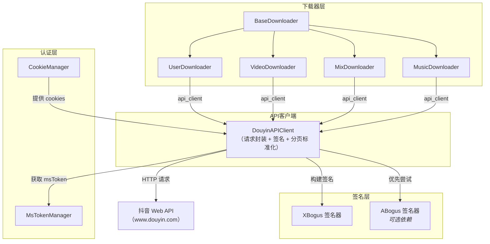
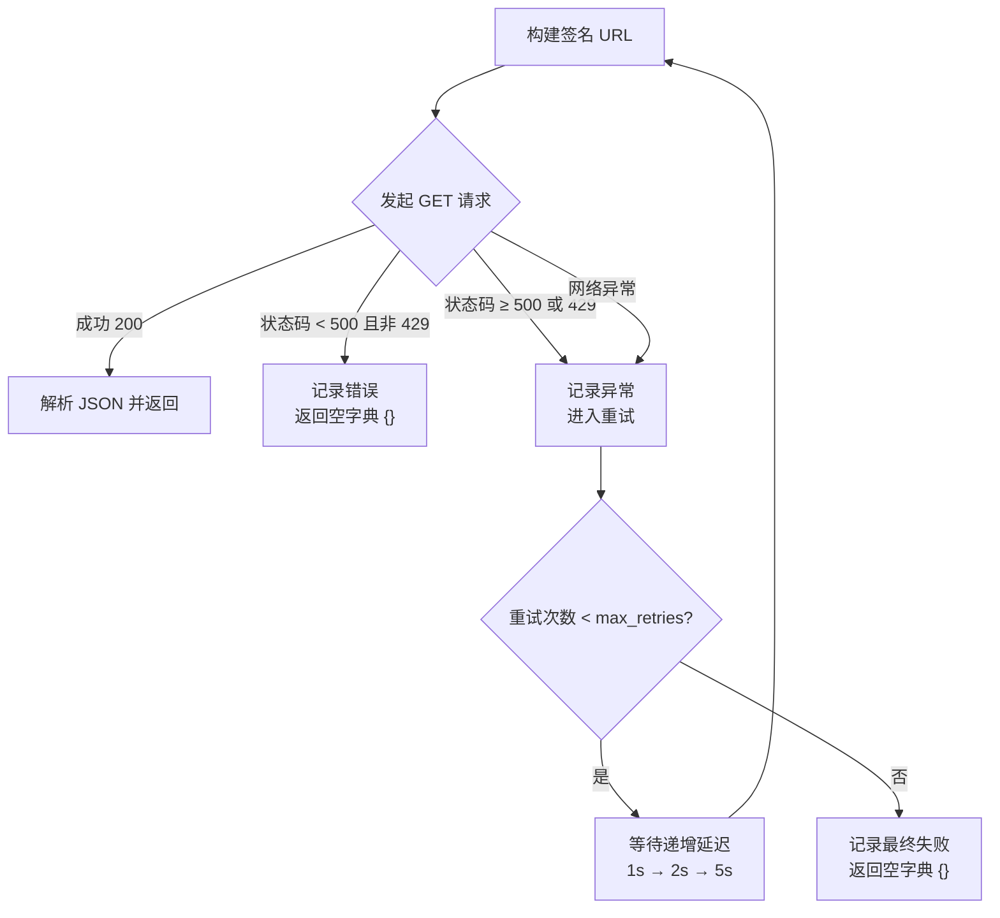
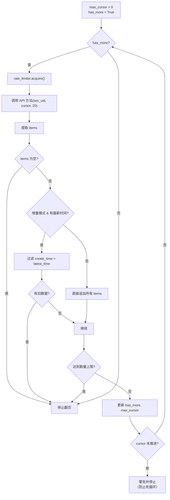

`DouyinAPIClient` 是本项目与抖音 Web API 交互的唯一入口，承担着**请求签名、会话管理、分页标准化、短链解析**四项核心职责。所有下载器（`VideoDownloader`、`UserDownloader`、`MixDownloader`、`MusicDownloader`）均通过 `BaseDownloader.api_client` 属性持有其实例，通过调用其高级方法获取结构化数据，而非直接构造 HTTP 请求。本页将深入剖析该类的设计动机、内部机制及其产出的标准化分页契约。

Sources: [api_client.py](core/api_client.py#L46-L84), [downloader_base.py](core/downloader_base.py#L47-L57)

---

## 架构定位：请求管道的中央枢纽

`DouyinAPIClient` 在整体架构中位于「下载器层」与「抖音 Web API」之间，是所有 HTTP 请求的必经通道。下方 Mermaid 图展示了其在数据流中的位置：



该设计的核心原则是**关注点分离**：下载器只需关心「取什么数据」和「怎么保存」，而「如何合法地请求数据」完全由 `DouyinAPIClient` 封装。这种隔离使得签名算法升级或 API 参数变更时，修改范围被严格限定在 `api_client.py` 一个文件内。

Sources: [api_client.py](core/api_client.py#L1-L20), [cli/main.py](cli/main.py#L47-L50)

---

## 初始化与会话管理

### 构造函数与身份伪装

`DouyinAPIClient` 的构造函数接收 `cookies`（认证凭证字典）和可选的 `proxy`（代理地址），在初始化阶段完成以下关键操作：

1. **Cookie 清洗**：通过 `sanitize_cookies()` 过滤非法字符和无效键名，确保传入 aiohttp 的 cookie 符合 RFC 6265 规范。
2. **UA 随机选择**：从包含 5 个主流浏览器 User-Agent 的池中随机选取一个，降低因固定 UA 被风控的概率。
3. **签名器初始化**：以选定的 UA 创建 `XBogus` 实例；若 `gmssl` 可用则启用 `ABogus`（更高级的签名方案）。
4. **msToken 管理**：创建 `MsTokenManager` 实例，尝试从已有 cookies 中提取 `msToken`，否则将在首次请求时自动生成。

Sources: [api_client.py](core/api_client.py#L63-L84), [cookie_utils.py](utils/cookie_utils.py#L19-L29)

### 异步上下文管理器模式

`DouyinAPIClient` 实现了 `__aenter__` / `__aexit__` 协议，支持 `async with` 语法。在入口处调用 `_ensure_session()` 创建 `aiohttp.ClientSession`，出口处调用 `close()` 释放连接池资源。会话的创建采用懒初始化策略——仅在首次请求时才建立，且当会话被意外关闭后会自动重建。

```python
async with DouyinAPIClient(cookies, proxy=config.get("proxy")) as api_client:
    # 所有 API 调用共享同一个 aiohttp 会话
    data = await api_client.get_user_post(sec_uid)
```

Sources: [api_client.py](core/api_client.py#L85-L109)

---

## 请求参数构建与签名机制

### 默认查询参数字典

`_default_query()` 方法构建了一组通用的抖音 Web API 查询参数，模拟浏览器的合法请求特征。这组参数包含设备平台标识（`device_platform=webapp`）、应用 ID（`aid=6383`）、版本信息、屏幕分辨率、浏览器引擎信息等共计 22 个字段，并在末尾附加动态获取的 `msToken`。

Sources: [api_client.py](core/api_client.py#L126-L155)

### msToken 的自动获取与缓存

`msToken` 是抖音 Web API 的必要鉴权参数。`_ensure_ms_token()` 的策略是：优先使用已有 cookies 中的 `msToken`；若不存在，则通过 `asyncio.to_thread()` 在后台线程中调用 `MsTokenManager.ensure_ms_token()` 生成，避免阻塞事件循环。获取成功后，token 会被同步更新到 cookies 字典和 aiohttp 的 cookie jar 中。

Sources: [api_client.py](core/api_client.py#L111-L124), [ms_token_manager.py](auth/ms_token_manager.py#L18-L59)

### 双签名机制：A-Bogus 优先 + X-Bogus 兜底

`build_signed_path()` 实现了一个优雅的**签名降级链**：

| 优先级 | 签名算法 | 依赖条件 | 行为 |
|--------|---------|---------|------|
| 1（优先） | A-Bogus | `gmssl` 库可用 | 基于 Edge 浏览器指纹生成 `a_bogus` 参数 |
| 2（兜底） | X-Bogus | 始终可用 | 基于 UA 计算的纯 Python 实现 |

当 `ABogus` 签名器因任何异常失败时，`_build_abogus_url()` 返回 `None`，`build_signed_path()` 自动回退到 `XBogus` 签名。这种设计确保了即使可选依赖缺失，客户端仍能正常工作。签名算法的详细原理请参阅 [X-Bogus 与 A-Bogus 签名算法原理](12-x-bogus-yu-a-bogus-qian-ming-suan-fa-yuan-li)。

Sources: [api_client.py](core/api_client.py#L157-L180)

---

## 请求执行与内置重试

### `_request_json()` 的三层防护

`_request_json()` 是所有 API 调用的最终执行器，其内部实现了以下机制：



重试策略采用固定延迟序列 `[1, 2, 5]` 秒，而非指数退避，这是一个有意为之的设计——对于抖音 API 而言，固定短延迟比指数增长更不易触发频率风控。`suppress_error` 参数允许调用方在「预期可能失败」的场景（如 `get_video_detail()` 的 AID 轮询）下将错误日志降级为 debug 级别，避免日志噪音。

Sources: [api_client.py](core/api_client.py#L182-L229)

---

## 分页响应标准化：`_normalize_paged_response()`

这是 `DouyinAPIClient` 对下游消费者最重要的契约。抖音不同 API 端点返回的 JSON 结构高度不一致——列表数据可能存放在 `aweme_list`、`mix_list`、`music_list` 或 `items` 字段中，分页游标可能是 `max_cursor` 或 `cursor`，`has_more` 可能是整数或布尔值。`_normalize_paged_response()` 将这些差异抹平为统一的 DTO（Data Transfer Object）。

### 标准化输出字段

| 字段 | 类型 | 含义 |
|------|------|------|
| `items` | `List[Dict]` | **主数据列表**，始终为数组，无论原始键名 |
| `aweme_list` | `List[Dict]` | `items` 的别名，兼容旧调用方 |
| `has_more` | `bool` | 是否还有更多数据 |
| `max_cursor` | `int` | 下一页游标值 |
| `status_code` | `int` | API 状态码 |
| `source` | `str` | 数据来源标识（`"api"` 或 `"browser"`） |
| `risk_flags` | `Dict` | 风控标志（登录提示、验证码） |
| `raw` | `Dict` | 原始 API 响应，供高级消费者访问 |

### 键名搜索优先级

`item_keys` 参数允许调用方指定优先搜索的键名列表。标准化的搜索顺序为 `["items", *item_keys, "aweme_list", "mix_list", "music_list"]`，即优先使用通用的 `items`，然后是调用方指定的专用键名，最后回退到已知的抖音 API 常见键名。这种设计兼顾了**通用性**和**可扩展性**。

### 类型强制的健壮性

`has_more`、`max_cursor`、`status_code` 三个字段的原始值可能是字符串、整数、布尔值甚至 `None`。标准化过程通过 `int()` + `try/except` 统一强制转换为目标类型，确保下游代码无需关心类型兼容问题。`risk_flags` 还会从嵌套结构（如 `not_login_module.guide_login_tip_exist`）中提取风控信号。

Sources: [api_client.py](core/api_client.py#L231-L291)

---

## API 端点方法与分页参数构建

### 参数构建器分层

`DouyinAPIClient` 采用**参数构建器方法**分层设计，避免每个端点方法重复构造公共参数：

| 构建器 | 用途 | 覆盖端点 |
|--------|------|---------|
| `_default_query()` | 全局公共参数 + msToken | 所有端点 |
| `_build_user_page_params()` | 用户级分页（`sec_uid` + `cursor` + `count`） | post, like, mix, music |
| `_build_collect_page_params()` | 收藏夹分页（`cursor` + `count` + 特定版本号） | collects, collect_aweme, collect_mix |

### 端点方法全景

下表汇总了所有公开的 API 端点方法、对应的抖音 Web API 路径及其返回类型：

| 方法 | API 路径 | 返回类型 | 说明 |
|------|---------|---------|------|
| `get_user_post()` | `/aweme/v1/web/aweme/post/` | 标准化分页 DTO | 用户发布列表，附加直播回放等参数 |
| `get_user_like()` | `/aweme/v1/web/aweme/favorite/` | 标准化分页 DTO | 用户点赞列表 |
| `get_user_mix()` | `/aweme/v1/web/mix/list/` | 标准化分页 DTO | 用户合集列表 |
| `get_user_music()` | `/aweme/v1/web/music/list/` | 标准化分页 DTO | 用户音乐收藏列表 |
| `get_user_collects()` | `/aweme/v1/web/collects/list/` | 标准化分页 DTO | 用户收藏夹列表（仅 `self`） |
| `get_collect_aweme()` | `/aweme/v1/web/collects/video/list/` | 标准化分页 DTO | 指定收藏夹内视频 |
| `get_user_collect_mix()` | `/aweme/v1/web/mix/listcollection/` | 标准化分页 DTO | 用户收藏的合集列表 |
| `get_mix_detail()` | `/aweme/v1/web/mix/detail/` | 原始 dict | 合集元信息 |
| `get_mix_aweme()` | `/aweme/v1/web/mix/aweme/` | 标准化分页 DTO | 指定合集内的视频 |
| `get_music_detail()` | `/aweme/v1/web/music/detail/` | 原始 dict | 音乐元信息 |
| `get_music_aweme()` | `/aweme/v1/web/music/aweme/` | 标准化分页 DTO | 使用指定音乐的视频 |
| `get_user_info()` | `/aweme/v1/web/user/profile/other/` | 原始 dict | 用户资料 |
| `get_video_detail()` | `/aweme/v1/web/aweme/detail/` | 原始 dict | 视频/图文详情（AID 轮询） |
| `resolve_short_url()` | 短链重定向 | `Optional[str]` | 短链解析为完整 URL |

Sources: [api_client.py](core/api_client.py#L293-L491)

### `get_video_detail()` 的 AID 轮询策略

这是一个特别值得注意的设计。抖音对 `aid` 参数有内容过滤行为：`aid=1128` 适用于视频内容但会过滤掉图文/笔记（note/gallery），而 `aid=6383` 适用于图文但可能遗漏部分视频。因此 `get_video_detail()` 定义了 `_DETAIL_AID_CANDIDATES = ("6383", "1128")` 轮询列表，按顺序尝试：

1. 先以 `aid=6383` 请求，若返回 `aweme_detail` 则直接使用。
2. 若返回了 `filter_detail.filter_reason`（如 `"images_base"`），说明内容被过滤，换下一个 AID 重试。
3. 若 `aweme_detail` 为 `None` 但无 `filter_reason`，说明内容确实不存在，停止重试。

Sources: [api_client.py](core/api_client.py#L307-L350)

---

## 分页消费模式：策略层的标准遍历循环

`DouyinAPIClient` 产出的标准化 DTO 被 `BaseUserModeStrategy._collect_paged_aweme()` 以统一的 while 循环消费。该循环的核心逻辑如下：



该模式的关键防护措施包括：**速率限制**（每页请求前 `acquire`）、**死循环检测**（当 `max_cursor` 未推进时主动停止）、**增量下载断点**（通过 `create_time` 过滤已下载内容）、**数量截断**（尊重用户配置的下载数量上限）。

Sources: [base_strategy.py](core/user_modes/base_strategy.py#L49-L110)

---

## 分页 DTO 在策略层的二次标准化

尽管 `DouyinAPIClient` 已经产出了标准化的 DTO，`BaseUserModeStrategy._normalize_page_data()` 仍对 DTO 进行了二次校验。这是一个防御性设计——考虑到未来可能出现未经过 `DouyinAPIClient` 的数据来源（如浏览器兜底），策略层需要独立保证数据格式的可靠性。该方法保证输出始终包含 `items`（列表）、`has_more`（布尔）、`max_cursor`（整数）、`status_code`（整数）四个核心字段。

Sources: [base_strategy.py](core/user_modes/base_strategy.py#L234-L257)

---

## 跨端点消费模式对比

不同策略模式对 API 端点的消费模式存在显著差异，这决定了每种模式所需的代码复杂度：

| 模式 | API 方法 | 消费模式 | 复杂度 |
|------|---------|---------|--------|
| `post` | `get_user_post` | 单层分页 + 浏览器兜底 | 高（含分页受限检测与恢复） |
| `like` | `get_user_like` | 单层分页 | 低（直接继承基类） |
| `mix` | `get_user_mix` → `get_mix_aweme` | 两层展开：先取合集列表，再逐个取视频 | 中 |
| `music` | `get_user_music` → `get_music_aweme` | 两层展开：先取音乐列表，再逐个取视频 | 中 |
| `collect` | `get_user_collects` → `get_collect_aweme` | 两层展开：先取收藏夹列表，再逐个取视频 | 中 |
| `collectmix` | `get_user_collect_mix` → `get_mix_aweme` | 两层展开：先取收藏合集列表，再逐个取视频 | 中 |

`post` 模式的特殊性在于它独占了一套**分页受限检测与浏览器兜底**逻辑（详见 [分页受限时的浏览器兜底采集机制](16-fen-ye-shou-xian-shi-de-liu-lan-qi-dou-di-cai-ji-ji-zhi)），而 `mix`/`music`/`collect` 模式则共享基类的 `_expand_metadata_items()` 两层展开方法。

Sources: [post_strategy.py](core/user_modes/post_strategy.py#L42-L92), [base_strategy.py](core/user_modes/base_strategy.py#L150-L220)

---

## 短链解析

`resolve_short_url()` 是一个独立的辅助方法，专门处理 `v.douyin.com` 格式的短链。它通过 aiohttp 的 `allow_redirects=True` 自动跟随重定向，最终返回落地页的完整 URL。此方法在 CLI 主流程中作为 URL 解析的第一步被调用，先于 [URL 解析与路由分发机制](7-url-jie-xi-yu-lu-you-fen-fa-ji-zhi) 的类型判断。

Sources: [api_client.py](core/api_client.py#L479-L490), [cli/main.py](cli/main.py#L53-L56)

---

## Cookie 安全与浏览器同步

### Cookie 安全过滤

`_BROWSER_COOKIE_BLOCKLIST` 定义了 10 个敏感 cookie 名称（如 `sessionid`、`sid_tt`、`passport_auth_status` 等），在将 cookie 传递给 Playwright 浏览器实例时会被自动过滤。这些 cookie 涉及登录态管理，传递给自动化浏览器可能导致账号风控。

### 浏览器 Cookie 回写

`_sync_browser_cookies()` 在浏览器兜底采集结束后执行，将 Playwright 浏览器会话中获取到的 `douyin.com` 域名下的新鲜 cookie 同步回 `DouyinAPIClient` 的 cookie 字典和 aiohttp 会话的 cookie jar。这确保了后续 API 请求能利用浏览器会话中可能更新的认证信息。

Sources: [api_client.py](core/api_client.py#L48-L61), [api_client.py](core/api_client.py#L714-L728), [api_client.py](core/api_client.py#L795-L816)

---

## 设计总结与阅读指引

`DouyinAPIClient` 的核心设计可归纳为三个层次的抽象：

1. **传输层**（`_request_json` + `build_signed_path`）：封装 HTTP 通信、签名、重试
2. **协议层**（`_normalize_paged_response`）：抹平抖音 API 的响应差异，输出统一 DTO
3. **业务层**（各 `get_*` 方法）：组合传输层与协议层，提供语义化的高级接口

这种分层使得下游消费者（下载器和策略模式）无需感知抖音 API 的任何底层细节。若需进一步了解签名算法的数学原理，请参阅 [X-Bogus 与 A-Bogus 签名算法原理](12-x-bogus-yu-a-bogus-qian-ming-suan-fa-yuan-li)；若需了解分页受限时的浏览器恢复机制，请参阅 [分页受限时的浏览器兜底采集机制](16-fen-ye-shou-xian-shi-de-liu-lan-qi-dou-di-cai-ji-ji-zhi)；若需了解消费这些 DTO 的策略模式架构，请参阅 [六种下载模式策略](15-liu-chong-xia-zai-mo-shi-ce-lue-post-like-mix-music-collect-collectmix)。