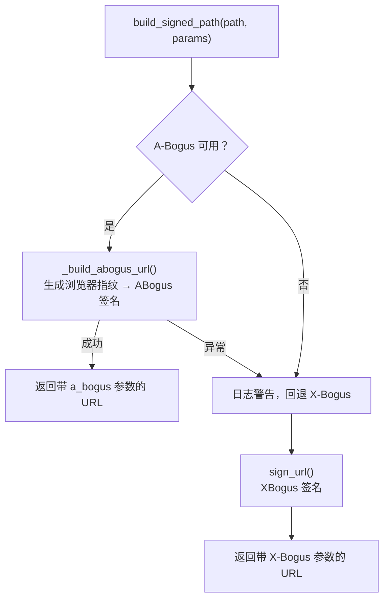
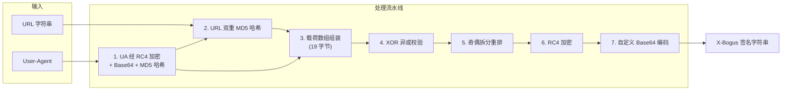
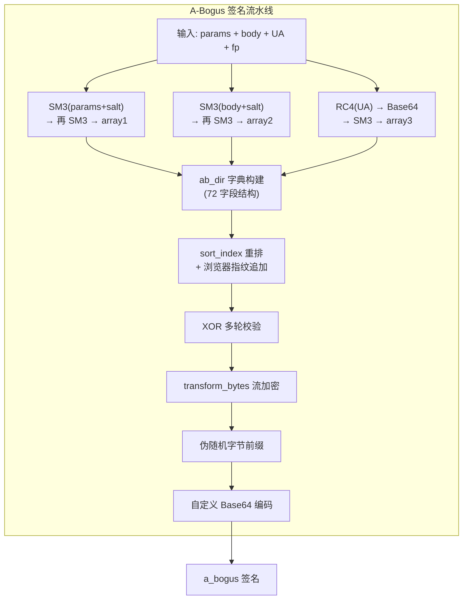

抖音 Web 端 API 对每次请求都要求携带一个签名参数来验证请求的合法性。本项目实现了两套签名方案——**A-Bogus**（主选）与 **X-Bogus**（兜底），它们分别通过不同强度的混淆策略生成不可逆的查询参数。本文将深入拆解这两种算法的数学原理、核心组件及在项目中的集成方式，帮助高级开发者理解其设计逻辑并在必要时进行调试或扩展。

Sources: [xbogus.py](utils/xbogus.py#L1-L203), [abogus.py](utils/abogus.py#L1-L878), [api_client.py](core/api_client.py#L12-L18)

## 签名机制的整体定位

在 [抖音 API 客户端（DouyinAPIClient）的请求封装与分页标准化](11-dou-yin-api-ke-hu-duan-douyinapiclient-de-qing-qiu-feng-zhuang-yu-fen-ye-biao-zhun-hua) 中，每个 API 请求在发出前都必须经过 URL 签名。`DouyinAPIClient.build_signed_path` 方法负责这一决策——它**优先尝试 A-Bogus**，仅当 `gmssl` 依赖不可用或签名过程抛出异常时，才自动回退到 X-Bogus。这种双层保障策略确保了在不同运行环境下签名流程的鲁棒性。



Sources: [api_client.py](core/api_client.py#L157-L180)

## 两种签名的核心差异对比

| 维度 | **X-Bogus** | **A-Bogus** |
|---|---|---|
| 哈希算法 | MD5（标准库 `hashlib`） | SM3（国密算法，依赖 `gmssl`） |
| 流密码 | RC4 | RC4 |
| 编码方式 | 自定义 Base64 字符表 | 自定义 Base64 字符表（双表切换） |
| 输入要素 | URL 全文 + User-Agent | 请求参数 + 请求体 + UA + 浏览器指纹 |
| 随机性来源 | 时间戳 + 固定常量 `536919696` | 毫秒级时间戳 + 伪随机字节 + 浏览器指纹 |
| 额外依赖 | 无 | `gmssl>=3.2.2` |
| 输出参数名 | `X-Bogus` | `a_bogus` |
| 请求类型区分 | 不区分 | 区分 GET（`[0,1,8]`）与 POST（`[0,1,14]`） |
| 防护等级 | 中等 | 较高 |

Sources: [xbogus.py](utils/xbogus.py#L25-L197), [abogus.py](utils/abogus.py#L584-L841)

## X-Bogus 算法详解

### 架构概览

X-Bogus 签名算法封装在 `XBogus` 类中，对外仅暴露 `build(url)` 方法，内部按流水线依次执行：**UA 指纹提取 → URL 哈希 → 载荷组装 → XOR 校验 → RC4 加密 → 自定义 Base64 编码**。整个过程是确定性的——相同 URL + 相同 UA + 相同时间戳将产生相同输出。



Sources: [xbogus.py](utils/xbogus.py#L118-L197)

### 第一步：UA 指纹提取

算法使用固定密钥 `\x00\x01\x0c` 对 User-Agent 字符串进行 RC4 加密，然后将密钥经 Base64 编码后再做一次 MD5 哈希，最终将 32 位十六进制哈希值转换为 16 字节数组。这个数组代表了 UA 的"指纹摘要"，后续仅取其中第 14、15 号元素参与载荷组装。

```
UA 字符串 → RC4(key=\x00\x01\x0c) → Base64 → MD5 → 字节数组[14:16]
```

Sources: [xbogus.py](utils/xbogus.py#L38-L46), [xbogus.py](utils/xbogus.py#L118-L127)

### 第二步：URL 双重 MD5 哈希

URL 字符串经过两轮 MD5 哈希处理——先将 URL 转 MD5 十六进制串，再将该十六进制串解析为字节数组后做第二次 MD5，最终得到 16 字节的"URL 指纹"。同理，一个空字符串 `"d41d8cd98f00b204e9800998ecf8427e"`（MD5 的空输入哈希）也经过双重 MD5 处理作为"环境基线"。

Sources: [xbogus.py](utils/xbogus.py#L52-L77), [xbogus.py](utils/xbogus.py#L129-L132)

### 第三步：载荷组装与 XOR 校验

核心载荷是一个 **19 字节数组**，各字节的语义如下表所示：

| 字节索引 | 值来源 | 含义 |
|---|---|---|
| 0 | 固定 `64` | 版本/格式标识 |
| 1 | 固定 `0.00390625`（即 `1/256`） | 未知参数 |
| 2 | 固定 `1` | 未知参数 |
| 3 | 固定 `12` | 未知参数 |
| 4–5 | URL MD5[14:16] | URL 指纹片段 |
| 6–7 | 空 MD5[14:16] | 环境基线 |
| 8–9 | UA MD5[14:16] | UA 指纹片段 |
| 10–13 | 时间戳（大端序 4 字节） | 请求时间 |
| 14–17 | 固定常量 `536919696`（大端序 4 字节） | 未知标识 |
| 18 | 前 18 字节 XOR 结果 | 校验值 |

第 18 字节是前面所有字节的**逐元素异或**结果，起到简单的完整性校验作用。

Sources: [xbogus.py](utils/xbogus.py#L134-L163)

### 第四步：奇偶拆分重排与 RC4 加密

载荷数组按奇偶索引拆分为两个子数组（先奇数位、再偶数位），然后**拼接**。这意味着原始序列 `[a,b,c,d,e,...]` 变成 `[a,c,e,...,b,d,...]`。拼接后的字节流再经过一轮 `_encoding_conversion` 函数进行字节重排，随后用 RC4（密钥为 `\xff`）加密。最终在前面加上魔术字节 `\x02\xff`，形成待编码的原始签名数据。

Sources: [xbogus.py](utils/xbogus.py#L165-L184)

### 第五步：自定义 Base64 编码

X-Bogus 使用一套**非标准 Base64 字符表** `"Dkdpgh4ZKsQB80/Mfvw36XI1R25-WUAlEi7NLboqYTOPuzmFjJnryx9HVGcaStCe="`，每 3 个字节一组编码为 4 个字符。`_calculation` 方法将 3 字节拼成 24 位整数，再按 6 位一组从字符表中取值。最终生成的字符串追加为 URL 的 `X-Bogus` 查询参数。

Sources: [xbogus.py](utils/xbogus.py#L36-L37), [xbogus.py](utils/xbogus.py#L109-L197)

## A-Bogus 算法详解

### 架构概览

A-Bogus 是 X-Bogus 的升级替代方案，算法复杂度显著提升。它由四个类协作完成：`StringProcessor`（底层字符串/字节转换）、`CryptoUtility`（SM3 哈希 + RC4 + 自定义 Base64）、`BrowserFingerprintGenerator`（浏览器指纹模拟）以及核心的 `ABogus` 类。A-Bogus 的核心区别在于**引入了浏览器指纹维度和请求体(body)参与签名**，使得签名结果更难被离线复现。



Sources: [abogus.py](utils/abogus.py#L584-L841)

### StringProcessor：字节运算基础层

`StringProcessor` 提供了一组静态方法，用于在字符串与 ASCII 码之间进行双向转换，并实现了 JavaScript 的**无符号右移运算**（`js_shift_right`）以保持与原始 JS 算法的位运算一致性。其 `generate_random_bytes` 方法生成伪随机字节序列作为混淆前缀——每次生成 3 组共 12 字节的伪随机数据，通过对随机数的位与/位或操作产生不可预测的字节值。

Sources: [abogus.py](utils/abogus.py#L29-L173)

### CryptoUtility：加密核心引擎

`CryptoUtility` 是 A-Bogus 算法的加密中枢，提供以下关键能力：

**SM3 哈希**：使用国密 SM3 算法（而非 MD5）对输入数据进行哈希。SM3 产生 256 位（32 字节）摘要，安全性显著高于 MD5 的 128 位。`sm3_to_array` 方法将输入数据编码为字节后调用 `gmssl` 库计算哈希，并返回十进制整数列表。

**加盐处理**：所有请求参数在哈希前都会追加固定盐值 `"cus"`，防止彩虹表攻击。`params_to_array` 方法实现了"加盐 → SM3 哈希 → 字节数组"的标准流程。

**transform_bytes 流加密**：该方法维护一个 256 元素的 `big_array`（预计算的 S-Box 替换表），对输入字节流逐字节进行查表 + 异或操作，同时动态交换 S-Box 中的元素，产生类 RC4 的密钥流效果。这使得相同的明文输入在不同调用位置会产生不同输出。

**双字符表 Base64**：与 X-Bogus 单一字符表不同，A-Bogus 维护两套 Base64 字符表（`character` 和 `character2`），通过 `selected_alphabet` 参数选择。`abogus_encode` 方法按标准 Base64 逻辑编码，但使用自定义字符表映射。

**RC4 加密**：与 X-Bogus 中的 RC4 实现原理一致（KSA + PRGA），但应用于不同的输入——UA 加密密钥为 `\x00\x01\x0e`（注意与 X-Bogus 的 `\x00\x01\x0c` 不同）。

Sources: [abogus.py](utils/abogus.py#L176-L483)

### BrowserFingerprintGenerator：浏览器指纹模拟

A-Bogus 将浏览器窗口尺寸、屏幕分辨率等环境信息作为签名输入的一部分。`BrowserFingerprintGenerator` 支持 Chrome、Firefox、Safari、Edge 四种浏览器的指纹生成（实际上 Chrome/Firefox/Edge 共用 Win32 平台参数），通过随机化窗口内尺寸、外尺寸、屏幕尺寸等参数生成形如 `1920|1080|1944|1152|0|30|0|0|1680|1050|1600|900|1920|1080|24|24|Win32` 的指纹字符串。每次签名都会生成新的指纹，增加签名结果的不可预测性。

Sources: [abogus.py](utils/abogus.py#L486-L581)

### ABogus 签名生成主流程

`ABogus.generate_abogus(params, body)` 方法执行签名生成的完整流程，核心步骤如下：

**1. 三路哈希并行计算**。分别对请求参数、请求体和 User-Agent 进行独立的哈希链处理：

- `array1`：`params → 加盐 → SM3 → 加盐 → SM3` → 取第 21、22 号字节
- `array2`：`body → 加盐 → SM3 → 加盐 → SM3` → 取第 21、22 号字节
- `array3`：`UA → RC4 → Base64 → SM3`（不加盐）→ 取第 23、24 号字节

**2. ab_dir 结构体填充**。构建一个包含 72 个槽位的字典结构 `ab_dir`，其中包含：

| 槽位范围 | 数据来源 | 含义 |
|---|---|---|
| 8 | 固定值 `3` | 加密方向标识 |
| 15 | 配置对象 | aid/pageId/paths 等 |
| 18 | 固定 `44` | 结构长度标识 |
| 19 | `[1,0,1,0,1]` | 未知标识数组 |
| 20–25 | `start_encryption`（毫秒时间戳） | 加密开始时间 |
| 26–37 | `self.options`（如 `[0,1,14]`） | 请求选项/方法 |
| 38–43 | array1/array2/array3 的各两个字节 | 三路哈希摘要 |
| 44–50 | `end_encryption`（毫秒时间戳） | 加密结束时间 |
| 51–60 | pageId + aid | 应用标识 |
| 64–65 | 浏览器指纹长度 | 指纹元信息 |
| 66,69–71 | 固定 `0` | 预留位 |

**3. 重排与异或校验**。按照 `sort_index`（44 个索引值）的指定顺序从 `ab_dir` 中提取值，形成重排后的有序列表。然后对 `sort_index_2`（去掉重复项后的 43 个索引）中的值进行逐元素 XOR 异或链运算，产生最终的校验字节 `ab_xor`。

**4. 组装与编码**。将排序值列表 + 浏览器指纹字节数组 + XOR 校验值拼接后，经过 `transform_bytes` 流加密，前面再添加 12 字节伪随机前缀，最后用 `abogus_encode` 进行自定义 Base64 编码，追加为 URL 的 `a_bogus` 参数。

Sources: [abogus.py](utils/abogus.py#L701-L841)

## RC4 流密码在两套算法中的共性角色

两套算法都使用了 RC4（Rivest Cipher 4）流密码，这是一个经典的对称流密码，其核心由两阶段组成：

1. **KSA（Key-Scheduling Algorithm）**：用密钥初始化 256 字节的 S-Box。对 `i` 从 0 到 255，计算 `j = (j + S[i] + key[i % key_len]) % 256` 并交换 `S[i]` 和 `S[j]`。
2. **PRGA（Pseudo-Random Generation Algorithm）**：逐字节生成密钥流。对每个明文字节，更新 `i`、`j` 索引，交换 `S[i]`、`S[j]`，然后 `K = S[(S[i] + S[j]) % 256]`，最终 `ciphertext = plaintext ^ K`。

在 X-Bogus 中，RC4 分别用于 UA 加密（密钥 `\x00\x01\x0c`）和最终载荷加密（密钥 `\xff`）。在 A-Bogus 中，RC4 仅用于 UA 加密（密钥 `\x00\x01\x0e`），载荷混淆则由 `transform_bytes` 中的自定义 S-Box 流加密完成。

Sources: [xbogus.py](utils/xbogus.py#L91-L107), [abogus.py](utils/abogus.py#L456-L483)

## 签名在 API 客户端中的集成方式

`DouyinAPIClient` 在构造时完成所有签名组件的初始化。UA 从一个包含 5 种常见浏览器 UA 的池中随机选取，然后基于该 UA 创建 `XBogus` 签名器实例。A-Bogus 的可用性取决于 `gmssl` 库是否成功导入——`try/except` 块确保了即使缺少该依赖，程序也能以 X-Bogus 模式正常运行。

在 `build_signed_path` 方法中，签名决策遵循以下逻辑：

```python
def build_signed_path(self, path, params):
    query = urlencode(params)
    base_url = f"{self.BASE_URL}{path}"
    ab_signed = self._build_abogus_url(base_url, query)  # 优先 A-Bogus
    if ab_signed:
        return ab_signed
    return self.sign_url(f"{base_url}?{query}")           # 回退 X-Bogus
```

值得注意的是，A-Bogus 签名器**每次调用都重新创建实例**（包括生成新的浏览器指纹），这是有意为之的设计——每次请求使用不同的指纹和时间戳，增加签名的时效性和唯一性。而 X-Bogus 签名器则是**复用实例**，仅时间戳在每次 `build` 调用时自然更新。

Sources: [api_client.py](core/api_client.py#L63-L83), [api_client.py](core/api_client.py#L157-L180)

## 自定义 Base64 编码的对比

两套算法都使用了非标准的 Base64 编码来防止直接的签名逆向。标准 Base64 使用 `A-Za-z0-9+/=` 字符集，而本项目的两套签名使用了完全不同的字符集：

| 算法 | 字符集（64 个字符） |
|---|---|
| X-Bogus | `Dkdpgh4ZKsQB80/Mfvw36XI1R25-WUAlEi7NLboqYTOPuzmFjJnryx9HVGcaStCe=` |
| A-Bogus (表1) | `Dkdpgh2ZmsQB80/MfvV36XI1R45-WUAlEixNLwoqYTOPuzKFjJnry79HbGcaStCe` |
| A-Bogus (表2) | `ckdp1h4ZKsUB80/Mfvw36XIgR25+WQAlEi7NLboqYTOPuzmFjJnryx9HVGDaStCe` |

这些字符集看似随机排列，实际上是对标准 Base64 字符表的固定置换。编码逻辑本身与标准 Base64 一致（每 3 字节 → 4 字符），仅字符映射不同。这种设计虽然不能阻止逆向工程，但增加了自动化工具的适配成本。

Sources: [xbogus.py](utils/xbogus.py#L36-L37), [abogus.py](utils/abogus.py#L653-L659)

## 安全性分析与局限

从安全工程视角审视，这两种签名算法的防护目标并非密码学意义上的安全，而是**提高自动化爬取的技术门槛**：

- **X-Bogus 的局限**：使用 MD5 作为哈希函数（已知存在碰撞攻击），载荷结构相对简单（仅 19 字节），无随机化前缀，理论上同一秒内相同 URL + UA 将产生完全相同的签名。
- **A-Bogus 的改进**：采用 SM3（抗碰撞性更强），引入毫秒级时间戳、伪随机字节前缀和浏览器指纹，使得即使相同参数在不同时刻也会产生不同签名。同时区分 GET/POST 请求类型，增加了签名域的维度。
- **共同局限**：两种算法都是客户端执行的确定性计算，所有密钥和盐值都硬编码在源码中。这意味着一旦算法逻辑被完整还原，就可以完全离线生成有效签名。它们的保护强度取决于混淆的复杂度而非密钥的保密性。

Sources: [xbogus.py](utils/xbogus.py#L25-L197), [abogus.py](utils/abogus.py#L626-L650)

## 延伸阅读

- 签名在完整请求链路中的调用方式参见 [抖音 API 客户端（DouyinAPIClient）的请求封装与分页标准化](11-dou-yin-api-ke-hu-duan-douyinapiclient-de-qing-qiu-feng-zhuang-yu-fen-ye-biao-zhun-hua)
- 与签名配合使用的 msToken 生成机制参见 [短链解析与 msToken 自动生成机制](13-duan-lian-jie-xi-yu-mstoken-zi-dong-sheng-cheng-ji-zhi)
- 签名测试用例参见 [测试体系：pytest 异步测试与核心模块覆盖](31-ce-shi-ti-xi-pytest-yi-bu-ce-shi-yu-he-xin-mo-kuai-fu-gai)