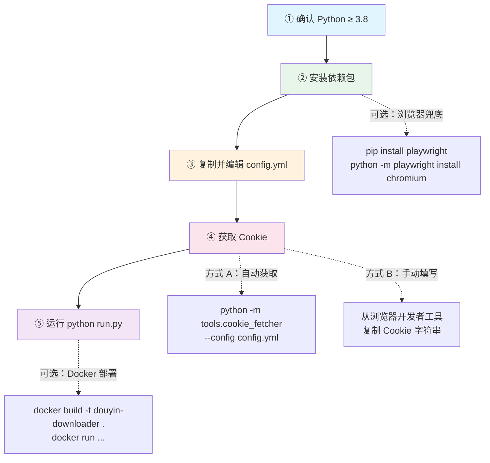
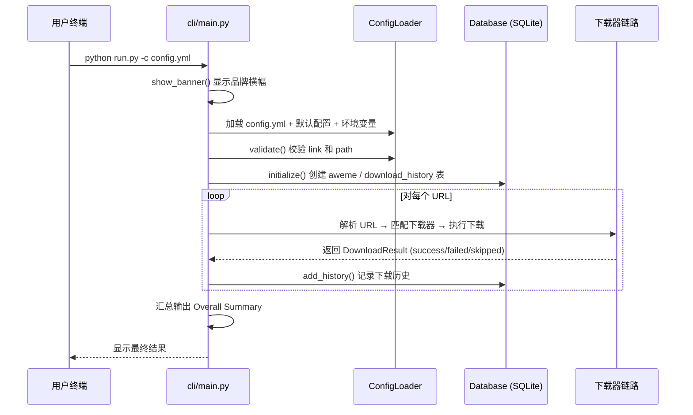

本文是 **douyin-downloader V2.0** 的快速上手指南。你将在这里完成从零到第一次成功下载的全部操作：确认运行环境、安装依赖包、编写最小配置、获取认证 Cookie、启动下载。完成本文所有步骤后，你将拥有一个可正常工作的抖音批量下载工具，并可以继续阅读 [配置文件详解：config.yml 全字段说明与典型场景示例](3-pei-zhi-wen-jian-xiang-jie-config-yml-quan-zi-duan-shuo-ming-yu-dian-xing-chang-jing-shi-li) 来精细化调整下载行为。

Sources: [README.zh-CN.md](README.zh-CN.md#L50-L87), [pyproject.toml](pyproject.toml#L1-L32)

## 整体流程一览

从克隆仓库到首次下载成功，核心步骤只有五步。下面的流程图展示了完整的操作路径，包括可选的浏览器兜底与 Docker 部署分支：



## 第一步：确认运行环境

**douyin-downloader** 是一个纯 Python 异步应用，运行环境要求极为精简：

| 项目 | 要求 | 说明 |
|------|------|------|
| **Python 版本** | ≥ 3.8 | 项目在 `pyproject.toml` 中声明了 `requires-python = ">=3.8"`，同时兼容 3.8–3.12 全系列 |
| **操作系统** | macOS / Linux / Windows | 跨平台支持，核心功能无系统依赖 |
| **网络** | 能访问 `douyin.com` | 如使用代理，后续在配置中设置 `proxy` 字段即可 |
| **磁盘空间** | ≥ 500 MB（建议） | 取决于下载数量；安装依赖本身仅需约 50 MB |

快速检查你的 Python 版本：

```bash
python --version   # 或 python3 --version
```

若输出为 `Python 3.8.x` 或更高版本，即可进入下一步。**建议使用 Python 3.10 或更高版本**以获得更稳定的异步运行时表现。当前项目虚拟环境使用的是 **Python 3.12**。

Sources: [pyproject.toml](pyproject.toml#L11-L23), [nut_venv/pyvenv.cfg](nut_venv/pyvenv.cfg)

## 第二步：安装依赖包

### 核心依赖（必装）

项目依赖声明在 `requirements.txt` 和 `pyproject.toml` 两处，内容一致。核心依赖仅 **7 个包**，体量轻巧：

| 依赖包 | 最低版本 | 用途 |
|--------|----------|------|
| `aiohttp` | ≥ 3.9.0 | 异步 HTTP 客户端，用于请求抖音 API 与下载资源 |
| `aiofiles` | ≥ 23.2.1 | 异步文件写入 |
| `aiosqlite` | ≥ 0.19.0 | 异步 SQLite 驱动，支持下载去重和历史记录 |
| `rich` | ≥ 13.7.0 | 终端美化，提供进度条和彩色输出 |
| `pyyaml` | ≥ 6.0.1 | 解析 config.yml 配置文件 |
| `python-dateutil` | ≥ 2.8.2 | 日期解析，支持 `start_time` / `end_time` 时间过滤 |
| `gmssl` | ≥ 3.2.2 | 国密 SM3 哈希算法，用于请求签名计算 |

推荐在虚拟环境中安装：

```bash
# 创建虚拟环境（可选但推荐）
python -m venv nut_venv

# 激活虚拟环境
# macOS / Linux:
source nut_venv/bin/activate
# Windows:
# nut_venv\Scripts\activate

# 安装核心依赖
pip install -r requirements.txt
```

### 可选依赖（按需安装）

项目通过 `pyproject.toml` 的 `[project.optional-dependencies]` 定义了三组可选依赖：

| 分组 | 安装命令 | 包含内容 | 何时需要 |
|------|----------|----------|----------|
| **browser** | `pip install playwright && python -m playwright install chromium` | Playwright 浏览器自动化引擎 | 需要自动获取 Cookie 或浏览器兜底采集时 |
| **transcribe** | `pip install openai-whisper` | OpenAI Whisper 语音转文字 | 需要视频转写功能时 |
| **dev** | `pip install pytest pytest-asyncio ruff` | 测试框架 + 代码检查 | 参与项目开发时 |
| **all** | `pip install ".[all]"` | 以上全部 | 一键安装所有可选组件 |

**对于首次使用的开发者**，最常见的需求是安装 **browser** 分组，因为自动获取 Cookie 大幅降低了配置门槛：

```bash
pip install playwright
python -m playwright install chromium
```

Sources: [pyproject.toml](pyproject.toml#L24-L48), [requirements.txt](requirements.txt#L1-L7)

## 第三步：准备配置文件

### 创建 config.yml

项目在 `.gitignore` 中将所有 `config*.yml` 文件排除在版本控制之外（仅保留 `config.example.yml` 作为模板），以保护你的 Cookie 等敏感信息。首先复制模板：

```bash
cp config.example.yml config.yml
```

### 最小可用配置

一个能跑起来的配置文件只需要 **两个必填字段**：`link`（下载链接）和 `path`（保存路径）。配置加载器 `ConfigLoader` 会自动用内置默认值填充未指定的字段。以下是一个最小配置示例：

```yaml
link:
  - https://www.douyin.com/video/7604129988555574538

path: ./Downloaded/
```

仅凭这两行配置，工具就能启动运行——它会使用默认的 5 并发、3 次重试、2 req/s 速率限制，并自动启用 SQLite 数据库去重。

Sources: [.gitignore](.gitignore#L41-L46), [config/config_loader.py](config/config_loader.py#L21-L36), [config/default_config.py](config/default_config.py#L1-L55)

### 配置合并机制速览

了解配置的加载顺序有助于理解"为什么只写两行就能跑"。`ConfigLoader` 按以下优先级从低到高合并配置：

| 优先级 | 来源 | 说明 |
|--------|------|------|
| 最低 | `DEFAULT_CONFIG` 字典 | 内置于代码中的完整默认值集合 |
| 中 | `config.yml` 文件 | 你手动编写的用户配置 |
| 最高 | 环境变量 | 以 `DOUYIN_` 为前缀的环境变量可覆盖配置项 |

支持的环境变量覆盖项包括：`DOUYIN_COOKIE`（Cookie 字符串）、`DOUYIN_PATH`（下载路径）、`DOUYIN_THREAD`（并发数）、`DOUYIN_PROXY`（代理地址）。这意味着你甚至可以不创建 `config.yml`，完全通过环境变量 + 命令行参数来运行工具。

Sources: [config/config_loader.py](config/config_loader.py#L53-L69), [config/config_loader.py](config/config_loader.py#L249-L265)

## 第四步：获取认证 Cookie

抖音 API 需要有效的 Cookie 才能返回数据。获取 Cookie 有两种方式，**推荐方式 A**。

### 方式 A：自动获取（推荐）

使用项目内置的 Playwright Cookie 抓取工具，它会打开一个真实浏览器窗口，你只需手动登录，工具会自动捕获并写入配置：

```bash
python -m tools.cookie_fetcher --config config.yml
```

执行后流程如下：

1. 程序自动启动 Chromium 浏览器并打开抖音登录页
2. 你在浏览器中完成扫码或账号登录
3. 登录成功后，回到终端按 **Enter** 键
4. 程序自动提取 Cookie 并写入 `config.yml` 和 `config/cookies.json`

该工具会抓取 **4 个必需 Cookie 键**（`msToken`、`ttwid`、`odin_tt`、`passport_csrf_token`）以及若干辅助键，并在缺少必需键时发出警告。

### 方式 B：手动填写

如果你无法使用 Playwright，可以从浏览器开发者工具中手动复制 Cookie：

1. 在 Chrome 中打开 `https://www.douyin.com` 并登录
2. 按 `F12` 打开开发者工具 → 切换到 **Network** 标签
3. 刷新页面，找到任意请求 → 查看 Request Headers 中的 `Cookie` 字段
4. 将完整 Cookie 字符串填入 `config.yml`：

```yaml
cookie: "msToken=xxx; ttwid=xxx; odin_tt=xxx; passport_csrf_token=xxx; sid_guard=xxx"
```

配置加载器同时支持 `cookie`（字符串形式）和 `cookies`（字典形式）两种写法。Cookie 配置的详细说明请参阅 [Cookie 获取与认证配置](5-cookie-huo-qu-yu-ren-zheng-pei-zhi)。

Sources: [tools/cookie_fetcher.py](tools/cookie_fetcher.py#L13-L16), [tools/cookie_fetcher.py](tools/cookie_fetcher.py#L78-L158), [config/config_loader.py](config/config_loader.py#L166-L177)

## 第五步：首次运行

### 基本启动命令

一切就绪后，使用以下命令启动下载：

```bash
python run.py -c config.yml
```

`run.py` 是项目的入口脚本，它负责将项目根目录加入 Python 搜索路径，然后调用 `cli.main:main()` 启动异步下载流程。你也可以直接通过已安装的包入口运行：

```bash
douyin-dl -c config.yml
```

此命令等价于 `python run.py`，由 `pyproject.toml` 中的 `[project.scripts]` 注册。

Sources: [run.py](run.py#L1-L13), [pyproject.toml](pyproject.toml#L50-L51), [cli/main.py](cli/main.py#L221-L246)

### 命令行参数

除了配置文件，你还可以通过命令行参数快速覆盖关键选项，适合临时调整而无需修改配置文件：

| 参数 | 缩写 | 说明 | 示例 |
|------|------|------|------|
| `--url` | `-u` | 追加下载链接（可重复传入） | `-u "https://www.douyin.com/video/xxx"` |
| `--config` | `-c` | 指定配置文件路径（默认 `config.yml`） | `-c my_config.yml` |
| `--path` | `-p` | 覆盖下载保存目录 | `-p ./my_downloads` |
| `--thread` | `-t` | 覆盖并发下载线程数 | `-t 8` |
| `--verbose` | `-v` | 显示详细日志（info 级别及以上） | `-v` |
| `--show-warnings` | — | 显示警告日志（warning 级别及以上） | `--show-warnings` |
| `--version` | — | 显示版本号 | `--version` |

组合使用示例——下载单个视频到指定目录，使用 8 线程：

```bash
python run.py -c config.yml \
  -u "https://www.douyin.com/video/7604129988555574538" \
  -t 8 \
  -p ./Downloaded
```

Sources: [cli/main.py](cli/main.py#L221-L234)

### 首次运行时会发生什么

当你执行 `python run.py -c config.yml` 后，程序内部的执行流程如下：



具体来说，程序依次执行以下动作：

1. **加载配置**：合并默认配置 → 配置文件 → 环境变量，并校验 `link` 和 `path` 两个必填项
2. **初始化 Cookie**：解析配置中的 Cookie 字符串或字典，并验证必需键是否存在
3. **初始化数据库**：如果 `database: true`（默认开启），创建 SQLite 数据库和必要的表结构（`aweme`、`download_history`、`transcript_job`）
4. **逐 URL 下载**：解析每个 URL 的类型（视频/图文/合集/音乐/用户主页），创建对应下载器，执行异步下载
5. **输出汇总**：显示每个 URL 的成功/失败/跳过计数，以及全局汇总

首次运行结束后，你会在项目根目录看到以下新增内容：

| 文件/目录 | 说明 |
|-----------|------|
| `Downloaded/` | 默认下载目录，按作者和类型组织子文件夹 |
| `dy_downloader.db` | SQLite 数据库文件，存储下载记录用于去重 |

Sources: [cli/main.py](cli/main.py#L128-L220), [storage/database.py](storage/database.py#L21-L79)

## Docker 部署（可选）

如果你更倾向于容器化运行，项目提供了开箱即用的 `Dockerfile`。它基于 `python:3.12-slim` 镜像，包含 gcc 编译工具以支持可能的 C 扩展编译：

```bash
# 构建镜像
docker build -t douyin-downloader .

# 运行容器（挂载配置文件和下载目录）
docker run -v $(pwd)/config.yml:/app/config.yml \
           -v $(pwd)/Downloaded:/app/Downloaded \
           douyin-downloader
```

容器默认入口为 `python run.py -c config.yml`，因此只需将你的 `config.yml` 挂载到 `/app/config.yml` 即可。下载目录通过卷挂载持久化到宿主机。

详细的容器化部署方案请参阅 [Docker 容器化部署](30-docker-rong-qi-hua-bu-shu)。

Sources: [Dockerfile](Dockerfile#L1-L19)

## 常见问题排查

首次运行中可能遇到的问题及解决方案：

| 问题现象 | 可能原因 | 解决方法 |
|----------|----------|----------|
| `Config file not found: config.yml` | 配置文件不存在或路径错误 | 确认已执行 `cp config.example.yml config.yml` |
| `Invalid configuration: missing required fields` | 配置中缺少 `link` 或 `path` | 检查 config.yml 中是否包含 `link` 和 `path` 字段 |
| `Cookies may be invalid or incomplete` | Cookie 缺少必需键 | 重新运行 `python -m tools.cookie_fetcher --config config.yml` |
| 下载 0 个视频，全部 skip | 数据库中已有记录（增量去重生效） | 删除 `dy_downloader.db` 重新下载，或关闭 `database` |
| `Playwright is not installed` | 未安装 Playwright | 执行 `pip install playwright && python -m playwright install chromium` |
| 短链解析失败 `Failed to resolve short URL` | 网络问题或 Cookie 失效 | 检查网络连通性并更新 Cookie |

Sources: [cli/main.py](cli/main.py#L131-L163), [tools/cookie_fetcher.py](tools/cookie_fetcher.py#L80-L86)

## 下一步

完成首次运行后，推荐按以下顺序深入阅读：

1. **[配置文件详解：config.yml 全字段说明与典型场景示例](3-pei-zhi-wen-jian-xiang-jie-config-yml-quan-zi-duan-shuo-ming-yu-dian-xing-chang-jing-shi-li)** — 了解所有配置项的含义，掌握批量下载、时间过滤、增量下载等典型场景的配置方法
2. **[命令行参数与运行模式](4-ming-ling-xing-can-shu-yu-yun-xing-mo-shi)** — 熟悉命令行参数的完整用法
3. **[Cookie 获取与认证配置](5-cookie-huo-qu-yu-ren-zheng-pei-zhi)** — 深入理解 Cookie 机制，解决认证相关问题
4. **[整体架构：模块划分与数据流全景](6-zheng-ti-jia-gou-mo-kuai-hua-fen-yu-shu-ju-liu-quan-jing)** — 从全局视角理解工具的架构设计