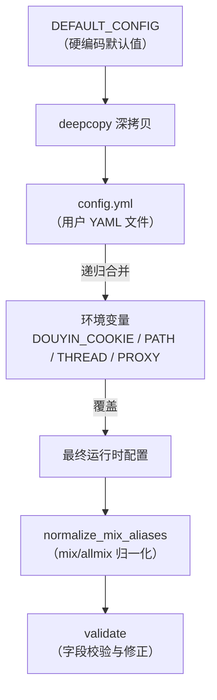

`config.yml` 是抖音批量下载工具的**核心配置入口**。你在命令行执行的每一次下载任务，其行为几乎全部由这个文件决定——从要下载哪些链接、采用什么模式，到并发数、代理、Cookie、浏览器兜底等高级选项。本文将逐一拆解每一个字段的含义、默认值和实际效果，并通过典型场景示例帮助你快速上手。

在深入字段之前，先理解配置的**加载优先级**。`ConfigLoader` 采用三层合并策略：**默认配置** → **config.yml 文件** → **环境变量覆盖**。三层按顺序叠加，后者覆盖前者。这意味着你不必在 config.yml 中填写所有字段——未列出的字段会自动使用默认值。



Sources: [default_config.py](config/default_config.py#L1-L55), [config_loader.py](config/config_loader.py#L21-L36)

---

## 一、链接与路径：告诉工具"下载什么、存到哪里"

### `link` — 下载目标链接列表

**类型**：`List[str]`（字符串列表）  
**默认值**：`[]`（空列表）  
**必填**：是（校验时如果为空则报错退出）

这是整个配置最关键的字段。你把要下载的抖音链接逐行写在 `link` 下面，支持以下 URL 类型：

| URL 类型 | 示例格式 | 说明 |
|----------|---------|------|
| 单个视频 | `https://www.douyin.com/video/7604129988555574538` | 按视频 ID 直接下载 |
| 单个图文 | `https://www.douyin.com/note/7341234567890123456` | 图文帖子中的所有图片 |
| 单个合集 | `https://www.douyin.com/collection/7341234567890123456` | 合集下所有视频 |
| 音乐页面 | `https://www.douyin.com/music/7341234567890123456` | 关联音乐原声 |
| 用户主页 | `https://www.douyin.com/user/MS4wLjABAAAAxxxx` | 配合 `mode` 字段批量下载 |
| 收藏夹 | `https://www.douyin.com/user/self?showTab=favorite_collection` | 需要登录 Cookie |
| 短链接 | `https://v.douyin.com/xxxxx` | 自动解析为完整 URL |

**注意**：`link` 也支持写成单个字符串（运行时会自动转为列表）。同时，通过命令行参数 `-u` 追加的 URL 会合并到 `link` 列表中，不会覆盖已有条目。

Sources: [config_loader.py](config/config_loader.py#L243-L247), [cli/main.py](cli/main.py#L143-L146)

### `path` — 下载保存目录

**类型**：`str`  
**默认值**：`"./Downloaded/"`

所有下载的文件都会保存到这个目录下。工具会按作者名 → 模式（post/like/...）→ 作品维度自动创建子目录结构。支持相对路径和绝对路径。通过命令行 `-p` 参数可临时覆盖此值。

Sources: [default_config.py](config/default_config.py#L4), [cli/main.py](cli/main.py#L148-L149)

---

## 二、下载模式：用户主页批量下载的策略选择

### `mode` — 用户下载模式列表

**类型**：`List[str]` 或 `str`  
**默认值**：`["post"]`

仅当 `link` 中包含**用户主页 URL** 时此字段才生效。它决定了要下载该用户的哪类内容，支持同时指定多个模式：

| 模式值 | 含义 | 需要登录 | 可增量 |
|--------|------|---------|--------|
| `post` | 用户发布的作品 | 否 | 是 |
| `like` | 用户点赞的作品 | 否 | 是 |
| `mix` | 用户创建的合集 | 否 | 是 |
| `music` | 用户使用的音乐 | 否 | 是 |
| `collect` | 登录账号的收藏夹作品 | **是** | 否 |
| `collectmix` | 登录账号的收藏合集 | **是** | 否 |

**重要约束**：
- `collect` 和 `collectmix` **必须单独使用**，不能与 `post`/`like`/`mix`/`music` 混用
- 跨模式自动去重：同一个 `aweme_id` 在不同模式下不会重复下载

```yaml
# 示例：同时下载某用户的发布、点赞和合集
mode:
  - post
  - like
  - mix
```

Sources: [default_config.py](config/default_config.py#L11-L12), [user_downloader.py](core/user_downloader.py#L28-L34)

### `number` — 各模式下载数量限制

**类型**：`Dict[str, int]`  
**默认值**：

```yaml
number:
  post: 0
  like: 0
  allmix: 0
  mix: 0
  music: 0
  collect: 0
  collectmix: 0
```

每个模式对应一个整数值。**`0` 表示不限制**，下载该模式下所有可用内容。如果只想下载前 50 个作品，则设置 `post: 50`。

**兼容别名**：`allmix` 是 `mix` 的旧名，两者会自动归一化为相同的值。如果你同时设置了 `mix` 和 `allmix` 且值不同，程序会输出警告并**以 `mix` 的值为准**。

Sources: [default_config.py](config/default_config.py#L13-L21), [downloader_base.py](core/downloader_base.py#L225-L233), [config_loader.py](config/config_loader.py#L71-L138)

### `increase` — 增量下载开关

**类型**：`Dict[str, bool]`  
**默认值**：

```yaml
increase:
  post: false
  like: false
  allmix: false
  mix: false
  music: false
```

当某个模式设为 `true` 时，该模式只下载**数据库中未记录的新内容**。遇到已下载的第一个旧作品时自动停止分页（而不是继续遍历全部）。**增量模式依赖数据库**——请确保 `database: true`。

Sources: [default_config.py](config/default_config.py#L22-L28), [base_strategy.py](core/user_modes/base_strategy.py#L66-L69)

---

## 三、资源类型开关：控制下载哪些附属文件

### `music` / `cover` / `avatar` / `json` — 资源下载开关

**类型**：`bool`  
**默认值**：全部为 `true`

这四个布尔开关控制每个作品是否额外下载附属资源：

| 字段 | 控制的资源 | 文件命名模式 |
|------|-----------|-------------|
| `music` | 视频背景音乐（mp3） | `{file_stem}_music.mp3` |
| `cover` | 视频封面图（jpg） | `{file_stem}_cover.jpg` |
| `avatar` | 作者头像（jpg） | `{file_stem}_avatar.jpg` |
| `json` | 原始 JSON 元数据 | `{file_stem}_data.json` |

如果只需要纯净的视频文件，可以全部关闭：

```yaml
music: false
cover: false
avatar: false
json: false
```

### `folderstyle` — 按作品创建子目录

**类型**：`bool`  
**默认值**：`true`

开启时，每个作品会在 `作者名/模式/` 下创建独立的子目录（格式：`日期_标题_aweme_id/`），所有该作品的资源文件放在同一子目录中。关闭后所有文件平铺在 `作者名/模式/` 目录下。

Sources: [default_config.py](config/default_config.py#L5-L8), [downloader_base.py](core/downloader_base.py#L264-L266), [downloader_base.py](core/downloader_base.py#L287-L390)

---

## 四、时间过滤：精确控制下载范围

### `start_time` / `end_time` — 时间范围筛选

**类型**：`str`  
**默认值**：`""`（空字符串，表示不限制）  
**格式要求**：`YYYY-MM-DD`（如 `2024-06-01`）

仅在用户主页批量下载（post/like/mix/music）时生效。程序会对比每个作品的发布时间戳，只保留在 `[start_time, end_time]` 范围内的作品。可以只设置一个端点：

```yaml
# 只下载 2024 年 6 月以后的作品
start_time: "2024-06-01"

# 只下载 2024 年 12 月 31 日之前的作品
end_time: "2024-12-31"

# 精确指定范围
start_time: "2024-01-01"
end_time: "2024-12-31"
```

如果格式不合法（如写成 `2024/01/01`），校验阶段会自动清空该字段并输出警告。

Sources: [default_config.py](config/default_config.py#L9-L10), [downloader_base.py](core/downloader_base.py#L196-L223), [config_loader.py](config/config_loader.py#L277-L285)

---

## 五、并发与可靠性：调优下载性能

### `thread` — 并发下载数

**类型**：`int`  
**默认值**：`5`  
**有效范围**：≥ 1（小于 1 时校验修正为默认值 5）

控制同时进行的下载任务数。底层通过 `asyncio.Semaphore` 实现并发控制。网络带宽充足时可以适当提高（如 `10` 或 `20`），但不建议过高以免触发平台限流。

可通过命令行 `-t` 参数临时覆盖，也可通过环境变量 `DOUYIN_THREAD` 设置。

### `retry_times` — 失败重试次数

**类型**：`int`  
**默认值**：`3`  
**有效范围**：≥ 0

每个下载任务失败后的最大重试次数。重试间隔采用指数退避策略，固定为 **1秒 → 2秒 → 5秒** 的序列。设为 `0` 则不重试。

### `rate_limit` — 每秒请求数限制

**类型**：`int`（运行时转为 `float`）  
**默认值**：`2`

控制 API 请求的频率。底层实现为令牌桶模式：每次请求前必须等待足够的时间间隔（1/rate_limit 秒），同时额外叠加 0~0.5 秒的随机抖动以模拟真实用户行为。

### `proxy` — HTTP/HTTPS 代理

**类型**：`str`  
**默认值**：`""`（空字符串，不使用代理）

设置后，所有 API 请求和媒体文件下载都会通过此代理。格式示例：`http://127.0.0.1:7890`。也可通过环境变量 `DOUYIN_PROXY` 覆盖。

Sources: [default_config.py](config/default_config.py#L29-L31), [cli/main.py](cli/main.py#L41-L43), [rate_limiter.py](control/rate_limiter.py#L6-L28), [retry_handler.py](control/retry_handler.py#L10-L29)

---

## 六、数据库与持久化

### `database` — 启用 SQLite 去重

**类型**：`bool`  
**默认值**：`true`

开启后程序使用 SQLite 数据库记录已下载的作品信息，实现**数据库 + 本地文件双重去重**。增量下载（`increase`）也依赖此功能。关闭后仅靠本地文件扫描判断是否已下载。

### `database_path` — 数据库文件路径

**类型**：`str`  
**默认值**：`"dy_downloader.db"`

SQLite 数据库文件的存储位置。如果只写文件名（如默认值），数据库文件会生成在当前工作目录下。

Sources: [default_config.py](config/default_config.py#L33-L34), [cli/main.py](cli/main.py#L166-L169)

---

## 七、认证配置：Cookie 相关字段

### `cookies` / `cookie` — 登录凭证

**类型**：`Dict[str, str]` 或 `str`  
**默认值**：未定义（默认无 Cookie）

Cookie 的配置方式灵活，支持三种形式：

**形式一：字典格式（推荐）**

```yaml
cookies:
  msToken: "your_ms_token"
  ttwid: "your_ttwid"
  odin_tt: "your_odin_tt"
  passport_csrf_token: "your_csrf_token"
  sid_guard: ""
```

**形式二：字符串 `"auto"`**

```yaml
cookies: auto
```

程序会自动从以下路径查找 `cookies.json` 文件：`config/cookies.json` 和 `.cookies.json`（相对于配置文件所在目录和当前工作目录）。

**形式三：`auto_cookie` 标志**

```yaml
auto_cookie: true
```

与 `cookies: auto` 效果相同，程序自动加载 `cookies.json` 文件。

**推荐做法**：使用 `python -m tools.cookie_fetcher --config config.yml` 自动获取 Cookie 并写入配置文件。

Sources: [config_loader.py](config/config_loader.py#L166-L194), [cookie_utils.py](utils/cookie_utils.py#L19-L45)

---

## 八、进度展示与日志

### `progress` — 进度条配置

**类型**：`Dict`  
**默认值**：

```yaml
progress:
  quiet_logs: true
```

`quiet_logs` 控制在 Rich 进度条显示期间是否**静默控制台日志**。开启时（默认），下载过程中不会出现大量日志刷屏导致进度条反复重绘的问题。下载完成后日志级别会恢复。

如果需要调试，可通过命令行参数 `--show-warnings` 或 `-v` 临时覆盖此设置。

Sources: [default_config.py](config/default_config.py#L35-L37), [cli/main.py](cli/main.py#L176-L182)

---

## 九、浏览器兜底：突破分页限制

### `browser_fallback` — 浏览器采集配置

**类型**：`Dict`  
**默认值**：

```yaml
browser_fallback:
  enabled: true
  headless: false
  max_scrolls: 240
  idle_rounds: 8
  wait_timeout_seconds: 600
```

当 API 分页被平台风控限制（常见表现为只能获取约 20 条作品）时，程序会自动启动 Playwright 浏览器模拟滚动页面来采集更多作品。各子字段含义：

| 子字段 | 类型 | 默认值 | 说明 |
|--------|------|--------|------|
| `enabled` | `bool` | `true` | 是否启用浏览器兜底 |
| `headless` | `bool` | `false` | 是否无头模式。**建议保持 false**，遇到验证码时可手动处理 |
| `max_scrolls` | `int` | `240` | 最大滚动次数，控制采集深度 |
| `idle_rounds` | `int` | `8` | 连续多少轮无新内容时停止滚动 |
| `wait_timeout_seconds` | `int` | `600` | 整体超时时间（秒），防止无限等待 |

**注意**：使用此功能需要预先安装 `playwright` 和 Chromium：

```bash
pip install playwright
python -m playwright install chromium
```

浏览器兜底当前仅对 **`post` 模式**完整验证，`like`/`mix`/`music` 模式主要依赖 API 正常分页。

Sources: [default_config.py](config/default_config.py#L48-L54), [user_downloader.py](core/user_downloader.py#L183-L203)

---

## 十、视频转写：AI 语音转文字

### `transcript` — 转写功能配置

**类型**：`Dict`  
**默认值**：

```yaml
transcript:
  enabled: false
  model: "gpt-4o-mini-transcribe"
  output_dir: ""
  response_formats: ["txt", "json"]
  api_url: "https://api.openai.com/v1/audio/transcriptions"
  api_key_env: "OPENAI_API_KEY"
  api_key: ""
```

视频下载完成后，可选调用 OpenAI Transcriptions API 进行语音转写。各子字段含义：

| 子字段 | 类型 | 默认值 | 说明 |
|--------|------|--------|------|
| `enabled` | `bool` | `false` | 总开关，必须显式设为 `true` |
| `model` | `str` | `"gpt-4o-mini-transcribe"` | OpenAI 转写模型名称 |
| `output_dir` | `str` | `""` | 转写文件输出目录。留空则与视频同目录 |
| `response_formats` | `List[str]` | `["txt", "json"]` | 输出格式，支持 `txt` 和 `json` |
| `api_url` | `str` | OpenAI 官方地址 | API 端点，可替换为兼容接口 |
| `api_key_env` | `str` | `"OPENAI_API_KEY"` | 读取 API Key 的环境变量名 |
| `api_key` | `str` | `""` | 直接填写 API Key（优先使用环境变量） |

**密钥加载顺序**：先检查 `api_key_env` 指定的环境变量，如果为空再使用 `api_key` 字段值。

**注意**：转写仅对**视频作品**生效，图文作品不会生成转写文件。输出的文件命名为 `xxx.transcript.txt` 和 `xxx.transcript.json`。

Sources: [default_config.py](config/default_config.py#L38-L46), [transcript_manager.py](core/transcript_manager.py#L27-L59)

---

## 十一、环境变量覆盖

除了 config.yml 文件，工具还支持通过环境变量覆盖特定字段。环境变量的优先级**最高**，会覆盖 config.yml 中的同名设置：

| 环境变量 | 覆盖字段 | 类型 | 示例 |
|----------|---------|------|------|
| `DOUYIN_COOKIE` | `cookie` | `str` | `"ttwid=abc; msToken=xyz"` |
| `DOUYIN_PATH` | `path` | `str` | `"/data/downloads"` |
| `DOUYIN_THREAD` | `thread` | `int` | `"10"` |
| `DOUYIN_PROXY` | `proxy` | `str` | `"http://127.0.0.1:7890"` |

如果 `DOUYIN_THREAD` 的值不是合法整数，程序会输出警告并忽略该环境变量。

Sources: [config_loader.py](config/config_loader.py#L53-L69)

---

## 十二、完整最小可用配置模板

以下是一个包含所有字段的完整配置模板，可直接复制使用。被注释掉的字段表示使用了默认值，你只需修改需要自定义的部分：

```yaml
# ========== 下载目标 ==========
link:
  - https://www.douyin.com/user/MS4wLjABAAAAxxxx    # 替换为实际链接

# ========== 存储与结构 ==========
path: ./Downloaded/
# folderstyle: true      # 是否按作品创建子目录

# ========== 下载模式（用户主页时生效）==========
mode:
  - post

number:
  post: 0                # 0 = 不限制
  like: 0
  mix: 0
  music: 0
  collect: 0
  collectmix: 0

increase:
  post: false
  like: false
  mix: false
  music: false

# ========== 资源类型开关 ==========
# music: true
# cover: true
# avatar: true
# json: true

# ========== 时间过滤 ==========
# start_time: ""
# end_time: ""

# ========== 并发与可靠性 ==========
thread: 5
retry_times: 3
# rate_limit: 2

# ========== 代理 ==========
proxy: ""

# ========== 数据库 ==========
database: true
database_path: dy_downloader.db

# ========== 认证 ==========
cookies:
  msToken: ""
  ttwid: YOUR_TTWID
  odin_tt: YOUR_ODIN_TT
  passport_csrf_token: YOUR_CSRF_TOKEN
  sid_guard: ""
# auto_cookie: false

# ========== 进度展示 ==========
progress:
  quiet_logs: true

# ========== 浏览器兜底 ==========
browser_fallback:
  enabled: true
  headless: false
  max_scrolls: 240
  idle_rounds: 8
  wait_timeout_seconds: 600

# ========== 视频转写 ==========
transcript:
  enabled: false
  model: gpt-4o-mini-transcribe
  output_dir: ""
  response_formats: ["txt", "json"]
  api_url: https://api.openai.com/v1/audio/transcriptions
  api_key_env: OPENAI_API_KEY
  api_key: ""
```

Sources: [README.md](README.md#L98-L143), [default_config.py](config/default_config.py#L1-L55)

---

## 十三、典型场景配置示例

### 场景一：下载单个视频

最简配置，只需要一个链接：

```yaml
link:
  - https://www.douyin.com/video/7604129988555574538
path: ./Downloaded/
```

### 场景二：批量下载作者主页前 50 个作品

```yaml
link:
  - https://www.douyin.com/user/MS4wLjABAAAAxxxx
mode:
  - post
number:
  post: 50
thread: 8
```

### 场景三：增量下载（只抓新作品）

适合定期运行，只下载上次之后发布的新内容：

```yaml
link:
  - https://www.douyin.com/user/MS4wLjABAAAAxxxx
mode:
  - post
increase:
  post: true
database: true          # 增量模式必须开启数据库
```

### 场景四：全模式同时下载 + 时间过滤

下载某用户 2024 年全年的发布、点赞和合集：

```yaml
link:
  - https://www.douyin.com/user/MS4wLjABAAAAxxxx
mode:
  - post
  - like
  - mix
start_time: "2024-01-01"
end_time: "2024-12-31"
thread: 10
```

### 场景五：下载登录账号的收藏夹

```yaml
link:
  - https://www.douyin.com/user/self?showTab=favorite_collection
mode:
  - collect
number:
  collect: 0
cookies:
  ttwid: YOUR_TTWID
  odin_tt: YOUR_ODIN_TT
  passport_csrf_token: YOUR_CSRF_TOKEN
  msToken: ""
```

### 场景六：通过代理下载 + 开启转写

```yaml
link:
  - https://www.douyin.com/user/MS4wLjABAAAAxxxx
mode:
  - post
proxy: "http://127.0.0.1:7890"
transcript:
  enabled: true
  model: gpt-4o-mini-transcribe
  api_key_env: OPENAI_API_KEY
```

Sources: [README.zh-CN.md](README.zh-CN.md#L166-L267)

---

## 十四、配置校验与常见排错

程序启动时会执行 `validate()` 校验，以下是最常见的校验问题及解决方案：

| 问题 | 原因 | 解决方式 |
|------|------|---------|
| `Invalid configuration: missing required fields` | `link` 或 `path` 为空 | 确保配置文件中包含至少一个 `link` |
| `Invalid thread value, using default 5` | `thread` 不是正整数 | 使用 ≥ 1 的整数 |
| `Invalid retry_times value, using default 3` | `retry_times` 为负数 | 使用 ≥ 0 的整数 |
| `Invalid start_time format` | 日期格式不是 `YYYY-MM-DD` | 使用如 `2024-06-01` 的格式 |
| `mix/allmix conflict detected` | 同时设置 `mix` 和 `allmix` 且值不同 | 只使用 `mix`，去掉 `allmix` |
| `Cookies may be invalid or incomplete` | Cookie 缺少关键字段 | 重新执行 Cookie 获取工具 |

Sources: [config_loader.py](config/config_loader.py#L249-L287), [cli/main.py](cli/main.py#L154-L163)

---

## 下一步

- 了解如何通过命令行参数覆盖配置：[命令行参数与运行模式](4-ming-ling-xing-can-shu-yu-yun-xing-mo-shi)
- 深入理解 Cookie 获取与认证：[Cookie 获取与认证配置](5-cookie-huo-qu-yu-ren-zheng-pei-zhi)
- 配置加载器的合并机制详解：[配置加载器的合并策略与环境变量覆盖](23-pei-zhi-jia-zai-qi-de-he-bing-ce-lue-yu-huan-jing-bian-liang-fu-gai)
- 默认配置字典的完整定义：[默认配置字典（default_config）全字段释义](24-mo-ren-pei-zhi-zi-dian-default_config-quan-zi-duan-shi-yi)