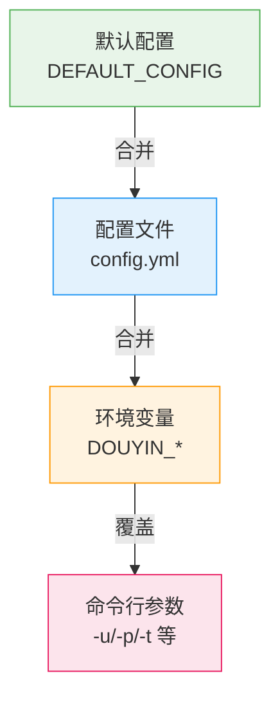
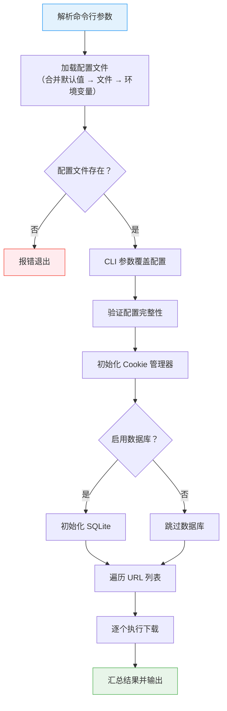

本文档系统介绍 douyin-downloader 的所有命令行入口、参数说明、运行模式以及配置优先级规则。掌握这些内容后，你可以灵活选择最适合自己的启动方式——无论是本地脚本、pip 安装后的全局命令，还是 Docker 容器化部署。

## 启动入口总览

douyin-downloader 提供了三种对等的启动入口，它们最终都调用同一个 `cli.main:main()` 函数，功能完全一致：

| 启动方式 | 命令 | 适用场景 |
|----------|------|----------|
| 源码直接运行 | `python run.py` | 开发调试、未安装到虚拟环境时 |
| pip 全局命令 | `douyin-dl` | 安装到环境后的日常使用 |
| Docker 容器 | `docker run ...` | 服务器部署、CI/CD 场景 |

`run.py` 的工作极其简洁：它将项目根目录加入 `sys.path`，切换工作目录到项目根，然后调用 [`cli.main:main()`](cli/main.py#L221-L256)。在 `pyproject.toml` 中，通过 `[project.scripts]` 段注册了 `douyin-dl` 命令行入口点，使得 `pip install .` 之后可以直接在终端使用 `douyin-dl` 命令。Dockerfile 的 `ENTRYPOINT` 同样指向 `python run.py`，并默认传入 `-c config.yml` 参数。

Sources: [run.py](run.py#L1-L14), [pyproject.toml](pyproject.toml#L50-L51), [Dockerfile](Dockerfile#L18-L19)

## 核心命令行参数

主程序通过 Python 标准库 `argparse` 定义了以下参数。这些参数的作用是**覆盖配置文件中的对应值**，而非替代配置文件。

### 参数一览表

| 参数 | 短选项 | 类型 | 默认值 | 说明 |
|------|--------|------|--------|------|
| `--url` | `-u` | 字符串（可重复） | 无 | 追加下载链接到配置文件的 `link` 列表 |
| `--config` | `-c` | 字符串 | `config.yml` | 指定配置文件路径 |
| `--path` | `-p` | 字符串 | 无 | 覆盖下载保存目录 |
| `--thread` | `-t` | 整数 | 无 | 覆盖并发下载数 |
| `--show-warnings` | — | 开关 | 关闭 | 在控制台显示 WARNING 级别以上的日志 |
| `--verbose` | `-v` | 开关 | 关闭 | 在控制台显示 INFO 级别以上的日志 |
| `--version` | — | 开关 | — | 显示版本号后退出 |

Sources: [cli/main.py](cli/main.py#L221-L234)

### 参数详解

**`-u / --url`（追加下载链接）**：使用 `action='append'` 模式注册，意味着你可以在命令行中多次使用此参数追加多个 URL。这些 URL 会被**追加到**配置文件 `link` 列表末尾（而非替换）。如果配置文件中已有链接，不会产生重复——代码会先检查 URL 是否已存在再追加。

```bash
# 追加两个下载链接
python run.py -u "https://www.douyin.com/video/7604129988555574538" \
              -u "https://www.douyin.com/note/7341234567890123456"
```

**`-c / --config`（指定配置文件）**：默认读取工作目录下的 `config.yml`。如果指定路径的文件不存在，程序会输出错误提示并退出。

**`-p / --path`（覆盖保存目录）**：直接覆盖配置文件中的 `path` 字段，优先级高于配置文件和环境变量。

**`-t / --thread`（覆盖并发数）**：直接覆盖配置文件中的 `thread` 字段。默认值为 5，建议根据网络带宽和目标服务器承受能力调整。

**`--show-warnings` 与 `-v / --verbose`（日志级别控制）**：这两个参数控制控制台日志的详细程度，存在三级递进关系：

| 参数组合 | 控制台日志级别 | 说明 |
|----------|---------------|------|
| （无参数） | `ERROR` | 仅显示错误，进度条运行期间自动静默所有日志 |
| `--show-warnings` | `WARNING` | 显示警告和错误，适合排查问题 |
| `-v / --verbose` | `INFO` | 显示全部信息日志，适合开发调试 |

值得注意的是，当配置文件中 `progress.quiet_logs` 为 `true`（默认）且未指定 `--verbose` 或 `--show-warnings` 时，程序会在 Rich 进度条运行期间将控制台日志级别临时提升至 `CRITICAL`，防止大量错误日志导致终端界面重复重绘。下载完成后恢复为 `ERROR` 级别。

Sources: [cli/main.py](cli/main.py#L128-L183), [cli/main.py](cli/main.py#L221-L248)

### 典型命令组合

```bash
# 基础运行：使用默认配置文件
python run.py

# 指定配置文件 + 追加 URL + 提高并发
python run.py -c /path/to/config.yml \
  -u "https://www.douyin.com/video/7604129988555574538" \
  -t 8

# 使用 pip 安装后的全局命令
douyin-dl -c config.yml -p ./my_downloads --verbose

# 查看版本号
python run.py --version
```

Sources: [cli/main.py](cli/main.py#L221-L248), [README.md](README.md#L145-L173)

## 配置优先级体系

命令行参数并非独立工作——它嵌入在一个三层配置合并体系中。理解优先级有助于你在不同场景下选择最合适的配置方式。



优先级从低到高排列如下：

| 优先级 | 来源 | 示例 | 覆盖范围 |
|--------|------|------|----------|
| 1（最低） | 代码内默认配置 | `DEFAULT_CONFIG` 字典 | 全部字段 |
| 2 | YAML 配置文件 | `config.yml` | 全部字段 |
| 3 | 环境变量 | `DOUYIN_PATH`, `DOUYIN_THREAD` | `path`, `thread`, `proxy`, `cookie` |
| 4（最高） | 命令行参数 | `-p`, `-t`, `-u` | `path`, `thread`, `link` |

环境变量支持以下四个字段：

| 环境变量 | 对应配置字段 | 类型 |
|----------|-------------|------|
| `DOUYIN_COOKIE` | `cookie` | 字符串 |
| `DOUYIN_PATH` | `path` | 字符串 |
| `DOUYIN_THREAD` | `thread` | 整数 |
| `DOUYIN_PROXY` | `proxy` | 字符串 |

Sources: [config/config_loader.py](config/config_loader.py#L21-L69), [cli/main.py](cli/main.py#L140-L152)

## 三种运行模式

### 模式一：配置文件驱动（推荐）

这是最常用的模式。在 `config.yml` 中完整定义下载链接、模式、数量限制等所有参数，然后通过 `python run.py` 或 `douyin-dl` 启动。程序的完整执行流程如下：



配置文件驱动模式的核心优势在于**可复现性**——同样的配置文件在任何时间运行都会产生一致的下载行为，适合批量任务和定时调度场景。

Sources: [cli/main.py](cli/main.py#L128-L219)

### 模式二：命令行快速覆盖

当你只需要临时调整一两个参数（如追加一个 URL、改变保存路径）时，无需修改配置文件，直接在命令行追加参数即可。命令行参数会覆盖配置文件中的对应值，但不会修改配置文件本身。

```bash
# 临时下载一个视频到指定目录，不影响 config.yml 的配置
python run.py -u "https://www.douyin.com/video/7604129988555574538" \
              -p ./temp_downloads \
              -t 3
```

此模式特别适合**一次性下载任务**或**快速测试**。

Sources: [cli/main.py](cli/main.py#L142-L152), [README.zh-CN.md](README.zh-CN.md#L145-L164)

### 模式三：Docker 容器化运行

Dockerfile 将项目打包为一个独立的容器镜像，通过 Volume 挂载配置文件和下载目录：

```bash
# 构建镜像
docker build -t douyin-downloader .

# 运行容器
docker run -v $(pwd)/config.yml:/app/config.yml \
           -v $(pwd)/Downloaded:/app/Downloaded \
           douyin-downloader

# 传入额外参数（覆盖 CMD 默认值）
docker run -v $(pwd)/config.yml:/app/config.yml \
           -v $(pwd)/Downloaded:/app/Downloaded \
           douyin-downloader -c config.yml -t 8 --verbose
```

Dockerfile 的 `ENTRYPOINT` 为 `python run.py`，`CMD` 默认参数为 `-c config.yml`。因此直接 `docker run` 等价于 `python run.py -c config.yml`，追加参数会覆盖 `CMD` 部分。

Sources: [Dockerfile](Dockerfile#L1-L19)

## 信号处理与中断行为

主程序注册了 `KeyboardInterrupt`（Ctrl+C）信号处理。当你按下 Ctrl+C 时：

- 程序输出 `"Download interrupted by user"` 提示
- 以退出码 `0` 正常退出（而非崩溃退出码）
- 如果数据库已初始化，`finally` 块会确保数据库连接被正确关闭
- 正在进行的下载任务会被取消

这是 `asyncio.run()` 的默认行为——取消所有未完成的协程。Rich 进度条也会在 `finally` 中通过 `stop_download_session()` 被正确清理。

Sources: [cli/main.py](cli/main.py#L244-L252), [cli/main.py](cli/main.py#L201-L206)

## 辅助命令行工具

除主程序外，项目还包含两个独立的命令行工具，它们有各自的参数体系。

### Cookie 自动抓取工具

用于通过 Playwright 浏览器自动登录抖音并抓取 Cookie：

```bash
python -m tools.cookie_fetcher --config config.yml
```

| 参数 | 类型 | 默认值 | 说明 |
|------|------|--------|------|
| `--url` | 字符串 | `https://www.douyin.com/` | 登录页地址 |
| `--browser` | 枚举 | `chromium` | 浏览器引擎（chromium/firefox/webkit） |
| `--headless` | 开关 | 关闭 | 无头模式（手动登录时不建议开启） |
| `--output` | 路径 | `config/cookies.json` | Cookie 输出文件 |
| `--config` | 路径 | 无 | 将抓取到的 Cookie 直接写入指定 config.yml |
| `--include-all` | 开关 | 关闭 | 保存所有 Cookie 而非仅推荐子集 |

Sources: [tools/cookie_fetcher.py](tools/cookie_fetcher.py#L39-L75)

### Whisper 视频转录工具

基于 OpenAI Whisper 对已下载的视频进行本地语音识别：

```bash
python cli/whisper_transcribe.py -d ./Downloaded/ -m base --srt
```

| 参数 | 短选项 | 类型 | 默认值 | 说明 |
|------|--------|------|--------|------|
| `--dir` | `-d` | 字符串 | `./Downloaded` | 视频扫描目录 |
| `--file` | `-f` | 字符串 | 无 | 指定单个视频文件 |
| `--model` | `-m` | 枚举 | `base` | Whisper 模型（tiny/base/small/medium/large） |
| `--language` | `-l` | 字符串 | `zh` | 识别语言 |
| `--srt` | — | 开关 | 关闭 | 同时输出 SRT 字幕文件 |
| `--skip-existing` | — | 开关 | 关闭 | 跳过已有转录结果的视频 |
| `--sc` | — | 开关 | 关闭 | 繁体转简体（需安装 OpenCC） |
| `--output` | `-o` | 字符串 | 无 | 转录文件输出目录 |

Sources: [cli/whisper_transcribe.py](cli/whisper_transcribe.py#L398-L420)

## 常见问题与排查

| 问题 | 可能原因 | 解决方案 |
|------|----------|----------|
| `Config file not found` | 配置文件路径错误 | 检查 `-c` 参数或确保 `config.yml` 存在于工作目录 |
| `Cookies may be invalid` | Cookie 缺少必要字段 | 使用 `python -m tools.cookie_fetcher --config config.yml` 重新获取 |
| 下载中断后无进度 | 进度条被日志干扰 | 添加 `--verbose` 查看详细日志，或检查配置中 `progress.quiet_logs` |
| Docker 中无法下载 | 网络代理未传入容器 | 在 `config.yml` 中设置 `proxy`，或通过环境变量 `DOUYIN_PROXY` 传入 |

## 下一步

- 完整的配置文件字段说明请参阅 [配置文件详解：config.yml 全字段说明与典型场景示例](3-pei-zhi-wen-jian-xiang-jie-config-yml-quan-zi-duan-shuo-ming-yu-dian-xing-chang-jing-shi-li)
- Cookie 的获取方式与认证配置请参阅 [Cookie 获取与认证配置](5-cookie-huo-qu-yu-ren-zheng-pei-zhi)
- 了解命令行参数背后的完整执行流程请参阅 [整体架构：模块划分与数据流全景](6-zheng-ti-jia-gou-mo-kuai-hua-fen-yu-shu-ju-liu-quan-jing)