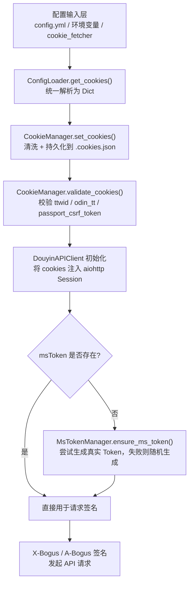
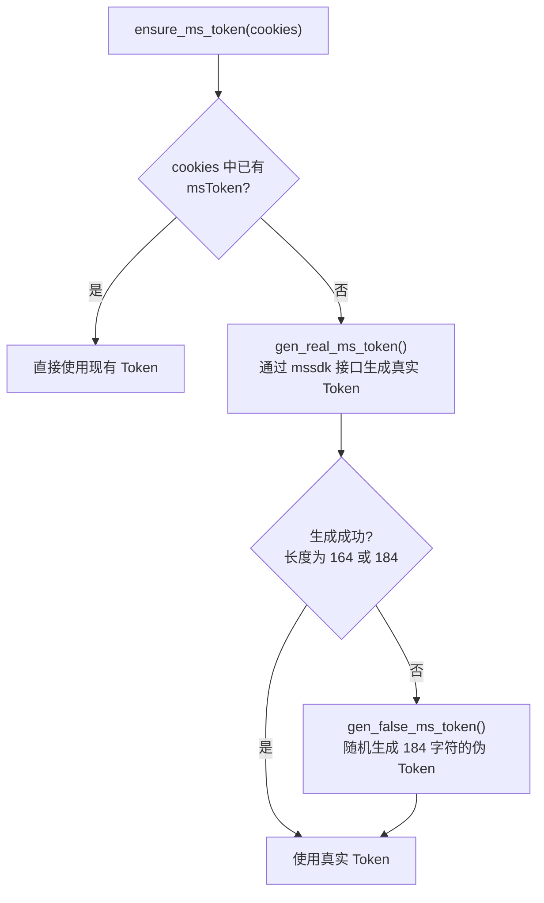

抖音 Web 端 API 依赖浏览器 Cookie 完成身份识别与请求鉴权。本工具围绕这一需求构建了**四层协作**的认证体系：配置输入层（`config.yml` / 环境变量）→ Cookie 管理层（`CookieManager`）→ Token 自动补充层（`MsTokenManager`）→ 请求签名层（`DouyinAPIClient`）。本文将逐层讲解每种配置方式的操作步骤、适用场景，以及遇到 Cookie 失效时的快速恢复方法。

Sources: [cli/main.py](cli/main.py#L158-L163), [config/config_loader.py](config/config_loader.py#L166-L177)

## 认证体系总览

整个 Cookie 配置从"用户输入"到"实际请求"经过以下流水线，理解它有助于你快速定位问题出现在哪个环节：



这个流程中的每个节点都有对应的容错机制：`CookieManager` 会清洗非法键名，`MsTokenManager` 会在真实 Token 不可用时回退到随机 Token，签名算法也支持 A-Bogus 不可用时降级到 X-Bogus。

Sources: [cli/main.py](cli/main.py#L158-L163), [auth/cookie_manager.py](auth/cookie_manager.py#L46-L59), [core/api_client.py](core/api_client.py#L111-L124)

## Cookie 的三种配置方式

本工具支持三种独立的 Cookie 输入方式，你可以根据使用场景选择其中一种，也可以组合使用（优先级：环境变量 > `config.yml` > 自动模式）。

Sources: [config/config_loader.py](config/config_loader.py#L53-L69)

### 方式一：Playwright 自动抓取（推荐）

这是**最推荐**的方式。工具内置了一个基于 Playwright 的浏览器 Cookie 抓取器，它会在真实浏览器中打开抖音登录页，等待你手动完成登录后，自动提取全部认证 Cookie 并写入配置文件。

**操作步骤：**

```bash
# 1. 确保已安装 Playwright（仅首次需要）
pip install playwright
python -m playwright install chromium

# 2. 启动 Cookie 抓取器，自动写入 config.yml
python -m tools.cookie_fetcher --config config.yml
```

执行后，终端会提示"Browser launched"，同时弹出一个 Chromium 浏览器窗口。你在浏览器中**正常登录抖音账号**，登录成功返回首页后，**切回终端按 Enter**，程序即可完成抓取。

**`cookie_fetcher` 支持的命令行参数：**

| 参数 | 默认值 | 说明 |
|------|--------|------|
| `--url` | `https://www.douyin.com/` | 浏览器打开的登录页地址 |
| `--browser` | `chromium` | 浏览器引擎（可选 `chromium` / `firefox` / `webkit`） |
| `--headless` | `false` | 是否无头模式运行（手动登录时不建议开启） |
| `--output` | `config/cookies.json` | Cookie JSON 文件的输出路径 |
| `--config` | 无 | 同时更新指定的 `config.yml` 文件 |
| `--include-all` | `false` | 保存所有 Cookie 而非推荐子集 |

抓取完成后，`config.yml` 中会自动写入完整的 `cookies` 字段。如果缺少必需的 Cookie 键，终端会打印警告信息。

Sources: [tools/cookie_fetcher.py](tools/cookie_fetcher.py#L39-L75), [tools/cookie_fetcher.py](tools/cookie_fetcher.py#L78-L158)

### 方式二：在 config.yml 中手动填写

如果你已经从浏览器开发者工具中复制了 Cookie，可以直接在 `config.yml` 中以字典格式填写：

```yaml
cookies:
  msToken: ""
  ttwid: "你的_ttwid_值"
  odin_tt: "你的_odin_tt_值"
  passport_csrf_token: "你的_csrf_token_值"
  sid_guard: ""
  sessionid: ""
  sid_tt: ""
```

也支持以**原始 Cookie 字符串**形式填写（从浏览器请求头的 `Cookie` 字段复制）：

```yaml
cookie: "ttwid=xxx; odin_tt=xxx; passport_csrf_token=xxx; msToken=xxx"
```

> **注意**：字典形式使用 `cookies` 键（复数），字符串形式使用 `cookie` 键（单数）。程序会依次检查两个键，优先使用 `cookies`。

Sources: [config/config_loader.py](config/config_loader.py#L166-L180), [README.zh-CN.md](README.zh-CN.md#L110-L119)

### 方式三：环境变量与自动模式

在容器化部署或 CI/CD 场景中，你可以通过环境变量注入 Cookie：

```bash
# 以原始 Cookie 字符串传入
export DOUYIN_COOKIE="ttwid=xxx; odin_tt=xxx; passport_csrf_token=xxx"
```

此外，`config.yml` 中还有一个 `auto_cookie` 开关，启用后程序会在以下路径中自动搜索 `cookies.json` 或 `.cookies.json` 文件：

- `config.yml` 所在目录的 `config/` 子目录
- `config.yml` 所在目录本身
- 当前工作目录

```yaml
auto_cookie: true   # 启用自动加载
cookies: auto       # 也可以将 cookies 设为 "auto" 触发自动加载
```

Sources: [config/config_loader.py](config/config_loader.py#L182-L224), [config/default_config.py](config/default_config.py#L47)

## 核心 Cookie 字段说明

抖音 Web 端 API 要求请求携带以下关键 Cookie 字段。不同字段的用途和重要性各不相同：

| Cookie 字段 | 必需 | 用途 | 缺失影响 |
|-------------|------|------|----------|
| **ttwid** | ✅ | 抖音设备标识，用于请求路由和频率限制 | API 请求直接失败 |
| **odin_tt** | ✅ | 抖音认证令牌，参与服务端鉴权 | API 请求直接失败 |
| **passport_csrf_token** | ✅ | CSRF 防护令牌，部分接口强制校验 | 涉及写操作的接口失败 |
| **msToken** | ⚠️ 可自动生成 | 请求签名所需的会话 Token | 由 `MsTokenManager` 自动补全 |
| **sid_guard** | 推荐 | 登录会话守卫，影响数据完整度 | 部分私密内容无法获取 |
| **sessionid** | 推荐 | 登录会话标识 | 无法访问登录态下的数据 |
| **sid_tt** | 推荐 | TikTok 侧会话标识 | 跨平台内容获取可能受限 |

Sources: [auth/cookie_manager.py](auth/cookie_manager.py#L46-L59), [tools/cookie_fetcher.py](tools/cookie_fetcher.py#L15-L32)

## CookieManager：Cookie 的加载、清洗与校验

[`CookieManager`](auth/cookie_manager.py) 是认证体系的核心枢纽，负责接收来自配置层的 Cookie 字典，进行清洗后持久化到本地文件，并在使用时提供校验。

### 初始化与 Cookie 写入

当 CLI 主流程启动时，`ConfigLoader` 解析配置得到 Cookie 字典，随后交给 `CookieManager` 处理：

```python
# cli/main.py 中的初始化流程
cookies = config.get_cookies()          # 从配置中获取 Cookie
cookie_manager = CookieManager()        # 创建管理器，默认文件路径 .cookies.json
cookie_manager.set_cookies(cookies)     # 清洗 + 持久化
```

`set_cookies()` 方法会调用 `sanitize_cookies()` 对键值对进行 **RFC 6265 合规性清洗**，过滤掉空键名、含非法字符（如 `;`、`,`、空格）的键名，并将所有值转为字符串。清洗后的 Cookie 以 JSON 格式写入 `.cookies.json` 文件，后续程序重启可直接从文件加载，无需再次解析配置。

Sources: [cli/main.py](cli/main.py#L158-L160), [auth/cookie_manager.py](auth/cookie_manager.py#L16-L18), [auth/cookie_manager.py](auth/cookie_manager.py#L29-L44)

### Cookie 校验机制

`validate_cookies()` 方法检查三个**必需字段**是否完整：`ttwid`、`odin_tt`、`passport_csrf_token`。三个字段全部存在且非空时返回 `True`，否则返回 `False` 并在日志中打印缺失字段名称。`msToken` 不在必需列表中——即使缺失，程序也会在 API 请求时自动生成。

Sources: [auth/cookie_manager.py](auth/cookie_manager.py#L46-L59)

## MsTokenManager：msToken 的自动生成策略

`msToken` 是抖音 API 请求中的关键参数，参与 URL 签名计算。它有一个独特之处：即使没有从浏览器获取到真实的 `msToken`，程序也能通过自动生成来保证请求正常发出。

### 三级生成策略



**第一级 — 使用现有 Token**：如果 Cookie 字典中已经包含 `msToken` 字段，直接返回使用。

**第二级 — 生成真实 Token**：调用抖音 mssdk 端点（配置来源于 F2 项目的公开 `conf.yaml`），通过 POST 请求获取真实的 `msToken`。生成后会校验 Token 长度是否为 164 或 184 个字符。为了减少远程请求次数，F2 配置在内存中缓存 1 小时（TTL = 3600 秒），并使用线程锁保证并发安全。

**第三级 — 随机回退**：如果 mssdk 接口不可达或返回格式异常，程序会生成一个由 182 个随机字母数字字符 + `==` 后缀组成的伪 Token（总长 184 字符），确保请求参数结构完整。

Sources: [auth/ms_token_manager.py](auth/ms_token_manager.py#L61-L70), [auth/ms_token_manager.py](auth/ms_token_manager.py#L72-L109), [auth/ms_token_manager.py](auth/ms_token_manager.py#L50-L59)

## cookie_fetcher 的内部工作机制

[`cookie_fetcher`](tools/cookie_fetcher.py) 是一个功能完备的浏览器 Cookie 采集工具。理解它的内部流程有助于你在遇到异常时快速排查问题。

### 浏览器导航的容错策略

浏览器打开抖音页面时，默认使用 `networkidle` 等待策略（等待网络完全空闲）。但抖音首页可能持续发送心跳或数据上报请求，导致 `networkidle` 永远无法达到。为此，抓取器内置了**二级降级策略**：首次超时（300 秒）后自动降级为 `domcontentloaded` 等待策略；若第二次仍然超时，则继续执行不中断流程。此外，如果用户在导航完成前就关闭了浏览器页面（`TargetClosedError`），程序也不会崩溃，而是继续使用当前的浏览器状态。

Sources: [tools/cookie_fetcher.py](tools/cookie_fetcher.py#L161-L208)

### msToken 的多源提取

`msToken` 是所有 Cookie 字段中最难可靠获取的一个，因为它可能不出现在 `document.cookie` 中，而是隐藏在请求参数、响应头或浏览器存储中。抓取器按照优先级依次尝试以下提取策略：

| 优先级 | 数据源 | 提取方式 |
|--------|--------|----------|
| 1 | `storage_state` 中的 Cookie | 直接读取 `msToken` 键 |
| 2 | 拦截到的 URL query 参数 | 从请求 URL 的 `?msToken=` 参数提取 |
| 3 | 拦截到的 Cookie 请求头 | 解析 `Cookie:` 请求头 |
| 4 | `document.cookie` | 在页面中执行 JS 读取 |
| 5 | `localStorage` / `sessionStorage` | 在页面中执行 JS 遍历查找含 `mstoken` 的键 |

通过这五层逐级回退，即使在最不利的环境下，也能最大概率地获取到有效的 `msToken`。

Sources: [tools/cookie_fetcher.py](tools/cookie_fetcher.py#L234-L314)

### Cookie 过滤与输出

默认情况下，`cookie_fetcher` 不会保存所有浏览器 Cookie，而是只保留与抖音认证相关的子集：

- **核心键**：`msToken`、`ttwid`、`odin_tt`、`passport_csrf_token`、`sid_guard`、`sessionid`、`sid_tt`
- **辅助键**：`_waftokenid`、`s_v_web_id`、`__ac_nonce`、`__ac_signature`、`UIFID` 等
- **前缀匹配键**：以 `__security_mc_`、`bd_ticket_guard_`、`_bd_ticket_crypt_` 开头的键

如果使用了 `--include-all` 参数，则跳过过滤，保存所有 `douyin.com` 域下的 Cookie。

Sources: [tools/cookie_fetcher.py](tools/cookie_fetcher.py#L15-L32), [tools/cookie_fetcher.py](tools/cookie_fetcher.py#L336-L348)

## cookie_utils：底层清洗工具

[`cookie_utils`](utils/cookie_utils.py) 提供了 Cookie 处理的基础工具函数，被 `CookieManager`、`ConfigLoader`、`cookie_fetcher` 三个模块共同依赖：

- **`sanitize_cookies(cookies)`**：遍历输入字典，过滤空键名和包含 RFC 6265 非法字符（如 `()`、`<>`、`;`、`,`、`"`、`/`、`[]`、`?`、`=`、`{}` 以及空白字符）的键名，将所有值转为字符串并去除首尾空白。
- **`parse_cookie_header(cookie_header)`**：将浏览器格式的 `Cookie:` 请求头字符串解析为字典，按 `;` 分割后逐一提取键值对，同样经过合法性校验。
- **`is_valid_cookie_name(name)`**：校验单个 Cookie 名称是否合规——必须由 ASCII 33-126 范围内的可打印字符组成，且不含 RFC 6265 定义的分隔符。

Sources: [utils/cookie_utils.py](utils/cookie_utils.py#L1-L46)

## 常见问题与排查

| 问题现象 | 可能原因 | 解决方案 |
|----------|----------|----------|
| API 返回 403 或空数据 | Cookie 已过期 | 重新运行 `python -m tools.cookie_fetcher --config config.yml` |
| 日志提示 "missing: ttwid, odin_tt" | Cookie 字典中缺少必需字段 | 检查 `config.yml` 中 `cookies` 配置是否完整 |
| 日志提示 "msToken not found" | msToken 未提供但程序可自动生成 | 正常提示，不影响下载；也可手动在浏览器中获取后填入 |
| cookie_fetcher 启动报错 "Playwright is not installed" | 未安装 Playwright 依赖 | 执行 `pip install playwright && python -m playwright install chromium` |
| cookie_fetcher 超时 | 抖音首页持续发送请求 | 正常行为，程序会自动降级为 `domcontentloaded` 等待策略 |
| 收藏夹模式无法获取数据 | 未使用已登录账号的 Cookie | 确保通过 `cookie_fetcher` 登录后再尝试 `collect` / `collectmix` 模式 |

Sources: [README.zh-CN.md](README.zh-CN.md#L411-L417), [auth/cookie_manager.py](auth/cookie_manager.py#L46-L59)

## 下一步阅读

- Cookie 正确配置后，下一步是了解完整的配置文件体系：[配置文件详解：config.yml 全字段说明与典型场景示例](3-pei-zhi-wen-jian-xiang-jie-config-yml-quan-zi-duan-shuo-ming-yu-dian-xing-chang-jing-shi-li)
- 了解 Cookie 如何被 API 客户端消费：[抖音 API 客户端（DouyinAPIClient）的请求封装与分页标准化](11-dou-yin-api-ke-hu-duan-douyinapiclient-de-qing-qiu-feng-zhuang-yu-fen-ye-biao-zhun-hua)
- 深入了解 msToken 生成与短链解析：[短链解析与 msToken 自动生成机制](13-duan-lian-jie-xi-yu-mstoken-zi-dong-sheng-cheng-ji-zhi)
- 了解 Playwright 抓取器的更多技术细节：[Playwright Cookie 抓取工具（cookie_fetcher）](28-playwright-cookie-zhua-qu-gong-ju-cookie_fetcher)