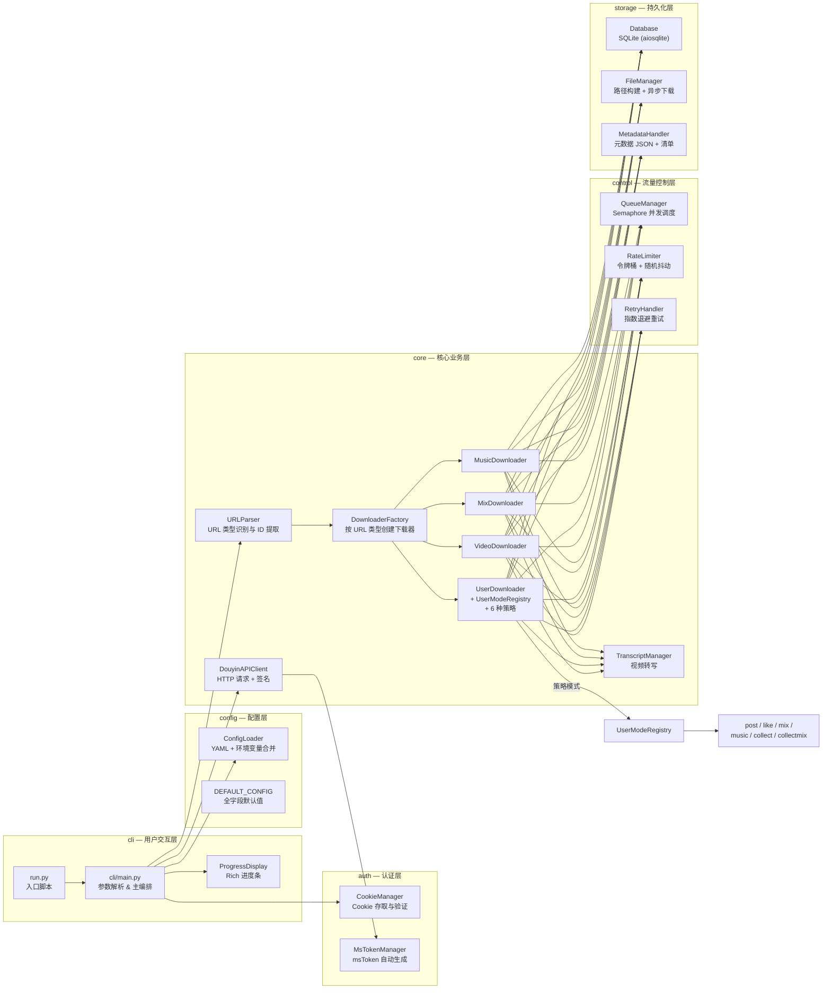
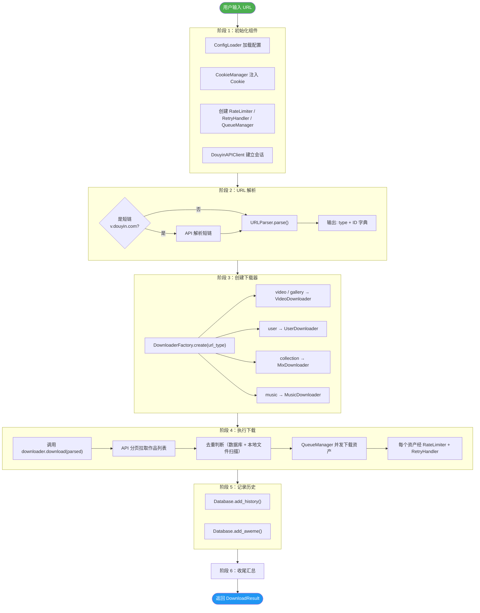
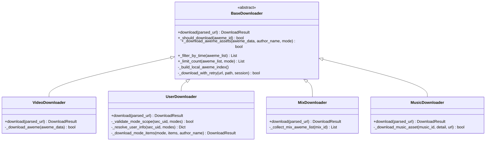
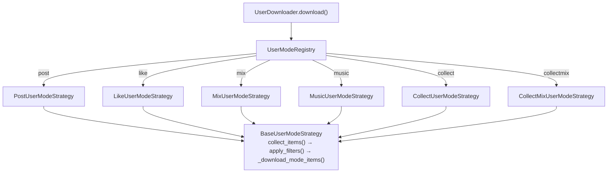
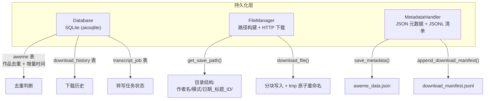

本文是抖音批量下载工具 v2.0.0 的全局架构参考。你将看到项目从 **命令行入口 → 配置加载 → URL 路由 → 下载器分发 → 并发控制 → 文件持久化** 的完整链路，以及各模块之间的职责边界与依赖关系。阅读本文后，你将具备在任意子模块中定位问题、扩展功能所需的"地图感"。

Sources: [\_\_init\_\_](/__init__.py#L1-L2), [run.py](/run.py#L1-L14)

---

## 顶层模块总览

项目由 **7 个顶层包** 和 **1 个独立入口脚本** 构成，遵循「按职责分层、按领域分包」的原则。下表概括了每个包的核心职责与对外暴露的主要类。

| 包 | 职责 | 核心导出类 | 代码入口 |
|---|---|---|---|
| **`cli`** | 命令行参数解析、进度展示、主编排逻辑 | `ProgressDisplay`、`main()` | [cli/\_\_init\_\_.py](/cli/__init__.py#L1) |
| **`config`** | YAML 配置加载、环境变量覆盖、默认值管理 | `ConfigLoader`、`DEFAULT_CONFIG` | [config/\_\_init\_\_.py](/config/__init__.py#L1-L4) |
| **`auth`** | Cookie 存取与验证、msToken 自动生成 | `CookieManager`、`MsTokenManager` | [auth/\_\_init\_\_.py](/auth/__init__.py#L1-L4) |
| **`core`** | URL 解析、API 客户端、下载器工厂与四种下载器实现 | `URLParser`、`DouyinAPIClient`、`DownloaderFactory` 等 | [core/\_\_init\_\_.py](/core/__init__.py#L1-L13) |
| **`control`** | 并发调度、速率限制、指数退避重试 | `QueueManager`、`RateLimiter`、`RetryHandler` | [control/\_\_init\_\_.py](/control/__init__.py#L1-L5) |
| **`storage`** | SQLite 数据库、文件下载与路径构建、元数据/清单写入 | `Database`、`FileManager`、`MetadataHandler` | [storage/\_\_init\_\_.py](/storage/__init__.py#L1-L5) |
| **`utils`** | 文件名清洗、URL 类型识别、日志、签名算法（X-Bogus / A-Bogus） | `sanitize_filename`、`parse_url_type`、`setup_logger` | [utils/validators.py](/utils/validators.py#L1-L47) |
| **`tools`** | 辅助工具（Playwright Cookie 抓取） | `capture_cookies()` | [tools/cookie_fetcher.py](/tools/cookie_fetcher.py#L1-L373) |

入口脚本 [run.py](/run.py#L1-L14) 仅做三件事：设置 `sys.path`、切换工作目录、调用 `cli.main()`。

Sources: [run.py](/run.py#L1-L14), [cli/main.py](/cli/main.py#L1-L18)

---

## 架构全景图

下面的 Mermaid 图展示了从用户输入到文件落盘的完整数据流，以及各模块之间的调用关系。阅读此图时，请注意 **水平方向表示数据流走向**，**垂直方向表示同一层的并行组件**。

> **阅读提示**：如果你不熟悉 Mermaid 流程图语法，只需关注箭头方向——它们表示"谁调用了谁"。每个矩形框内的第一行是类名，第二行是它的核心职责。

Sources: [cli/main.py](/cli/main.py#L31-L125), [core/downloader_factory.py](/core/downloader_factory.py#L17-L57), [core/user_mode_registry.py](/core/user_mode_registry.py#L16-L35)

---

## 主数据流详解：从 URL 到文件

一次完整的下载经历 **6 个阶段**，每个阶段对应 [cli/main.py](/cli/main.py#L31-L125) 中 `download_url()` 函数的一个步骤。下面通过流程图展开这些阶段的内部逻辑。

Sources: [cli/main.py](/cli/main.py#L31-L125)

### 各阶段的职责要点

**阶段 1 — 初始化组件**：`main_async()` 从配置文件构造 `ConfigLoader`，从中提取 Cookie 注入 `CookieManager`，然后为每个 URL 调用 `download_url()` 创建独立的 `RateLimiter`、`RetryHandler`、`QueueManager` 和 `DouyinAPIClient` 实例。`DouyinAPIClient` 采用 `async with` 上下文管理器模式，确保 `aiohttp.ClientSession` 的正确创建与关闭。

Sources: [cli/main.py](/cli/main.py#L128-L169), [core/api_client.py](/core/api_client.py#L63-L109)

**阶段 2 — URL 解析**：短链（`v.douyin.com`）先通过 `DouyinAPIClient.resolve_short_url()` 解析为完整 URL，再由 `URLParser.parse()` 根据路径特征判断 URL 类型（video / user / gallery / collection / music），并提取对应的 ID（`aweme_id` / `sec_uid` / `note_id` / `mix_id` / `music_id`）。类型判断逻辑实际委托给 [utils/validators.py](/utils/validators.py#L30-L46) 中的 `parse_url_type()` 函数。

Sources: [core/url_parser.py](/core/url_parser.py#L9-L48), [utils/validators.py](/utils/validators.py#L30-L46)

**阶段 3 — 创建下载器**：`DownloaderFactory` 是一个静态工厂类，根据 `url_type` 字符串实例化对应的下载器子类。所有下载器共享同一套依赖参数（config、api_client、file_manager 等），通过 `common_args` 字典统一传递。值得注意的是 `video` 和 `gallery` 类型都映射到 `VideoDownloader`——图文作品复用了视频下载器的资产提取逻辑。

Sources: [core/downloader_factory.py](/core/downloader_factory.py#L17-L57)

**阶段 4 — 执行下载**：这是最复杂的阶段。`BaseDownloader` 定义了所有下载器共享的去重判断（`_should_download`）、时间过滤（`_filter_by_time`）、数量限制（`_limit_count`）和资产下载（`_download_aweme_assets`）方法。`UserDownloader` 在此基础上引入策略模式，通过 `UserModeRegistry` 分派到六种用户下载策略。并发控制由 `QueueManager.download_batch()` 基于 `asyncio.Semaphore` 实现。

Sources: [core/downloader_base.py](/core/downloader_base.py#L43-L234), [core/user_downloader.py](/core/user_downloader.py#L12-L62), [control/queue_manager.py](/control/queue_manager.py#L10-L37)

**阶段 5 — 记录历史**：下载成功后，`Database` 同时记录两类信息——`download_history` 表记录本次 URL 级别的整体结果，`aweme` 表记录每个作品的元数据和文件路径。这些数据支撑了增量下载和去重判断。

Sources: [storage/database.py](/storage/database.py#L21-L107)

**阶段 6 — 收尾汇总**：所有 URL 处理完毕后，`main_async()` 汇总所有 `DownloadResult` 对象，计算总成功/失败/跳过数量，通过 `ProgressDisplay` 展示最终摘要。

Sources: [cli/main.py](/cli/main.py#L208-L218)

---

## 核心层内部结构

`core` 包是整个项目最复杂的模块，包含 **下载器继承体系** 和 **用户模式策略体系** 两个正交的设计维度。

### 下载器继承体系

**`BaseDownloader`** 承担了约 700 行的公共逻辑，包括：本地文件去重索引（`_build_local_aweme_index`）、无水印视频 URL 构建、图片/封面/音乐等附属资产的下载、元数据 JSON 写入、视频转写触发等。子类只需实现 `download()` 方法，专注于「获取待下载列表」这一差异化逻辑。

Sources: [core/downloader_base.py](/core/downloader_base.py#L43-L134), [core/video_downloader.py](/core/video_downloader.py#L9-L51), [core/user_downloader.py](/core/user_downloader.py#L12-L62), [core/mix_downloader.py](/core/mix_downloader.py#L12-L61), [core/music_downloader.py](/core/music_downloader.py#L17-L63)

### 用户模式策略体系

`UserDownloader` 没有将六种下载模式硬编码为条件分支，而是通过 **策略模式 + 注册表** 实现可扩展的模式分派：

每个策略类继承 `BaseUserModeStrategy`，通过声明 `api_method_name` 和 `mode_name` 两个类属性来指定对应的 API 方法和模式名称。基类的 `_collect_paged_aweme()` 方法封装了通用的分页遍历、游标推进、增量判断逻辑，子类只需覆盖 `collect_items()` 或 `select_items()` 实现差异化数据提取。

Sources: [core/user_mode_registry.py](/core/user_mode_registry.py#L16-L35), [core/user_modes/base_strategy.py](/core/user_modes/base_strategy.py#L15-L48), [core/user_modes/\_\_init\_\_.py](/core/user_modes/__init__.py#L1-L17)

---

## 流量控制层：三位一体的可靠性保障

`control` 包的三个组件在下载链路中形成了 **速率感知 → 并发约束 → 失败重试** 的三层防护：

| 组件 | 机制 | 关键参数 | 在链路中的作用 |
|---|---|---|---|
| **RateLimiter** | 令牌桶 + 随机抖动（0~0.5s） | `max_per_second`（默认 2） | 每次 API 调用前 `acquire()`，保证请求间隔不低于 1/max_per_second 秒 |
| **QueueManager** | `asyncio.Semaphore` | `max_workers`（默认 5） | `download_batch()` 并发执行多个资产下载，Semaphore 限制同时活跃数 |
| **RetryHandler** | 指数退避（1s → 2s → 5s） | `max_retries`（默认 3） | `execute_with_retry()` 包裹可能失败的网络操作 |

这三者的协作方式是：`RateLimiter` 在分页请求层面限速，`QueueManager` 在资产下载层面控制并发，`RetryHandler` 在单个 HTTP 请求层面处理瞬时失败。三层各自独立，互不干扰。

Sources: [control/rate_limiter.py](/control/rate_limiter.py#L6-L29), [control/queue_manager.py](/control/queue_manager.py#L10-L37), [control/retry_handler.py](/control/retry_handler.py#L10-L30)

---

## 持久化层：数据库、文件管理、元数据

**Database** 维护三张表：`aweme`（作品记录，支持去重和增量查询）、`download_history`（URL 级别下载记录）、`transcript_job`（视频转写任务状态，`UNIQUE(aweme_id, video_path, model)` 约束实现幂等更新）。所有数据库操作基于 `aiosqlite` 异步执行。

**FileManager** 负责两个核心职责：一是根据配置中的 `folderstyle` 参数构建 `作者名/模式/日期_标题_ID/` 的目录层级；二是通过 `download_file()` 方法执行实际的 HTTP 下载，采用 **临时文件 + 原子重命名** 策略防止下载中断产生不完整文件，并通过 `Content-Length` 校验确保下载完整性。

**MetadataHandler** 提供两类输出：`save_metadata()` 将完整的 aweme API 响应写入 JSON 文件供后续分析；`append_download_manifest()` 以 JSONL 格式追加式记录每次下载的元信息（含时间戳、作者、文件路径等），形成可审计的下载日志。

Sources: [storage/database.py](/storage/database.py#L7-L79), [storage/file_manager.py](/storage/file_manager.py#L13-L119), [storage/metadata_handler.py](/storage/metadata_handler.py#L13-L55)

---

## 认证层与 API 客户端

认证层由 `CookieManager` 和 `MsTokenManager` 组成。`CookieManager` 负责从配置字符串/字典/文件中加载 Cookie，验证必要字段（`ttwid`、`odin_tt`、`passport_csrf_token`）的存在性，并持久化到 `.cookies.json` 文件。`MsTokenManager` 在 Cookie 中缺少 `msToken` 时，优先通过 F2 开源项目的 mssdk 接口生成真实 msToken，失败时回退到随机生成（长度 184 的随机字符串），确保请求参数完整。

`DouyinAPIClient` 是与抖音 Web API 交互的唯一入口，承担了三项关键职责：

1. **会话管理**：基于 `aiohttp.ClientSession`，通过 `__aenter__` / `__aexit__` 上下文协议管理生命周期，从 User-Agent 池中随机选择 UA
2. **请求签名**：优先使用 A-Bogus 签名（需额外依赖），失败时回退到 X-Bogus 签名
3. **分页标准化**：`_request_json()` 方法内置 3 次重试和指数退避，统一处理 JSON 响应解析

Sources: [auth/cookie_manager.py](/auth/cookie_manager.py#L11-L59), [auth/ms_token_manager.py](/auth/ms_token_manager.py#L18-L70), [core/api_client.py](/core/api_client.py#L46-L110)

---

## 配置系统与日志

`ConfigLoader` 采用 **三层合并** 策略：`DEFAULT_CONFIG`（硬编码默认值）→ YAML 文件配置 → 环境变量覆盖。合并逻辑通过递归字典合并实现，支持嵌套配置项的局部覆盖。此外，`_normalize_mix_aliases()` 方法处理了 `mix` / `allmix` 的兼容别名问题，确保旧配置文件中的 `allmix` 字段能正确映射到规范的 `mix` 键。

日志系统基于 Python 标准 `logging` 模块，所有模块通过 `setup_logger(name)` 获取独立 Logger。`set_console_log_level()` 可在运行时动态调整控制台日志级别——进度条运行期间默认将控制台日志提升到 `CRITICAL`，避免 Rich 的反复重绘问题。

Sources: [config/config_loader.py](/config/config_loader.py#L16-L51), [config/default_config.py](/config/default_config.py#L3-L55), [utils/logger.py](/utils/logger.py#L1-L53)

---

## 建议阅读路径

掌握了全局架构后，建议按以下顺序深入各子系统的实现细节：

1. **[URL 解析与路由分发机制](7-url-jie-xi-yu-lu-you-fen-fa-ji-zhi)** — 理解 URL 如何被识别和路由到对应下载器
2. **[下载器工厂模式：按 URL 类型创建下载器](8-xia-zai-qi-gong-han-mo-shi-an-url-lei-xing-chuang-jian-xia-zai-qi)** — 深入工厂的设计决策
3. **[基础下载器（BaseDownloader）的资产下载与去重逻辑](9-ji-chu-xia-zai-qi-basedownloader-de-zi-chan-xia-zai-yu-qu-zhong-luo-ji)** — 核心下载流程的 700 行公共逻辑
4. **[并发队列管理（QueueManager）与 Semaphore 调度](17-bing-fa-dui-lie-guan-li-queuemanager-yu-semaphore-diao-du)** — 异步并发控制
5. **[抖音 API 客户端（DouyinAPIClient）的请求封装与分页标准化](11-dou-yin-api-ke-hu-duan-douyinapiclient-de-qing-qiu-feng-zhuang-yu-fen-ye-biao-zhun-hua)** — API 交互层
6. **[六种下载模式策略（post/like/mix/music/collect/collectmix）](15-liu-chong-xia-zai-mo-shi-ce-lue-post-like-mix-music-collect-collectmix)** — 用户批量下载的策略模式实现