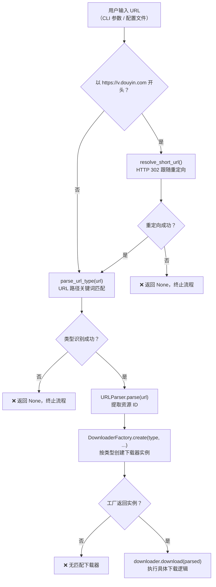
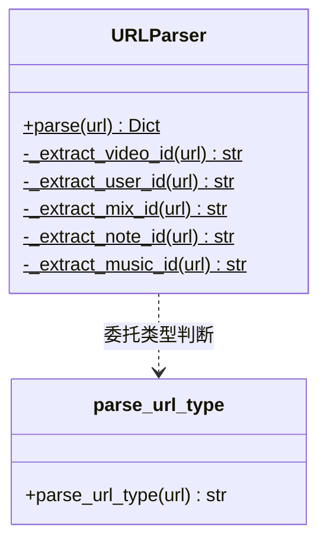
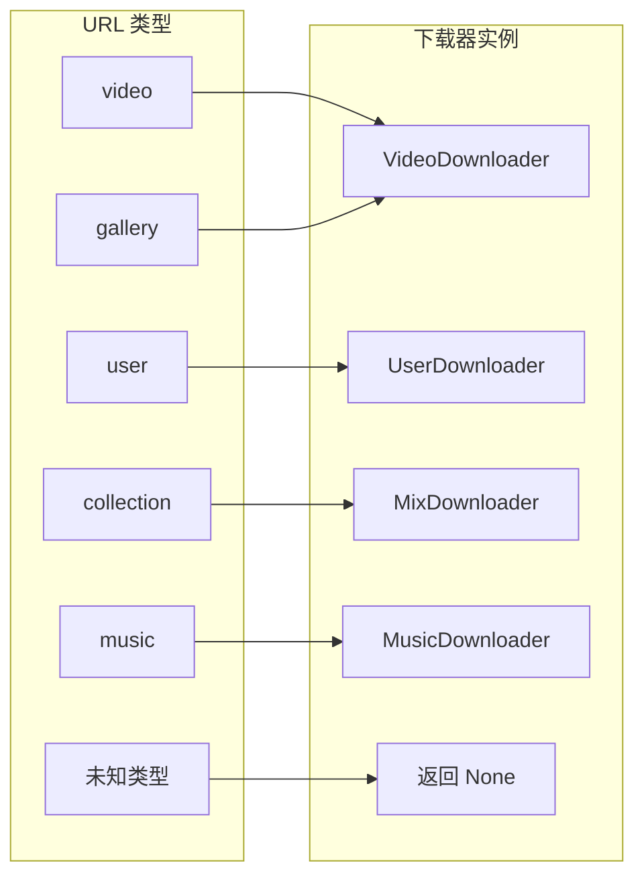

当用户将一条抖音链接投入工具时，系统需要在毫秒级完成三个判断：**这是什么类型的资源？它的唯一标识是什么？应该交给哪个下载器处理？** 本文聚焦于回答这三个问题所涉及的 URL 分类检测、资源 ID 提取、短链解析以及下载器路由分发四个环节。这是整个下载管道的入口关卡——所有后续的 API 请求、文件下载和持久化操作都依赖此处产出的结构化解析结果。

Sources: [url_parser.py](core/url_parser.py#L1-L91), [validators.py](utils/validators.py#L1-L47), [downloader_factory.py](core/downloader_factory.py#L1-L57), [main.py](cli/main.py#L31-L126)

## 端到端解析流程总览

从 CLI 入口到下载器创建，URL 经过一条清晰的处理管线。下面这张流程图展示了 `download_url()` 函数中的完整调度逻辑：



这条管线的核心设计原则是**尽早失败**——短链解析失败、类型无法识别、ID 提取为空、工厂返回 `None`，任何一个环节断裂都会立即终止当前 URL 的处理并向用户报告错误，而不会进入下游的下载流程。

Sources: [main.py](cli/main.py#L46-L96)

## URL 类型分类：`parse_url_type()` 的关键词匹配策略

URL 类型的识别由 [validators.py](utils/validators.py#L30-L46) 中的 `parse_url_type()` 函数完成。它采用**路径关键词匹配**而非正则全量解析，实现简单且性能极高。其匹配逻辑按优先级依次检查 URL 路径中的特征片段：

| 匹配条件 | 返回类型 | 典型 URL 示例 |
|---|---|---|
| `v.douyin.com` 出现在 URL 中 | `video` | `https://v.douyin.com/iRNBho5m/` |
| 路径包含 `/video/` | `video` | `https://www.douyin.com/video/7320876060210373923` |
| 路径包含 `/user/` | `user` | `https://www.douyin.com/user/MS4wLjABAAAA...` |
| 路径包含 `/note/`、`/gallery/` 或 `/slides/` | `gallery` | `https://www.douyin.com/note/7320876060210373923` |
| 路径包含 `/collection/` 或 `/mix/` | `collection` | `https://www.douyin.com/collection/7320876060210373923` |
| 路径包含 `/music/` | `music` | `https://www.douyin.com/music/7320876060210373923` |
| 以上均不匹配 | `None` | `https://www.douyin.com/hashtag/123456` |

**值得注意的设计决策**：所有 `v.douyin.com` 短链都被默认归类为 `video` 类型。这并非精确判断——短链可能指向用户主页或合集页面——但在实际运行中，短链会在上游被 `resolve_short_url()` 解析为完整 URL 后再进入类型判断，因此这个默认值仅在短链解析失败时作为兜底返回值存在，正常流程不会被触发。

Sources: [validators.py](utils/validators.py#L30-L46)

## 短链解析：从 `v.douyin.com` 到完整 URL

抖音分享链接通常以 `https://v.douyin.com/xxxxxx/` 的短链形式出现。在 [cli/main.py](cli/main.py#L53-L61) 的 `download_url()` 函数中，系统首先检测 URL 是否以 `https://v.douyin.com` 开头，若是，则调用 API 客户端的 `resolve_short_url()` 方法进行解析：

```python
# cli/main.py L53-L61
if url.startswith('https://v.douyin.com'):
    resolved_url = await api_client.resolve_short_url(url)
    if resolved_url:
        url = resolved_url
    else:
        # 短链解析失败，立即终止
        return None
```

`resolve_short_url()` 的实现利用了 HTTP 重定向机制——向短链发起 GET 请求并设置 `allow_redirects=True`，服务端经过 302 跳转后返回的最终 URL 即为包含完整路径的抖音页面地址（如 `https://www.douyin.com/video/7320876060210373923`）。这种方法简洁可靠，无需维护短链与长链的映射规则。

Sources: [main.py](cli/main.py#L53-L61), [api_client.py](core/api_client.py#L479-L490)

## `URLParser`：类型驱动的资源 ID 提取

短链解析完成后（或输入本身就是完整 URL），`URLParser.parse()` 接管后续处理。这个类采用**静态方法 + 策略分支**的设计模式：先通过 `parse_url_type()` 确定类型，再根据类型调用对应的 ID 提取方法。



每种类型提取的 ID 字段及正则模式如下表所示：

| URL 类型 | 提取方法 | 正则模式 | 输出字段 | 说明 |
|---|---|---|---|---|
| `video` | `_extract_video_id` | `/video/(\d+)` 或 `modal_id=(\d+)` | `aweme_id` | 支持标准路径和查询参数两种格式 |
| `user` | `_extract_user_id` | `/user/([A-Za-z0-9_-]+)` | `sec_uid` | sec_uid 为 Base64 编码的用户唯一标识 |
| `gallery` | `_extract_note_id` | `/(?:note\|gallery\|slides)/(\d+)` | `note_id` + `aweme_id` | **同时设置两个字段**，因为图文/图集与视频共享下载逻辑 |
| `collection` | `_extract_mix_id` | `/collection/(\d+)` 或 `/mix/(\d+)` | `mix_id` | 支持合集的两种路径变体 |
| `music` | `_extract_music_id` | `/music/(\d+)` | `music_id` | 音乐详情页的数字 ID |

**gallery 类型的双重 ID 策略**是一个值得关注的细节。在 [url_parser.py](core/url_parser.py#L38-L42) 中，`gallery` 类型同时写入了 `note_id` 和 `aweme_id` 两个字段，且值相同。这是因为图文/图集内容在抖音 API 层面使用与视频相同的 `aweme_id` 进行查询，但在 URL 层面却使用独立的路径关键词（`/note/`、`/gallery/`、`/slides/`）。双重 ID 确保了下游下载器无需关心内容形态差异。

`parse()` 方法的返回值是一个统一的字典结构，始终包含 `original_url` 和 `type` 两个基础字段，再加上类型特定的 ID 字段。如果 ID 提取失败（正则不匹配），对应字段不会被写入字典，但解析结果仍然会返回——这为下游下载器提供了自行判断完整性的空间。

Sources: [url_parser.py](core/url_parser.py#L9-L48)

## `DownloaderFactory`：类型到下载器的路由映射

解析结果中的 `type` 字段是连接 URL 解析层和下载执行层的桥梁。`DownloaderFactory.create()` 接收这个类型字符串，通过一个简洁的 if-elif 链完成路由分发：



**`video` 和 `gallery` 共享 `VideoDownloader`**——这与前述的双重 ID 策略形成呼应。抖音的图文、图集和视频在 API 数据结构上高度一致（均使用 aweme_detail 接口），因此无需为它们创建独立的下载器。工厂方法将所有依赖（配置、API 客户端、文件管理器、Cookie 管理器等）打包为 `common_args` 字典统一注入，保证了各下载器构造参数的一致性。

当遇到未知类型时，工厂返回 `None` 并记录错误日志，调用方据此终止当前 URL 的处理。

Sources: [downloader_factory.py](core/downloader_factory.py#L17-L56)

## 解析结果的下游传递

`URLParser.parse()` 返回的字典会完整地传递给下载器的 `download()` 方法。各下载器从字典中提取自己需要的字段：

| 下载器 | 消费的解析字段 | 用途 |
|---|---|---|
| `VideoDownloader` | `aweme_id` | 调用视频详情 API 获取下载地址 |
| `UserDownloader` | `sec_uid` | 调用用户作品列表 API，结合策略模式分页拉取 |
| `MixDownloader` | `mix_id` | 调用合集详情 API 获取合集内所有视频 |
| `MusicDownloader` | `music_id` | 调用音乐详情 API 获取关联视频列表 |

这种"解析层输出通用字典、下载器按需取用"的松耦合设计，使得新增 URL 类型支持时只需三步操作：在 `parse_url_type()` 中添加路径关键词、在 `URLParser` 中添加 ID 提取方法、在 `DownloaderFactory` 中添加路由分支。

Sources: [url_parser.py](core/url_parser.py#L17-L48), [downloader_factory.py](core/downloader_factory.py#L44-L56)

## 错误处理与边界情况

整个解析管线的错误处理遵循**快速失败、明确反馈**的原则：

**短链解析失败**——当 `resolve_short_url()` 因网络超时或链接失效返回 `None` 时，`download_url()` 立即打印错误信息并返回 `None`，不会继续尝试类型判断。这是因为 `v.douyin.com` 域名的短链在未解析前路径信息毫无意义。

**类型识别失败**——当 `parse_url_type()` 返回 `None` 时（如输入了 `https://www.douyin.com/hashtag/123456` 这类不支持的路由），`URLParser.parse()` 记录错误日志并返回 `None`。测试用例 [test_url_parser.py](tests/test_url_parser.py#L51-L53) 明确覆盖了这一边界情况。

**ID 提取失败**——正则匹配失败时，对应的 ID 字段不会被写入结果字典。此时 `URLParser.parse()` 仍然返回一个只含 `original_url` 和 `type` 的字典，下游下载器需要自行处理 ID 缺失的情况。

**工厂路由失败**——当 `DownloaderFactory.create()` 收到无法识别的类型字符串时，返回 `None` 并记录日志。测试用例 [test_downloader_factory.py](tests/test_downloader_factory.py#L46-L54) 验证了未知类型返回 `None` 的行为。

Sources: [main.py](cli/main.py#L53-L92), [test_url_parser.py](tests/test_url_parser.py#L51-L53), [test_downloader_factory.py](tests/test_downloader_factory.py#L46-L54)

## 延伸阅读

本文描述的 URL 解析与路由分发是下载管道的起点。了解解析结果如何被具体下载器消费，建议继续阅读：

- [下载器工厂模式：按 URL 类型创建下载器](8-xia-zai-qi-gong-han-mo-shi-an-url-lei-xing-chuang-jian-xia-zai-qi)——工厂模式的完整设计意图与扩展机制
- [基础下载器（BaseDownloader）的资产下载与去重逻辑](9-ji-chu-xia-zai-qi-basedownloader-de-zi-chan-xia-zai-yu-qu-zhong-luo-ji)——解析结果字典如何驱动具体的下载行为
- [短链解析与 msToken 自动生成机制](13-duan-lian-jie-xi-yu-mstoken-zi-dong-sheng-cheng-ji-zhi)——短链解析背后的 HTTP 机制与 Token 管理细节