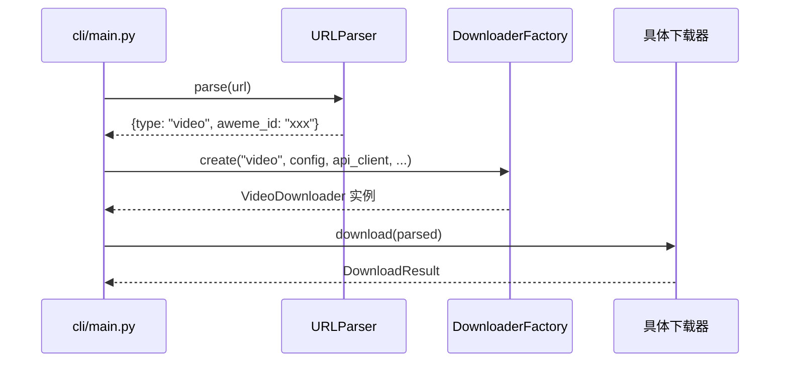
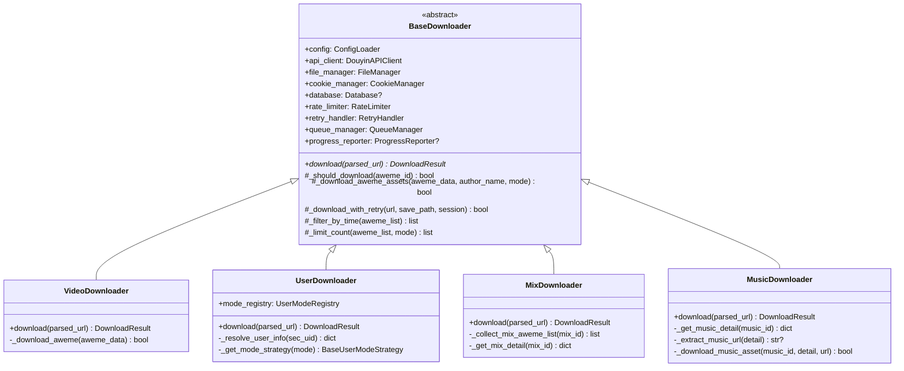

`DownloaderFactory` 是整个下载系统的**路由中枢**——它接收上游 [URL 解析与路由分发机制](7-url-jie-xi-yu-lu-you-fen-fa-ji-zhi) 产出的 URL 类型标签（如 `video`、`user`、`collection`），并将其映射到对应的下载器实例。这个工厂类采用**静态工厂方法**（Static Factory Method）模式，用不到 60 行代码完成了 5 种 URL 类型到 4 种下载器子类的分发，使得上层调用方（CLI 入口）无需感知任何具体下载器的构造细节。

Sources: [downloader_factory.py](core/downloader_factory.py#L17-L56)

## 工厂定位与调用上下文

工厂并非孤立存在。在实际运行流程中，CLI 入口先通过 `URLParser.parse()` 从原始 URL 中提取类型标签和结构化参数，再将类型标签传入 `DownloaderFactory.create()`，后者返回一个已组装好所有依赖的下载器实例，随后调用方直接执行 `downloader.download(parsed)` 完成下载。整个调用链如下所示：



值得注意的是，工厂的 `create()` 方法需要 8 个依赖参数（其中 4 个可选），这些参数涵盖了配置、API 客户端、文件管理、认证、数据库、限流、重试、并发和进度报告等横切关注点。工厂将这些参数打包为 `common_args` 字典，统一注入到所有下载器子类的构造函数中，避免了调用方手动拼装参数的繁琐逻辑。

Sources: [main.py](cli/main.py#L63-L96), [downloader_factory.py](core/downloader_factory.py#L18-L42)

## URL 类型到下载器的映射规则

工厂核心逻辑是一段简洁的类型分发：通过 `if/elif/else` 链将 URL 类型字符串映射到对应的下载器类。以下是完整的映射关系表：

| URL 类型 | 匹配来源（URL 路径特征） | 实例化的下载器 | 用途 |
|:---------|:------------------------|:-------------|:-----|
| `video` | `/video/` 路径或 `v.douyin.com` 短链 | `VideoDownloader` | 单个视频下载 |
| `gallery` | `/note/`、`/gallery/`、`/slides/` 路径 | `VideoDownloader` | 图文/图集下载（与视频共用同一处理器） |
| `user` | `/user/` 路径 | `UserDownloader` | 用户主页批量下载，支持 6 种策略模式 |
| `collection` | `/collection/` 或 `/mix/` 路径 | `MixDownloader` | 合集/收藏夹批量下载 |
| `music` | `/music/` 路径 | `MusicDownloader` | 单首音乐下载 |
| 其他 | — | `None` | 不支持的类型，记录错误日志并返回空值 |

**关键设计决策**：`gallery`（图文）类型与 `video` 类型共享同一个 `VideoDownloader`。这是因为图文作品与视频作品在获取作品详情后的资产下载逻辑高度一致——`BaseDownloader._download_aweme_assets()` 内部会根据 `aweme_data` 中的 `aweme_type` 字段自动区分视频与图集，分别走视频流下载或逐帧图片下载的分支。因此在工厂层面无需为图单设立独立下载器。

Sources: [downloader_factory.py](core/downloader_factory.py#L44-L56), [validators.py](utils/validators.py#L30-L46)

## 类层次结构与契约设计

所有下载器都继承自 `BaseDownloader` 这个抽象基类，形成了一个清晰的多态体系：



**契约的核心**是 `BaseDownloader` 中定义的抽象方法 `download(parsed_url: Dict[str, Any]) -> DownloadResult`。每个子类必须实现此方法，接收一个结构化的 URL 解析字典，返回统一的 `DownloadResult` 结果对象。`DownloadResult` 是一个简单的数据类，包含 `total`、`success`、`failed`、`skipped` 四个计数字段，便于上层汇总统计。

`BaseDownloader` 的构造函数采用**依赖注入**模式，将所有基础设施组件作为参数传入，并在内部为可选组件提供默认实例化策略（如 `rate_limiter or RateLimiter()`、`queue_manager or QueueManager(max_workers=thread_count)`），确保子类即使在外部未传入这些组件时也能正常工作。

Sources: [downloader_base.py](core/downloader_base.py#L43-L84), [downloader_base.py](core/downloader_base.py#L32-L40)

## 各下载器的职责边界

虽然共享同一个基类，四种下载器在 `download()` 方法的实现上展现出截然不同的职责边界：

**VideoDownloader**（处理 `video` 和 `gallery` 类型）是最简单的下载器。它从 `parsed_url` 中提取 `aweme_id`，调用 API 获取作品详情，然后委托给基类的 `_download_aweme_assets()` 完成资产下载。每个实例只处理一条作品。

**UserDownloader**（处理 `user` 类型）是最复杂的下载器。它从配置中读取用户指定的下载模式（`post`/`like`/`mix`/`music`/`collect`/`collectmix`），通过内部的 `UserModeRegistry` 获取对应的策略对象，逐一执行各策略的 `download_mode()` 方法。它维护了一个 `seen_aweme_ids` 集合，在多个模式之间进行全局去重，避免同一作品被重复下载。

**MixDownloader**（处理 `collection` 类型）负责合集批量下载。它先通过 API 采集合集内所有作品的元数据列表，然后利用 `QueueManager.download_batch()` 进行并发下载，将每条作品的下载状态（`success`/`skipped`/`failed`）汇总到 `DownloadResult` 中。

**MusicDownloader**（处理 `music` 类型）采用**双路径回退策略**：优先尝试通过音乐详情 API 直接获取音频链接下载；若失败，则回退到搜索该音乐下的第一条视频作品，通过下载该作品来间接获取音乐资源。这种设计体现了对抖音 API 不稳定性的防御性处理。

Sources: [video_downloader.py](core/video_downloader.py#L9-L50), [user_downloader.py](core/user_downloader.py#L12-L60), [mix_downloader.py](core/mix_downloader.py#L12-L60), [music_downloader.py](core/music_downloader.py#L17-L60)

## 工厂方法的参数组装机制

`DownloaderFactory.create()` 接收的所有参数都会被打包进 `common_args` 字典，然后通过 `**common_args` 展开传给下载器构造函数。这种设计有两个好处：一是新增下载器类型时只需在工厂中加一行映射，无需修改调用方代码；二是所有下载器共享完全一致的依赖注入签名，保证了组件间的可替换性。

```python
common_args = {
    'config': config,
    'api_client': api_client,
    'file_manager': file_manager,
    'cookie_manager': cookie_manager,
    'database': database,           # 可选，None 时不启用数据库去重
    'rate_limiter': rate_limiter,   # 可选，None 时使用默认 RateLimiter()
    'retry_handler': retry_handler, # 可选，None 时使用默认 RetryHandler()
    'queue_manager': queue_manager, # 可选，None 时按 config.thread 创建
    'progress_reporter': progress_reporter,  # 可选，None 时静默运行
}
```

需要特别注意的是，`common_args` 中的 `progress_reporter` 是一个遵循 `ProgressReporter` 协议（Protocol）的对象，而非具体类。这意味着只要实现了 `update_step()`、`set_item_total()` 和 `advance_item()` 三个方法，任何对象都可以作为进度报告器注入——这是**结构化子类型**（Structural Subtyping）的典型应用。

Sources: [downloader_factory.py](core/downloader_factory.py#L32-L42), [downloader_base.py](core/downloader_base.py#L21-L29)

## 测试验证：类型路由的完整性

工厂的测试用例集中验证了两个核心场景：

1. **正向路由**：对 5 种支持的 URL 类型逐一调用 `create()`，断言返回实例的类型与预期一致，其中 `video` 和 `gallery` 都应返回 `VideoDownloader` 实例。
2. **异常兜底**：传入未知类型字符串 `"unknown"`（甚至允许关键参数为 `None`），断言工厂返回 `None` 而非抛出异常。

这种测试策略确保了工厂的**类型安全边界**——所有已知类型都能正确路由，未知类型优雅降级。测试中使用了 `tmp_path` fixture 创建临时目录来隔离文件系统操作，并在 `finally` 块中确保 API 客户端正确关闭。

Sources: [test_downloader_factory.py](tests/test_downloader_factory.py#L16-L54)

## 扩展新下载器的操作路径

如果未来需要支持新的 URL 类型（例如直播回放 `live`），只需三步操作：

1. 在 [validators.py](utils/validators.py#L30-L46) 的 `parse_url_type()` 中添加新路径的匹配规则
2. 在 [url_parser.py](core/url_parser.py) 的 `URLParser.parse()` 中提取对应的 ID 字段
3. 在 [downloader_factory.py](core/downloader_factory.py#L44-L56) 的 `create()` 方法中增加一个新的 `elif` 分支

这种"三处修改点"的模式是当前静态工厂方法的扩展成本。对于当前 5 种类型的规模，`if/elif` 链清晰可维护；若类型数量显著增长，可考虑将映射关系提取为类级字典或引入注册机制（类似 `UserModeRegistry` 的做法），将新增类型的修改范围从三处缩减为一处。

Sources: [downloader_factory.py](core/downloader_factory.py#L44-L56), [user_mode_registry.py](core/user_mode_registry.py#L18-L25)

## 延伸阅读

- **上游**：工厂接收的 URL 类型标签来自 [URL 解析与路由分发机制](7-url-jie-xi-yu-lu-you-fen-fa-ji-zhi)，理解解析逻辑有助于掌握类型分发的前置条件。
- **下游**：工厂创建的下载器都继承自 [基础下载器（BaseDownloader）的资产下载与去重逻辑](9-ji-chu-xia-zai-qi-basedownloader-de-zi-chan-xia-zai-yu-qu-zhong-luo-ji)，深入理解基类才能看清子类的复用边界。
- **子类细节**：各下载器的具体实现差异详见 [视频/图文/音乐下载的具体实现](10-shi-pin-tu-wen-yin-le-xia-zai-de-ju-ti-shi-xian)。
- **关联模式**：`UserDownloader` 内部使用了类似工厂思想的策略注册表，详见 [UserDownloader 与 UserModeRegistry 的设计](14-userdownloader-yu-usermoderegistry-de-she-ji)。