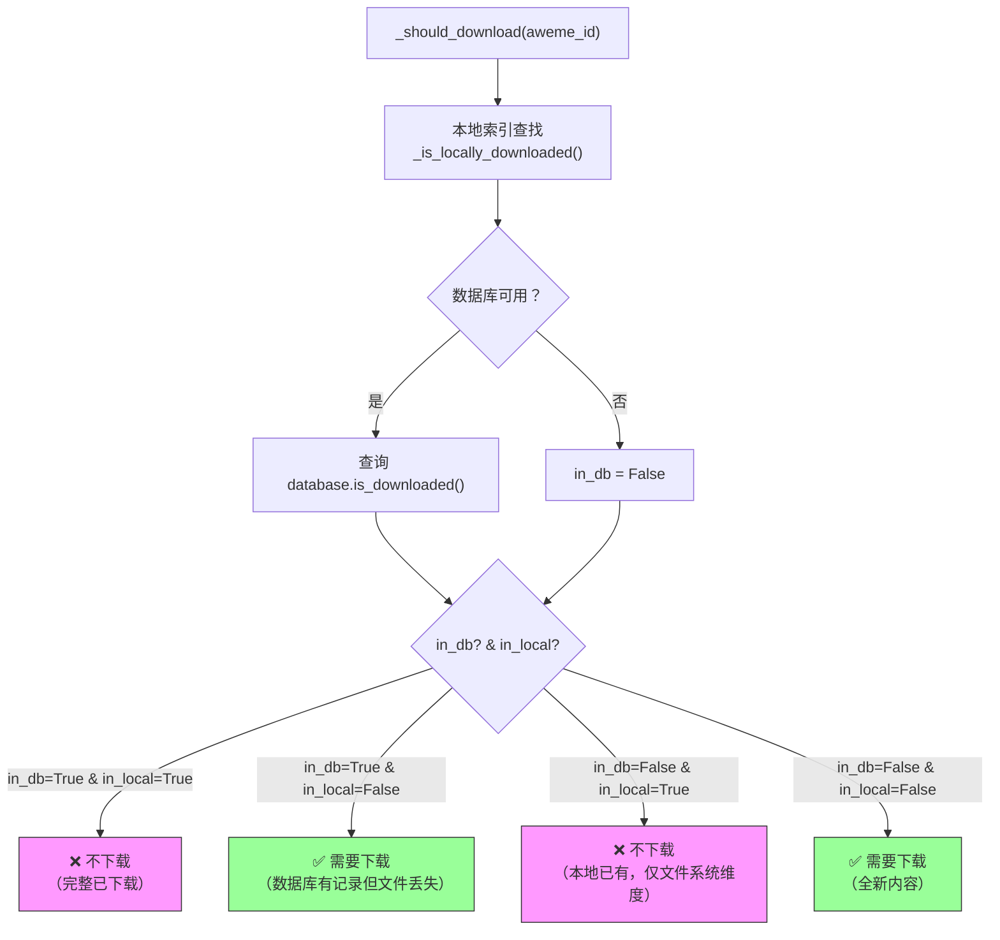
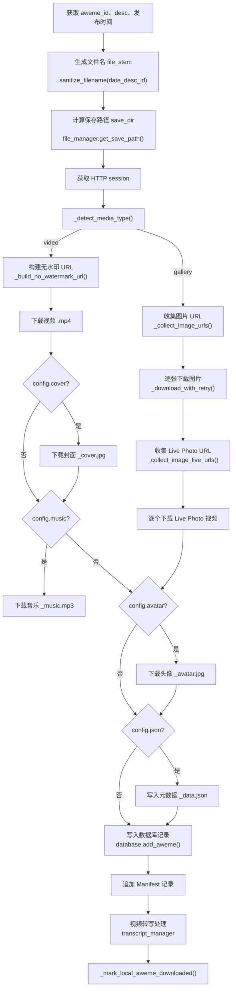
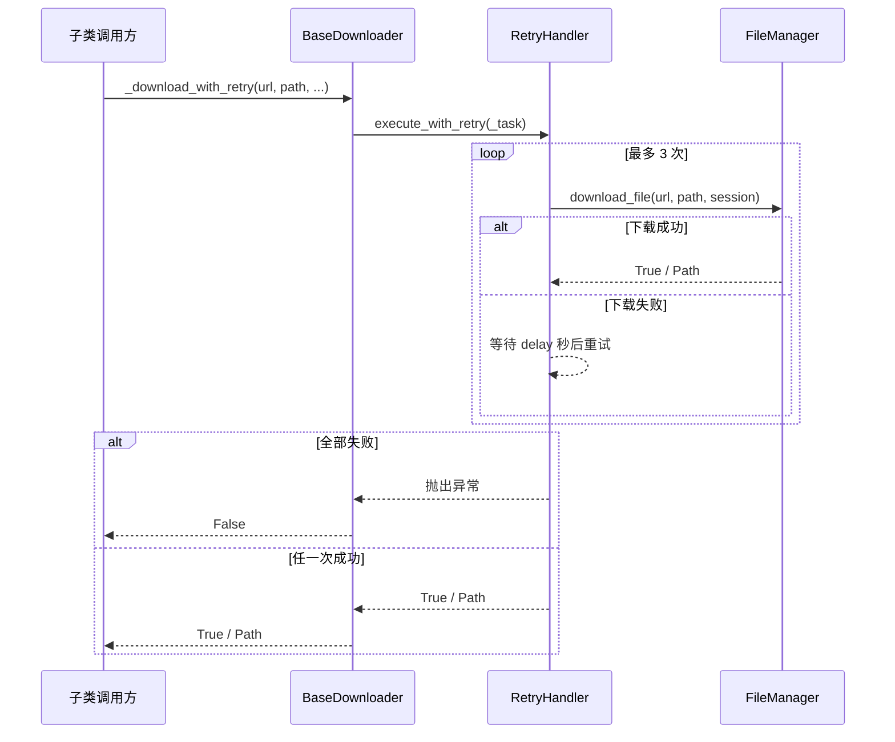
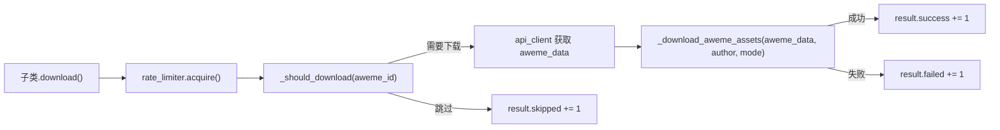

**BaseDownloader** 是整个下载器体系的抽象基类，定义了从「是否需要下载」到「资产落盘写库」的完整模板流程。四个具体子类——`VideoDownloader`、`UserDownloader`、`MixDownloader`、`MusicDownloader`——均通过继承该基类来复用去重判断、媒体类型检测、无水印 URL 构建、重试下载、元数据持久化等核心能力。本页聚焦 BaseDownloader 自身提供的方法机制，不深入子类的差异行为（详见 [视频/图文/音乐下载的具体实现](10-shi-pin-tu-wen-yin-le-xia-zai-de-ju-ti-shi-xian)）。

Sources: [downloader_base.py](core/downloader_base.py#L43-L84), [video_downloader.py](core/video_downloader.py#L9-L50)

## 类层次与依赖注入

BaseDownloader 使用 `ABC`（抽象基类）声明 `download()` 为抽象方法，强制子类实现各自的下载入口。构造函数接收 8 个外部依赖，采用「可选依赖自动创建默认实例」的模式——`rate_limiter`、`retry_handler`、`queue_manager` 在未传入时分别创建默认实例（速率 2 req/s、重试 3 次、线程数取配置 `thread` 默认 5）。`database` 是唯一允许为 `None` 的核心依赖，当其缺失时去重仅依赖本地文件索引。

```python
class BaseDownloader(ABC):
    def __init__(self, config, api_client, file_manager, cookie_manager,
                 database=None, rate_limiter=None, retry_handler=None,
                 queue_manager=None, progress_reporter=None): ...
```

Sources: [downloader_base.py](core/downloader_base.py#L43-L84)

**构造函数初始化的关键内部状态**如下表所示：

| 属性 | 类型 | 来源 | 用途 |
|---|---|---|---|
| `self.config` | ConfigLoader | 构造参数 | 读取所有运行时配置项 |
| `self.api_client` | DouyinAPIClient | 构造参数 | 发起 API 请求、URL 签名 |
| `self.file_manager` | FileManager | 构造参数 | 文件落盘、路径生成 |
| `self.database` | Database / None | 构造参数 | 数据库去重与记录写入 |
| `self.rate_limiter` | RateLimiter | 构造参数或 `RateLimiter()` | 请求间隔控制 |
| `self.retry_handler` | RetryHandler | 构造参数或 `RetryHandler()` | 指数退避重试 |
| `self.queue_manager` | QueueManager | 构造参数或 `QueueManager(max_workers)` | 并发下载调度 |
| `self.metadata_handler` | MetadataHandler | 内部创建 | JSON 元数据和 Manifest 写入 |
| `self.transcript_manager` | TranscriptManager | 内部创建 | 视频转写处理 |
| `self._local_aweme_ids` | set / None | 惰性初始化 | 本地文件去重索引 |

Sources: [downloader_base.py](core/downloader_base.py#L56-L84)

## 双层去重机制：本地索引 + 数据库

去重是 BaseDownloader 最关键的基础能力之一。它采用**双层校验**策略：先扫描本地文件系统构建 aweme_id 集合，再查询 SQLite 数据库，两层结果交叉判定是否需要下载。整个决策流程由 `_should_download()` 方法驱动。

### 决策流程



四种场景的语义如下：

| 场景 | in_db | in_local | 决策 | 含义 |
|---|---|---|---|---|
| 完整已下载 | ✅ | ✅ | 跳过 | 数据库有记录且文件存在，无需重复下载 |
| 文件丢失 | ✅ | ❌ | **重下载** | 记录存在但文件已被删除/移动，补齐资产 |
| 仅本地存在 | ❌ | ✅ | 跳过 | 手动放入的文件或数据库被清理后的残留 |
| 全新内容 | ❌ | ❌ | 下载 | 从未下载过 |

Sources: [downloader_base.py](core/downloader_base.py#L135-L155)

### 本地文件索引的构建

`_is_locally_downloaded()` 在首次调用时触发 `_build_local_aweme_index()`，对 `file_manager.base_path` 递归遍历（`rglob("*")`），执行三重过滤：

1. **文件类型过滤**：仅保留后缀在 `_local_media_suffixes`（`.mp4`、`.jpg`、`.jpeg`、`.png`、`.webp`、`.gif`、`.mp3`、`.m4a`）中的文件
2. **空文件过滤**：`st_size <= 0` 的文件被排除
3. **ID 提取**：通过正则 `(?<!\d)(\d{15,20})(?!\d)` 从文件名中提取 15–20 位的纯数字串作为 aweme_id

这种惰性初始化（首次访问时构建、后续直接查 set）确保索引仅构建一次，且 `_mark_local_aweme_downloaded()` 方法在每次成功下载后将新的 aweme_id 追加到集合中，避免同一会话内重复下载。

Sources: [downloader_base.py](core/downloader_base.py#L70-L84), [downloader_base.py](core/downloader_base.py#L157-L194)

## 资产下载主流程

`_download_aweme_assets()` 是 BaseDownloader 的核心方法，承担单条 aweme 从解析到落盘的全部工作。它被所有子类在各自的 `download()` 实现中统一调用。

### 整体流程



Sources: [downloader_base.py](core/downloader_base.py#L235-L447)

### 媒体类型检测

`_detect_media_type()` 通过三重判据决定内容是视频还是图文集：

```python
_GALLERY_AWEME_TYPES = {2, 68, 150}
```

1. **字段检测**：`aweme_data` 中存在 `image_post_info`、`images` 或 `image_list` 任一字段 → `gallery`
2. **类型码检测**：`aweme_type` 为 `2`（图集）、`68`（图文笔记）、`150`（其他图集变体）之一 → `gallery`
3. **兜底**：以上均不满足 → `video`

Sources: [downloader_base.py](core/downloader_base.py#L484-L502)

### 无水印视频 URL 的构建策略

`_build_no_watermark_url()` 实现了一套多级候选 URL 筛选逻辑，优先级从高到低：

| 优先级 | 策略 | 说明 |
|---|---|---|
| 1 | 含 `watermark=0` 的 URL | 从 `play_addr.url_list` 中排序，无水印参数的 URL 排前 |
| 2 | douyin.com 域名 + X-Bogus 签名 | 若 URL 属于 douyin.com 且尚未签名，调用 `api_client.sign_url()` |
| 3 | 非 douyin.com 的 CDN 直链 | 如 douyinvod.com 等第三方 CDN，直接使用 |
| 4 | `/aweme/v1/play/` 兜底接口 | 使用 `video_id`/`vid`/`download_addr.uri` 拼接参数并签名 |

这套策略的核心思想是**优先使用无水印直链，避免依赖会返回 403 的 play 接口**。

Sources: [downloader_base.py](core/downloader_base.py#L504-L551)

### 图文集（Gallery）的图片采集

对于图文类内容，两个方法分别处理静态图片和 Live Photo：

- **`_collect_image_urls()`**：遍历 `_iter_gallery_items()` 返回的列表，对每个 item 按优先级从 `download_url` → `download_addr` → `download_url_list` → `display_image` → `owner_watermark_image` 提取第一个可用 URL
- **`_collect_image_live_urls()`**：同样遍历 gallery items，从 `item.video.play_addr`、`item.video.download_addr`、`item.video_play_addr`、`item.video_download_addr` 中提取 Live Photo 的视频 URL

两个方法都通过 `_deduplicate_urls()` 去除重复 URL。图片文件扩展名通过 `_infer_image_extension()` 从 URL 路径中推断，支持 `.jpg`、`.jpeg`、`.png`、`.webp`、`.gif` 五种格式，无法识别时默认 `.jpg`。下载时启用 `prefer_response_content_type=True`，让 FileManager 根据 HTTP 响应的 Content-Type 头动态修正扩展名。

Sources: [downloader_base.py](core/downloader_base.py#L553-L656), [file_manager.py](storage/file_manager.py#L120-L140)

### 可选资产：封面、音乐、头像、JSON

在核心媒体文件下载完成后，BaseDownloader 根据配置项决定是否下载附加资产：

| 配置项 | 资产 | 文件名模式 | optional 标记 |
|---|---|---|---|
| `config.cover` | 视频封面 | `{file_stem}_cover.jpg` | ✅ |
| `config.music` | 背景音乐 | `{file_stem}_music.mp3` | ✅ |
| `config.avatar` | 作者头像 | `{file_stem}_avatar.jpg` | ✅ |
| `config.json` | 完整元数据 | `{file_stem}_data.json` | N/A |

`optional=True` 标记的作用体现在 `_download_with_retry()` 中：当重试耗尽后，optional 资产仅输出 `logger.warning` 而非 `logger.error`，且不会导致整个 aweme 下载失败。

Sources: [downloader_base.py](core/downloader_base.py#L287-L393), [downloader_base.py](core/downloader_base.py#L449-L482)

## 重试下载与错误抑制

### _download_with_retry 的委托模式

`_download_with_retry()` 本身不执行网络 I/O，而是将实际下载委托给 `file_manager.download_file()` 并包装在 `retry_handler.execute_with_retry()` 中。RetryHandler 默认执行 3 次尝试，退避延迟为 `[1s, 2s, 5s]`。当所有尝试均失败后抛出异常，由 `_download_with_retry()` 捕获并返回 `False`（或可选资产的 warning 日志）。



Sources: [downloader_base.py](core/downloader_base.py#L449-L482), [retry_handler.py](control/retry_handler.py#L10-L29)

### 错误日志抑制机制

BaseDownloader 内置了一个下载错误日志计数器 `_download_error_log_count`，上限为 5 条。当批量化下载大量文件时（如用户主页下载数百条视频），避免错误日志洪泛导致 Rich 进度条被频繁打断重绘。达到上限后输出一条"suppressing further per-file logs"提示，后续错误静默跳过。

Sources: [downloader_base.py](core/downloader_base.py#L82-L117)

## 下载后的持久化处理

### 数据库记录写入

当 `self.database` 可用时，每次成功下载后调用 `database.add_aweme()` 写入 aweme 表，使用 `INSERT OR REPLACE` 语义保证幂等性。记录包含 `aweme_id`、`aweme_type`、`title`、`author_id`、`author_name`、`create_time`、`download_time`、`file_path` 和完整 `metadata` 的 JSON 序列化。

Sources: [downloader_base.py](core/downloader_base.py#L396-L409), [database.py](storage/database.py#L90-L107)

### Manifest 清单追加

`metadata_handler.append_download_manifest()` 以 JSONL 格式（每行一条 JSON 记录）追加写入 `download_manifest.jsonl` 文件。每条记录包含：

```json
{
  "recorded_at": "2025-01-15T10:30:00",
  "date": "2025-01-14",
  "aweme_id": "7123456789012345678",
  "author_name": "作者昵称",
  "desc": "作品标题",
  "media_type": "video",
  "tags": ["标签1", "标签2"],
  "file_names": ["2025-01-14_标题_id.mp4"],
  "file_paths": ["作者/2025-01-14_标题_id/2025-01-14_标题_id.mp4"]
}
```

写入操作使用 `asyncio.Lock` 保证并发安全，且 `file_paths` 通过 `_to_manifest_path()` 转为相对于 `base_path` 的相对路径。

Sources: [downloader_base.py](core/downloader_base.py#L411-L425), [metadata_handler.py](storage/metadata_handler.py#L26-L45)

### 视频转写处理

如果下载的是视频且 `video_path` 有效，会调用 `transcript_manager.process_video()` 进行转写处理（需配置 OpenAI API）。转写结果仅记录日志，不影响下载本身的成功/失败判定。

Sources: [downloader_base.py](core/downloader_base.py#L427-L443)

## 时间过滤与数量限制

BaseDownloader 提供两个列表级预处理方法，供子类在调用 `_should_download()` 之前对 aweme 列表进行裁剪：

- **`_filter_by_time()`**：读取配置中的 `start_time` 和 `end_time`（格式 `YYYY-MM-DD`），将它们转为 Unix 时间戳后与每条 aweme 的 `create_time` 比对，过滤出时间窗口内的作品
- **`_limit_count()`**：读取 `config.number.<mode>` 的数值限制，对列表进行截断（`[:limit]`），0 表示不限制

Sources: [downloader_base.py](core/downloader_base.py#L196-L233)

## 子类集成模式

四个子类对 BaseDownloader 的使用遵循统一的调用链模式：



子类间的差异主要体现在：
- **入口数据来源**：VideoDownloader 单条获取、UserDownloader/MixDownloader/MusicDownloader 分页批量获取
- **mode 参数传递**：影响文件保存路径的子目录结构
- **API 调用方式**：不同的 `api_client` 方法（`get_video_detail` vs `get_user_post` vs `get_mix_detail` 等）

Sources: [video_downloader.py](core/video_downloader.py#L9-L50), [downloader_base.py](core/downloader_base.py#L131-L133)

## 辅助工具方法一览

| 方法 | 功能 |
|---|---|
| `_download_headers()` | 构建 Referer/Origin/User-Agent 请求头 |
| `_extract_first_url(source)` | 从 dict（取 `url_list[0]`）、list（取 `[0]`）、str 三种形态中提取第一个 URL |
| `_pick_first_media_url(*sources)` | 依次尝试多个 source，返回第一个成功提取的 URL |
| `_deduplicate_urls(urls)` | 保持顺序的 URL 去重 |
| `_infer_image_extension(url)` | 从 URL 路径推断图片扩展名 |
| `_resolve_publish_time(ts)` | 将时间戳转为 `(int, "YYYY-MM-DD")` 元组 |
| `_extract_tags(aweme_data)` | 从 `text_extra`、`cha_list`、`desc` 中提取话题标签 |
| `_to_manifest_path(path)` | 将绝对路径转为相对 base_path 的路径 |

Sources: [downloader_base.py](core/downloader_base.py#L119-L129), [downloader_base.py](core/downloader_base.py#L606-L704)

## 延伸阅读

- **子类的差异化实现**：[视频/图文/音乐下载的具体实现](10-shi-pin-tu-wen-yin-le-xia-zai-de-ju-ti-shi-xian)
- **数据库去重的底层细节**：[SQLite 数据库设计与去重、增量下载支持](20-sqlite-shu-ju-ku-she-ji-yu-qu-zhong-zeng-liang-xia-zai-zhi-chi)
- **文件落盘与路径构建**：[文件管理器（FileManager）的路径构建与异步下载](21-wen-jian-guan-li-qi-filemanager-de-lu-jing-gou-jian-yu-yi-bu-xia-zai)
- **重试与速率控制**：[速率限制器（RateLimiter）的节流与随机抖动](18-su-lu-xian-zhi-qi-ratelimiter-de-jie-liu-yu-sui-ji-dou-dong)、[指数退避重试（RetryHandler）与下载完整性校验](19-zhi-shu-tui-bi-zhong-shi-retryhandler-yu-xia-zai-wan-zheng-xing-xiao-yan)
- **Manifest 的结构与用途**：[元数据与下载清单（Manifest）的写入与用途](22-yuan-shu-ju-yu-xia-zai-qing-dan-manifest-de-xie-ru-yu-yong-tu)