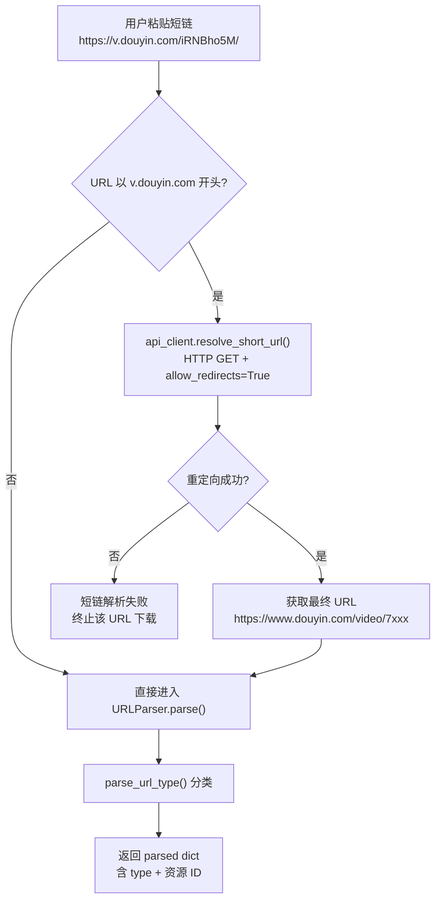
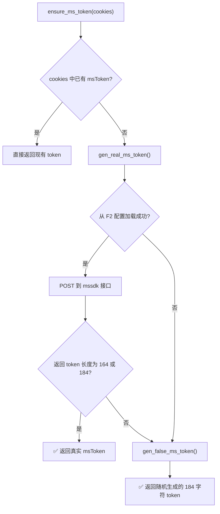
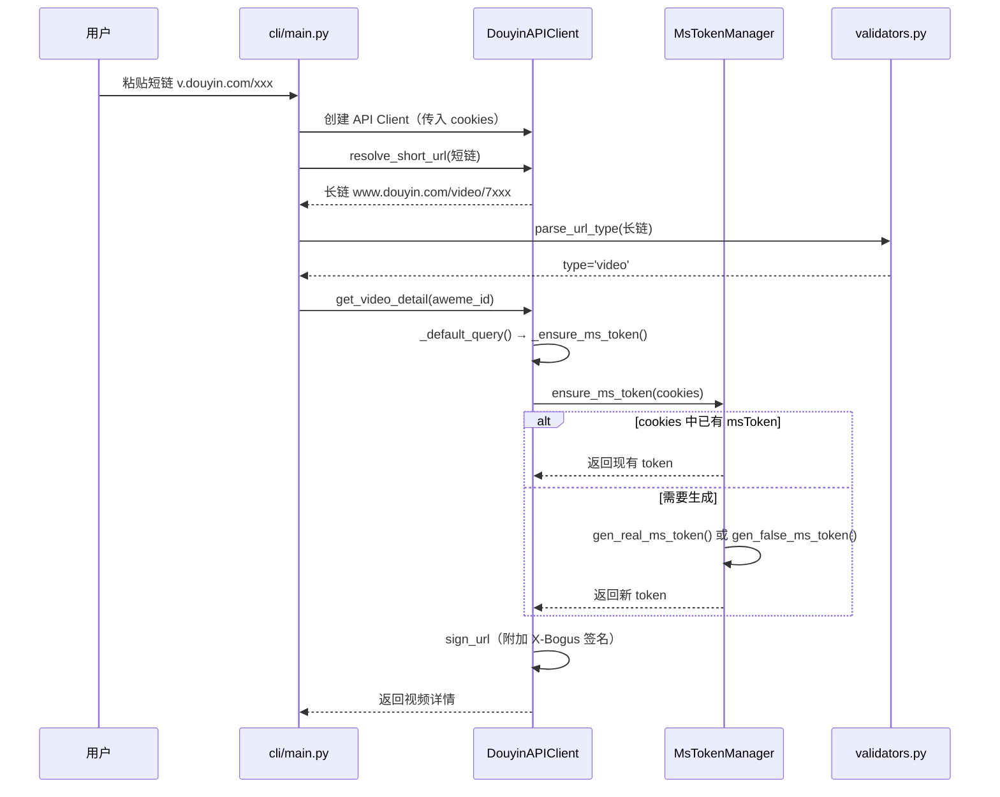

本文深入分析两个相互关联的底层基础设施：**短链解析**负责将用户粘贴的分享短链（`v.douyin.com` 域名）还原为标准长链，使后续路由分发成为可能；**msToken 自动生成**则确保每次 API 请求都携带有效的身份令牌，即使在用户未手动配置 Cookie 的场景下也能维持请求的合法性。二者共同构成了「用户只需粘贴一个链接，其余全自动」体验的技术基石。

## 短链解析：从分享文本到可路由 URL

### 问题背景

抖音的分享功能产生的链接通常形如 `https://v.douyin.com/iRNBho5M/`——一个经过压缩的短链。短链本身不包含目标资源的类型信息（视频、用户、合集等），无法直接被下载器消费。系统必须在下载流程的最早阶段将其解析为长链（如 `https://www.douyin.com/video/7320876060210373923`），才能被 `URLParser` 正确分类并路由到对应下载器。

Sources: [validators.py](utils/validators.py#L30-L32), [main.py](cli/main.py#L53-L61)

### 解析流程的入口与触发时机

短链解析的触发点位于 CLI 层的 `download_url` 函数。该函数在创建 `DouyinAPIClient` 实例后、调用 `URLParser.parse()` 之前，会先检测当前 URL 是否以 `https://v.douyin.com` 开头。如果是，则调用 `api_client.resolve_short_url()` 执行一次同步跟随重定向的 HTTP GET 请求，获取最终落地 URL：

`resolve_short_url` 的实现极为简洁——它利用 `aiohttp` 的 `allow_redirects=True` 参数让 HTTP 客户端自动跟随 302 重定向链，直到获取最终响应的 `response.url`。这一方案的优势在于：无需自行解析 `Location` 头、无需处理多跳重定向，完全委托给成熟的 HTTP 客户端库。

Sources: [api_client.py](core/api_client.py#L479-L490), [main.py](cli/main.py#L53-L61)

### 短链识别的双重保障

系统对短链的识别实际上存在两层逻辑。在 `cli/main.py` 中通过字符串前缀 `url.startswith('https://v.douyin.com')` 进行精确匹配触发解析流程；而在 `utils/validators.py` 的 `parse_url_type` 函数中，则以子串包含 `'v.douyin.com' in url` 的方式将短链兜底分类为 `'video'` 类型。后者的设计意图是一个安全网——万一短链未被提前解析就进入了 URL 解析阶段，至少不会返回 `None`，而是尝试按视频类型处理。在正常流程中，短链会被优先解析为长链，因此 `parse_url_type` 中的短链分支通常不会被命中。

Sources: [validators.py](utils/validators.py#L31-L32), [main.py](cli/main.py#L53)

### 解析后的 ID 提取

短链被解析为长链后，`URLParser` 通过一系列正则表达式从 URL 路径中提取资源 ID。下表汇总了所有支持的 URL 类型及其对应的提取逻辑：

| URL 类型 | URL 路径模式 | 正则表达式 | 提取字段 |
|---------|-------------|-----------|---------|
| video | `/video/{id}` | `r'/video/(\d+)'` | `aweme_id` |
| video（备选） | `?modal_id={id}` | `r'modal_id=(\d+)'` | `aweme_id` |
| user | `/user/{sec_uid}` | `r'/user/([A-Za-z0-9_-]+)'` | `sec_uid` |
| gallery | `/note/{id}` 或 `/gallery/{id}` 或 `/slides/{id}` | `r'/(?:note\|gallery\|slides)/(\d+)'` | `note_id` + `aweme_id` |
| collection | `/collection/{id}` 或 `/mix/{id}` | `r'/collection/(\d+)'` 或 `r'/mix/(\d+)'` | `mix_id` |
| music | `/music/{id}` | `r'/music/(\d+)'` | `music_id` |

值得注意的是，gallery 类型的 URL 会同时设置 `note_id` 和 `aweme_id` 两个字段，使图文作品可以被 `VideoDownloader` 统一处理。

Sources: [url_parser.py](core/url_parser.py#L50-L90), [validators.py](utils/validators.py#L30-L46)

## msToken 自动生成：三级递进式令牌保障

### msToken 在请求中的作用

`msToken` 是抖音 Web API 请求中的核心身份令牌之一，它被嵌入到每个 API 请求的查询参数中（`_default_query` 方法构建的参数字典包含 `msToken` 字段）。缺少 `msToken` 的请求可能被服务端降级处理甚至直接拒绝，因此确保其存在性是请求合法性的基本前提。

Sources: [api_client.py](core/api_client.py#L126-L155)

### 三级递进策略

`MsTokenManager` 采用**三级递进策略**确保每次请求都携带有效的 msToken，其决策逻辑体现在 `ensure_ms_token` 方法中：

**第一级：Cookie 复用**。如果用户在 `config.yml` 中已配置包含 `msToken` 的 Cookie，则直接使用，不做任何额外请求。这是最高效的路径，适用于手动配置了 Cookie 的场景。

**第二级：真实 Token 生成**。通过向抖音的 mssdk 接口发送 POST 请求，获取服务端签发的真实 msToken。这一过程依赖 F2 项目的开源配置，将配置中的 `magic`、`version`、`dataType`、`strData`、`ulr` 等参数连同客户端时间戳一起打包为 JSON 请求体。响应头中的 `Set-Cookie` 字段包含生成的 msToken，通过 `SimpleCookie` 解析提取。

**第三级：随机 Token 兜底**。当真实 Token 生成失败（网络不可达、配置加载失败、返回格式异常等）时，系统生成一个 182 位随机字母数字字符串并追加 `"=="` 后缀（总长度 184 字符），作为降级方案。虽然这不是真实签发的 token，但能保证请求参数结构的完整性，避免因缺少参数被直接拒绝。

Sources: [ms_token_manager.py](auth/ms_token_manager.py#L61-L70)

### F2 配置加载与缓存机制

真实 Token 生成所需的关键参数来自 F2 项目的远程配置文件（`https://raw.githubusercontent.com/Johnserf-Seed/f2/main/f2/conf/conf.yaml`）。`MsTokenManager` 对这一配置实现了**线程安全的带 TTL 缓存**：

| 缓存属性 | 实现方式 | 设计意图 |
|---------|---------|---------|
| 存储位置 | 类变量 `_cached_conf`（`Optional[Dict]`） | 全局共享，避免每个实例重复加载 |
| 过期策略 | `_cache_ttl_seconds = 3600`（1 小时） | 平衡时效性与网络开销 |
| 线程安全 | `threading.Lock` 保护读写 | 防止并发请求下的缓存击穿 |
| 完整性校验 | 检查 `url`/`magic`/`version`/`dataType`/`ulr`/`strData` 六个必需字段 | 配置缺失时优雅降级 |

缓存使用类变量而非实例变量存储，这意味着同一进程中所有 `MsTokenManager` 实例共享同一份配置缓存——无论创建了多少个 `DouyinAPIClient` 实例，F2 配置文件在 1 小时内最多只下载一次。

Sources: [ms_token_manager.py](auth/ms_token_manager.py#L111-L141)

### Token 有效性验证

`_is_valid_ms_token` 方法通过长度校验来判断 token 是否有效。根据代码注释，真实的 msToken 长度通常为 **164** 或 **184** 个字符。这一判断标准来源于 F2 项目的实践经验。`gen_false_ms_token` 方法生成的伪 token 固定长度为 184（182 位随机字符 + 2 个 `=` 字符），恰好落在有效长度范围内，确保它不会在长度校验阶段被拒绝。

Sources: [ms_token_manager.py](auth/ms_token_manager.py#L43-L48), [ms_token_manager.py](auth/ms_token_manager.py#L51-L59)

### 异步集成：非阻塞的 Token 确保机制

`DouyinAPIClient` 中的 `_ensure_ms_token` 方法是连接异步下载流程与同步 Token 生成逻辑的桥梁。它通过 `asyncio.to_thread` 将同步的 `ensure_ms_token` 调用委托给线程池执行，避免阻塞事件循环。一旦获取到 token，它会同步更新三处状态：

1. **实例属性** `self._ms_token`——缓存供后续调用直接复用
2. **请求参数字典** `self.cookies["msToken"]`——确保后续构建的查询参数包含 token
3. **Session Cookie Jar**——确保 HTTP 请求自动携带 token

这种「获取一次，全局生效」的设计确保 msToken 的生成开销在整个下载会话中仅发生一次。

Sources: [api_client.py](core/api_client.py#L111-L124)

### CookieManager 的协同角色

`CookieManager` 的 `validate_cookies` 方法在验证 Cookie 有效性时，对 msToken 采取了宽容策略：它只检查 `ttwid`、`odin_tt`、`passport_csrf_token` 三个关键字段是否存在，如果 `msToken` 缺失，仅记录一条 info 级别日志（"msToken not found, it will be generated automatically if needed"）而不会判定验证失败。这一设计与三级递进策略完美协同——用户无需手动获取 msToken，系统会在首次 API 请求时自动补全。

Sources: [cookie_manager.py](auth/cookie_manager.py#L46-L59)

## 模块协作关系总览

短链解析与 msToken 生成虽然在代码层面属于不同模块，但在运行时它们通过 `DouyinAPIClient` 这一中心节点紧密协作。下图展示了从用户输入到首次 API 请求的完整初始化流程中，两个机制的交互关系：

Sources: [main.py](cli/main.py#L31-L125), [api_client.py](core/api_client.py#L111-L124)

## 延伸阅读

- **[URL 解析与路由分发机制](7-url-jie-xi-yu-lu-you-fen-fa-ji-zhi)**：短链解析后的完整路由分发逻辑
- **[X-Bogus 与 A-Bogus 签名算法原理](12-x-bogus-yu-a-bogus-qian-ming-suan-fa-yuan-li)**：msToken 之外的另一个请求签名维度
- **[Cookie 获取与认证配置](5-cookie-huo-qu-yu-ren-zheng-pei-zhi)**：手动配置 Cookie 的完整指南
- **[抖音 API 客户端的请求封装与分页标准化](11-dou-yin-api-ke-hu-duan-douyinapiclient-de-qing-qiu-feng-zhuang-yu-fen-ye-biao-zhun-hua)**：msToken 如何融入完整的请求签名链路