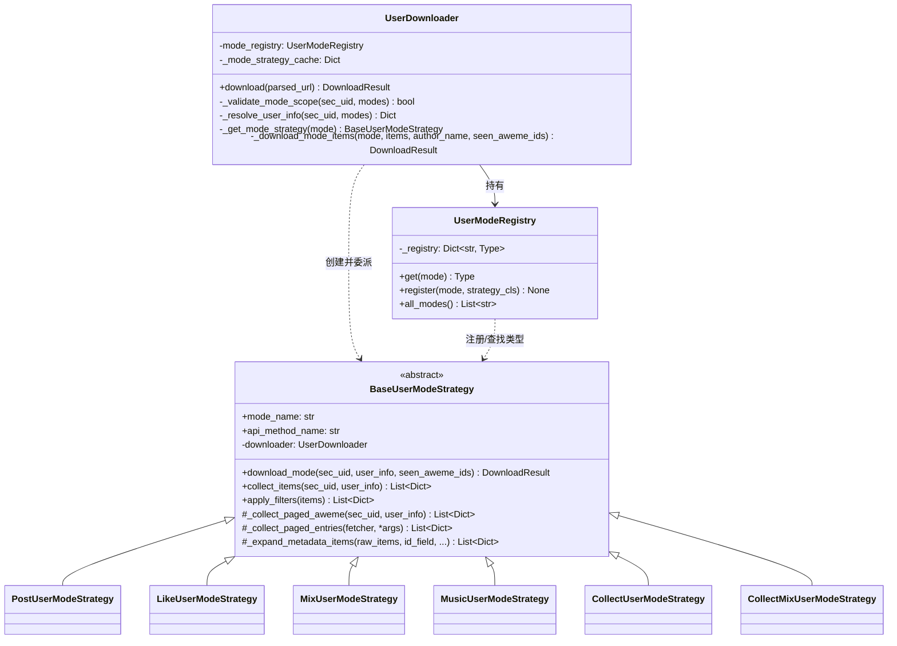
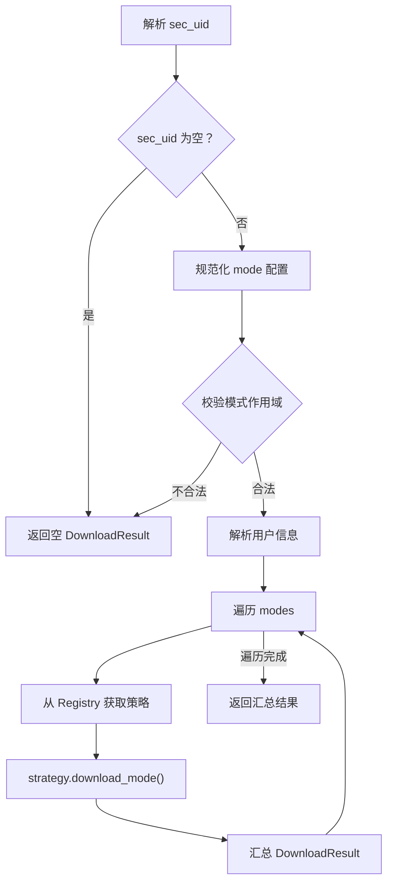
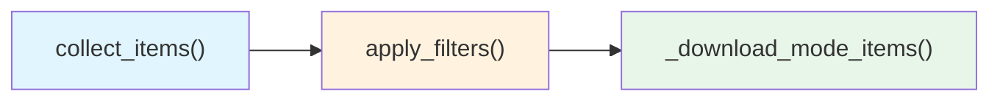
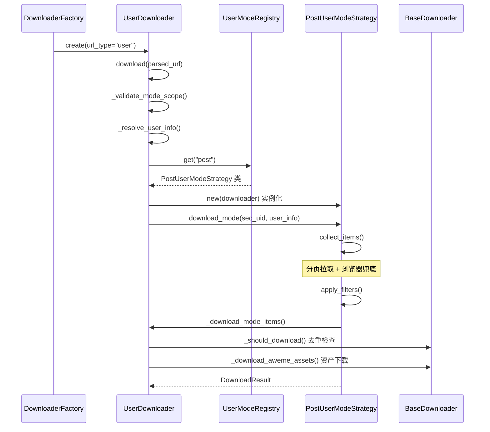

本文深入剖析 `UserDownloader` 与 `UserModeRegistry` 的协作架构——这是一个将 **策略模式**（Strategy Pattern）与 **注册表模式**（Registry Pattern）相结合的经典设计。`UserDownloader` 承担"上下文"角色，负责模式解析、作用域校验与跨模式去重；`UserModeRegistry` 则作为策略类的中央注册表，将模式名称映射到对应的策略实现。二者配合，使系统在保持六种下载模式独立演进的同时，对外呈现统一的调用接口。

Sources: [user_downloader.py](core/user_downloader.py#L1-L17), [user_mode_registry.py](core/user_mode_registry.py#L1-L35)

## 架构总览：三层协作模型

整个用户下载体系分为三层——**调度层**（UserDownloader）、**注册层**（UserModeRegistry）、**策略层**（BaseUserModeStrategy 及其六个子类）。调度层持有注册表实例，通过模式名称从注册表中获取策略类，实例化后委派具体的采集与下载行为。下面的类图展示了它们之间的关系：



这三层之间形成了清晰的依赖方向：`UserDownloader` → `UserModeRegistry` → `BaseUserModeStrategy` 子类。策略实例通过构造函数接收 `downloader` 引用，从而可以回调 `downloader` 的基础设施方法（速率限制、数据库查询、并发队列等），这是一种**双向委托**设计——调度器委派策略执行采集，策略回调调度器完成下载。

Sources: [user_downloader.py](core/user_downloader.py#L12-L18), [user_mode_registry.py](core/user_mode_registry.py#L16-L34), [base_strategy.py](core/user_modes/base_strategy.py#L15-L38)

## UserDownloader：调度器的设计职责

### 入口方法 download() 的执行流程

`download()` 方法是 `UserDownloader` 对外暴露的唯一入口，由[下载器工厂模式：按 URL 类型创建下载器](8-xia-zai-qi-gong-han-mo-shi-an-url-lei-xing-chuang-jian-xia-zai-qi)在识别到 `url_type == "user"` 时调用。其内部执行流程可以概括为五个阶段：



**模式配置的规范化**逻辑值得注意：配置中的 `mode` 字段既可以是单个字符串 `"post"`，也可以是列表 `["post", "like"]`，还可以为空（此时默认回退到 `["post"]`）。这种宽容的输入处理确保了配置文件和命令行参数的灵活性。

Sources: [user_downloader.py](core/user_downloader.py#L20-L62)

### 模式作用域校验

`_validate_mode_scope()` 实施了两条关键的业务约束：

| 约束规则 | 说明 | 典型违规场景 |
|---------|------|-------------|
| collect/collectmix 仅允许 `sec_uid == "self"` | 收藏夹和收藏合集是用户私有数据，只能访问当前登录账号 | `sec_uid=other_user` + `mode=collect` |
| collect/collectmix 不能与 post/like/mix/music 混用 | 自引用模式和常规模式的用户信息获取逻辑完全不同 | `mode=["collect", "post"]` |

这两条约束在 `_resolve_user_info()` 中也有呼应——当 `sec_uid == "self"` 且模式全部为收藏类时，直接返回一个合成的 `{"uid": "self", ...}` 用户信息，跳过 API 调用，避免向抖音服务器发送无效请求。

Sources: [user_downloader.py](core/user_downloader.py#L64-L94)

### 跨模式去重机制

`download()` 方法在遍历多个模式时维护一个共享的 `seen_aweme_ids: Set[str]` 集合，并将其传递给每个策略。这意味着当用户配置 `mode: ["post", "like"]` 时，同一作品如果同时出现在"发布"和"点赞"列表中，只会被下载一次。去重集合从 `download()` 顶层一路传递到 `_download_mode_items()`，再传递到每个 `_process_aweme()` 回调中，形成了完整的去重链路。

Sources: [user_downloader.py](core/user_downloader.py#L46-L61), [user_downloader.py](core/user_downloader.py#L109-L166)

### 策略缓存与延迟实例化

`_get_mode_strategy()` 实现了一个简单的 **延迟实例化 + 缓存** 模式：首次请求某个模式时，从 `UserModeRegistry` 获取策略类并实例化，随后缓存到 `_mode_strategy_cache` 字典中。这保证了：(1) 同一模式下不会重复创建策略对象；(2) 如果配置中从未使用某个模式，对应的策略类永远不会被实例化。

```python
def _get_mode_strategy(self, mode: str):
    normalized_mode = (mode or "").strip()
    if normalized_mode in self._mode_strategy_cache:
        return self._mode_strategy_cache[normalized_mode]  # 缓存命中

    strategy_cls = self.mode_registry.get(normalized_mode)  # 查询注册表
    if strategy_cls is None:
        return None

    strategy = strategy_cls(self)  # 实例化，传入 downloader 引用
    self._mode_strategy_cache[normalized_mode] = strategy
    return strategy
```

Sources: [user_downloader.py](core/user_downloader.py#L96-L107)

## UserModeRegistry：策略注册表的设计

### 核心接口

`UserModeRegistry` 的实现极其精简——仅 35 行代码，提供了三个方法：

| 方法 | 签名 | 职责 |
|------|------|------|
| `get()` | `(mode: str) → Optional[Type[BaseUserModeStrategy]]` | 按名称查找策略类，找不到返回 `None` |
| `register()` | `(mode: str, strategy_cls: Type) → None` | 运行时动态注册新策略 |
| `all_modes()` | `() → List[str]` | 返回所有已注册模式名的排序列表 |

注册表在 `__init__` 中预注册了六种内置模式。`register()` 方法的存在意味着系统支持**运行时扩展**——外部代码可以在不修改注册表源码的情况下注入新的下载策略，这是开闭原则（Open-Closed Principle）的直接体现。

### 预注册的六种模式

| 模式名 | 策略类 | API 方法 | 数据特性 |
|--------|--------|----------|---------|
| `post` | `PostUserModeStrategy` | `get_user_post` | 用户发布作品，支持浏览器兜底 |
| `like` | `LikeUserModeStrategy` | `get_user_like` | 用户点赞作品 |
| `mix` | `MixUserModeStrategy` | `get_user_mix` | 用户合集，需展开元数据 |
| `music` | `MusicUserModeStrategy` | `get_user_music` | 用户使用的音乐，需展开元数据 |
| `collect` | `CollectUserModeStrategy` | `get_user_collects` | 用户收藏夹，仅 self 可用 |
| `collectmix` | `CollectMixUserModeStrategy` | `get_user_collect_mix` | 收藏的合集，仅 self 可用 |

Sources: [user_mode_registry.py](core/user_mode_registry.py#L16-L35)

## BaseUserModeStrategy：模板方法与共享基础设施

### 模板方法 download_mode()

`BaseUserModeStrategy` 的核心是 `download_mode()` 模板方法，它定义了所有策略共享的执行骨架：



**采集**（collect_items）→ **过滤**（apply_filters）→ **下载**（_download_mode_items）——这个三阶段流水线是所有模式的统一执行路径。子类通常只需覆写 `collect_items()` 来定制采集逻辑，其余阶段由基类统一处理。`apply_filters()` 内部调用了 `downloader._filter_by_time()` 和 `downloader._limit_count()`，分别完成时间范围过滤和数量限制。

### 三种分页采集工具方法

基类为子类提供了三个共享的分页采集方法，覆盖了不同的数据获取场景：

**`_collect_paged_aweme()`**——标准 aweme 分页采集。这是最通用的分页器，通过 `api_method_name` 指定的 API 方法逐页拉取数据。它内置了三项关键能力：(1) 增量下载——从数据库查询最新时间戳，只采集新作品；(2) 数量限制——达到配置上限时立即停止；(3) 游标停滞检测——当 `max_cursor` 不再前进时中断循环，防止无限分页。`LikeUserModeStrategy` 直接使用此方法，无需任何覆写。

**`_collect_paged_entries()`**——通用条目分页采集。与 `_collect_paged_aweme()` 类似，但不绑定特定的 `api_method_name`，而是接受任意的 `fetcher` 函数。`CollectUserModeStrategy` 和 `CollectMixUserModeStrategy` 使用它来先拉取收藏夹列表或合集列表等"元数据条目"。

**`_expand_metadata_items()`**——元数据展开采集。用于 `MixUserModeStrategy` 和 `MusicUserModeStrategy` 这类场景——API 返回的不是直接的 aweme 数据，而是合集/音乐的元数据。此方法遍历每条元数据，通过指定的 `fetch_method_name` 再次分页拉取其中的实际 aweme 列表，最终合并为统一的 aweme 集合。它还内置了 `seen_aweme` 去重，防止跨合集/跨音乐出现重复作品。

Sources: [base_strategy.py](core/user_modes/base_strategy.py#L22-L110), [base_strategy.py](core/user_modes/base_strategy.py#L112-L258)

### 页面数据规范化

`_normalize_page_data()` 是一个关键的防御性方法。抖音不同 API 端点返回的数据结构并不统一——有的返回 `{"items": [...]}`，有的返回 `{"aweme_list": [...]}`。此方法将所有格式统一为包含 `items`、`has_more`、`max_cursor`、`status_code` 四个标准字段的字典，使上层分页逻辑无需关心底层数据格式的差异。

Sources: [base_strategy.py](core/user_modes/base_strategy.py#L234-L258)

## 策略实现的复杂度光谱

六种策略子类的实现复杂度差异显著，形成了一个从极简到复杂的完整光谱：

| 复杂度 | 策略 | 行数 | 覆写方法 | 特殊逻辑 |
|--------|------|------|---------|---------|
| ★☆☆☆☆ | `LikeUserModeStrategy` | 7 | 无 | 完全依赖基类默认实现 |
| ★★☆☆☆ | `MusicUserModeStrategy` | 29 | `collect_items` | 先尝试直接提取，失败后展开元数据 |
| ★★☆☆☆ | `MixUserModeStrategy` | 29 | `collect_items` | 同上，使用 `mix_id` 展开 |
| ★★★☆☆ | `CollectUserModeStrategy` | 81 | `collect_items` | 两阶段：先拉收藏夹列表，再逐个展开 |
| ★★★★☆ | `CollectMixUserModeStrategy` | 70 | `collect_items` | 三阶段：拉列表→分离 aweme 与元数据→合并去重 |
| ★★★★★ | `PostUserModeStrategy` | 93 | `collect_items` | 完全自定义分页逻辑 + 浏览器兜底采集 |

`LikeUserModeStrategy` 仅 7 行代码——它只声明了 `mode_name` 和 `api_method_name` 两个类属性，其余完全继承自基类。这充分验证了基类设计的泛化能力。

而 `PostUserModeStrategy` 则是最复杂的实现。它没有使用基类的 `_collect_paged_aweme()`，而是完全自定义了分页逻辑，原因在于它需要检测"**分页受限**"（`pagination_restricted`）状态——当 API 在非零 cursor 处返回空结果但 `status_code == 0` 时，判定为被平台限流，随即触发浏览器兜底采集机制。这一特殊逻辑的详细分析见[分页受限时的浏览器兜底采集机制](16-fen-ye-shou-xian-shi-de-liu-lan-qi-dou-di-cai-ji-ji-zhi)。

Sources: [like_strategy.py](core/user_modes/like_strategy.py#L1-L7), [post_strategy.py](core/user_modes/post_strategy.py#L1-L93), [mix_strategy.py](core/user_modes/mix_strategy.py#L1-L29), [collect_strategy.py](core/user_modes/collect_strategy.py#L1-L81), [collect_mix_strategy.py](core/user_modes/collect_mix_strategy.py#L1-L70)

## 从工厂到策略的完整调用链路

当一个用户主页 URL 被解析后，完整的调用链路如下：



这个链路清晰地展示了职责的分层：`DownloaderFactory` 负责"创建谁"，`UserDownloader` 负责"做什么"，`UserModeRegistry` 负责"找谁做"，`BaseUserModeStrategy` 负责"怎么做"。

Sources: [downloader_factory.py](core/downloader_factory.py#L44-L48), [user_downloader.py](core/user_downloader.py#L20-L62)

## 设计模式总结

本模块综合运用了多种设计模式，每种模式都解决了特定的架构问题：

| 设计模式 | 应用位置 | 解决的问题 |
|---------|---------|-----------|
| **策略模式** | `BaseUserModeStrategy` 及子类 | 将不同下载模式的采集逻辑解耦为独立策略 |
| **注册表模式** | `UserModeRegistry` | 集中管理模式名到策略类的映射，支持运行时扩展 |
| **模板方法模式** | `BaseUserModeStrategy.download_mode()` | 定义采集→过滤→下载的统一骨架，子类只需覆写特定步骤 |
| **延迟初始化** | `UserDownloader._get_mode_strategy()` | 按需创建策略实例，避免不必要的对象创建 |
| **双向委托** | 策略持有 `downloader` 引用 | 策略回调下载器的去重、限速、并发等基础设施 |

这种组合设计使得添加新的下载模式变得极为简单——只需创建一个继承 `BaseUserModeStrategy` 的新类，声明 `mode_name` 和 `api_method_name`，然后通过 `UserModeRegistry.register()` 注册即可，无需修改 `UserDownloader` 的任何代码。

Sources: [user_downloader.py](core/user_downloader.py#L1-L107), [user_mode_registry.py](core/user_mode_registry.py#L1-L35), [base_strategy.py](core/user_modes/base_strategy.py#L1-L38)

## 延伸阅读

- **[六种下载模式策略（post/like/mix/music/collect/collectmix）](15-liu-chong-xia-zai-mo-shi-ce-lue-post-like-mix-music-collect-collectmix)**——逐个剖析每种策略的采集逻辑、数据转换与特殊处理
- **[分页受限时的浏览器兜底采集机制](16-fen-ye-shou-xian-shi-de-liu-lan-qi-dou-di-cai-ji-ji-zhi)**——详解 `PostUserModeStrategy` 的分页受限检测与 Playwright 浏览器回补
- **[下载器工厂模式：按 URL 类型创建下载器](8-xia-zai-qi-gong-han-mo-shi-an-url-lei-xing-chuang-jian-xia-zai-qi)**——理解 `UserDownloader` 如何被工厂创建和注入依赖
- **[基础下载器（BaseDownloader）的资产下载与去重逻辑](9-ji-chu-xia-zai-qi-basedownloader-de-zi-chan-xia-zai-yu-qu-zhong-luo-ji)**——深入了解策略回调的 `_download_aweme_assets` 等基础设施方法