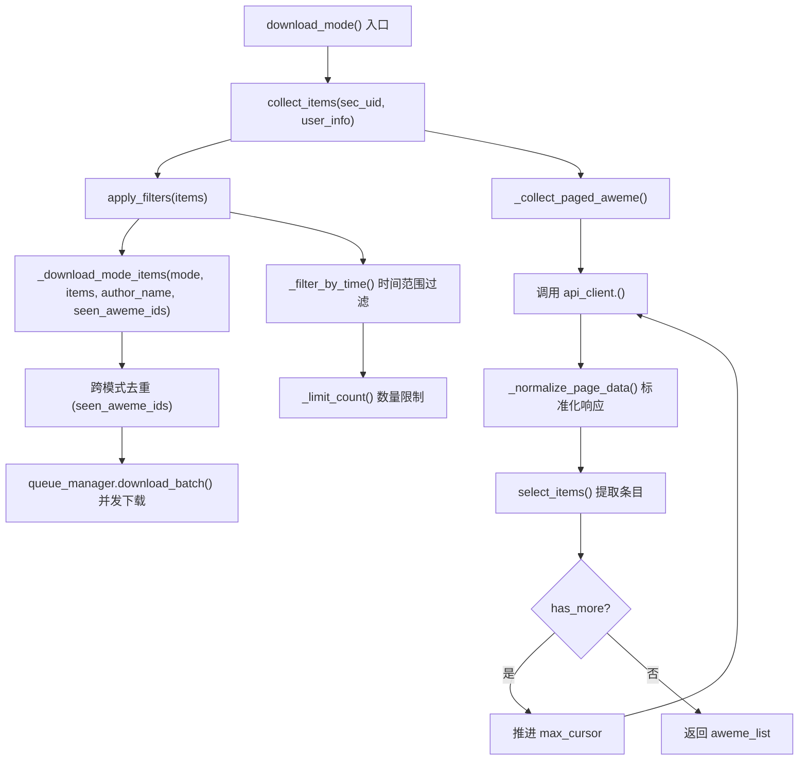

本页深入剖析 `core/user_modes/` 目录下的六种用户批量下载策略的实现细节。当 URL 被识别为 `user` 类型后，`UserDownloader` 会根据配置中的 `mode` 字段选取对应的策略类，通过统一的 **收集 → 过滤 → 下载** 三阶段管线完成从 API 分页采集到资产落地的完整流程。理解这六种策略的差异——尤其是它们在 API 端点选择、分页行为、元数据展开方式和浏览器兜底机制上的不同——是掌握本工具批量下载能力的关键。

## 策略架构总览

六种策略均继承自 `BaseUserModeStrategy` 抽象基类，通过 `UserModeRegistry` 以字符串键注册到统一的策略字典中。这种设计使得新增下载模式只需创建一个新策略类并注册，无需修改 `UserDownloader` 的核心逻辑。

```mermaid
classDiagram
    class BaseUserModeStrategy {
        <<abstract>>
        +mode_name: str
        +api_method_name: str
        +download_mode(sec_uid, user_info, seen_aweme_ids)
        +collect_items(sec_uid, user_info) List~Dict~
        +apply_filters(items) List~Dict~
        #_collect_paged_aweme(sec_uid, user_info) List~Dict~
        #_collect_paged_entries(fetcher, *args) List~Dict~
        #_expand_metadata_items(raw_items, id_field, id_aliases, fetch_method_name) List~Dict~
        #_extract_aweme_from_item(item) Dict~
        #_normalize_page_data(data) Dict~
        +select_items(page_data) List~Dict~
    }

    class PostUserModeStrategy {
        mode_name = "post"
        api_method_name = "get_user_post"
        +collect_items() 浏览器兜底
    }
    class LikeUserModeStrategy {
        mode_name = "like"
        api_method_name = "get_user_like"
    }
    class MixUserModeStrategy {
        mode_name = "mix"
        api_method_name = "get_user_mix"
        +collect_items() 双层展开
    }
    class MusicUserModeStrategy {
        mode_name = "music"
        api_method_name = "get_user_music"
        +collect_items() 双层展开
    }
    class CollectUserModeStrategy {
        mode_name = "collect"
        api_method_name = "get_user_collects"
        +collect_items() 文件夹遍历
    }
    class CollectMixUserModeStrategy {
        mode_name = "collectmix"
        api_method_name = "get_user_collect_mix"
        +collect_items() 混合展开+合并去重
    }

    BaseUserModeStrategy <|-- PostUserModeStrategy
    BaseUserModeStrategy <|-- LikeUserModeStrategy
    BaseUserModeStrategy <|-- MixUserModeStrategy
    BaseUserModeStrategy <|-- MusicUserModeStrategy
    BaseUserModeStrategy <|-- CollectUserModeStrategy
    BaseUserModeStrategy <|-- CollectMixUserModeStrategy

    class UserModeRegistry {
        -_registry Dict~str, Type~
        +get(mode) Type~BaseUserModeStrategy~
        +register(mode, strategy_cls)
        +all_modes() List~str~
    }

    UserModeRegistry ..> PostUserModeStrategy : "post"
    UserModeRegistry ..> LikeUserModeStrategy : "like"
    UserModeRegistry ..> MixUserModeStrategy : "mix"
    UserModeRegistry ..> MusicUserModeStrategy : "music"
    UserModeRegistry ..> CollectUserModeStrategy : "collect"
    UserModeRegistry ..> CollectMixUserModeStrategy : "collectmix"
```

`UserModeRegistry` 在初始化时硬编码了六种模式到策略类的映射。`UserDownloader` 通过 `_get_mode_strategy()` 方法查询注册表并缓存策略实例，确保同一模式在一次下载会话中只创建一次策略对象。`download()` 方法在遍历 `mode` 配置列表时，依次调用每个策略的 `download_mode()` 入口。

Sources: [user_mode_registry.py](core/user_mode_registry.py#L16-L35), [\_\_init\_\_.py](core/user_modes/__init__.py#L1-L17)

## 基类执行管线：收集 → 过滤 → 下载

`BaseUserModeStrategy` 定义了所有策略共享的三阶段执行管线。入口方法 `download_mode()` 按顺序执行 `collect_items()`（数据收集）→ `apply_filters()`（过滤裁剪）→ `_download_mode_items()`（资产下载），将职责清晰地划分到不同层次。

`_collect_paged_aweme()` 是基类中最核心的分页采集方法。它通过反射机制（`getattr`）从 `api_client` 上获取与 `api_method_name` 同名的异步方法作为分页抓取器。每一页请求 20 条数据，循环推进 `max_cursor` 直到 `has_more` 为 `False`。分页过程中内置了三个关键机制：

- **数量限制提前截断**：若 `number.<mode>` 配置了正整数限制，当累计采集量达标时立即跳出循环并截断列表。
- **增量下载早停**：若 `increase.<mode>` 开启且数据库中存在历史记录，通过 `get_latest_aweme_time()` 获取已下载的最新时间戳，一旦遇到旧数据即停止翻页。
- **游标停滞保护**：当 `max_cursor` 未前进时记录警告并终止，防止陷入无限循环。

`apply_filters()` 依次应用时间范围过滤（`start_time` / `end_time` 配置）和数量限制（`number.<mode>` 配置），两者均在 `BaseDownloader` 中实现，策略通过 `self.downloader` 引用调用。

Sources: [base_strategy.py](core/user_modes/base_strategy.py#L15-L110), [base_strategy.py](core/user_modes/base_strategy.py#L222-L258), [downloader_base.py](core/downloader_base.py#L196-L233)

## API 端点与数据格式差异

每种策略对应不同的抖音 Web API 端点，返回的数据结构也存在关键差异——有些直接返回 `aweme` 对象列表，有些则返回**元数据条目**（如合集信息、音乐信息），需要二次展开才能获取实际的视频数据。

| 模式 | API 方法 | API 端点 | 返回数据键 | 数据性质 |
|------|----------|----------|------------|----------|
| **post** | `get_user_post` | `/aweme/v1/web/aweme/post/` | `aweme_list` | 直接 aweme |
| **like** | `get_user_like` | `/aweme/v1/web/aweme/favorite/` | `aweme_list` | 直接 aweme |
| **mix** | `get_user_mix` | `/aweme/v1/web/mix/list/` | `mix_list` | 合集元数据或 aweme |
| **music** | `get_user_music` | `/aweme/v1/web/music/list/` | `music_list` | 音乐元数据或 aweme |
| **collect** | `get_user_collects` → `get_collect_aweme` | `/aweme/v1/web/collects/list/` → `/aweme/v1/web/collects/video/list/` | `collects_list` → `aweme_list` | 收藏夹列表 → 内部视频 |
| **collectmix** | `get_user_collect_mix` → `get_mix_aweme` | `/aweme/v1/web/mix/listcollection/` → `/aweme/v1/web/mix/aweme/` | `mix_infos` → `aweme_list` | 收藏合集列表 → 内部视频 |

`post` 和 `like` 是最简单的**单层采集**模式——API 直接返回 aweme 对象列表，基类的 `_collect_paged_aweme()` 即可完整处理。而 `mix`、`music`、`collect`、`collectmix` 则涉及**双层或多层**数据展开，各策略在 `collect_items()` 中覆写了不同的处理逻辑。

Sources: [api_client.py](core/api_client.py#L352-L477)

## 六种策略的详细行为

### post 策略：用户作品下载（含浏览器兜底）

`PostUserModeStrategy` 是功能最复杂、也是默认的下载模式。它覆写了 `collect_items()` 方法，在基类分页逻辑的基础上增加了**分页受限检测**与**浏览器兜底回补**机制。

当 API 返回空结果但 `status_code` 为 0（表示请求成功但无数据）时，策略判定为分页被平台限制（`pagination_restricted = True`）。同样，当 `max_cursor` 停滞不前时也会触发此标记。此时策略调用 `UserDownloader._recover_user_post_with_browser()`，通过 Playwright 驱动浏览器模拟滚动来采集视频 ID 列表，然后逐条调用 `get_video_detail()` 补全缺失的 aweme 详情数据。

`_recover_user_post_with_browser()` 的回补逻辑设计精巧：首先从浏览器采集结果中弹出已缓存的 aweme items（`pop_browser_post_aweme_items()`）直接复用，避免重复 API 调用；对于未命中缓存的 ID，才逐一请求 `get_video_detail()`。同时还会校验 `sec_uid` 一致性，防止浏览器列表中混入非目标用户的作品。

Sources: [post_strategy.py](core/user_modes/post_strategy.py#L1-L93), [user_downloader.py](core/user_downloader.py#L177-L299)

### like 策略：用户点赞列表

`LikeUserModeStrategy` 是最轻量的策略实现——它仅声明了 `mode_name = "like"` 和 `api_method_name = "get_user_like"` 两个类属性，完全依赖基类的默认行为。这是因为点赞 API 直接返回 aweme 列表，无需任何数据展开或特殊处理。

配置中通过 `number.like` 控制下载数量上限，通过 `increase.like` 开启增量下载。时间过滤、数量限制、去重等通用逻辑全部由基类管线处理。

Sources: [like_strategy.py](core/user_modes/like_strategy.py#L1-L7)

### mix 策略：用户合集（双层展开）

`MixUserModeStrategy` 面临的核心挑战是 API 返回数据的**不确定性**：`get_user_mix` 端点可能返回直接的 aweme 对象，也可能返回合集元数据（`mix_info`）。

策略采用**先提取、后展开**的两阶段处理：

1. **第一阶段**：调用基类 `_collect_paged_aweme()` 获取原始分页数据，然后用 `_extract_aweme_from_item()` 逐条尝试提取 aweme。该方法会检查三个嵌套键：顶层 `aweme_id`、嵌套的 `aweme` 字典、嵌套的 `aweme_info` 或 `aweme_detail` 字典。
2. **第二阶段**：若第一阶段成功提取到任何 aweme，直接返回；否则将全部原始条目视为元数据，调用基类 `_expand_metadata_items()` 展开——对每条元数据用 `mix_id` 作为标识，调用 `get_mix_aweme()` 端点分页获取合集内的全部视频。

这种设计使得策略能同时适应两种 API 响应格式，确保在合集列表和合集内视频两个层级上都正确采集数据。

Sources: [mix_strategy.py](core/user_modes/mix_strategy.py#L1-L29), [base_strategy.py](core/user_modes/base_strategy.py#L150-L220)

### music 策略：用户音乐（双层展开）

`MusicUserModeStrategy` 的结构与 `MixUserModeStrategy` 完全对称，区别仅在于元数据字段名和展开端点。当第一阶段提取不到 aweme 时，使用 `music_id` 作为标识调用 `get_music_aweme()` 端点展开。

在 `_expand_metadata_items()` 的元数据 ID 提取逻辑中，支持多种 ID 字段别名和嵌套路径（如 `music_info.id`、`music_info.music_id`），兼容抖音 API 不同版本的数据格式。

Sources: [music_strategy.py](core/user_modes/music_strategy.py#L1-L29)

### collect 策略：用户收藏夹（文件夹遍历）

`CollectUserModeStrategy` 是最复杂的多层展开策略。它不是简单地对 aweme 进行分页，而是采用**文件夹遍历**模型：

1. **第一层——获取收藏夹列表**：调用 `_collect_paged_entries()` 分页获取用户的收藏夹（`collects`）列表，使用 `get_user_collects` 端点。
2. **第二层——遍历每个收藏夹**：对每个收藏夹用 `_extract_collects_id()` 提取其 ID（兼容 `collects_id`、`collects_id_str`、`id` 以及 `collects_info.collects_id` 等多种字段名），然后调用 `get_collect_aweme()` 分页获取该收藏夹内的所有 aweme。
3. **跨文件夹去重**：维护 `seen_aweme` 集合，确保同一视频出现在多个收藏夹时只下载一次。

> **重要约束**：`collect` 和 `collectmix` 模式仅支持 `sec_uid = "self"`（即当前登录用户自身），因为收藏夹是用户私密数据。`UserDownloader._validate_mode_scope()` 会在执行前校验此条件，混合使用 `collect` 与 `post/like` 等模式也会被拒绝。

Sources: [collect_strategy.py](core/user_modes/collect_strategy.py#L1-L81), [user_downloader.py](core/user_downloader.py#L64-L79)

### collectmix 策略：用户收藏的合集（混合展开+合并去重）

`CollectMixUserModeStrategy` 结合了 `collect` 和 `mix` 两种策略的特征，但采用独特的**分类处理+合并去重**模型：

1. **第一层——获取收藏的合集列表**：调用 `_collect_paged_entries()` 获取用户收藏的合集条目。
2. **分类处理**：遍历原始条目，用 `_extract_aweme_from_item()` 尝试提取。成功的归入 `aweme_items`（合集预览视频），失败的通过 `_normalize_mix_item()` 标准化后归入 `metadata_items`（合集元数据）。
3. **展开元数据**：对 `metadata_items` 调用 `_expand_metadata_items()`，用 `mix_id` 标识调用 `get_mix_aweme()` 获取每个合集的完整视频列表。
4. **合并去重**：将直接 aweme 和展开后的 aweme 拼接，通过 `seen_aweme_ids` 集合去除重复项。

`_normalize_mix_item()` 负责处理合集元数据的格式差异：如果条目顶层没有 `mix_id` 或 `mixId`，会尝试从嵌套的 `mix_info` 字典中提取，确保所有元数据条目都携带有效的合集标识。

Sources: [collect_mix_strategy.py](core/user_modes/collect_mix_strategy.py#L1-L70)

## 数据标准化与 aweme 提取

所有策略共享两个关键的静态方法来处理抖音 API 返回数据的多态性：

**`_normalize_page_data()`** 负责将两种不同的分页响应格式统一为标准字典。抖音 API 的分页响应有两种形式：新格式直接包含 `items` 列表，旧格式使用 `aweme_list` 字段。该方法将其统一为包含 `items`、`has_more`、`max_cursor`、`status_code`、`raw`、`risk_flags` 六个字段的标准字典。对于非字典类型的异常输入，返回安全的空页面对象。

**`_extract_aweme_from_item()`** 负责从可能嵌套的条目中提取 aweme 对象。它依次检查四个位置：条目自身是否有 `aweme_id`（顶层 aweme）、条目中是否嵌套了 `aweme` 字典、是否嵌套了 `aweme_info` 字典、是否嵌套了 `aweme_detail` 字典。这种多层探测机制确保了策略能正确处理 API 返回的各种数据嵌套格式。

Sources: [base_strategy.py](core/user_modes/base_strategy.py#L222-L232), [base_strategy.py](core/user_modes/base_strategy.py#L234-L258)

## 模式组合与互斥规则

`UserDownloader` 支持通过 `mode` 配置字段同时指定多个模式（如 `["post", "like"]`），但存在严格的**互斥约束**：

| 规则 | 说明 |
|------|------|
| `collect` / `collectmix` 仅限 `self` | 这两种模式操作的是当前登录用户的私密收藏数据，`sec_uid` 必须为 `"self"` |
| `collect` / `collectmix` 不能与 `post` / `like` / `mix` / `music` 混合 | 一次下载会话只能选择"公开内容模式"或"私密收藏模式"，不可跨界混合 |
| `post` / `like` / `mix` / `music` 可自由组合 | 这四种公开内容模式可以在同一会话中并行执行 |
| 跨模式去重 | 多模式顺序执行时共享 `seen_aweme_ids` 集合，同一视频不会被重复下载 |

`_validate_mode_scope()` 在下载开始前进行校验，违反互斥规则时直接返回空结果并记录错误日志。对于 `collect` / `collectmix` 模式，`_resolve_user_info()` 跳过 API 调用，直接构造 `{"uid": "self", "sec_uid": "self", "nickname": "self"}` 的虚拟用户信息。

Sources: [user_downloader.py](core/user_downloader.py#L64-L94)

## 策略对比总结

| 维度 | post | like | mix | music | collect | collectmix |
|------|------|------|-----|-------|---------|------------|
| **API 层级** | 单层 | 单层 | 双层 | 双层 | 双层 | 双层+合并 |
| **浏览器兜底** | ✅ | ❌ | ❌ | ❌ | ❌ | ❌ |
| **增量下载** | ✅ | ✅ | ✅ | ✅ | ✅* | ✅* |
| **需要 self** | ❌ | ❌ | ❌ | ❌ | ✅ | ✅ |
| **代码行数** | 93 | 7 | 29 | 29 | 81 | 70 |
| **覆写方法** | `collect_items` | 无 | `collect_items` | `collect_items` | `collect_items` | `collect_items` + `_normalize_mix_item` |
| **默认数量限制** | 0（无限） | 0 | 0 | 0 | 0 | 0 |

> \* `collect` 和 `collectmix` 的 `collect_items()` 中未显式处理增量逻辑（因为它们自定义了 `collect_items`），但 `increase` 配置在基类 `_collect_paged_aweme()` 中生效——若这些策略内部调用了 `_collect_paged_aweme()` 则间接支持。

Sources: [default_config.py](config/default_config.py#L12-L28), [user_downloader.py](core/user_downloader.py#L20-L62)

## 延伸阅读

- **策略的注册与发现机制**：详见 [UserDownloader 与 UserModeRegistry 的设计](14-userdownloader-yu-usermoderegistry-de-she-ji)
- **post 模式的浏览器兜底采集**：详见 [分页受限时的浏览器兜底采集机制](16-fen-ye-shou-xian-shi-de-liu-lan-qi-dou-di-cai-ji-ji-zhi)
- **策略最终调用的资产下载逻辑**：详见 [基础下载器（BaseDownloader）的资产下载与去重逻辑](9-ji-chu-xia-zai-qi-basedownloader-de-zi-chan-xia-zai-yu-qu-zhong-luo-ji)
- **API 端点封装细节**：详见 [抖音 API 客户端（DouyinAPIClient）的请求封装与分页标准化](11-dou-yin-api-ke-hu-duan-douyinapiclient-de-qing-qiu-feng-zhuang-yu-fen-ye-biao-zhun-hua)