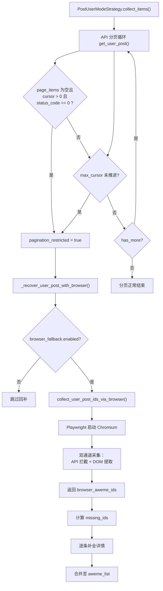
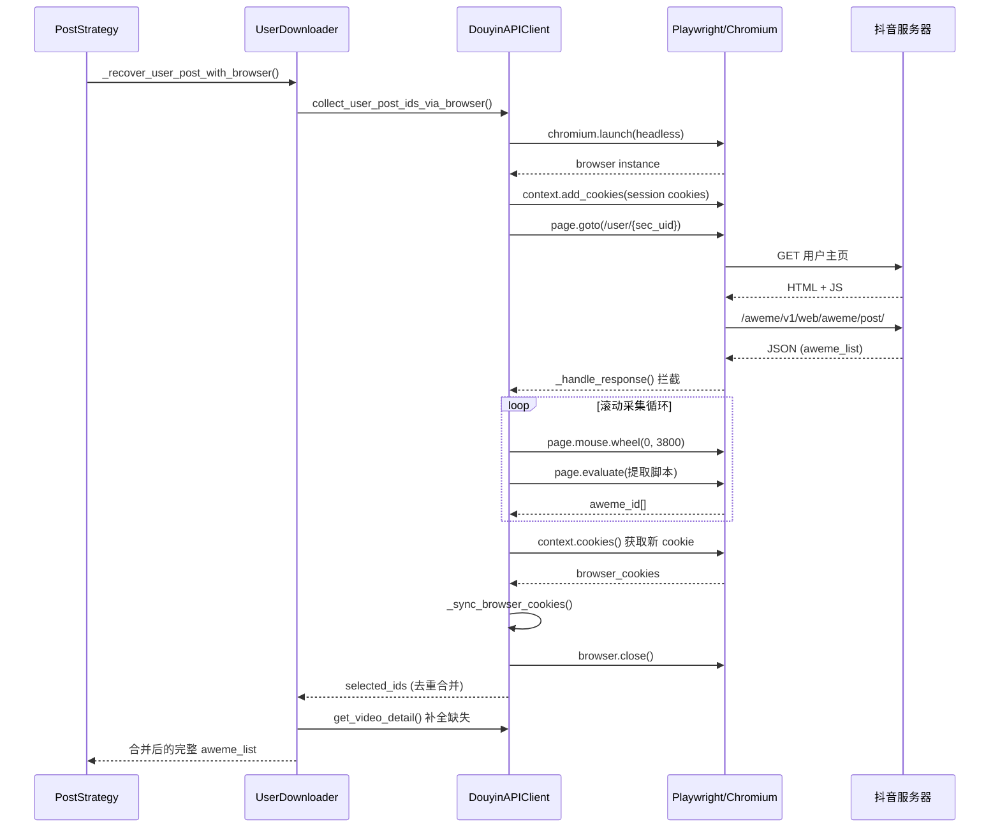

抖音 Web API 对用户作品列表的分页请求存在频率与深度限制——当翻页次数超出阈值或账号风控触发后，API 将返回空列表（`status_code == 0` 但 `aweme_list` 为空）或游标停滞不前（`max_cursor` 不再递增）。本页深入解析项目如何通过 **Playwright 浏览器自动化** 实现 API 分页受限后的兜底采集，涵盖受限检测、浏览器启动与滚动策略、API 响应拦截与 DOM 提取的双通道采集、缺失作品的详情回补，以及 Cookie 回写同步的完整数据流。

Sources: [post_strategy.py](core/user_modes/post_strategy.py#L1-L93), [user_downloader.py](core/user_downloader.py#L177-L299), [api_client.py](core/api_client.py#L492-L816), [default_config.py](config/default_config.py#L48-L54)

---

## 问题背景：API 分页受限的典型表现

抖音的 `/aweme/v1/web/aweme/post/` 接口采用 `max_cursor` 游标式分页，每次返回至多 20 条作品。在以下场景中，API 会中断正常的分页链路：

| 受限表现 | API 返回特征 | 含义 |
|---|---|---|
| **空列表截断** | `status_code == 0`，`aweme_list` 为空，`has_more` 为假 | 服务端已识别分页行为，静默截断后续数据 |
| **游标停滞** | `max_cursor` 与请求传入的 `request_cursor` 相等 | 分页游标未推进，继续请求将进入死循环 |
| **登录提示** | `not_login_module.guide_login_tip_exist == true` | 未登录态下的作品列表受限 |

这三种场景中的前两种构成了浏览器兜底机制的核心触发条件。项目仅对 `post`（用户作品）模式实现了完整的浏览器回补链路，其余模式（`like`、`mix`、`music` 等）使用基础策略中的通用分页逻辑，不涉及浏览器兜底。

Sources: [post_strategy.py](core/user_modes/post_strategy.py#L26-L56), [api_client.py](core/api_client.py#L269-L276)

---

## 整体架构：从受限检测到回补完成

下图展示了浏览器兜底采集的完整数据流，从 API 分页受限被检测到开始，到最终的作品列表合并完成：

Sources: [post_strategy.py](core/user_modes/post_strategy.py#L15-L92), [user_downloader.py](core/user_downloader.py#L177-L299), [api_client.py](core/api_client.py#L492-L702)

---

## 第一阶段：PostUserModeStrategy 的受限检测

与 [六种下载模式策略](15-liu-chong-xia-zai-mo-shi-ce-lue-post-like-mix-music-collect-collectmix) 中介绍的基础策略不同，`PostUserModeStrategy` 重写了 `collect_items()` 方法，在标准分页循环中嵌入了受限检测逻辑。该方法的核心在于引入 `pagination_restricted` 布尔标志，在两种关键条件下将其置为 `true`：

**条件一——空列表截断**：当 `request_cursor > 0`（即不是第一页）且 API 返回的 `page_items` 为空，但 `status_code == 0`（表示请求本身并未失败）时，说明服务端在非首页位置静默截断了数据，而非正常的列表结束。

**条件二——游标停滞**：当 `has_more == true` 但 `max_cursor == request_cursor`（游标未推进）时，说明服务端虽然声称还有更多数据，但实际已拒绝提供下一页。基础策略 `BaseUserModeStrategy._collect_paged_aweme()` 中也有同样的检测，但仅做日志警告后退出循环，不触发浏览器回补。

一旦 `pagination_restricted` 被置位，分页循环立即终止，随后调用 `UserDownloader._recover_user_post_with_browser()` 启动浏览器兜底流程。

Sources: [post_strategy.py](core/user_modes/post_strategy.py#L26-L91)

---

## 第二阶段：UserDownloader 的浏览器回补调度

`_recover_user_post_with_browser()` 是连接策略层与 API 客户端层浏览器采集能力的桥梁方法。它的职责可以分为三步：**前置判断**、**浏览器采集调用**、**缺失作品详情回补**。

### 前置判断

方法首先读取 `browser_fallback` 配置节，若 `enabled` 为 `false` 则直接返回不做任何处理。接着检查是否真的需要回补——如果用户设置了 `number.post` 数量限制，且当前已采集的作品数已达到该限制，说明分页受限并未影响目标采集量，无需启动浏览器。值得注意的是，代码注释明确指出 `user_info.aweme_count` 在分页受限场景下**不可靠**（经常只返回 20），因此不将其作为判断依据，而是仅依赖用户显式设置的数量限制。

### 浏览器采集调用

确认需要回补后，方法将 `browser_fallback` 下的全部子参数透传给 `DouyinAPIClient.collect_user_post_ids_via_browser()`，包括 `headless`（是否无头模式）、`max_scrolls`（最大滚动次数）、`idle_rounds`（空闲轮数阈值）、`wait_timeout_seconds`（超时秒数）。浏览器采集返回的是一个 `aweme_id` 字符串列表。

### 缺失作品详情回补

浏览器返回的仅是 `aweme_id` 列表，而后续下载流程需要完整的作品元数据。方法通过计算 `missing_ids`（浏览器采集到但 API 分页未覆盖的 ID），对每个缺失 ID 尝试获取详情。获取策略采用**优先复用**原则：先从浏览器会话期间拦截到的 API 响应缓存（`pop_browser_post_aweme_items()`）中查找，若缓存未命中再调用 `get_video_detail()` 单独拉取。每条详情还经过 `sec_uid` 一致性校验，防止混入其他用户的作品。

Sources: [user_downloader.py](core/user_downloader.py#L177-L299)

---

## 第三阶段：Playwright 浏览器采集的核心实现

`DouyinAPIClient.collect_user_post_ids_via_browser()` 是整个兜底机制中代码量最大、逻辑最复杂的部分，它通过 Playwright 驱动 Chromium 浏览器模拟真实用户行为来突破 API 分页限制。该方法的采集策略采用**双通道并行**架构：

### 双通道采集模型

| 采集通道 | 数据来源 | 数据质量 | 触发方式 |
|---|---|---|---|
| **API 响应拦截** | 浏览器发出的 `/aweme/v1/web/aweme/post/` 网络请求响应 | 完整的 `aweme` 对象（含视频地址、作者信息等） | `page.on("response")` 事件监听 |
| **DOM 提取** | 页面渲染后的 HTML 内容 | 仅 `aweme_id`（通过正则匹配链接和内嵌 JSON） | JavaScript `page.evaluate()` 执行 |

最终合并时，API 拦截通道的 ID 优先排列（`post_api_ids` 在前），DOM 提取的 ID 作为补充（`ids` 在后），通过 `selected_seen` 集合去重。

### 浏览器会话生命周期

### 关键实现细节

**Cookie 注入**：浏览器启动后，`_browser_cookie_payload()` 将当前 API 客户端的 Cookie 映射为 Playwright 格式并注入浏览器上下文，但排除了 `sessionid`、`sid_tt`、`uid_tt` 等敏感会话 Cookie（定义在 `_BROWSER_COOKIE_BLOCKLIST` 中），避免跨上下文会话冲突。

**验证码处理**：方法在页面加载后检查 `document.title` 是否包含"验证码"。若检测到验证码页面且当前为 `headless` 模式，则直接返回空列表并提示用户将 `headless` 设为 `false`；若为有头模式，则调用 `_wait_for_manual_verification()` 进入轮询等待，用户在弹出的浏览器窗口中完成验证后程序自动继续。

**滚动策略**：预热阶段最多等待 20 秒（每秒尝试提取一次），一旦成功提取到 ID 即提前退出。正式滚动阶段每次向下滚动 3800 像素，等待 1200 毫秒后提取。终止条件有两个：达到用户设定的 `expected_count`，或连续 `idle_rounds` 轮滚动后 ID 列表未增长（说明已到达页面底部）。

**DOM 提取脚本**：`_extract_aweme_ids_from_page()` 通过 JavaScript 在浏览器上下文中执行，扫描三类来源——所有 `<a>` 标签的 `href` 属性中匹配 `/video/{id}` 和 `/note/{id}` 模式的链接，以及整个 HTML 中匹配 `"aweme_id":"{id}"` 和 `"group_id":"{id}"` 的内嵌 JSON 字符串。这三类来源的匹配结果合并去重后返回。

**Cookie 回写**：浏览器会话关闭前，通过 `context.cookies()` 提取所有 `douyin.com` 域名的 Cookie，调用 `_sync_browser_cookies()` 将其合并回 API 客户端的 Cookie 存储和 `aiohttp` 会话中。这意味着浏览器访问过程中可能获得的新 Cookie（如刷新后的 `msToken`）会被后续 API 请求复用。

Sources: [api_client.py](core/api_client.py#L492-L816), [api_client.py](core/api_client.py#L48-L61), [api_client.py](core/api_client.py#L714-L728), [api_client.py](core/api_client.py#L730-L769), [api_client.py](core/api_client.py#L771-L793), [api_client.py](core/api_client.py#L795-L816)

---

## 配置参数详解

浏览器兜底机制通过 `config.yml` 中的 `browser_fallback` 配置节控制，以下为每个参数的详细说明：

| 参数 | 类型 | 默认值 | 说明 |
|---|---|---|---|
| `enabled` | `bool` | `true` | 是否启用浏览器兜底。设为 `false` 可完全禁用，API 分页受限时仅使用已采集的部分结果 |
| `headless` | `bool` | `false` | 是否以无头模式运行 Chromium。默认为有头模式，便于用户在触发验证码时手动完成验证 |
| `max_scrolls` | `int` | `240` | 最大滚动次数。每次滚动约 3800 像素，240 次可覆盖约 4800 条作品（每页 20 条 × 240 滚动） |
| `idle_rounds` | `int` | `8` | 连续空闲轮数阈值。当连续 N 轮滚动后 ID 列表无增长时，判定已到达页面底部并终止 |
| `wait_timeout_seconds` | `int` | `600` | 等待超时秒数。用于页面加载超时和手动验证等待的上限时间 |

Sources: [default_config.py](config/default_config.py#L48-L54)

---

## 详情回补与 sec_uid 校验

浏览器采集返回的是 `aweme_id` 列表，而下载器需要完整的作品元数据对象。回补流程对每个缺失 ID 按以下优先级获取详情：

1. **复用浏览器拦截缓存**：`pop_browser_post_aweme_items()` 返回浏览器会话期间通过 API 响应拦截获取的完整 `aweme` 对象字典（key 为 `aweme_id`）。这些数据来自真实的 API 响应，数据完整性最高。
2. **逐条 API 拉取**：对于缓存中未命中的 ID，调用 `get_video_detail(aweme_id, suppress_error=True)` 单独请求详情接口。`suppress_error=True` 确保单条失败不会产生过多错误日志，影响整体回补进度。

每条回补的详情还会经过 `sec_uid` 一致性校验——如果详情中的 `author.sec_uid` 与目标用户不一致（可能因为作品已被删除或接口返回了错误数据），该条记录将被跳过。这一校验是防御性的，避免将无关作品混入下载队列。

回补完成后，方法输出完整的统计摘要日志，包含 `merged_ids`（DOM 通道采集数）、`selected_ids`（合并去重后总数）、`post_items`（API 拦截缓存数）、`post_pages`（拦截到的分页响应数）、`reused`（复用缓存数）、`detail_success`（API 补拉成功数）、`detail_failed`（补拉失败数）等指标，便于排查采集效果。

Sources: [user_downloader.py](core/user_downloader.py#L209-L299), [api_client.py](core/api_client.py#L704-L712)

---

## 与其他模块的关联

浏览器兜底机制位于用户作品下载流程的中间层，它仅作用于 `post` 模式。其他下载模式（`like`、`mix`、`music`、`collect`、`collectmix`）使用 `BaseUserModeStrategy._collect_paged_aweme()` 的通用分页逻辑，在游标停滞时仅记录警告日志并终止，不触发浏览器回补。若这些模式也需要浏览器兜底能力，需参照 `PostUserModeStrategy` 的实现模式，在各自的 `collect_items()` 方法中加入受限检测和浏览器回补调用。

在并发控制方面，浏览器采集过程中的 API 响应拦截回调通过 `asyncio.create_task()` 创建为独立任务，暂存于 `pending_response_tasks` 列表中，在浏览器关闭前通过 `asyncio.gather()` 统一等待完成，确保不会丢失异步拦截到的数据。而详情回补阶段的每条 `get_video_detail()` 调用则通过 [RateLimiter](18-su-lu-xian-zhi-qi-ratelimiter-de-jie-liu-yu-sui-ji-dou-dong) 进行节流，避免触发接口频率限制。

Cookie 管理方面，浏览器会话的 Cookie 注入来源于 [Cookie 获取与认证配置](5-cookie-huo-qu-yu-ren-zheng-pei-zhi) 中配置的会话 Cookie，而浏览器关闭时获取的新 Cookie 会被同步回 API 客户端，形成正向的 Cookie 更新循环。

Sources: [base_strategy.py](core/user_modes/base_strategy.py#L49-L110), [like_strategy.py](core/user_modes/like_strategy.py#L1-L7)

---

## 测试覆盖

浏览器兜底机制在 `tests/test_user_downloader.py` 中有四项专项测试，覆盖了核心场景：

| 测试用例 | 验证场景 | 关键断言 |
|---|---|---|
| `test_user_post_browser_fallback_recovers_missing_pages` | API 分页受限后浏览器回补成功 | `total == 3`，浏览器调用 1 次，详情拉取 2 条且均使用 `suppress_error=True` |
| `test_user_post_browser_fallback_can_be_disabled` | `enabled=false` 时不触发浏览器 | `total == 1`（仅首页 1 条），浏览器调用 0 次 |
| `test_user_post_browser_fallback_prefers_browser_aweme_items` | 优先复用浏览器拦截缓存 | 详情拉取 0 次（全部从缓存复用），`total == 3` |
| `test_user_post_browser_fallback_expected_count_uses_number_limit` | `number.post` 限制透传至浏览器 | `total == 2`，浏览器调用时 `expected_count == 2` |

测试使用 `_FakeAPIClient` 模拟 API 客户端，其中 `get_user_post()` 在 `max_cursor == 0` 时返回 1 条作品，`max_cursor > 0` 时返回空列表（模拟分页受限），`collect_user_post_ids_via_browser()` 固定返回 `["111", "222", "333"]`，精确覆盖了受限检测→浏览器调用→详情回补的完整链路。

Sources: [test_user_downloader.py](tests/test_user_downloader.py#L131-L271)

---

## 延伸阅读

- [UserDownloader 与 UserModeRegistry 的设计](14-userdownloader-yu-usermoderegistry-de-she-ji)：理解策略模式如何组织多种下载模式
- [六种下载模式策略](15-liu-chong-xia-zai-mo-shi-ce-lue-post-like-mix-music-collect-collectmix)：各策略的分页实现差异对比
- [Playwright Cookie 抓取工具](28-playwright-cookie-zhua-qu-gong-ju-cookie_fetcher)：另一个使用 Playwright 的工具模块，了解项目中的浏览器自动化基础设施
- [速率限制器](18-su-lu-xian-zhi-qi-ratelimiter-de-jie-liu-yu-sui-ji-dou-dong)：详情回补阶段的请求节流机制
- [配置文件详解](3-pei-zhi-wen-jian-xiang-jie-config-yml-quan-zi-duan-shuo-ming-yu-dian-xing-chang-jing-shi-li)：`browser_fallback` 配置节在 `config.yml` 中的使用方式