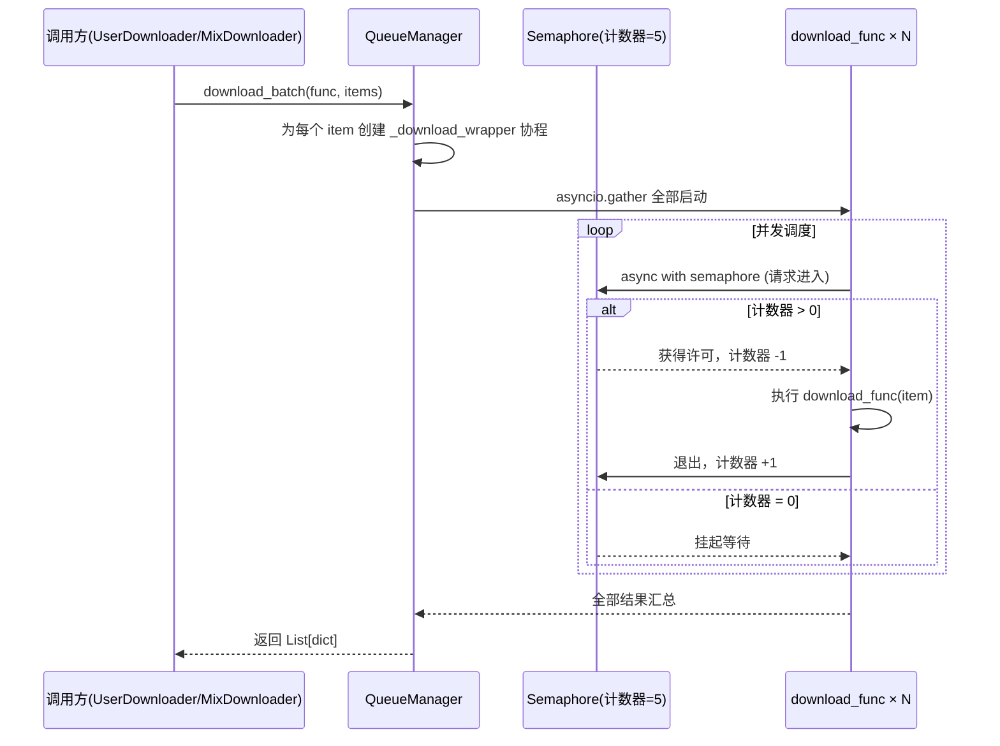
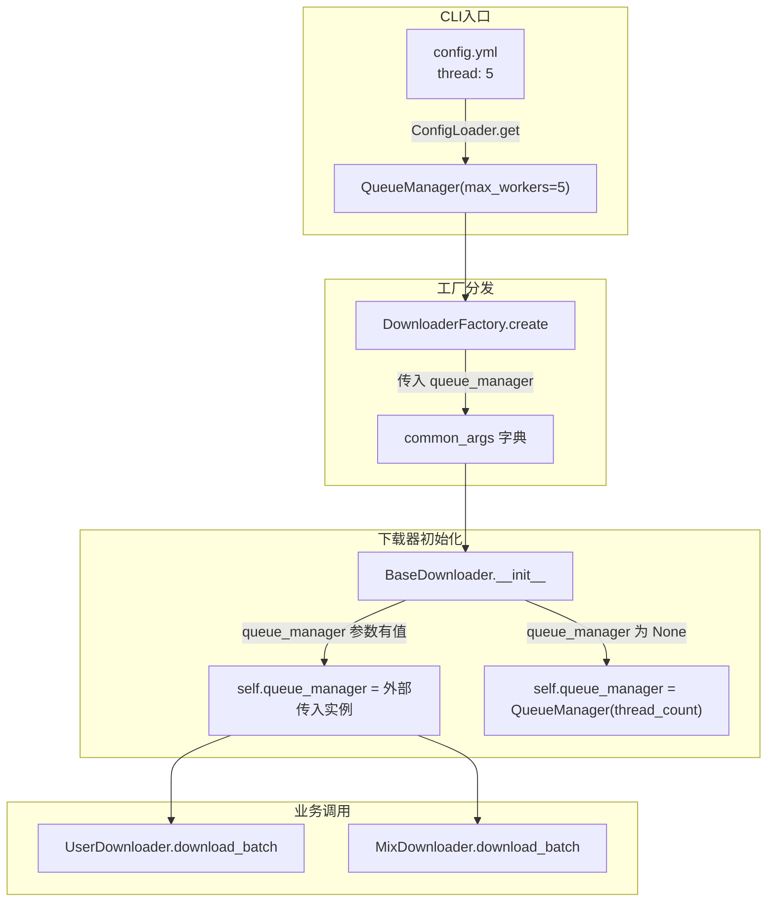
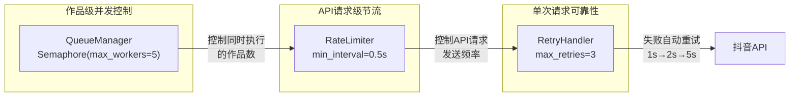

在抖音批量下载场景中，一个用户可能有数百条作品，一个合集可能包含几十个视频。如果逐一顺序下载，耗时会呈线性增长；如果毫无节制地全部并发，不仅会压垮本地网络和磁盘 I/O，还极易触发平台风控导致 IP 被封。**QueueManager** 正是解决这一矛盾的轻量级并发调度器——它基于 `asyncio.Semaphore` 实现可配置的并发上限控制，让开发者只需传入一个待处理列表和一个处理函数，即可自动完成"全部提交、受限并发、结果汇总"的完整流程。

Sources: [queue_manager.py](control/queue_manager.py#L1-L38)

## 设计目标与定位

QueueManager 属于 `control` 控制层的三大组件之一，与 [速率限制器（RateLimiter）的节流与随机抖动](18-su-lu-xian-zhi-qi-ratelimiter-de-jie-liu-yu-sui-ji-dou-dong)、[指数退避重试（RetryHandler）与下载完整性校验](19-zhi-shu-tui-bi-zhong-shi-retryhandler-yu-xia-zai-wan-zheng-xing-xiao-yan) 共同构成下载器的流量控制与可靠性保障体系。三者的职责边界非常清晰：

| 组件 | 核心职责 | 控制维度 |
|---|---|---|
| **QueueManager** | 并发上限控制 | 同时执行的任务数量 |
| **RateLimiter** | 请求频率节流 | 单位时间内的请求次数 |
| **RetryHandler** | 失败重试策略 | 单次请求的重试次数与间隔 |

QueueManager 关注的是"粗粒度"的并发度控制——同一时刻最多有多少个下载任务并行执行。RateLimiter 在更细粒度上控制 API 请求的发送频率。二者配合使用，既保证下载吞吐量，又避免被平台识别为爬虫行为。

Sources: [\_\_init\_\_.py](control/__init__.py#L1-L5), [default_config.py](config/default_config.py#L29-L31)

## 核心实现：Semaphore 模式

QueueManager 的全部实现仅有 38 行代码，其核心机制建立在 Python `asyncio.Semaphore` 之上：

```python
class QueueManager:
    def __init__(self, max_workers: int = 5):
        self.max_workers = max_workers
        self.semaphore = asyncio.Semaphore(max_workers)
```

`asyncio.Semaphore` 是一个计数信号量：内部维护一个计数器，初始值为 `max_workers`。每当一个协程通过 `async with self.semaphore` 进入临界区时，计数器减 1；协程退出时计数器加 1。当计数器降至 0 时，后续协程会在 `async with` 处自动挂起，直到有已运行的协程释放信号量。这意味着——无论你提交多少个任务，**同一时刻最多只有 `max_workers` 个任务在并发执行**。

默认并发上限为 5，与配置文件中 `thread` 字段的默认值保持一致。这个值经过权衡选择：既能保证合理的下载吞吐量，又不会因并发过高而触发抖音的反爬策略。

Sources: [queue_manager.py](control/queue_manager.py#L10-L14), [default_config.py](config/default_config.py#L29-L29)

## 两种批量处理接口

QueueManager 提供了两个语义不同的批量处理方法，分别适配不同的调用场景：

### `download_batch`：下载专用接口

这是项目中最常用的方法，专为"对一组 item 逐一执行同一下载函数"的场景设计：

```python
async def download_batch(self, download_func: Callable, items: List[Any]) -> List[Any]:
    async def _download_wrapper(item):
        async with self.semaphore:
            try:
                return await download_func(item)
            except Exception as e:
                logger.error("Download failed for item: %s", e)
                return {'status': 'error', 'error': str(e), 'item': item}

    results = await asyncio.gather(*[_download_wrapper(item) for item in items], return_exceptions=False)
    return results
```

其工作流程可以用以下时序图表示：



**关键设计细节**：
- 每个任务在信号量保护下执行，异常不会中断整个批次，而是返回 `{'status': 'error', ...}` 字典
- 使用 `return_exceptions=False`——因为异常已在 wrapper 内捕获，不会向外传播
- 返回值始终是字典列表，每个字典包含 `status` 字段（`success`/`failed`/`skipped`/`error`）

### `process_tasks`：通用任务接口

这是一个更通用的批处理方法，接受一组**不同的**异步函数，统一传入相同的参数：

```python
async def process_tasks(self, tasks: List[Callable], *args, **kwargs) -> List[Any]:
    async def _task_wrapper(task):
        async with self.semaphore:
            try:
                return await task(*args, **kwargs)
            except Exception as e:
                logger.error("Task failed: %s", e)
                return None

    results = await asyncio.gather(*[_task_wrapper(task) for task in tasks], return_exceptions=True)
    return results
```

与 `download_batch` 的核心区别在于：

| 特性 | `download_batch` | `process_tasks` |
|---|---|---|
| 输入模式 | 一个函数 + 一组数据项 | 一组不同的函数 |
| 参数传递 | 每项单独传入 | 所有任务共享 `*args, **kwargs` |
| 异常处理 | 返回错误字典 | 异常通过 `return_exceptions=True` 捕获 |
| 返回值 | `List[dict]` | `List[Any]`（可能包含 Exception 对象） |
| 典型场景 | 批量下载作品 | 批量执行异构任务 |

`process_tasks` 使用 `return_exceptions=True`，这意味着即使某个任务抛出未预期的异常，也不会导致 `asyncio.gather` 整体失败，异常对象会作为对应位置的结果返回。

Sources: [queue_manager.py](control/queue_manager.py#L15-L37)

## 生命周期：从配置到实例化

QueueManager 的实例化贯穿了从 CLI 入口到最终下载器的完整链路。理解这个链路对于排查并发相关问题至关重要：



**实例化路径**（以 CLI 运行为例）：

1. **配置读取**：`cli/main.py` 从 `config.yml` 读取 `thread` 值，默认为 5，创建 `QueueManager(max_workers=int(config.get('thread', 5) or 5))`
2. **工厂透传**：`DownloaderFactory.create()` 将 QueueManager 实例作为 `common_args` 的一部分传递给所有下载器
3. **兜底创建**：`BaseDownloader.__init__()` 中有一个回退机制——如果外部未传入 `queue_manager`，则根据配置自行创建一个：`self.queue_manager = queue_manager or QueueManager(max_workers=thread_count)`

这个"优先使用外部传入、兜底自行创建"的模式确保了两种场景都能正常工作：CLI 入口统一创建并共享实例（推荐），或者测试时直接构造下载器并让内部自行实例化。

Sources: [main.py](cli/main.py#L43-L84), [downloader_factory.py](core/downloader_factory.py#L28-L42), [downloader_base.py](core/downloader_base.py#L53-L64)

## 实际调用场景

在当前项目中，`download_batch` 是实际被使用的接口，主要有两个调用方：

### UserDownloader：用户作品批量下载

当 UserDownloader 从 API 获取到用户的全部作品列表后，通过 `download_batch` 并发执行下载。每个 `_process_aweme` 协程内部会先调用 `_should_download` 做去重判断，再调用 `_download_aweme_assets` 执行实际的资产下载（视频、封面、音乐、头像、JSON 元数据等）：

```python
async def _process_aweme(item: Dict[str, Any]):
    aweme_id = item.get("aweme_id")
    if not await self._should_download(str(aweme_id or "")):
        return {"status": "skipped", "aweme_id": aweme_id}
    success = await self._download_aweme_assets(item, author_name, mode=mode)
    status = "success" if success else "failed"
    return {"status": status, "aweme_id": aweme_id}

download_results = await self.queue_manager.download_batch(
    _process_aweme, deduped_items
)
```

### MixDownloader：合集批量下载

MixDownloader 的调用模式几乎完全一致，区别仅在于 `_process_aweme` 内部的 `mode` 参数固定为 `"mix"`：

```python
download_results = await self.queue_manager.download_batch(
    _process_aweme, aweme_list
)
```

两种场景的共同特征是：**传入的 `_process_aweme` 本身就是一个"重"协程**——它内部会串行下载视频、封面、音乐等多个资产，每次 HTTP 请求还会经过 RetryHandler 的重试包装。因此 Semaphore 控制的并发粒度是"一条作品的全部下载流程"，而非单个 HTTP 请求。

Sources: [user_downloader.py](core/user_downloader.py#L136-L152), [mix_downloader.py](core/mix_downloader.py#L34-L51)

## 并发度配置与调优建议

并发上限通过配置文件的 `thread` 字段控制：

```yaml
# config.yml
thread: 5          # 默认值，表示最多 5 个作品同时下载
retry_times: 3     # 重试次数
rate_limit: 2      # API 请求频率限制（次/秒）
```

**调优考量**：

| 配置值 | 优势 | 风险 |
|---|---|---|
| `thread: 1` | 最安全，几乎不会触发风控 | 下载速度最慢 |
| `thread: 3~5`（推荐） | 速度与安全性的平衡点 | — |
| `thread: 10+` | 下载速度快 | 容易触发 IP 封禁，磁盘 I/O 压力大 |

需要注意，`thread` 控制的是**作品级并发**，而非 HTTP 请求级并发。当 `thread=5` 时，理论上最多同时存在 `5 × N` 个 HTTP 连接（其中 N 是每条作品的资产数量，通常为 3~5：视频 + 封面 + 音乐 + 头像 + JSON）。再加上每个下载请求可能经过 RetryHandler 重试，实际网络负载会比直觉上的"5 个并发"高不少。

Sources: [default_config.py](config/default_config.py#L29-L31)

## 异常隔离与结果汇总

QueueManager 的异常处理策略是"隔离而非传播"——单个任务的失败不会影响其他任务的执行，也不会导致整个批次中断。

对于 `download_batch`，wrapper 内部通过 `try/except` 捕获所有异常，将其转换为结构化的错误字典：

```python
try:
    return await download_func(item)
except Exception as e:
    logger.error("Download failed for item: %s", e)
    return {'status': 'error', 'error': str(e), 'item': item}
```

调用方在收到结果后，通过遍历字典列表中的 `status` 字段统计最终结果：

```python
for entry in download_results:
    status = entry.get("status") if isinstance(entry, dict) else None
    if status == "success":
        result.success += 1
    elif status == "failed":
        result.failed += 1
    elif status == "skipped":
        result.skipped += 1
    else:
        result.failed += 1  # 未知状态按失败处理
```

这种设计使得上层调用者只需关心 `DownloadResult` 的四项计数（total/success/failed/skipped），无需感知并发调度的细节。

Sources: [queue_manager.py](control/queue_manager.py#L27-L37), [user_downloader.py](core/user_downloader.py#L154-L166), [mix_downloader.py](core/mix_downloader.py#L52-L60)

## 与其他控制层组件的协作关系

QueueManager 并非孤立运作。在一次完整的批量下载过程中，三个控制层组件按照不同维度协同工作：



**协作时序**（以 UserDownloader 为例）：

1. **QueueManager** 通过 Semaphore 控制：最多 5 个 `_process_aweme` 协程同时运行
2. 在每个 `_process_aweme` 内部，调用 API 获取详情前先经过 **RateLimiter**：确保请求间隔不低于 `1/rate_limit` 秒
3. 每次 HTTP 下载由 **RetryHandler** 包裹：遇到网络错误自动重试最多 3 次，间隔递增（1s → 2s → 5s）

这种分层设计确保了：从宏观的作品级并发，到中观的请求频率，再到微观的单次请求可靠性，每一层都有对应的保障机制。

Sources: [rate_limiter.py](control/rate_limiter.py#L1-L29), [retry_handler.py](control/retry_handler.py#L1-L30), [downloader_base.py](core/downloader_base.py#L449-L482)

## 延伸阅读

- 了解 RateLimiter 如何在 QueueManager 的并发框架内进一步细化请求频率控制，参阅 [速率限制器（RateLimiter）的节流与随机抖动](18-su-lu-xian-zhi-qi-ratelimiter-de-jie-liu-yu-sui-ji-dou-dong)
- 了解单次 HTTP 下载失败后的指数退避重试机制，参阅 [指数退避重试（RetryHandler）与下载完整性校验](19-zhi-shu-tui-bi-zhong-shi-retryhandler-yu-xia-zai-wan-zheng-xing-xiao-yan)
- 了解 QueueManager 如何被 DownloaderFactory 分配给各下载器实例，参阅 [下载器工厂模式：按 URL 类型创建下载器](8-xia-zai-qi-gong-han-mo-shi-an-url-lei-xing-chuang-jian-xia-zai-qi)
- 了解批量下载结果如何持久化到 SQLite 数据库，参阅 [SQLite 数据库设计与去重、增量下载支持](20-sqlite-shu-ju-ku-she-ji-yu-qu-zhong-zeng-liang-xia-zai-zhi-chi)