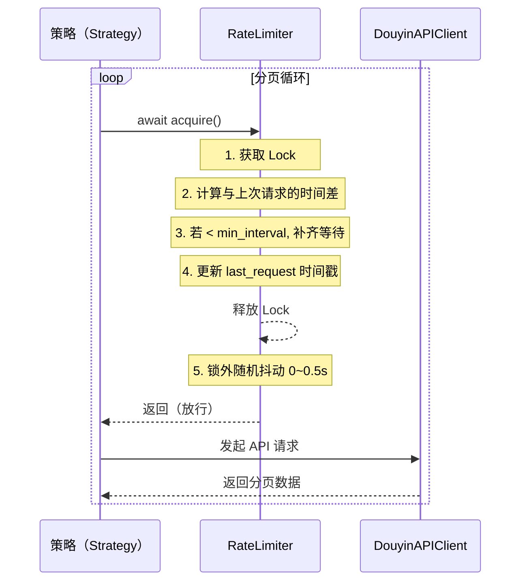
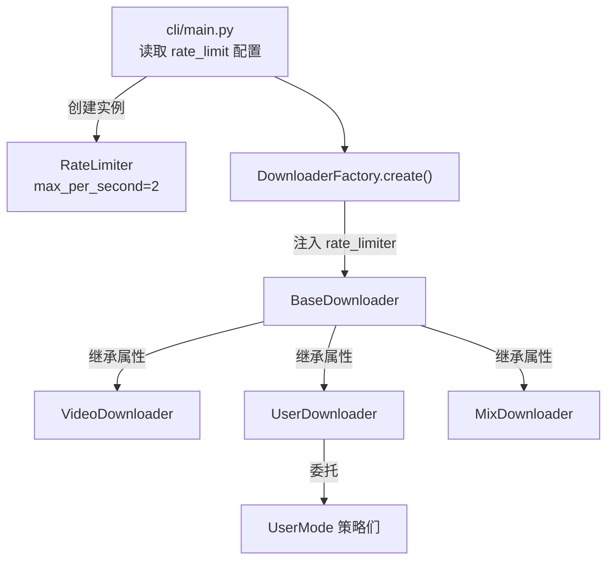

在批量爬取抖音数据的场景中，**请求频率控制**是决定工具能否长期稳定运行的关键因素。过高的请求密度会触发平台的风控策略，导致 IP 被封禁或 Cookie 失效；而过低的频率又严重拖慢下载效率。本项目中的 `RateLimiter` 正是为解决这一矛盾而设计的轻量级异步节流器——它以**令牌桶的极简变体**实现了固定速率节流，并在锁外叠加了 **0\~0.5 秒的随机抖动**，使请求间隔在数学期望可控的前提下呈现自然的人类操作特征。

Sources: [rate_limiter.py](control/rate_limiter.py#L1-L29)

## 设计动机与核心约束

抖音的 API 风控系统会对短时间内密集访问同一接口的客户端进行降级处理，表现为返回空数据、频繁触发验证码、甚至直接封禁账号。面对这一现实约束，本项目的 `RateLimiter` 在设计上遵循两条原则：

- **确定性下界**：任何两次相邻请求之间至少间隔 `1 / max_per_second` 秒，由 `asyncio.Lock` 保证即使在并发场景下也不会突破这一下界。
- **随机性上界**：在确定性等待完成后，额外引入 0\~0.5 秒的均匀分布随机延迟，模拟真实用户在浏览、点击过程中的自然停顿，从而降低被时序分析模型识别为自动化工具的风险。

这种「确定性骨架 + 随机外衣」的两层设计，使得节流器既是合规的流量守门员，又能在对抗风控时提供概率性保护。默认配置下 `max_per_second=2`，即最小间隔 0.5 秒，加上随机抖动后，实际请求间隔分布在 **0.5\~1.0 秒**之间，数学期望约为 0.75 秒。

Sources: [rate_limiter.py](control/rate_limiter.py#L6-L28), [default_config.py](config/default_config.py#L31)

## 架构定位：请求生命周期中的节流锚点

在整体数据流中，`RateLimiter` 被放置在 **API 请求发出之前**，作为所有下载器和策略模式共享的全局节流阀门。以下时序图展示了它在一次典型分页采集中的位置：



该设计的关键决策是：**Lock 只包裹确定性等待逻辑，随机抖动在锁外执行**。这意味着当并发协程 A 正在经历随机抖动时，协程 B 可以进入 Lock 开始自己的确定性等待，避免了锁持有时间被随机性不必要地拉长。

Sources: [rate_limiter.py](control/rate_limiter.py#L15-L28)

## 源码逐行解析

`RateLimiter` 的完整实现仅有 29 行，但其设计精炼且值得逐段拆解。

### 初始化：参数校验与内部状态

```python
def __init__(self, max_per_second: float = 2):
    if max_per_second <= 0:
        max_per_second = 2
    self.max_per_second = max_per_second
    self.min_interval = 1.0 / max_per_second
    self.last_request = 0.0
    self._lock = asyncio.Lock()
```

构造函数接收 `max_per_second` 参数，默认值为 2。对于非法输入（零或负数），采用**静默回退策略**将其修正为默认值 2，而非抛出异常——这是一种面向配置文件的防御性设计，确保用户在 `config.yml` 中误填无效值时工具仍能正常运行。`min_interval` 由速率倒数直接计算，作为两次请求之间的最小时间差。`last_request` 初始化为 0（即 Unix 纪元），保证首次调用 `acquire()` 时不会产生无谓等待。`_lock` 是 `asyncio.Lock` 实例，为后续的异步互斥提供基础设施。

Sources: [rate_limiter.py](control/rate_limiter.py#L7-L13)

### 核心方法 acquire：两阶段节流

```python
async def acquire(self):
    async with self._lock:
        current = time.time()
        time_since_last = current - self.last_request

        if time_since_last < self.min_interval:
            wait_time = self.min_interval - time_since_last
            await asyncio.sleep(wait_time)

        self.last_request = time.time()

    # Random jitter (0~0.5s) outside the lock
    await asyncio.sleep(random.uniform(0, 0.5))
```

`acquire()` 的执行分为两个阶段：

| 阶段 | 锁状态 | 行为 | 目的 |
|------|--------|------|------|
| 确定性等待 | 持有 Lock | 计算 `time_since_last`，若不足 `min_interval` 则 `asyncio.sleep` 补齐 | 保证请求间隔不低于下界 |
| 随机抖动 | 已释放 Lock | `asyncio.sleep(random.uniform(0, 0.5))` | 模拟人类行为、对抗时序分析 |

值得注意的是第 24 行 `self.last_request = time.time()` 在 `if` 块之外执行——这意味着即使本次调用无需等待（距离上次请求已超过 `min_interval`），时间戳仍然会被刷新，确保下一次调用以**本次实际放行时刻**为基准计算间隔。

Sources: [rate_limiter.py](control/rate_limiter.py#L15-L28)

## 全局实例化与依赖注入

`RateLimiter` 在应用入口处被创建为**单一实例**，随后通过依赖注入链路传递到所有需要节流的组件中，确保全局共享同一个时间戳基准。



实例化入口位于 [cli/main.py](cli/main.py#L41)，通过 `config.get('rate_limit', 2)` 读取用户配置（默认 2），创建 `RateLimiter` 实例后传入 `DownloaderFactory`。工厂将同一个实例打包进 `common_args` 字典，注入到所有下载器构造函数中。[BaseDownloader](core/downloader_base.py#L61) 中通过 `self.rate_limiter = rate_limiter or RateLimiter()` 做了兜底——若外部未注入则自动创建默认实例，保证即使依赖注入链路断裂也不会抛出 `AttributeError`。

Sources: [main.py](cli/main.py#L41), [downloader_factory.py](core/downloader_factory.py#L26-L38), [downloader_base.py](core/downloader_base.py#L51-L61)

## 调用点分布：请求级节流的完整覆盖

`rate_limiter.acquire()` 在项目中被广泛调用，覆盖了所有可能触发 API 请求的关键路径。以下是完整的调用点分布：

| 调用位置 | 触发场景 | 说明 |
|----------|----------|------|
| [VideoDownloader.download()](core/video_downloader.py#L28) | 单视频详情获取 | 下载单个视频前获取详情数据 |
| [MixDownloader._fetch_all_mix_aweme()](core/mix_downloader.py#L74) | 合集分页采集 | 循环翻页获取合集中的所有视频 |
| [UserDownloader._fetch_detail_via_api()](core/user_downloader.py#L256) | 浏览器兜底采集 | 补全浏览器采集未能覆盖的视频详情 |
| [BaseUserModeStrategy._collect_aweme_paged()](core/user_modes/base_strategy.py#L78) | 用户作品/点赞分页 | post/like 等模式的通用分页循环 |
| [BaseUserModeStrategy._collect_paged_entries()](core/user_modes/base_strategy.py#L129) | 收藏夹分页 | collect/collectmix 模式的分页入口 |
| [BaseUserModeStrategy._expand_metadata_items()](core/user_modes/base_strategy.py#L185) | 元数据展开 | mix/music 模式的子列表分页获取 |
| [CollectStrategy._fetch_collect_items()](core/user_modes/collect_strategy.py#L39) | 收藏内容分页 | 遍历收藏夹内视频列表 |

可以观察到，`acquire()` 的调用时机高度一致：**总是在发起 API 请求之前、分页循环体之内**。这种一致的调用模式形成了一个隐式的编程契约——任何可能触发 HTTP 请求的代码路径都必须先经过 `rate_limiter.acquire()` 的放行。

Sources: [video_downloader.py](core/video_downloader.py#L28), [mix_downloader.py](core/mix_downloader.py#L74), [user_downloader.py](core/user_downloader.py#L256), [base_strategy.py](core/user_modes/base_strategy.py#L78-L185), [collect_strategy.py](core/user_modes/collect_strategy.py#L39)

## 配置与调优指南

`RateLimiter` 的行为由 `config.yml` 中的 `rate_limit` 字段控制，该字段定义在 [default_config.py](config/default_config.py#L31) 中，默认值为 `2`（即每秒最多 2 次请求）。

### 参数行为对照表

| `rate_limit` 值 | `min_interval` | 加抖动后实际间隔范围 | 数学期望间隔 | 适用场景 |
|-----------------|----------------|---------------------|-------------|----------|
| 1 | 1.0s | 1.0\~1.5s | 1.25s | 极保守模式，IP/账号风险较高时使用 |
| 2（默认） | 0.5s | 0.5\~1.0s | 0.75s | 日常使用，兼顾效率与安全 |
| 5 | 0.2s | 0.2\~0.7s | 0.45s | 高速模式，需配合优质代理使用 |
| 10 | 0.1s | 0.1\~0.6s | 0.35s | 极速模式，仅适用于测试环境 |
| 0 或负数 | 0.5s | 0.5\~1.0s | 0.75s | 回退为默认值 2 |

> ⚠️ **重要提醒**：提高 `rate_limit` 值虽然能加速下载，但显著增加了被风控系统标记的风险。建议根据当前 Cookie 的有效状态和网络环境谨慎调整。当遇到频繁的请求失败时，应优先降低该值而非提高。

Sources: [default_config.py](config/default_config.py#L31), [rate_limiter.py](control/rate_limiter.py#L7-L13)

## 测试策略：单元验证与测试替身

项目中对 `RateLimiter` 采用了两层测试策略：**直接单元测试**验证核心节流逻辑，**测试替身**则在集成测试中消除速率限制的副作用。

### 单元测试：时间边界验证

[test_rate_limiter.py](tests/test_rate_limiter.py) 包含两个核心用例：

- **`test_rate_limiter_enforces_interval`**：创建 `max_per_second=10` 的实例（即 `min_interval=0.1s`），连续调用 5 次 `acquire()`，断言总耗时 ≥ 0.4 秒。由于 5 次调用之间需要 4 个间隔，每个间隔至少 0.1 秒，理论下界为 0.4 秒（实际因随机抖动会更高）。
- **`test_rate_limiter_invalid_value_uses_default`**：验证传入 0 和 -5 时，`max_per_second` 均被修正为默认值 2。

### 测试替身：_NoopRateLimiter

在 [test_user_downloader_modes.py](tests/test_user_downloader_modes.py#L31-L33)、[test_user_mode_strategies.py](tests/test_user_mode_strategies.py#L11-L13) 和 [test_user_downloader.py](tests/test_user_downloader.py#L31-L33) 中，均定义了一个 `_NoopRateLimiter` 类：

```python
class _NoopRateLimiter:
    async def acquire(self):
        return
```

这个空实现直接跳过了所有等待逻辑，使集成测试能在毫秒级完成，而不受真实节流器的时间惩罚影响。由于 `RateLimiter` 在 `BaseDownloader` 中通过鸭子类型（duck typing）被调用——只要求对象拥有 `async acquire()` 方法——因此 `_NoopRateLimiter` 可以无缝替换真实实例，无需引入任何接口抽象。

Sources: [test_rate_limiter.py](tests/test_rate_limiter.py#L1-L26), [test_user_downloader_modes.py](tests/test_user_downloader_modes.py#L31-L33), [test_user_mode_strategies.py](tests/test_user_mode_strategies.py#L11-L13)

## 设计权衡与局限性

`RateLimiter` 的极简设计是有意为之的架构选择，但它也带来了一些值得注意的权衡：

**优势方面**：29 行代码实现了完整的异步节流功能，无外部依赖，单实例共享确保全局一致性，Lock 保护下的确定性间隔保证了即使在并发场景下也不会超速。

**局限性方面**：首先，随机抖动范围 `0\~0.5s` 是硬编码的，无法通过配置调整——对于不同风控强度的场景可能需要不同的抖动幅度。其次，`RateLimiter` 是**单一粒度**的全局节流器，不区分 API 端点——理论上，详情接口和列表接口可能需要不同的速率策略，但当前实现将所有请求一视同仁。最后，`last_request` 基于进程内 `time.time()`，不支持跨进程协调——在多进程部署场景下，每个进程会维护各自独立的节流状态。

Sources: [rate_limiter.py](control/rate_limiter.py#L1-L29)

## 延伸阅读

- 了解 `RateLimiter` 如何与并发调度器协同工作，参见 [并发队列管理（QueueManager）与 Semaphore 调度](17-bing-fa-dui-lie-guan-li-queuemanager-yu-semaphore-diao-du)
- 当节流仍不足以避免请求失败时，了解重试机制如何兜底：[指数退避重试（RetryHandler）与下载完整性校验](19-zhi-shu-tui-bi-zhong-shi-retryhandler-yu-xia-zai-wan-zheng-xing-xiao-yan)
- 查看 `rate_limit` 在配置体系中的完整上下文：[默认配置字典（default_config）全字段释义](24-mo-ren-pei-zhi-zi-dian-default_config-quan-zi-duan-shi-yi)