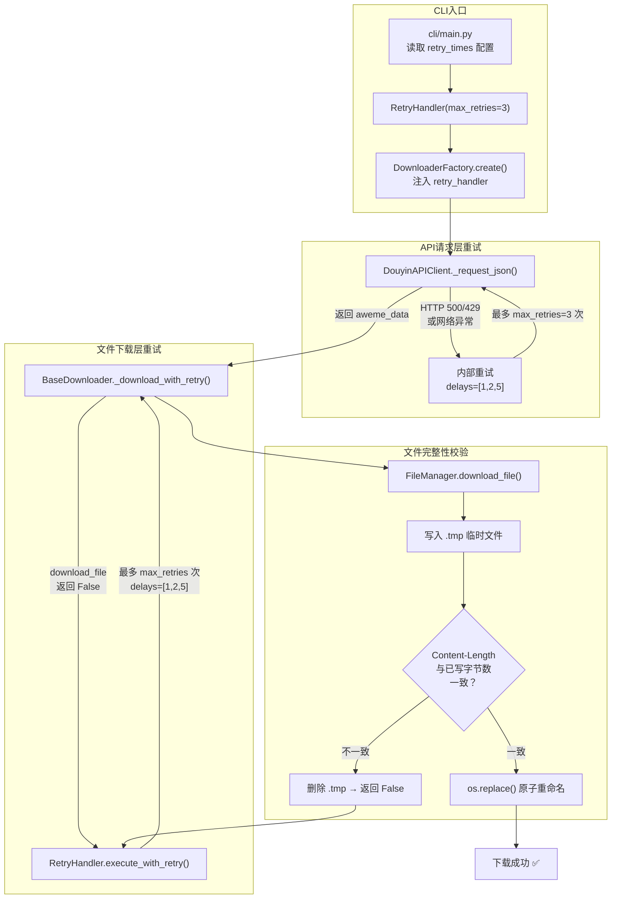
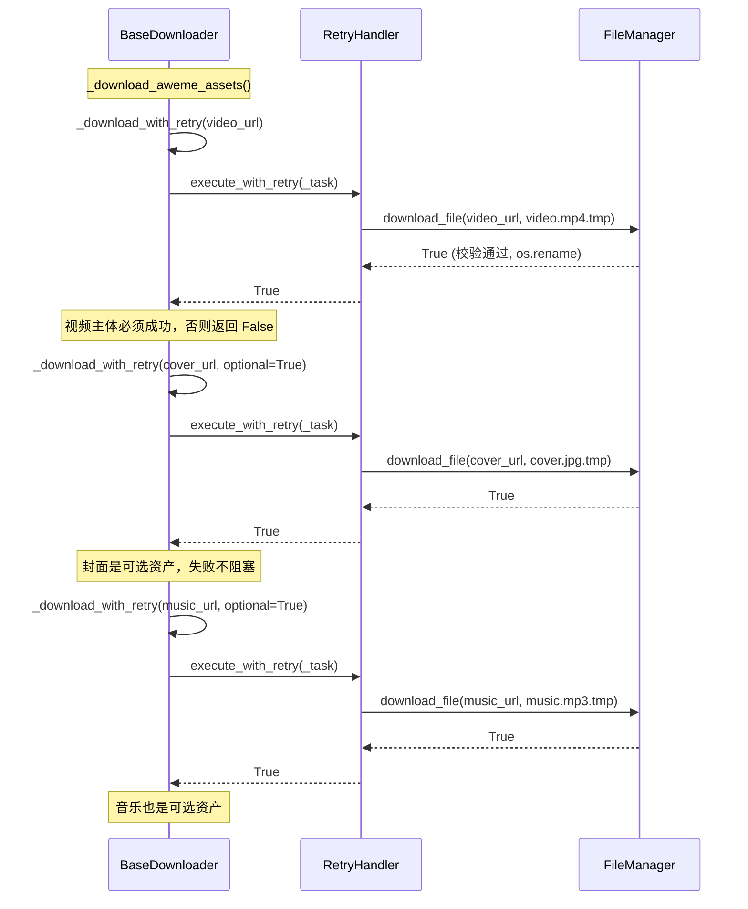

在网络下载场景中，请求失败是常态而非例外——连接超时、服务端限流返回 429、CDN 节点暂时不可用，这些都会导致单次下载失败。本文深入剖析项目中**两层重试机制**（API 请求层重试 + 文件下载层重试）的设计与实现，以及基于**临时文件 + 字节长度校验**的下载完整性保障体系。理解这些机制，是排查"下载失败"类问题的前提。

Sources: [retry_handler.py](control/retry_handler.py#L1-L30), [downloader_base.py](core/downloader_base.py#L1-L30), [file_manager.py](storage/file_manager.py#L50-L119)

## 双层重试架构总览

项目在两个独立的网络交互层分别实现了重试逻辑，形成**纵深防御**。下图展示了完整的数据流与重试触发点：



**第一层**：`DouyinAPIClient._request_json()` 内部自带重试循环，处理 API 请求级别的服务端错误（HTTP 500、429 等）和网络异常。**第二层**：`BaseDownloader._download_with_retry()` 通过 `RetryHandler` 对文件下载操作进行重试，处理的是 CDN 返回异常、字节不完整等下载级失败。两层互不耦合，各自维护独立的延迟序列和重试计数。

Sources: [api_client.py](core/api_client.py#L182-L229), [downloader_base.py](core/downloader_base.py#L449-L482), [cli/main.py](cli/main.py#L42-L43)

## RetryHandler 的核心实现

`RetryHandler` 是一个精简的异步重试包装器，位于 `control/retry_handler.py`，整个实现仅 30 行代码，但提供了完整的**指数退避重试语义**。

### 构造参数与延迟序列

| 参数 | 类型 | 默认值 | 配置来源 |
|---|---|---|---|
| `max_retries` | `int` | `3` | `config.yml` 中的 `retry_times` |
| `retry_delays` | `list[int]` | `[1, 2, 5]` | 硬编码，不可通过配置修改 |

延迟序列 `[1, 2, 5]` 秒的取值遵循了**指数退避（Exponential Backoff）**的简化形式：第一次重试等待 1 秒，第二次 2 秒，第三次及之后 5 秒。这种递增间隔设计能有效避免在服务端负载高峰期产生"重试风暴"。

当 `attempt` 超过 `retry_delays` 的长度时，取最后一个值（5 秒）作为后续所有重试的延迟——这通过 `min(attempt, len(self.retry_delays) - 1)` 索引实现。

Sources: [retry_handler.py](control/retry_handler.py#L10-L29)

### execute_with_retry 执行流程

```python
async def execute_with_retry(self, func: Callable[..., T], *args, **kwargs) -> T:
```

该方法是 RetryHandler 的唯一公共接口，接受一个异步可调用对象 `func` 及其参数，返回 `func` 的执行结果。其执行逻辑为：

1. 进入 `max_retries` 次循环
2. 调用 `await func(*args, **kwargs)`，成功则直接返回
3. 捕获所有 `Exception`，记录到 `last_error`
4. 若非最后一次尝试，从 `retry_delays` 取出对应延迟，调用 `asyncio.sleep(delay)` 等待后继续
5. 所有尝试耗尽后，以 `logger.error` 记录并重新抛出最后一次异常

值得注意的是，`except Exception` 意味着重试机制对**所有运行时异常**生效，包括 `RuntimeError`、`aiohttp.ClientError`、`asyncio.TimeoutError` 等常见网络错误。这是有意为之的设计：在文件下载场景中，任何异常都可能是瞬时问题，值得重试。

Sources: [retry_handler.py](control/retry_handler.py#L15-L29)

### 配置与实例化路径

`RetryHandler` 的实例化发生在 CLI 入口 `cli/main.py` 中，从用户配置读取 `retry_times` 参数：

```python
retry_handler = RetryHandler(max_retries=config.get('retry_times', 3))
```

随后通过 `DownloaderFactory.create()` 将同一实例注入所有下载器，确保全局共享统一的重试策略。在 `BaseDownloader.__init__()` 中，若未显式传入 `retry_handler`，则使用无参默认值 `RetryHandler()` 构造，此时 `max_retries` 同样为 3。

Sources: [cli/main.py](cli/main.py#L42-L43), [downloader_factory.py](core/downloader_factory.py#L27-L42), [downloader_base.py](core/downloader_base.py#L52-L62)

### 配置校验

`ConfigLoader` 在加载配置时会验证 `retry_times` 的合法性：必须能转为非负整数，否则回退为默认值 3 并输出警告日志。这保证了即使配置文件中写入了错误值（如字符串 `"abc"` 或负数 `-1`），系统也不会崩溃。

Sources: [config_loader.py](config/config_loader.py#L266-L275), [default_config.py](config/default_config.py#L30)

## 文件下载层的重试编排

`BaseDownloader._download_with_retry()` 是文件下载与重试机制的核心枢纽，它将 `FileManager.download_file()` 包装为一个可重试的任务：

### 方法签名与参数

```python
async def _download_with_retry(
    self, url: str, save_path: Path, session, *,
    headers=None, optional=False,
    prefer_response_content_type=False, return_saved_path=False,
) -> bool | Path:
```

| 参数 | 作用 |
|---|---|
| `url` | 资源下载地址（CDN 直链或签名 URL） |
| `save_path` | 目标保存路径 |
| `session` | 共享的 `aiohttp.ClientSession` |
| `optional` | 若为 `True`，失败时仅输出 warning 级别日志（如封面图下载） |
| `prefer_response_content_type` | 是否根据响应 Content-Type 调整文件扩展名 |
| `return_saved_path` | 是否返回实际保存路径（用于图集中动态扩展名场景） |

### 包装与降级策略

方法内部定义了 `_task` 闭包，调用 `file_manager.download_file()` 并将返回值 `False` 转化为 `RuntimeError`，从而触发 RetryHandler 的重试逻辑。重试耗尽后，方法不会向上抛异常，而是返回 `False`，实现了**静默降级**——调用方可以根据返回值决定后续行为。

同时，方法使用了**日志限流机制** `_log_download_error()`：前 5 次错误正常记录日志，超过阈值后仅输出一条"Too many download errors, suppressing further per-file logs..."提示，避免批量下载时日志刷屏干扰终端进度条显示。

Sources: [downloader_base.py](core/downloader_base.py#L449-L482), [downloader_base.py](core/downloader_base.py#L110-L117)

## 下载完整性校验机制

`FileManager.download_file()` 实现了一套基于**临时文件 + 字节长度比对**的完整性校验体系，这是项目确保下载文件不为空、不截断的核心防线。

### 临时文件写入模式

下载过程并非直接写入目标文件，而是遵循"**先写临时文件，校验通过后原子替换**"的模式：

1. 生成临时文件路径：`tmp_path = save_path.with_suffix(save_path.suffix + ".tmp")`
2. 通过 `aiofiles.open(tmp_path, "wb")` 以二进制写入模式打开临时文件
3. 以 8192 字节的分块（`iter_chunked(8192)`）流式写入，累计已写字节数 `written`
4. 校验通过后调用 `os.replace(str(tmp_path), str(final_path))` 完成原子重命名

`os.replace()` 在 POSIX 系统上是原子操作（在 NTFS 上同样保证原子性），这意味着即使程序在重命名过程中崩溃，目标文件要么是旧版本要么是新版本，不会出现"写了一半"的损坏状态。

### 字节长度校验

```python
expected_size = response.content_length
written = 0
async with aiofiles.open(tmp_path, "wb") as f:
    async for chunk in response.content.iter_chunked(8192):
        await f.write(chunk)
        written += len(chunk)
if expected_size is not None and written != expected_size:
    logger.warning("Size mismatch for %s: expected %d, got %d", ...)
    tmp_path.unlink(missing_ok=True)
    return False
```

校验逻辑为：当 HTTP 响应头包含 `Content-Length` 时，将实际写入字节数 `written` 与 `expected_size` 比对。若不一致，删除临时文件并返回 `False`。这个返回值会经由 `_download_with_retry` 中的 `_task` 闭包转化为 `RuntimeError`，从而触发 RetryHandler 的重试。

对于不携带 `Content-Length` 的响应（如 chunked transfer encoding），校验被自动跳过（`expected_size is not None` 条件不满足），避免误判。

Sources: [file_manager.py](storage/file_manager.py#L72-L104)

### 异常清理保障

```python
except Exception as e:
    logger.debug("Download error for %s: %s", final_path.name, e)
    tmp_path.unlink(missing_ok=True)
    return False
```

无论是网络超时、连接重置还是磁盘写入失败，所有异常都在 `except` 块中被捕获。关键操作是 `tmp_path.unlink(missing_ok=True)`——删除可能已部分写入的临时文件，防止磁盘上残留 `.tmp` 垃圾文件。`missing_ok=True` 确保即使临时文件因某种原因不存在，也不会抛出额外异常。

Sources: [file_manager.py](storage/file_manager.py#L112-L118)

## API 请求层的独立重试

与文件下载层不同，`DouyinAPIClient._request_json()` 实现了独立的重试循环，专门处理 API 请求级别的失败：

### 两层重试的职责划分

| 维度 | API 请求层（DouyinAPIClient） | 文件下载层（RetryHandler） |
|---|---|---|
| **触发场景** | HTTP 500/429、网络超时、JSON 解析失败 | 文件下载失败、字节不完整 |
| **重试范围** | 仅针对 HTTP 5xx 和 429 重试；4xx 直接返回 `{}` | 对所有 Exception 重试 |
| **延迟序列** | `[1, 2, 5]`（内联定义） | `[1, 2, 5]`（RetryHandler 属性） |
| **失败策略** | 返回空字典 `{}`（不抛异常） | 抛出最后一次异常（由调用方捕获） |
| **典型日志** | `"Request retry 1/3 for /aweme/v1/..."` | `"Attempt 1 failed: Download failed for..."` |

API 层的特别之处在于**状态码敏感的重试决策**：只有 HTTP 5xx（服务端错误）和 429（限流）才触发重试；HTTP 4xx（客户端错误，如 401 未授权、404 不存在）直接返回空字典，不做无意义重试。这种设计避免了对永久性错误的无效重试。

Sources: [api_client.py](core/api_client.py#L188-L229)

## 资产下载中的重试调用全景

一次完整的视频下载涉及多个资产，每个资产的下载都独立经过重试路径。以视频类 aweme 为例：



资产分为**必需**和**可选**两类：视频主体（video）是必需资产，任何一次重试耗尽后的失败都会使整个 `_download_aweme_assets()` 返回 `False`；封面（cover）、背景音乐（music）、头像（avatar）均为可选资产（`optional=True`），失败仅记录 warning 日志，不阻塞后续流程。这种分级容错策略确保了核心内容（视频/图片）优先获取，辅助信息则尽力而为。

Sources: [downloader_base.py](core/downloader_base.py#L235-L388)

## 测试验证

`tests/test_retry_handler.py` 通过三个测试用例覆盖了 RetryHandler 的核心行为路径：

| 测试用例 | 验证场景 | 关键断言 |
|---|---|---|
| `test_retry_handler_succeeds_on_first_try` | 首次即成功 | `result == "ok"`, `call_count == 1` |
| `test_retry_handler_retries_then_succeeds` | 前两次失败，第三次恢复 | `result == "recovered"`, `call_count == 3` |
| `test_retry_handler_raises_after_exhaustion` | 全部重试耗尽 | 抛出 `ValueError("permanent")` |

测试中通过 `handler.retry_delays = [0, 0, 0]` 将延迟置零以加速测试执行，这验证了 `retry_delays` 是可外部覆盖的属性，具备良好的可测试性。

Sources: [test_retry_handler.py](tests/test_retry_handler.py#L1-L49)

## 与其他控制模块的协作

RetryHandler 并非独立运作，它与同属 `control` 模块的 [RateLimiter](18-su-lu-xian-zhi-qi-ratelimiter-de-jie-liu-yu-sui-ji-dou-dong) 和 [QueueManager](17-bing-fa-dui-lie-guan-li-queuemanager-yu-semaphore-diao-du) 共同构成了**流量控制三角**：

- **RateLimiter**：在下载前限流，控制请求频率，预防触发服务端限流（从而减少重试需求）
- **QueueManager**：通过 Semaphore 控制并发数，避免过多并行请求同时失败并重试
- **RetryHandler**：在单次请求失败后执行退避重试，是最后的容错防线

三者的协作顺序为：`RateLimiter.acquire()` → 执行下载任务 → 失败时 `RetryHandler.execute_with_retry()` 重试 → 多个任务由 `QueueManager` 并发调度。

Sources: [control/__init__.py](control/__init__.py#L1-L5), [downloader_base.py](core/downloader_base.py#L56-L64)

## 延伸阅读

- [并发队列管理（QueueManager）与 Semaphore 调度](17-bing-fa-dui-lie-guan-li-queuemanager-yu-semaphore-diao-du)：理解 RetryHandler 的上游并发控制
- [速率限制器（RateLimiter）的节流与随机抖动](18-su-lu-xian-zhi-qi-ratelimiter-de-jie-liu-yu-sui-ji-dou-dong)：理解如何通过限流减少重试触发频率
- [基础下载器（BaseDownloader）的资产下载与去重逻辑](9-ji-chu-xia-zai-qi-basedownloader-de-zi-chan-xia-zai-yu-qu-zhong-luo-ji)：了解 `_download_with_retry` 在完整下载流程中的位置
- [文件管理器（FileManager）的路径构建与异步下载](21-wen-jian-guan-li-qi-filemanager-de-lu-jing-gou-jian-yu-yi-bu-xia-zai)：深入理解完整性校验底层实现