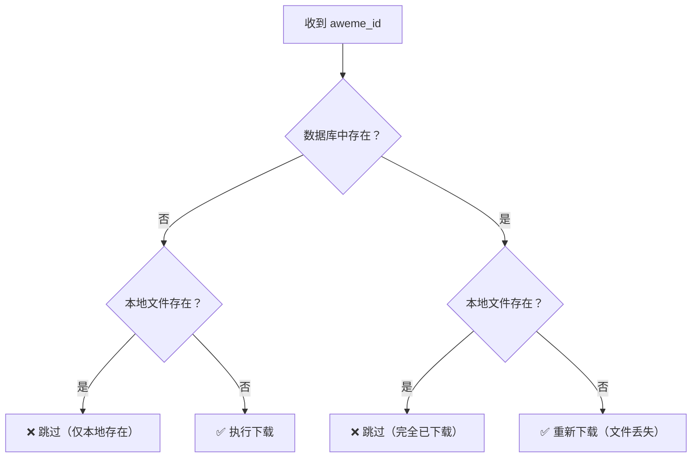
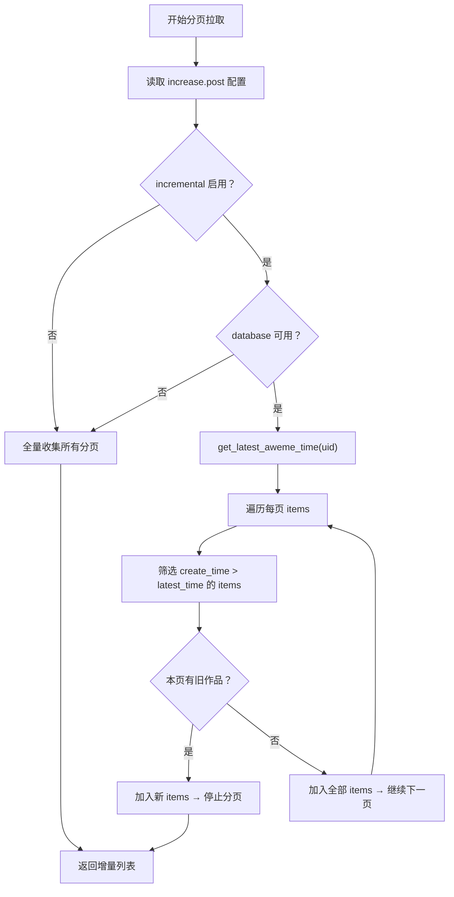
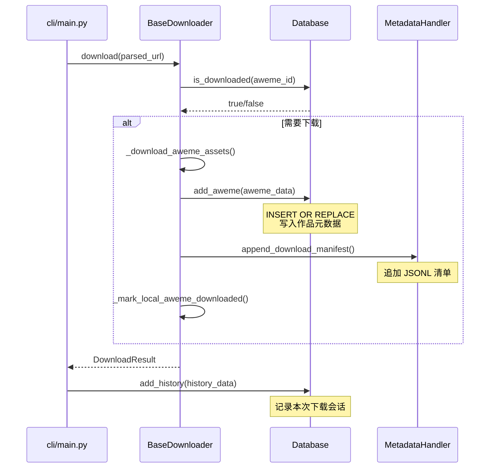

本项目使用 SQLite 作为轻量级本地持久化引擎，承载三个核心职责：**作品去重判重**、**增量下载断点**、**下载历史审计**。整个数据库层封装在 `storage.Database` 类中，基于 `aiosqlite` 实现全异步操作，与项目的异步下载管线无缝衔接。本文将从表结构设计、去重机制、增量下载策略、连接管理四个维度进行深入剖析。

Sources: [database.py](storage/database.py#L1-L12)

## 数据库表结构设计

数据库共包含三张表，在 `initialize()` 方法中通过 `CREATE TABLE IF NOT EXISTS` 原子创建，确保首次运行和重复调用均安全。

### aweme 表 — 作品元数据核心

`aweme` 表是整个去重和增量下载的基石，以抖音作品 ID（`aweme_id`）作为唯一业务主键：

| 字段 | 类型 | 约束 | 用途 |
|---|---|---|---|
| `id` | INTEGER | PRIMARY KEY AUTOINCREMENT | 内部自增主键 |
| `aweme_id` | TEXT | UNIQUE NOT NULL | 抖音作品唯一标识 |
| `aweme_type` | TEXT | NOT NULL | 媒体类型（video/gallery） |
| `title` | TEXT | — | 作品描述文本 |
| `author_id` | TEXT | — | 作者 UID |
| `author_name` | TEXT | — | 作者昵称 |
| `create_time` | INTEGER | — | 作品发布时间戳 |
| `download_time` | INTEGER | — | 下载完成时间戳 |
| `file_path` | TEXT | — | 本地保存目录路径 |
| `metadata` | TEXT | — | 原始 API 返回的完整 JSON |

`aweme_id` 的 `UNIQUE` 约束配合 `INSERT OR REPLACE` 语义，保证同一作品重复下载时元数据会被更新而非产生重复记录。

Sources: [database.py](storage/database.py#L27-L40)

### download_history 表 — 下载会话审计

`download_history` 表记录每次下载任务的执行快照，用于事后追溯和统计分析：

| 字段 | 类型 | 用途 |
|---|---|---|
| `url` | TEXT | 原始输入 URL |
| `url_type` | TEXT | URL 类型（video/user/mix/music） |
| `download_time` | INTEGER | 下载时间戳 |
| `total_count` | INTEGER | 本次任务发现的作品总数 |
| `success_count` | INTEGER | 成功下载数 |
| `config` | TEXT | 本次下载使用的配置快照（JSON） |

该表在 CLI 层 `download_url()` 函数末尾写入，每次 URL 处理完成后自动记录一条。`config` 字段会过滤掉 `cookies`、`cookie`、`transcript` 等敏感信息后再存储。

Sources: [database.py](storage/database.py#L42-L52), [main.py](cli/main.py#L103-L114)

### transcript_job 表 — 转写任务追踪

`transcript_job` 表为视频转写功能提供幂等保障，通过 `UNIQUE(aweme_id, video_path, model)` 复合唯一约束实现 UPSERT 语义：

| 字段 | 类型 | 用途 |
|---|---|---|
| `aweme_id` | TEXT | 关联作品 ID |
| `video_path` | TEXT | 视频文件本地路径 |
| `transcript_dir` | TEXT | 转写输出目录 |
| `model` | TEXT | 使用的转写模型 |
| `status` | TEXT | 任务状态（pending/success/skipped/failed） |
| `skip_reason` | TEXT | 跳过原因 |
| `error_message` | TEXT | 错误信息 |

Sources: [database.py](storage/database.py#L54-L69)

### 索引策略

数据库建立了五个索引，精确覆盖高频查询路径：

```sql
CREATE INDEX idx_aweme_id ON aweme(aweme_id);        -- 去重查询
CREATE INDEX idx_author_id ON aweme(author_id);       -- 增量下载 + 作者统计
CREATE INDEX idx_download_time ON aweme(download_time);-- 时间排序
CREATE INDEX idx_transcript_aweme_id ON transcript_job(aweme_id);  -- 转写查询
CREATE INDEX idx_transcript_status ON transcript_job(status);      -- 状态筛选
```

其中 `idx_aweme_id` 服务于 `is_downloaded()` 的点查询，`idx_author_id` 同时服务于 `get_latest_aweme_time()` 的聚合查询和 `get_aweme_count_by_author()` 的计数查询，索引设计与业务查询高度对齐。

Sources: [database.py](storage/database.py#L72-L76)

## 双层去重机制

去重判别发生在下载决策层 `BaseDownloader._should_download()` 中，采用**数据库记录 + 本地文件扫描**的双层校验架构，确保即使数据库与文件系统出现不一致状态也能正确处理。



### 数据库层去重

`Database.is_downloaded(aweme_id)` 直接查询 `aweme` 表，以 O(1) 复杂度（命中唯一索引）判断该作品是否已被记录。这是最快速的判重路径，适用于绝大多数场景。

Sources: [database.py](storage/database.py#L81-L88)

### 本地文件层去重

当数据库不可用或需要交叉验证时，`BaseDownloader._build_local_aweme_index()` 会递归扫描 `base_path` 目录下的所有媒体文件（`.mp4`、`.jpg`、`.jpeg`、`.png`、`.webp`、`.gif`、`.mp3`、`.m4a`），使用正则表达式 `(\d{15,20})` 从文件名中提取 aweme_id，构建内存索引集合 `_local_aweme_ids`。

这种设计的优势在于：即使数据库文件被删除或损坏，只要本地文件存在，系统仍能正确跳过已下载内容，避免重复请求和存储浪费。同时，它覆盖了数据库未启用（`config.database = False`）的降级场景。

Sources: [downloader_base.py](core/downloader_base.py#L135-L186)

### 状态不一致的修复策略

`_should_download()` 的决策逻辑中最值得关注的是**数据库有记录但文件缺失**的场景处理。当 `is_downloaded()` 返回 `True` 但 `_is_locally_downloaded()` 返回 `False` 时，系统会输出警告日志并触发重新下载，确保数据完整性不受文件意外删除的影响：

```
if in_db and not in_local:
    logger.info("Aweme %s exists in database but media file not found locally, retry download", aweme_id)
    return True
```

Sources: [downloader_base.py](core/downloader_base.py#L144-L149)

## 增量下载实现

增量下载是一种优化策略：当用户多次运行同一作者的下载任务时，系统仅获取上次下载之后发布的新作品，而非重新拉取全部内容。这一功能依赖 `increase` 配置项和 `get_latest_aweme_time()` 数据库查询协同实现。

### 配置结构

`default_config.py` 中定义了按模式独立控制的增量开关：

```yaml
increase:
  post: false
  like: false
  allmix: false
  mix: false
  music: false
```

每个模式可独立启用，例如只对 `post` 开启增量而对 `like` 保持全量下载。

Sources: [default_config.py](config/default_config.py#L22-L28)

### 增量查询原理

`Database.get_latest_aweme_time(author_id)` 执行 `SELECT MAX(create_time) FROM aweme WHERE author_id = ?`，返回该作者在数据库中记录的最新作品发布时间戳。这个时间戳即为"断点"——所有 `create_time` 大于该值的作品都被视为新作品。

Sources: [database.py](storage/database.py#L109-L116)

### 策略层的增量逻辑

以 `PostUserModeStrategy` 为例，增量下载的完整流程如下：



核心判断位于分页循环内部：对每页返回的作品列表，筛选 `create_time > latest_time` 的新作品加入结果集。当某页中出现 `create_time ≤ latest_time` 的旧作品时（即 `len(new_items) < len(page_items)`），说明已到达断点位置，立即停止分页拉取，避免不必要的 API 请求。

Sources: [post_strategy.py](core/user_modes/post_strategy.py#L31-L66), [base_strategy.py](core/user_modes/base_strategy.py#L68-L94)

## 连接管理与并发安全

### 单连接 + 双重检查锁

`Database` 类采用**单连接复用**模式，通过 `_get_conn()` 方法配合 `asyncio.Lock` 实现双重检查锁定（Double-Checked Locking）：

```python
async def _get_conn(self) -> aiosqlite.Connection:
    if self._conn is None:              # 第一次检查（无锁）
        async with self._conn_lock:     # 加锁
            if self._conn is None:      # 第二次检查（有锁）
                self._conn = await aiosqlite.connect(self.db_path)
    return self._conn
```

这种设计确保在高并发环境下（多个下载协程同时首次访问数据库时）只创建一个连接实例，避免连接泄漏和资源浪费。测试用例 `test_database_get_conn_reuses_single_connection_under_concurrency` 专门验证了这一行为。

Sources: [database.py](storage/database.py#L14-L19), [test_database.py](tests/test_database.py#L90-L119)

### 生命周期管理

数据库的完整生命周期由 CLI 入口 `cli/main.py` 管理：

| 阶段 | 操作 | 位置 |
|---|---|---|
| 初始化 | 读取 `config.database` 开关和 `config.database_path` 路径 | `cli/main.py` L165-169 |
| 建表 | `await database.initialize()` 创建表和索引 | `database.py` L21-79 |
| 注入 | 通过 `DownloaderFactory.create()` 传入各下载器 | `cli/main.py` L81 |
| 关闭 | `finally` 块中 `await database.close()` 确保资源释放 | `cli/main.py` L203-204 |

当配置中 `database: true`（默认值）时，数据库自动启用；设为 `false` 时系统降级为纯本地文件去重模式。

Sources: [main.py](cli/main.py#L165-L204), [default_config.py](config/default_config.py#L33-L34)

## 写入时机与数据流



`add_aweme()` 使用 `INSERT OR REPLACE` 语义，以 `aweme_id` 的 UNIQUE 约束作为冲突判定基准。当同一作品被重复下载时，旧记录的所有字段（包括 `download_time`、`file_path`、`metadata`）都会被新值覆盖，实现"最新状态优先"的更新策略。

Sources: [database.py](storage/database.py#L90-L107), [downloader_base.py](core/downloader_base.py#L396-L409)

## 与其他模块的协作关系

数据库层在整体架构中处于**存储层**的核心位置，向上为下载器提供去重和断点查询服务，向旁为元数据处理器提供数据来源，向下与 FileManager 的文件系统操作形成互补：

| 协作模块 | 交互方式 | 具体场景 |
|---|---|---|
| `BaseDownloader` | 读取 `is_downloaded`、`get_latest_aweme_time` | 下载前去重、增量断点 |
| `UserModeStrategy` | 读取 `get_latest_aweme_time` | 分页拉取时的增量过滤 |
| `TranscriptManager` | 读写 `upsert_transcript_job`、`get_transcript_job` | 转写任务幂等与状态追踪 |
| `MetadataHandler` | 并行写入，无直接依赖 | JSON 元数据文件 + JSONL 清单 |
| `FileManager` | 互补关系，无直接依赖 | 文件存在性校验覆盖数据库缺失场景 |

下一页将深入探讨 [文件管理器（FileManager）的路径构建与异步下载](21-wen-jian-guan-li-qi-filemanager-de-lu-jing-gou-jian-yu-yi-bu-xia-zai) 的实现细节，它与数据库层共同构成了完整的持久化管线。若对元数据文件和下载清单的写入格式感兴趣，可参阅 [元数据与下载清单（Manifest）的写入与用途](22-yuan-shu-ju-yu-xia-zai-qing-dan-manifest-de-xie-ru-yu-yong-tu)。