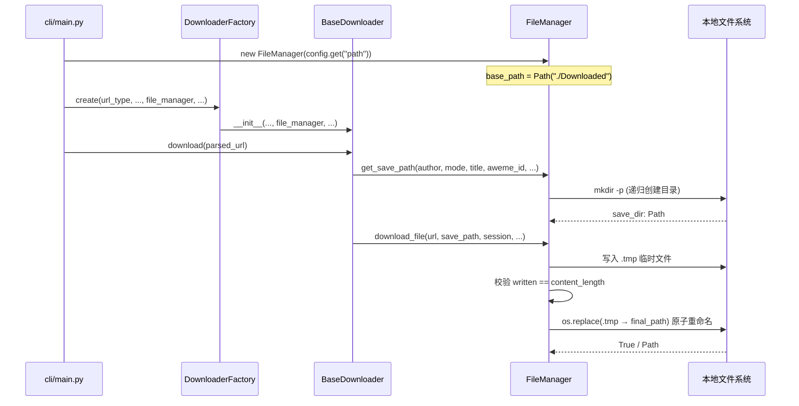
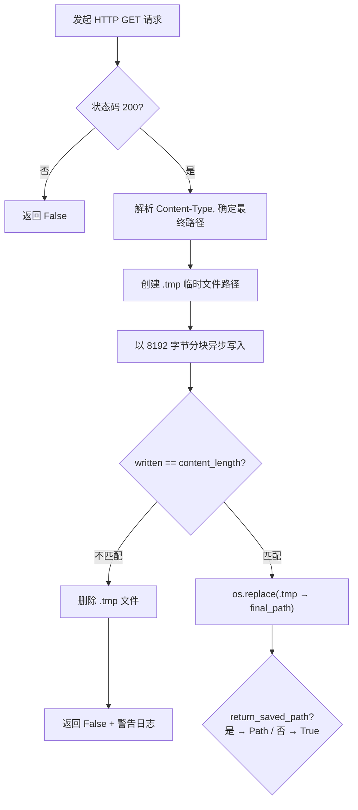

**FileManager** 是本项目中负责本地文件系统交互的核心组件，承担两大职责：**目录结构构建**与**异步文件下载**。它作为 `storage` 层唯一的 I/O 网关，被所有下载器（`BaseDownloader`、`MusicDownloader`、`TranscriptManager`）共享依赖——下载器只关心"把哪个 URL 的内容存到哪个路径"，而路径的安全化、目录的自动创建、下载过程中的原子写入与完整性校验，全部由 FileManager 透明地完成。

Sources: [storage/__init__.py](storage/__init__.py#L1-L5), [storage/file_manager.py](storage/file_manager.py#L1-L10)

## 架构定位：下载流水线中的 I/O 层

在整体数据流中，FileManager 处于"API 数据获取"与"本地持久化"的衔接位置。下面的 Mermaid 图展示了它在一次典型下载中的调用链路：

> **前置概念**：`BaseDownloader._download_aweme_assets()` 方法是所有资产下载的编排入口，它会调用 `FileManager.get_save_path()` 确定存储目录，然后对每个资产（视频、封面、音乐、头像等）分别调用 `FileManager.download_file()` 完成写入。`DownloaderFactory` 在创建下载器实例时将同一个 `FileManager` 对象注入到所有下载器中。

`FileManager` 在 `cli/main.py` 中被实例化，其 `base_path` 由配置文件的 `path` 字段决定（默认 `"./Downloaded/"`）。随后通过 `DownloaderFactory.create()` 注入到对应的下载器中，整个生命周期与一次 `download_url` 调用绑定。

Sources: [cli/main.py](cli/main.py#L38-L86), [core/downloader_factory.py](core/downloader_factory.py#L22-L42)

## 路径构建：`get_save_path` 的目录层级规则

`get_save_path` 方法将五个参数映射为一个具体的本地目录路径，其构建逻辑遵循严格的层级规则：

| 参数 | 作用 | 是否必须 | 来源示例 |
|------|------|----------|----------|
| `author_name` | 作者名，作为一级子目录 | ✅ 是 | `aweme_data["author"]["nickname"]` |
| `mode` | 下载模式，作为二级子目录 | ❌ 可选 | `"post"`, `"like"`, `"music"` 等 |
| `aweme_title` | 作品标题，参与文件夹命名 | ❌ 可选 | `aweme_data["desc"]` |
| `aweme_id` | 作品 ID，确保文件夹唯一性 | ❌ 可选 | `"7389xxxxx"` |
| `folderstyle` | 是否按作品创建独立文件夹 | ❌ 默认 `True` | `config.get("folderstyle")` |
| `download_date` | 日期前缀 | ❌ 可选 | `"2024-12-25"` |

当 `folderstyle=True` 且同时提供了 `aweme_title` 和 `aweme_id` 时，会为每个作品创建一个独立子目录，命名格式为 `{date_prefix}{safe_title}_{aweme_id}`。**注意**：所有用户输入（作者名、标题）都会通过 `sanitize_filename()` 净化，移除 `<>:"/\|?*#` 等非法字符并将长度截断至 80 字符。

最终生成的路径遵循以下三种模式之一：

| 场景 | 路径模板 | 示例 |
|------|----------|------|
| 有 mode + folderstyle | `base_path/作者/模式/日期_标题_ID/` | `Downloaded/张三/post/2024-12-25_我的视频_7389xxx/` |
| 有 mode，无 folderstyle | `base_path/作者/模式/` | `Downloaded/张三/post/` |
| 无 mode | `base_path/作者/` | `Downloaded/张三/` |

无论哪种路径模式，方法末尾都会调用 `save_dir.mkdir(parents=True, exist_ok=True)` 确保目录存在，返回一个 `Path` 对象供调用方拼接具体的文件名。

Sources: [storage/file_manager.py](storage/file_manager.py#L26-L48), [utils/validators.py](utils/validators.py#L14-L27)

## 异步下载：`download_file` 的原子写入与完整性校验

`download_file` 是 FileManager 最核心的异步方法，它封装了从 HTTP 请求到本地落盘的完整流程。其设计包含三个关键机制：**会话生命周期管理**、**原子写入**和**大小校验**。

### 会话管理策略

方法接受一个可选的 `aiohttp.ClientSession` 参数。当调用方（通常是 `BaseDownloader`）传入已存在的 session 时，FileManager 不会关闭它——这允许在批量下载中复用同一个 TCP 连接池。当未传入 session 时，方法会自行创建一个携带默认请求头（`User-Agent`、`Referer`、`Accept`）的临时 session，并在 `finally` 块中关闭，避免资源泄漏。

Sources: [storage/file_manager.py](storage/file_manager.py#L50-L118)

### 原子写入流程

下载过程采用 **"先写临时文件，后原子重命名"** 的策略，确保在任何时刻断点或异常都不会产生不完整的最终文件：

关键实现细节：临时文件路径通过 `save_path.with_suffix(save_path.suffix + ".tmp")` 生成，例如目标为 `video.mp4` 时，临时文件为 `video.mp4.tmp`。下载完成后通过 `os.replace()` 执行原子重命名（在同一文件系统上是原子操作）。如果过程中发生任何异常，`except` 块会清理临时文件并返回 `False`。

Sources: [storage/file_manager.py](storage/file_manager.py#L72-L118)

### Content-Type 路径修正

`download_file` 支持通过 `prefer_response_content_type` 参数让响应的 `Content-Type` 决定文件扩展名。这在**图文下载场景**中尤为重要：抖音图片 URL 的扩展名不一定准确（可能是 `.webp` 但实际返回 `.jpeg`），通过比对 `Content-Type` 与预定义映射表 `_IMAGE_CONTENT_TYPE_SUFFIXES`，可以自动修正保存路径的扩展名。

该方法通过内部类方法 `_resolve_save_path_from_content_type` 实现：当 `prefer_response_content_type=False` 时直接返回原始路径（默认行为）；为 `True` 时，解析响应头中的 `Content-Type`，去掉 `;` 后的参数部分，匹配映射表中的后缀。如果不匹配任何已知图片类型（例如视频的 `video/mp4`），同样返回原始路径不做修改。

Sources: [storage/file_manager.py](storage/file_manager.py#L120-L140)

## 文件存在性检查：去重与增量下载的基石

FileManager 提供两个轻量级的文件状态查询方法：

**`file_exists(file_path)`** —— 不仅仅检查 `Path.exists()`，还额外验证 `st_size > 0`，将空文件视为不存在。这个设计是有意的：某些下载失败场景可能残留大小为 0 的文件，跳过它们可以触发重新下载。`MusicDownloader._download_music_asset()` 在下载前会调用此方法实现本地去重。

**`get_file_size(file_path)`** —— 在 `file_exists` 的基础上返回文件字节数，不存在或出错时返回 0。两个方法都用 `try/except OSError` 包裹，防止并发场景下文件被删除后引发的竞态异常。

Sources: [storage/file_manager.py](storage/file_manager.py#L142-L152)

## 与下载器的集成模式

FileManager 在项目中有两种典型的集成调用模式：

### 模式一：BaseDownloader 的标准化资产下载

`BaseDownloader._download_aweme_assets()` 是视频/图文下载的核心编排方法。它首先调用 `get_save_path()` 确定作品的存储目录，然后为每种资产类型（视频主体 `.mp4`、封面 `_cover.jpg`、音乐 `_music.mp3`、头像 `_avatar.jpg`、元数据 `_data.json`）分别拼接文件名并调用 `_download_with_retry()`，后者内部委托给 `FileManager.download_file()`。所有资产共享同一个 `save_dir`，形成 `{date}_{desc}_{aweme_id}/` 目录下的完整文件集合。

Sources: [core/downloader_base.py](core/downloader_base.py#L259-L446)

### 模式二：MusicDownloader 的独立音乐下载

`MusicDownloader._download_music_asset()` 展示了另一种路径构建方式。当音乐详情 API 能直接返回音频 URL 时，它使用 `music_{id}` 作为 record_id 调用 `get_save_path()`，然后在保存前通过 `file_exists()` 检查文件是否已存在。如果已存在则直接返回 `True`，跳过整个下载流程——这是**增量下载**机制在文件层面的直接体现。

Sources: [core/music_downloader.py](core/music_downloader.py#L65-L156)

### 关键参数传递总结

下表总结了 `download_file` 在实际调用中的参数组合差异：

| 调用场景 | `session` | `headers` | `prefer_response_content_type` | `return_saved_path` |
|----------|-----------|-----------|-------------------------------|---------------------|
| 视频主体下载 | 复用 API session | 带签名 headers | `False` | `False` |
| 图文图片下载 | 复用 API session | 默认 UA headers | **`True`** | **`True`** |
| 封面/头像下载 | 复用 API session | 默认 UA headers | `False` | `False` |
| 音乐文件下载 | 复用 API session | 默认 UA headers | `False` | `False` |

图文图片是唯一同时启用 `prefer_response_content_type` 和 `return_saved_path` 的场景，因为 Content-Type 修正可能导致最终路径与预设路径不同，需要返回实际路径以正确记录到清单（Manifest）中。

Sources: [core/downloader_base.py](core/downloader_base.py#L337-L355), [core/downloader_base.py](core/downloader_base.py#L449-L482)

## 测试覆盖：原子写入与异常场景验证

项目的测试文件 `tests/test_file_manager.py` 覆盖了 FileManager 的关键行为：

| 测试用例 | 验证的行为 | 核心断言 |
|----------|-----------|----------|
| `test_file_exists_returns_false_for_missing` | 不存在的文件返回 `False` | `fm.file_exists(path) is False` |
| `test_file_exists_returns_false_for_empty` | 空（0 字节）文件返回 `False` | `fm.file_exists(path) is False` |
| `test_file_exists_returns_true_for_non_empty` | 有内容的文件返回 `True` | `fm.file_exists(path) is True` |
| `test_get_file_size_returns_0_for_missing` | 不存在的文件大小为 0 | `fm.get_file_size(path) == 0` |
| `test_get_save_path_creates_directories` | 路径构建并自动创建目录 | `path.exists()` + 路径包含各组件 |
| `test_download_file_atomic_write` | 正常下载后文件内容正确、无残留临时文件 | 内容匹配 + `.tmp` 不存在 |
| `test_download_file_size_mismatch_cleans_up` | 大小不匹配时清理临时文件并返回 `False` | 最终文件不存在 + `.tmp` 不存在 |

其中两个异步测试用例通过 mock `aiohttp.ClientSession` 验证了原子写入的核心保证：成功时 `os.replace` 完成重命名、大小不匹配时 `tmp_path.unlink` 清理残留。这确保了下载过程中即使出现网络中断或数据截断，本地文件系统也不会留下不完整的文件。

Sources: [tests/test_file_manager.py](tests/test_file_manager.py#L1-L100)

---

**相关阅读**：FileManager 的路径输出最终会被 [元数据与下载清单（Manifest）的写入与用途](22-yuan-shu-ju-yu-xia-zai-qing-dan-manifest-de-xie-ru-yu-yong-tu) 中的 `MetadataHandler` 消费，生成结构化的下载记录。去重判断则同时依赖本模块的 `file_exists()` 与 [SQLite 数据库设计与去重、增量下载支持](20-sqlite-shu-ju-ku-she-ji-yu-qu-zhong-zeng-liang-xia-zai-zhi-chi) 中的数据库查询，形成文件系统与数据库的双重校验体系。