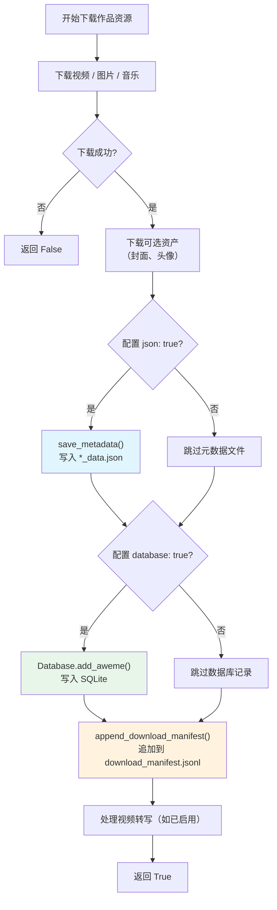

本项目在每次成功下载一个作品后，会产出两种文件化记录：**单条元数据 JSON** 和**全局下载清单（Manifest）**。它们由 `MetadataHandler` 类统一管理，分别在下载器的资源保存流程中被调用，为后续的去重校验、增量下载和离线检索提供结构化数据支撑。本文将详细讲解这两层数据的写入时机、数据结构、并发安全保障以及它们在整体架构中的角色。

Sources: [metadata_handler.py](storage/metadata_handler.py#L1-L55)

## MetadataHandler 类概览

`MetadataHandler` 是 `storage` 包的三个核心组件之一，与 [Database](20-sqlite-shu-ju-ku-she-ji-yu-qu-zhong-zeng-liang-xia-zai-zhi-chi) 和 [FileManager](21-wen-jian-guan-li-qi-filemanager-de-lu-jing-gou-jian-yu-yi-bu-xia-zai) 协同工作。它的职责非常聚焦——**JSON 格式的文件读写**——不涉及数据库操作。整个类只有三个异步方法：

| 方法 | 功能简述 | 写入模式 | 调用时机 |
|------|---------|---------|---------|
| `save_metadata()` | 将完整作品数据保存为独立 JSON 文件 | 覆盖写（`"w"`） | 配置项 `json: true` 时 |
| `append_download_manifest()` | 向清单追加一条下载记录 | 追加写（`"a"`） | 每次下载成功后**必定**调用 |
| `load_metadata()` | 读取已有 JSON 元数据文件 | 只读 | 对外提供的读取接口 |

Sources: [metadata_handler.py](storage/metadata_handler.py#L13-L55)

类的构造函数中初始化了一个 `asyncio.Lock()` 实例 `_manifest_lock`，这是清单追加写入的并发安全关键——在多个协程同时完成下载时，锁确保 `download_manifest.jsonl` 文件不会被并发写入损坏。而 `save_metadata()` 使用覆盖写模式（每条作品写独立文件），因此不需要加锁。

Sources: [metadata_handler.py](storage/metadata_handler.py#L14-L15)

## 两种持久化产物的数据结构

### 单条元数据（`*_data.json`）

当配置文件中 `json` 字段为 `true`（这也是默认值）时，下载器会将抖音 API 返回的**完整 `aweme_data` 字典**直接序列化为 JSON 文件，保存在该作品的下载目录中，文件名格式为 `{发布日期}_{描述}_{aweme_id}_data.json`。

```json
{
  "aweme_id": "7123456789XXXXXXXX",
  "desc": "视频描述文案",
  "author": { "nickname": "作者昵称", "uid": "作者ID" },
  "video": { "play_addr": { "url_list": ["..."] } },
  "create_time": 1700000000,
  "text_extra": [...],
  ...
}
```

这是一个"原始快照"——保留了 API 返回的全部字段（包括视频 URL、作者信息、标签列表、创建时间等），可用于离线数据分析和二次开发。由于保存的是完整的原始数据，文件体积可能较大。

Sources: [downloader_base.py](core/downloader_base.py#L390-L393)

### 下载清单（`download_manifest.jsonl`**

清单文件采用 **JSONL 格式**（每行一条 JSON 记录），固定命名为 `download_manifest.jsonl`，存储在下载根目录（即 `FileManager.base_path`，默认为 `./Downloaded/`）下。每条记录是一个精炼的结构，只提取了与文件管理相关的关键字段：

| 字段 | 类型 | 说明 |
|------|------|------|
| `recorded_at` | string | Manifest 写入时间（ISO 8601 格式，由 `MetadataHandler` 自动注入） |
| `date` | string | 作品发布日期（`YYYY-MM-DD` 格式） |
| `aweme_id` | string | 作品唯一标识 |
| `author_name` | string | 作者昵称 |
| `desc` | string | 作品描述文案 |
| `media_type` | string | 媒体类型：`video`、`gallery` 或 `music` |
| `tags` | list[string] | 从 `text_extra`、`cha_list` 和描述文本中提取的标签列表 |
| `file_names` | list[string] | 本次下载产生的所有文件名（不含目录） |
| `file_paths` | list[string] | 文件相对于下载根目录的**相对路径** |
| `publish_timestamp` | int | 作品发布时间戳（仅在原始数据中有时写入） |

一条典型的清单记录如下：

```json
{"recorded_at":"2024-11-15T14:30:00","date":"2024-11-14","aweme_id":"7123456789XXXXXXXX","author_name":"创作者昵称","desc":"视频描述文案","media_type":"video","tags":["生活","美食"],"file_names":["2024-11-14_视频描述_7123456789XXXXXXXX.mp4","2024-11-14_视频描述_7123456789XXXXXXXX_cover.jpg"],"file_paths":["创作者昵称/post/2024-11-14_视频描述_7123456789XXXXXXXX/2024-11-14_视频描述_7123456789XXXXXXXX.mp4"],"publish_timestamp":1700000000}
```

`file_paths` 中的路径由 `_to_manifest_path()` 方法生成，它使用 `Path.relative_to()` 将绝对路径转换为相对于下载根目录的相对路径，保证清单的可移植性。

Sources: [downloader_base.py](core/downloader_base.py#L411-L425), [downloader_base.py](core/downloader_base.py#L700-L704), [metadata_handler.py](storage/metadata_handler.py#L26-L45)

## 写入流程在下载管线中的位置

下面的流程图展示了元数据和清单在下载管线中的确切写入位置：



**关键要点**：清单写入（橙色节点）是下载成功后的**必经步骤**，不受任何配置项控制；而元数据 JSON 文件（蓝色节点）受 `json` 配置项开关控制；SQLite 数据库记录（绿色节点）受 `database` 配置项控制。三者共同构成了项目的三层持久化体系。

Sources: [downloader_base.py](core/downloader_base.py#L376-L425)

## 三层持久化体系的对比

为了更清晰地理解 MetadataHandler 管理的两层文件与 SQLite 数据库的关系，下表从多个维度进行对比：

| 维度 | 单条元数据 JSON | 下载清单 Manifest | SQLite 数据库 |
|------|---------------|------------------|-------------|
| **存储位置** | 各作品的下载子目录 | 下载根目录 | `dy_downloader.db` 文件 |
| **文件格式** | `.json`（标准 JSON） | `.jsonl`（JSON Lines） | SQLite 二进制 |
| **数据量级** | 完整 API 响应（大） | 精炼摘要（小） | 结构化索引字段 |
| **写入控制** | `json` 配置项 | 始终写入 | `database` 配置项 |
| **并发安全** | 无需加锁（独立文件） | `asyncio.Lock` | SQLite 自身锁 |
| **主要用途** | 离线数据分析、二次开发 | 下载审计、文件索引 | 去重、增量下载 |
| **可移植性** | 随作品目录一起移动 | 相对路径，可移植 | 需数据库工具查看 |

Sources: [metadata_handler.py](storage/metadata_handler.py#L1-L55), [database.py](storage/database.py#L27-L40)

## 并发安全设计：Manifest 锁机制

在批量下载场景中，多个协程可能几乎同时完成下载并尝试向同一个 `download_manifest.jsonl` 文件追加记录。`MetadataHandler` 使用 `asyncio.Lock()` 确保同一时刻只有一个协程能操作清单文件：

```python
async with self._manifest_lock:
    async with aiofiles.open(manifest_path, "a", encoding="utf-8") as f:
        await f.write(json.dumps(normalized_record, ensure_ascii=False))
        await f.write("\n")
```

这里采用**嵌套异步上下文管理器**：外层 `_manifest_lock` 控制协程级别的互斥，内层 `aiofiles.open` 实现非阻塞文件追加。注意 `save_metadata()` 不需要锁——每个作品写独立的 JSON 文件，不存在并发冲突。

选择 JSONL 而非标准 JSON 数组格式也是出于并发考虑：追加一行只需 `open("a")` + `write()`，无需读取-修改-写入整个文件，天然适合高并发追加场景。

Sources: [metadata_handler.py](storage/metadata_handler.py#L35-L45)

## 音乐下载中的 Manifest 差异

`MusicDownloader` 同样使用 `MetadataHandler` 写入清单，但其记录结构与视频/图文下载略有不同。音乐类型的清单记录中 `media_type` 固定为 `"music"`，`desc` 字段存储音乐标题而非视频描述，且通常只有一个文件条目。

Sources: [music_downloader.py](core/music_downloader.py#L144-L155)

## Manifest 的实际用途

### 下载审计与回溯

清单文件提供了完整的下载历史记录，包含每条作品的发布日期、作者、标签和文件路径。通过简单的命令行工具即可检索：

```bash
# 查看所有下载记录
cat download_manifest.jsonl | python3 -m json.tool --no-ensure-ascii

# 按作者筛选
grep "某作者昵称" download_manifest.jsonl

# 统计下载量
wc -l download_manifest.jsonl
```

### 文件索引与迁移参考

`file_paths` 字段使用相对路径，这意味着即使下载目录被整体移动到其他位置，清单中的路径仍然有效，可以作为文件索引使用。

### 与 SQLite 数据库的互补

清单与 SQLite 数据库记录的信息有重叠但不完全相同。SQLite 侧重于**去重查询**（通过 `aweme_id` 索引快速判断是否已下载），而 Manifest 侧重于**文件级审计**（清晰记录每次下载产生了哪些文件）。两者互为补充——数据库提供高效的查询能力，清单提供人类可读的完整记录。

Sources: [database.py](storage/database.py#L81-L88)

## 相关阅读

- **上游模块**：[SQLite 数据库设计与去重、增量下载支持](20-sqlite-shu-ju-ku-she-ji-yu-qu-zhong-zeng-liang-xia-zai-zhi-chi) — 理解数据库层面的去重机制
- **上游模块**：[文件管理器（FileManager）的路径构建与异步下载](21-wen-jian-guan-li-qi-filemanager-de-lu-jing-gou-jian-yu-yi-bu-xia-zai) — 理解文件路径如何构建，Manifest 中的路径从何而来
- **调用方**：[基础下载器（BaseDownloader）的资产下载与去重逻辑](9-ji-chu-xia-zai-qi-basedownloader-de-zi-chan-xia-zai-yu-qu-zhong-luo-ji) — 元数据写入在整个下载流程中的位置
- **配置控制**：[默认配置字典（default_config）全字段释义](24-mo-ren-pei-zhi-zi-dian-default_config-quan-zi-duan-shi-yi) — `json` 和 `database` 配置项的详细说明