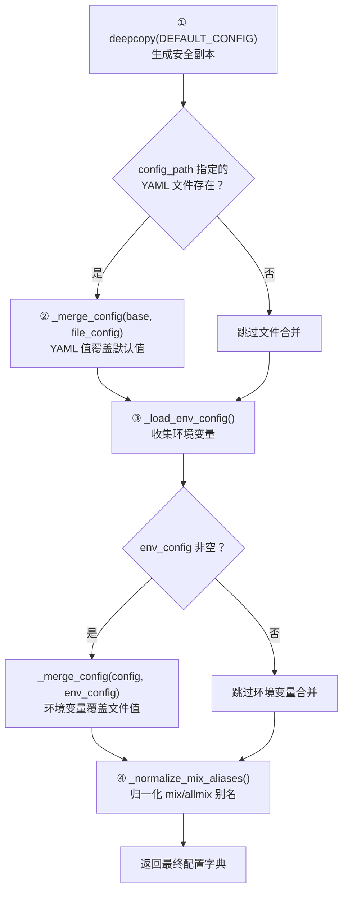
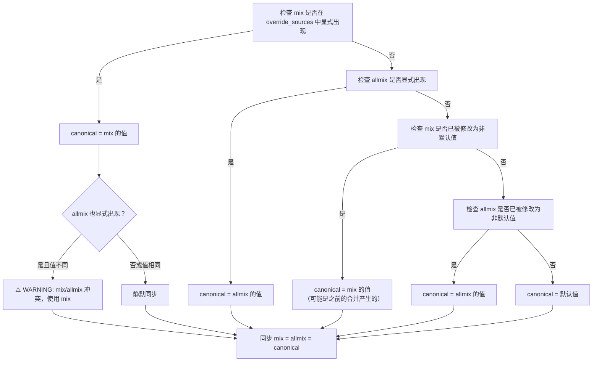
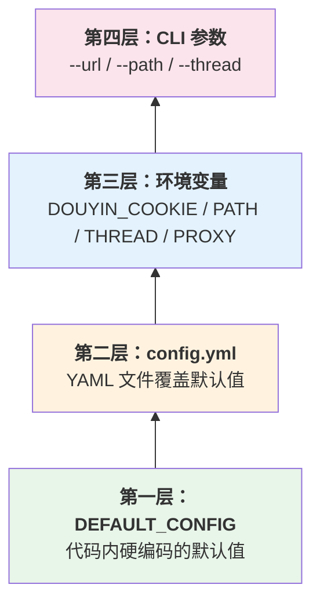

`ConfigLoader` 是本工具配置系统的核心入口。它以**三层优先级**——默认配置字典 → YAML 配置文件 → 环境变量——依次合并，最终产出一份完整的运行时配置。这一设计让工具在"零配置即可运行"与"灵活覆盖任意字段"之间取得了平衡。本文将深入解析合并的执行顺序、递归合并策略、环境变量的映射与类型转换机制，以及针对 `mix`/`allmix` 兼容别名的归一化处理。

Sources: [config_loader.py](config/config_loader.py#L16-L36)

## 三层配置的优先级与执行顺序

`ConfigLoader.__init__` 在实例化时自动调用 `_load_config`，按固定顺序执行三层合并：



关键要点：**优先级自底向上递增**——环境变量的值始终能覆盖文件中的同名字段，文件的值始终能覆盖默认配置。这意味着用户可以在不修改 `config.yml` 的前提下，仅通过环境变量临时调整行为。

Sources: [config_loader.py](config/config_loader.py#L21-L36)

## 递归深度合并策略

合并逻辑由 `_merge_config` 方法实现，其核心行为是**递归深度合并**：当 base 和 override 中同一 key 对应的值都是 `dict` 时，不直接替换，而是递归合并子字典；否则用 override 的值直接覆盖。

```python
def _merge_config(self, base, override):
    result = base.copy()
    for key, value in override.items():
        if key in result and isinstance(result[key], dict) and isinstance(value, dict):
            result[key] = self._merge_config(result[key], value)
        else:
            result[key] = value
    return result
```

这一策略的实际效果可以通过嵌套配置字段 `progress` 来观察：

| 合并阶段 | `progress.quiet_logs` 值 | 说明 |
|---|---|---|
| DEFAULT_CONFIG | `True` | 默认启用静默日志 |
| YAML 文件 `{progress: {quiet_logs: false}}` | `False` | 仅覆盖 `quiet_logs`，不影响 `progress` 下其他未来可能新增的字段 |
| 环境变量 | （无对应环境变量） | 保持 `False` 不变 |

这种递归合并保证了**顶层 key 的粒度灵活可控**：用户无需在 YAML 中复写完整的嵌套字典，只需给出需要修改的叶节点即可。同时，`base.copy()` 浅拷贝 + 递归替换的组合确保了未被覆盖的分支仍然引用默认值，不会产生不必要的对象复制开销。

Sources: [config_loader.py](config/config_loader.py#L38-L51)

## 环境变量映射与类型安全

`_load_env_config` 将四个特定的环境变量映射到配置顶层 key，并内置类型转换与容错处理：

| 环境变量 | 配置 key | 类型转换 | 容错行为 |
|---|---|---|---|
| `DOUYIN_COOKIE` | `cookie` | 字符串直传 | 无需转换 |
| `DOUYIN_PATH` | `path` | 字符串直传 | 无需转换 |
| `DOUYIN_THREAD` | `thread` | `int()` | 转换失败时记录 WARNING 并忽略 |
| `DOUYIN_PROXY` | `proxy` | 字符串直传 | 无需转换 |

`DOUYIN_THREAD` 是唯一需要类型转换的环境变量。`_load_env_config` 用 `try/except` 包裹 `int()` 转换，当值无法转为整数时，该方法**不会向返回字典中写入该 key**，因此默认值或文件中的值将被保留。这一设计保证了即使环境变量配置错误，工具仍能以合理配置运行。

```python
# 当 DOUYIN_THREAD="not_a_number" 时
# _load_env_config 返回 {} 中不包含 "thread" key
# → 合并阶段不触发覆盖 → 保留 DEFAULT_CONFIG 中的默认值 5
```

Sources: [config_loader.py](config/config_loader.py#L53-L69), [test_config_validation.py](tests/test_config_validation.py#L22-L27)

## mix/allmix 别名归一化机制

`_normalize_mix_aliases` 解决了一个向后兼容性问题：`number` 和 `increase` 两个配置节中，`mix` 与 `allmix` 是同一语义的两种命名。归一化逻辑确保无论用户在 YAML 中使用哪个名称，最终两个 key 都会被同步为相同的规范值。

### 判定优先级

归一化遵循以下优先级决策链：



**"显式出现"**的定义是关键：`_is_key_explicit_in_sources` 检查 override_sources（即文件配置和环境变量配置）中是否直接包含了该 key。如果 `mix` 只是在 DEFAULT_CONFIG 中定义而未被任何覆盖源提及，则不算"显式出现"。这防止了默认值之间的虚假冲突。

### 测试验证矩阵

以下测试用例来自 `test_config_loader_normalizes_mix_aliases`，覆盖了主要场景：

| number 配置 | increase 配置 | 期望 mix 值 | 期望 allmix 值 | 冲突警告 |
|---|---|---|---|---|
| `{mix: 9}` | `{mix: True}` | 9 | 9 | ❌ 无 |
| `{allmix: 7}` | `{allmix: True}` | 7 | 7 | ❌ 无 |
| `{mix: 8, allmix: 8}` | `{mix: False, allmix: False}` | 8 | 8 | ❌ 无 |
| `{mix: 5, allmix: 3}` | `{mix: False, allmix: True}` | 5 | 5 | ⚠️ 有 |
| `{}` | `{}` | 0 | 0 | ❌ 无 |

Sources: [config_loader.py](config/config_loader.py#L71-L151), [test_config_loader.py](tests/test_config_loader.py#L283-L327)

## 运行时更新与 CLI 参数覆盖

除了初始化阶段的三层合并，`ConfigLoader.update()` 方法支持在运行时通过关键字参数动态修改配置。CLI 入口 `main_async` 正是利用这一机制，将命令行参数覆盖到已加载的配置之上：

```python
# cli/main.py 中的 CLI 参数覆盖
if args.url:
    config.update(link=config.get('link', []) + [url])
if args.path:
    config.update(path=args.path)
if args.thread:
    config.update(thread=args.thread)
```

`update` 方法的合并逻辑与 `_merge_config` 类似但更轻量：当已存在的 key 对应 `dict` 值时，执行一层 `dict.update`（注意：**不递归**）；否则直接赋值。对于不存在于当前配置中的新 key，也会直接添加。

Sources: [config_loader.py](config/config_loader.py#L153-L161), [main.py](cli/main.py#L142-L152)

## 完整优先级总结

将所有覆盖来源纳入考量，最终的优先级从低到高排列如下：



| 优先级 | 来源 | 覆盖范围 | 合并方式 |
|---|---|---|---|
| 最低 | `DEFAULT_CONFIG` | 全部字段 | `deepcopy` 避免污染 |
| ↑ | `config.yml` | 用户自定义字段 | 递归深度合并 |
| ↑ | 环境变量 | 4 个顶层字段 | 整值替换 |
| 最高 | CLI 参数 | `link`、`path`、`thread` | `update()` 方法 |

## 安全防护：深拷贝与实例隔离

`_load_config` 的第一步是 `deepcopy(DEFAULT_CONFIG)`，这并非多余操作。测试 `test_nested_defaults_do_not_leak_between_loader_instances` 证明了其必要性：如果两个 `ConfigLoader` 实例共享同一个嵌套字典引用，对实例 A 的 `update` 操作会污染实例 B 的配置。`deepcopy` 从根源上消除了这一风险，确保每个实例的配置字典完全独立。

Sources: [config_loader.py](config/config_loader.py#L22), [test_config_loader.py](tests/test_config_loader.py#L266-L280)

## 延伸阅读

- 了解 DEFAULT_CONFIG 中每个字段的完整含义与默认值，参见 [默认配置字典（default_config）全字段释义](24-mo-ren-pei-zhi-zi-dian-default_config-quan-zi-duan-shi-yi)
- 了解配置文件的全量字段与典型场景示例，参见 [配置文件详解：config.yml 全字段说明与典型场景示例](3-pei-zhi-wen-jian-xiang-jie-config-yml-quan-zi-duan-shuo-ming-yu-dian-xing-chang-jing-shi-li)
- 了解 CLI 参数如何映射到配置系统，参见 [命令行参数与运行模式](4-ming-ling-xing-can-shu-yu-yun-xing-mo-shi)