`default_config` 是整个抖音批量下载工具的**配置基石**——它定义在 [default_config.py](config/default_config.py#L1-L55) 中，以一个纯 Python 字典呈现，涵盖了从下载路径到并发控制、从内容过滤到浏览器兜底采集的**全部可配置行为**。当你未提供任何 `config.yml` 文件或环境变量时，系统将完全依赖这份默认字典运行；当你提供了自定义配置后，`ConfigLoader` 会以**深度合并（deep merge）**策略将用户配置覆盖到默认值之上，未被覆盖的键值对始终保持默认行为。

这种设计的好处在于：**你永远不需要写出完整配置文件**。只需覆盖你想修改的那几个字段，其余自动回退到 `default_config` 中的默认值。整个配置合并、环境变量覆盖和校验流程在 [配置加载器的合并策略与环境变量覆盖](23-pei-zhi-jia-zai-qi-de-he-bing-ce-lue-yu-huan-jing-bian-liang-fu-gai) 中有详细说明。

Sources: [default_config.py](config/default_config.py#L1-L55), [config_loader.py](config/config_loader.py#L21-L36)

## 配置结构总览

下面的 Mermaid 图展示了 `default_config` 的完整层级结构。顶层为扁平的标量字段，中间包含若干嵌套字典（`number`、`increase`、`progress`、`transcript`、`browser_fallback`），每个叶子节点都标注了其数据类型与默认值。

```mermaid
graph TD
    DC["default_config"]
    DC --> path["path <code>str</code> = './Downloaded/'"]
    DC --> music["music <code>bool</code> = True"]
    DC --> cover["cover <code>bool</code> = True"]
    DC --> avatar["avatar <code>bool</code> = True"]
    DC --> json["json <code>bool</code> = True"]
    DC --> start_time["start_time <code>str</code> = ''"]
    DC --> end_time["end_time <code>str</code> = ''"]
    DC --> folderstyle["folderstyle <code>bool</code> = True"]
    DC --> mode["mode <code>list</code> = ['post']"]
    DC --> thread["thread <code>int</code> = 5"]
    DC --> retry_times["retry_times <code>int</code> = 3"]
    DC --> rate_limit["rate_limit <code>int</code> = 2"]
    DC --> proxy["proxy <code>str</code> = ''"]
    DC --> database["database <code>bool</code> = True"]
    DC --> database_path["database_path <code>str</code> = 'dy_downloader.db'"]
    DC --> auto_cookie["auto_cookie <code>bool</code> = False"]

    DC --> number["number <code>dict</code>"]
    number --> n1["post = 0"]
    number --> n2["like = 0"]
    number --> n3["allmix = 0"]
    number --> n4["mix = 0"]
    number --> n5["music = 0"]
    number --> n6["collect = 0"]
    number --> n7["collectmix = 0"]

    DC --> increase["increase <code>dict</code>"]
    increase --> i1["post = False"]
    increase --> i2["like = False"]
    increase --> i3["allmix = False"]
    increase --> i4["mix = False"]
    increase --> i5["music = False"]

    DC --> progress["progress <code>dict</code>"]
    progress --> quiet_logs["quiet_logs = True"]

    DC --> transcript["transcript <code>dict</code>"]
    transcript --> t1["enabled = False"]
    transcript --> t2["model = 'gpt-4o-mini-transcribe'"]
    transcript --> t3["output_dir = ''"]
    transcript --> t4["response_formats = ['txt','json']"]
    transcript --> t5["api_url = 'https://api.openai.com/...'"]
    transcript --> t6["api_key_env = 'OPENAI_API_KEY'"]
    transcript --> t7["api_key = ''"]

    DC --> browser_fallback["browser_fallback <code>dict</code>"]
    browser_fallback --> bf1["enabled = True"]
    browser_fallback --> bf2["headless = False"]
    browser_fallback --> bf3["max_scrolls = 240"]
    browser_fallback --> bf4["idle_rounds = 8"]
    browser_fallback --> bf5["wait_timeout_seconds = 600"]
```



Sources: [default_config.py](config/default_config.py#L3-L55)

## 顶层标量字段

以下表格逐条列出 `default_config` 中的所有顶层标量字段，包括其类型、默认值、用途说明以及在源码中的消费位置。

| 字段名 | 类型 | 默认值 | 释义 |
|--------|------|--------|------|
| `path` | `str` | `"./Downloaded/"` | **下载根目录**。所有通过工具下载的文件都以此为根路径，按作者名、下载模式、作品标题逐级建立子目录。传入 [FileManager](storage/file_manager.py#L22-L23) 的构造函数作为 `base_path`。 |
| `music` | `bool` | `True` | **是否下载视频的原声音乐**。为 `True` 时，下载每个视频后会额外保存一份 `_music.mp3` 文件（从 `aweme_data.music.play_url` 提取）。在 [downloader_base.py](core/downloader_base.py#L302-L315) 中控制此分支。 |
| `cover` | `bool` | `True` | **是否下载视频封面图**。为 `True` 时，下载每个视频后会额外保存一份 `_cover.jpg` 文件（从 `aweme_data.video.cover` 提取）。在 [downloader_base.py](core/downloader_base.py#L287-L300) 中控制。 |
| `avatar` | `bool` | `True` | **是否下载作者头像**。为 `True` 时，下载作品后额外保存一份 `_avatar.jpg`（从 `aweme_data.author.avatar_larger` 提取）。在 [downloader_base.py](core/downloader_base.py#L376-L388) 中控制。 |
| `json` | `bool` | `True` | **是否保存作品元数据 JSON**。为 `True` 时，下载作品后将完整的 `aweme_data` 字典以 `_data.json` 形式落盘。在 [downloader_base.py](core/downloader_base.py#L390-L393) 中通过 `MetadataHandler` 写入。 |
| `start_time` | `str` | `""` | **时间过滤起始日期**，格式为 `YYYY-MM-DD`。设置后，仅下载发布日期 ≥ 此值的作品。空字符串表示不限制。在 [downloader_base.py](core/downloader_base.py#L196-L223) 的 `_filter_by_time` 方法中与作品 `create_time` 时间戳比较。校验逻辑见 [config_loader.py](config/config_loader.py#L277-L285)。 |
| `end_time` | `str` | `""` | **时间过滤截止日期**，格式为 `YYYY-MM-DD`。设置后，仅下载发布日期 ≤ 此值的作品。与 `start_time` 配合使用，可框定任意时间窗口。 |
| `folderstyle` | `bool` | `True` | **是否为每个作品创建独立子文件夹**。为 `True` 时，路径格式为 `作者名/模式/日期_标题_ID/`；为 `False` 时，所有文件直接平铺在 `作者名/模式/` 目录下。在 [file_manager.py](storage/file_manager.py#L42-L45) 的 `get_save_path` 方法中生效。 |
| `mode` | `list[str]` | `["post"]` | **用户批量下载时激活的模式列表**。可选值为 `post`、`like`、`mix`、`music`、`collect`、`collectmix`。多个模式可同时启用，工具将依次执行。在 [user_downloader.py](core/user_downloader.py#L28) 中读取并遍历。各模式的详细说明见 [六种下载模式策略](15-liu-chong-xia-zai-mo-shi-ce-lue-post-like-mix-music-collect-collectmix)。 |
| `thread` | `int` | `5` | **并发工作线程数**。决定 `QueueManager` 的 `max_workers` 大小，即同时执行的异步下载任务数上限。同时传入 [QueueManager](cli/main.py#L43) 和 [BaseDownloader](core/downloader_base.py#L63-L64)。值必须 ≥ 1，否则校验时回退为默认值 5。 |
| `retry_times` | `int` | `3` | **单次下载失败后的最大重试次数**。传入 `RetryHandler` 的 `max_retries` 参数，配合指数退避策略使用。在 [cli/main.py](cli/main.py#L42) 和 [config_loader.py](config/config_loader.py#L266-L275) 中生效。值必须 ≥ 0。 |
| `rate_limit` | `int` | `2` | **每秒最大请求数**。传入 `RateLimiter` 的 `max_per_second` 参数，用于向抖音 API 发起请求前的节流控制，防止因请求过密被风控。在 [cli/main.py](cli/main.py#L41) 中创建 `RateLimiter` 时读取。 |
| `proxy` | `str` | `""` | **HTTP 代理地址**。传入 `DouyinAPIClient` 的 `proxy` 参数，所有 API 请求和文件下载都将通过此代理发出。格式示例：`"http://127.0.0.1:7890"`。空字符串表示直连。在 [cli/main.py](cli/main.py#L49) 中传入。也可通过环境变量 `DOUYIN_PROXY` 设置。 |
| `database` | `bool` | `True` | **是否启用 SQLite 数据库**。为 `True` 时，初始化 [Database](storage/database.py) 实例，用于记录已下载作品、支持去重和增量下载。为 `False` 时跳过数据库初始化，每次运行均重新下载所有内容。在 [cli/main.py](cli/main.py#L166-L170) 中控制。 |
| `database_path` | `str` | `"dy_downloader.db"` | **SQLite 数据库文件路径**。默认在当前工作目录下创建 `dy_downloader.db` 文件。可设为绝对路径或相对路径。在 [cli/main.py](cli/main.py#L167) 中读取。 |
| `auto_cookie` | `bool` | `False` | **是否自动加载本地 Cookie 文件**。为 `True` 时，`ConfigLoader` 会在配置文件目录、其上级目录、当前工作目录下依次搜索 `config/cookies.json` 或 `.cookies.json` 文件，自动加载为 Cookie 字典。搜索逻辑见 [config_loader.py](config/config_loader.py#L182-L224)。当 `cookie` 字段设为字符串 `"auto"` 时也会触发此行为。 |

Sources: [default_config.py](config/default_config.py#L3-L47), [downloader_base.py](core/downloader_base.py#L63-L64), [downloader_base.py](core/downloader_base.py#L287-L393), [file_manager.py](storage/file_manager.py#L26-L48), [cli/main.py](cli/main.py#L40-L49), [config_loader.py](config/config_loader.py#L53-L69), [config_loader.py](config/config_loader.py#L182-L224)

## number —— 各模式下载数量上限

`number` 是一个嵌套字典，为**每种下载模式**独立设定最大获取数量。值为 `0` 表示不限制（获取该模式下的全部作品）；值为正整数 `N` 时，仅获取前 `N` 条作品。

| 键名 | 默认值 | 对应模式 | 说明 |
|------|--------|----------|------|
| `post` | `0` | 用户作品 | 用户发布的视频/图文作品数量上限 |
| `like` | `0` | 用户点赞 | 用户点赞列表数量上限 |
| `allmix` | `0` | 全部合集 | （`mix` 的兼容别名，系统会自动同步） |
| `mix` | `0` | 合集 | 单个合集内的作品数量上限 |
| `music` | `0` | 音乐 | 以某首音乐为线索关联的作品数量上限 |
| `collect` | `0` | 收藏 | 当前账号收藏夹中的作品数量上限 |
| `collectmix` | `0` | 收藏合集 | 收藏夹中的合集作品数量上限 |

**内部实现**：在 [downloader_base.py](core/downloader_base.py#L225-L233) 的 `_limit_count` 方法中，配置值通过 `number_config.get(mode, 0)` 读取，当 `limit > 0` 时对作品列表执行切片 `aweme_list[:limit]`。当 `limit == 0` 时返回完整列表。各策略类（如 [base_strategy.py](core/user_modes/base_strategy.py#L65-L66)、[post_strategy.py](core/user_modes/post_strategy.py#L29)）中也直接读取对应模式的 `number` 值来控制分页循环的终止条件。

Sources: [default_config.py](config/default_config.py#L13-L21), [downloader_base.py](core/downloader_base.py#L225-L233), [base_strategy.py](core/user_modes/base_strategy.py#L65-L66)

## increase —— 增量下载开关

`increase` 同样是按模式拆分的嵌套字典，每个键对应一个布尔值，控制该模式是否启用**增量下载**。增量下载的核心逻辑是：如果数据库中已有该用户的历史下载记录，则仅获取比已有记录的**最新发布时间**更晚的作品，跳过已下载内容。

| 键名 | 默认值 | 说明 |
|------|--------|------|
| `post` | `False` | 用户作品模式是否增量下载 |
| `like` | `False` | 点赞模式是否增量下载 |
| `allmix` | `False` | 全部合集（`mix` 别名） |
| `mix` | `False` | 合集模式是否增量下载 |
| `music` | `False` | 音乐模式是否增量下载 |

**生效条件**：增量下载要求 `database` 必须为 `True`，因为系统需要从 SQLite 数据库中查询该用户已下载的最新作品时间戳。在 [base_strategy.py](core/user_modes/base_strategy.py#L68-L93) 中，当 `increase_enabled` 为 `True` 且 `self.downloader.database` 不为 `None` 时，先获取 `latest_time`，然后在分页遍历中仅保留 `create_time > latest_time` 的新作品，遇到已下载作品时立即终止分页。注意 `collect` 和 `collectmix` 模式未提供增量下载支持。

Sources: [default_config.py](config/default_config.py#L22-L28), [base_strategy.py](core/user_modes/base_strategy.py#L68-L93)

## progress —— 进度展示控制

`progress` 是一个小型嵌套字典，目前仅包含一个字段，用于控制下载过程中的控制台日志行为。

| 键名 | 类型 | 默认值 | 说明 |
|------|------|--------|------|
| `quiet_logs` | `bool` | `True` | **是否在进度条运行期间静默控制台日志**。为 `True` 时，下载过程中将控制台日志级别提升为 `CRITICAL`，避免大量日志触发 Rich 进度条反复重绘导致屏幕出现重复块；下载完成后恢复原始日志级别。可通过命令行参数 `--verbose` 或 `--show-warnings` 覆盖此设置。 |

在 [cli/main.py](cli/main.py#L176-L182) 中的处理逻辑为：先从配置读取 `quiet_logs` 值，然后与命令行参数取交集——只有当配置要求静默**且**用户未指定 `--verbose` 或 `--show-warnings` 时，才真正静默日志。

Sources: [default_config.py](config/default_config.py#L35-L37), [cli/main.py](cli/main.py#L176-L182)

## transcript —— 视频转写配置

`transcript` 是功能最丰富的嵌套字典，控制与 **OpenAI Whisper API** 的集成，用于将下载的视频自动转录为文字。默认为**关闭状态**（`enabled: False`），开启后会在每次视频下载完成后自动调用转写服务。

| 键名 | 类型 | 默认值 | 说明 |
|------|------|--------|------|
| `enabled` | `bool` | `False` | 是否启用视频转写功能。为 `False` 时 `TranscriptManager` 在 `process_video` 入口处直接跳过。 |
| `model` | `str` | `"gpt-4o-mini-transcribe"` | OpenAI 转写模型名称。在 [transcript_manager.py](core/transcript_manager.py#L33-L34) 中通过 `_model()` 方法读取。 |
| `output_dir` | `str` | `""` | 转写文件的输出根目录。为空字符串时，转写文件保存在视频所在目录；设为路径时，将镜像视频的相对目录结构到该路径下。见 [transcript_manager.py](core/transcript_manager.py#L61-L79)。 |
| `response_formats` | `list[str]` | `["txt", "json"]` | 转写结果的输出格式列表。`"txt"` 保存纯文本（`.transcript.txt`），`"json"` 保存完整 API 响应（`.transcript.json`）。在 [transcript_manager.py](core/transcript_manager.py#L36-L41) 中标准化为小写并去空。 |
| `api_url` | `str` | `"https://api.openai.com/v1/audio/transcriptions"` | OpenAI 兼容的转写 API 端点地址。可替换为自建服务或其他兼容端点。 |
| `api_key_env` | `str` | `"OPENAI_API_KEY"` | 存放 API Key 的**环境变量名**。系统优先从此环境变量读取密钥。 |
| `api_key` | `str` | `""` | 直接填写的 API Key（备选方案）。当 `api_key_env` 对应的环境变量不存在时使用此值。**不建议将密钥明文写入配置文件**，推荐使用环境变量。 |

密钥解析的优先级为：环境变量 `api_key_env` → 配置文件中的 `api_key` → 空（跳过转写）。完整流程见 [transcript_manager.py](core/transcript_manager.py#L43-L51)。

Sources: [default_config.py](config/default_config.py#L38-L46), [transcript_manager.py](core/transcript_manager.py#L27-L59)

## browser_fallback —— 浏览器兜底采集

`browser_fallback` 控制当抖音 API 分页受限（通常只能获取前 20 条左右）时，是否以及如何使用 Playwright 浏览器进行**兜底采集**。此功能仅在使用 `post` 模式（用户作品下载）时触发。

| 键名 | 类型 | 默认值 | 说明 |
|------|------|--------|------|
| `enabled` | `bool` | `True` | 是否启用浏览器兜底。为 `True` 时，当 API 分页返回的作品数量不足以覆盖目标数量，系统会启动 Playwright 浏览器滚动采集页面上的作品 ID。 |
| `headless` | `bool` | `False` | 浏览器是否以无头模式运行。为 `False` 时会弹出浏览器窗口，方便调试观察。 |
| `max_scrolls` | `int` | `240` | 浏览器页面向下滚动的最大次数。每次滚动加载更多作品，达到此上限后停止采集。 |
| `idle_rounds` | `int` | `8` | 连续多少次滚动未发现新作品后判定为"已到底部"并停止采集。用于提前终止，避免不必要的滚动。 |
| `wait_timeout_seconds` | `int` | `600` | 浏览器页面的整体等待超时时间（秒）。超过此时间强制结束采集。 |

在 [user_downloader.py](core/user_downloader.py#L177-L204) 的 `_recover_user_post_with_browser` 方法中，这些参数被逐一读取并传入 `api_client.collect_user_post_ids_via_browser`。当 `enabled` 为 `False` 时方法在入口处直接返回。关于浏览器兜底机制的详细分析见 [分页受限时的浏览器兜底采集机制](16-fen-ye-shou-xian-shi-de-liu-lan-qi-dou-di-cai-ji-ji-zhi)。

Sources: [default_config.py](config/default_config.py#L48-L54), [user_downloader.py](core/user_downloader.py#L177-L204)

## 配置字段与源码消费关系速查

为了方便快速定位某个字段的具体作用位置，下表汇总了每个字段与主要消费代码的映射关系。

| 配置字段 | 主要消费位置 | 说明 |
|----------|-------------|------|
| `path` | [FileManager](storage/file_manager.py#L22-L23) | 作为下载根目录 |
| `music` | [BaseDownloader._download_aweme_assets](core/downloader_base.py#L302) | 是否下载背景音乐 |
| `cover` | [BaseDownloader._download_aweme_assets](core/downloader_base.py#L287) | 是否下载封面图 |
| `avatar` | [BaseDownloader._download_aweme_assets](core/downloader_base.py#L376) | 是否下载作者头像 |
| `json` | [BaseDownloader._download_aweme_assets](core/downloader_base.py#L390) | 是否保存元数据 JSON |
| `start_time` / `end_time` | [BaseDownloader._filter_by_time](core/downloader_base.py#L196-L223) | 时间范围过滤 |
| `folderstyle` | [FileManager.get_save_path](storage/file_manager.py#L42-L45) | 每个作品是否单独建文件夹 |
| `mode` | [UserDownloader](core/user_downloader.py#L28) | 指定激活的下载模式列表 |
| `thread` | [QueueManager](core/downloader_base.py#L63-L64), [cli/main.py](cli/main.py#L43) | 并发工作线程数 |
| `retry_times` | [RetryHandler](cli/main.py#L42) | 最大重试次数 |
| `rate_limit` | [RateLimiter](cli/main.py#L41) | 每秒最大请求数 |
| `proxy` | [DouyinAPIClient](cli/main.py#L49) | HTTP 代理地址 |
| `database` | [cli/main.py](cli/main.py#L166-L170) | 是否启用 SQLite 数据库 |
| `database_path` | [Database](cli/main.py#L167) | 数据库文件路径 |
| `auto_cookie` | [ConfigLoader.get_cookies](config/config_loader.py#L182-L186) | 是否自动加载本地 Cookie |
| `number.*` | [BaseDownloader._limit_count](core/downloader_base.py#L228-L229), [base_strategy](core/user_modes/base_strategy.py#L65-L66) | 各模式数量上限 |
| `increase.*` | [base_strategy](core/user_modes/base_strategy.py#L68-L69) | 各模式增量下载开关 |
| `progress.quiet_logs` | [cli/main.py](cli/main.py#L176-L182) | 进度条运行时是否静默日志 |
| `transcript.*` | [TranscriptManager](core/transcript_manager.py#L27-L59) | 视频转写全流程配置 |
| `browser_fallback.*` | [UserDownloader._recover_user_post_with_browser](core/user_downloader.py#L183-L204) | 浏览器兜底采集参数 |

Sources: [default_config.py](config/default_config.py#L3-L55), [config_loader.py](config/config_loader.py#L1-L288)

## 实践建议

**最小化配置原则**：由于 `default_config` 已经提供了开箱即用的完整默认值，你的 `config.yml` 只需要覆盖与默认行为不同的字段即可。例如，如果你只想修改下载目录和启用增量下载，配置文件只需两行：

```yaml
path: "/data/douyin/"
increase:
  post: true
```

**环境变量覆盖**：`path`、`thread`、`proxy`、`cookie` 四个字段支持通过环境变量 `DOUYIN_PATH`、`DOUYIN_THREAD`、`DOUYIN_PROXY`、`DOUYIN_COOKIE` 直接覆盖，适合在 Docker 部署或 CI 环境中使用，无需创建配置文件。

**安全提示**：`transcript.api_key` 字段虽然支持直接填写密钥，但**强烈建议**使用环境变量（通过 `api_key_env` 指定的 `OPENAI_API_KEY`）来传递 API 密钥，避免将敏感信息写入配置文件或版本控制系统。

如需了解配置文件如何被加载、合并和校验的完整流程，请参阅 [配置加载器的合并策略与环境变量覆盖](23-pei-zhi-jia-zai-qi-de-he-bing-ce-lue-yu-huan-jing-bian-liang-fu-gai)。如需了解 `config.yml` 的实际编写示例，请参阅 [配置文件详解：config.yml 全字段说明与典型场景示例](3-pei-zhi-wen-jian-xiang-jie-config-yml-quan-zi-duan-shuo-ming-yu-dian-xing-chang-jing-shi-li)。