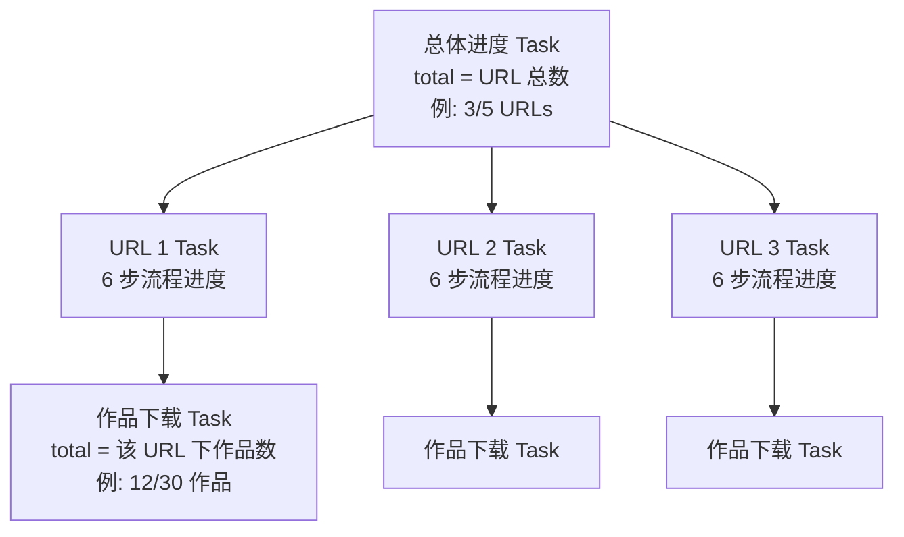
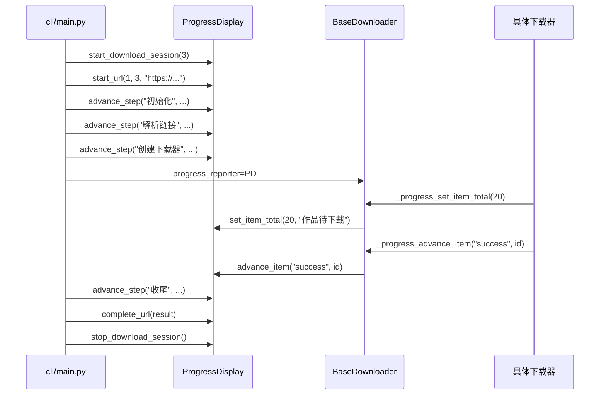
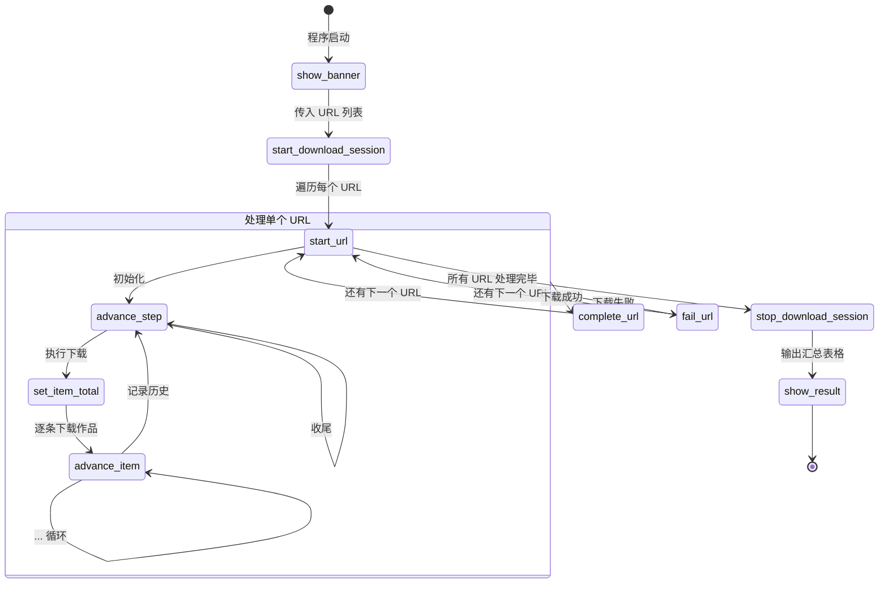

当你在终端运行抖音批量下载时，屏幕上那些旋转的加载动画、实时推进的进度条、以及下载结束后整齐的统计表格——这些全部由 `ProgressDisplay` 类统一编排。它基于 [Rich](https://rich.readthedocs.io/) 库构建，采用**三层嵌套任务模型**（总体 → URL → 作品）来呈现多 URL、多作品的批量下载进度，并通过 `ProgressReporter` 协议与下载器核心完全解耦。本文将带你理解这个进度系统的设计思路、API 分层、以及它与下载器之间的协作方式。

Sources: [progress_display.py](cli/progress_display.py#L1-L35)

## 设计目标：为什么需要 ProgressDisplay

批量下载场景的进度展示面临三个核心挑战。**第一**，用户可能一次提交多个 URL（例如用户主页、合集、音乐等），需要知道"总共几个 URL，当前处理到第几个"。**第二**，每个 URL 内部可能包含大量作品（一个用户主页可能有几百条视频），作品级别的逐条进度同样重要。**第三**，当只有一个 URL 时，总体进度如果只显示 `0/1 → 1/1` 的跳变，体验极差——用户希望总体进度直接映射到作品数量。

`ProgressDisplay` 用一个类同时解决了这三个问题，而且对下载器核心完全透明——下载器只看到一个 `ProgressReporter` 协议接口，不知道、也不需要知道终端用的是 Rich 还是 plain text。

Sources: [downloader_base.py](core/downloader_base.py#L21-L29), [progress_display.py](cli/progress_display.py#L19-L35)

## 三层任务模型

`ProgressDisplay` 在一个 Rich `Progress` 实例中管理三类 Task，自上而下形成嵌套的进度展示层级。



| 层级 | Task 变量 | 含义 | 进度单位 |
|------|-----------|------|----------|
| **总体进度** | `_overall_task_id` | 所有 URL 的整体完成情况 | URL 个数（或单 URL 时为作品数） |
| **URL 步骤** | `_url_task_id` | 单个 URL 的 6 步处理流程 | 固定 6 步 |
| **作品下载** | `_item_task_id` | 当前 URL 下的逐条作品下载 | 作品条数 |

Sources: [progress_display.py](cli/progress_display.py#L22-L35)

### 总体进度层

`start_download_session(total_urls)` 创建总体进度 Task，它的 `total` 等于用户提交的 URL 数量。每完成一个 URL（无论成功或失败），总体进度前进一步。这是一个宏观的"还剩几个链接要处理"的指示器。

Sources: [progress_display.py](cli/progress_display.py#L59-L71)

### URL 步骤层

每个 URL 的处理被固定拆分为 **6 个步骤**（由类常量 `_URL_STEP_TOTAL = 6` 定义）。从 `cli/main.py` 的 `download_url` 函数可以清晰地看到这 6 步的完整调用链路：

| 步骤序号 | 步骤名称 | 调用方法 | 语义 |
|----------|----------|----------|------|
| 1 | 初始化 | `advance_step("初始化", ...)` | 创建下载组件 |
| 2 | 解析链接 | `advance_step("解析链接", ...)` | 短链解析 + URL 解析 |
| 3 | 创建下载器 | `advance_step("创建下载器", ...)` | 工厂创建匹配的下载器 |
| 4 | 执行下载 | `advance_step("执行下载", ...)` | 下载器执行实际下载 |
| 5 | 记录历史 | `advance_step("记录历史", ...)` | 写入数据库 |
| 6 | 收尾 | `advance_step("收尾", ...)` | 汇报统计结果 |

`advance_step` 既更新 `completed` 计数，又更新 `description` 文本，因此用户看到的是进度条前进一步的同时，步骤描述也同步切换。而 `update_step` 只更新描述文本，不推进进度——用于"解析链接失败"这类需要更新提示但不希望前进计数的场景。

Sources: [main.py](cli/main.py#L39-L123), [progress_display.py](cli/progress_display.py#L142-L162)

### 作品下载层

当 URL 步骤进入"执行下载"阶段后，具体的下载器（`VideoDownloader`、`UserDownloader`、`MixDownloader`、`MusicDownloader`）会调用 `set_item_total` 和 `advance_item` 来驱动作品级别的进度条。每条作品完成下载后，状态会被归入三类之一：

| 状态 | 中文标签 | 描述列中的标识 |
|------|----------|---------------|
| `success` | 成功 | `S:` 计数器 |
| `failed` | 失败 | `F:` 计数器 |
| `skipped` | 跳过 | `K:` 计数器 |

作品进度条的 description 文本会实时更新为 `作品下载 S:5 F:1 K:2` 这样的格式，让用户一眼看到成功/失败/跳过的分布。`detail` 字段则显示最近一条作品的处理结果，例如 `最近: 成功 7123456789012345678`。

Sources: [progress_display.py](cli/progress_display.py#L201-L228), [progress_display.py](cli/progress_display.py#L274-L280)

## 单 URL 模式：总体进度的智能切换

当用户只提供一个 URL 时，如果总体进度只显示 `0/1 → 1/1` 的瞬间跳变，体验极差。`ProgressDisplay` 通过 `_single_url_item_mode` 标志位实现了一个优雅的适配——**在单 URL 场景下，总体进度条自动切换为作品级进度**。

触发逻辑在 `set_item_total` 方法中：当 `self._url_total == 1` 时，将 `_single_url_item_mode` 置为 `True`，并将总体进度 Task 的 `total` 从 `1`（URL 数）更新为作品总数。此后每次 `advance_item` 都会同步更新总体进度的 `completed`，让唯一的进度条精确映射到作品完成度。

```python
# set_item_total 中的关键判断
if self._url_total == 1 and self._overall_task_id is not None:
    self._single_url_item_mode = True
    self._progress.update(
        self._overall_task_id,
        total=self._item_total,           # 从 1 URL → N 个作品
        completed=self._item_completed,
        detail=f"共 {total} 个作品",
    )
```

这种设计让用户无论提交 1 个还是 100 个 URL，都能看到有意义的进度变化。

Sources: [progress_display.py](cli/progress_display.py#L164-L199), [progress_display.py](cli/progress_display.py#L223-L228)

## ProgressReporter 协议：下载器的进度契约

下载器核心代码位于 `core/` 目录，它不直接依赖 `ProgressDisplay`。取而代之的是 `core/downloader_base.py` 中定义的 `ProgressReporter` 协议——一个 Python `typing.Protocol`，只声明了三个方法：

```python
class ProgressReporter(Protocol):
    def update_step(self, step: str, detail: str = "") -> None: ...
    def set_item_total(self, total: int, detail: str = "") -> None: ...
    def advance_item(self, status: str, detail: str = "") -> None: ...
```

`BaseDownloader` 持有一个 `Optional[ProgressReporter]`，通过三个以 `_progress_` 为前缀的包装方法来安全调用。每个包装方法都包含 `try/except`，确保进度更新失败不会中断下载流程——这是一种**防御性编程**策略，让 UI 故障不影响核心业务逻辑。



Sources: [downloader_base.py](core/downloader_base.py#L21-L29), [downloader_base.py](core/downloader_base.py#L94-L108)

## 完整生命周期

一次典型的多 URL 下载会话中，`ProgressDisplay` 的方法调用序列如下。注意 `_cleanup_url_tasks` 在每次 `start_url` 时自动清理上一轮的 URL 和作品 Task，确保进度条不会堆叠。



Sources: [main.py](cli/main.py#L184-L218), [progress_display.py](cli/progress_display.py#L73-L83)

## Rich 进度条的视觉配置

`create_progress` 方法精心配置了 Rich `Progress` 的外观和行为，每一列都有明确的设计意图：

| Rich 列 | 类型 | 作用 |
|---------|------|------|
| `SpinnerColumn` | 🔄 旋转动画 | 视觉反馈"正在工作中" |
| `TextColumn("{task.description}")` | 描述文本 | 显示步骤名称或作品统计 |
| `BarColumn` | ████████ 进度条 | 直观的完成比例 |
| `TaskProgressColumn` | `45%` / `12/30` | 精确的数字百分比 |
| `TimeRemainingColumn` | 剩余时间估算 | 告诉用户还要等多久 |
| `TextColumn("{task.fields[detail]}")` | 附加信息 | URL 缩略文本或最近处理结果 |

关键参数 `transient=True` 让进度条在完成后自动从终端消失，避免大量已完成的进度条堆叠。`refresh_per_second=6` 在流畅度和性能之间取得平衡——每秒刷新 6 次足够流畅，又不会在高速下载时产生过多的终端 I/O。

Sources: [progress_display.py](cli/progress_display.py#L46-L57)

## 日志静默与进度条共存

Rich 进度条通过持续重绘终端来实现实时更新。如果同时有大量日志输出到同一个 Console，Rich 的重绘机制会导致日志和进度条互相干扰，出现**屏幕重复块**问题。`cli/main.py` 通过以下策略解决这个问题：

在 `start_download_session` 之前，检查 `progress.quiet_logs` 配置项（默认为 `True`），如果生效且用户没有开启 `--verbose` 或 `--show-warnings`，就将控制台日志级别提升到 `CRITICAL`——几乎所有日志都不会输出到终端。下载会话结束后，再恢复到 `ERROR` 级别。`BaseDownloader` 中还有一个互补机制——`_download_error_log_count` 限制单个下载器实例最多输出 5 条错误日志，超出后静默，避免大量错误日志冲击 Rich 渲染。

Sources: [main.py](cli/main.py#L176-L206), [downloader_base.py](core/downloader_base.py#L82-L117)

## 汇总报告：show_result

下载会话结束后，`show_result` 方法使用 Rich `Table` 输出一张格式化的统计表格，包含 Total、Success、Failed、Skipped 四个计数指标以及成功率百分比。`main_async` 会先将所有 URL 的 `DownloadResult` 累加为一个汇总结果，再调用 `show_result` 一次性展示。这确保用户在进度条消失后，仍能清晰看到本次会话的整体下载成果。

Sources: [progress_display.py](cli/progress_display.py#L230-L244), [main.py](cli/main.py#L208-L218)

## 消息打印方法

除了进度条，`ProgressDisplay` 还提供了四个带图标的样式化打印方法，用于在进度条之外输出一次性信息：

| 方法 | 图标 | 颜色 | 典型用途 |
|------|------|------|----------|
| `print_info` | ℹ | 蓝色 | "Found 3 URL(s) to process" |
| `print_success` | ✓ | 绿色 | "Database initialized" |
| `print_warning` | ⚠ | 黄色 | "Cookies may be invalid" |
| `print_error` | ✗ | 红色 | "Config file not found" |

这些方法通过 `_active_console()` 统一获取 Console 实例——当 Progress 上下文活跃时使用 Progress 内部的 Console（保证与进度条共享输出流），否则使用模块级别的全局 Console。

Sources: [progress_display.py](cli/progress_display.py#L246-L285)

## 辅助方法

`_format_url_description` 将 URL 步骤格式化为 `URL 2/5 · 解析链接` 这样的统一格式，`_format_item_description` 生成 `作品下载 S:5 F:1 K:2` 的实时统计。`_shorten` 是一个静态方法，将过长的 URL 或 detail 文本截断为指定长度并追加 `...`，防止 Rich 布局被超长文本撑破。

Sources: [progress_display.py](cli/progress_display.py#L271-L293)

## 延伸阅读

- 了解下载器如何通过 `ProgressReporter` 协议调用进度条：[基础下载器（BaseDownloader）的资产下载与去重逻辑](9-ji-chu-xia-zai-qi-basedownloader-de-zi-chan-xia-zai-yu-qu-zhong-luo-ji)
- 了解日志系统如何与进度条协同工作：[日志系统与静默模式控制](26-ri-zhi-xi-tong-yu-jing-mo-mo-shi-kong-zhi)
- 了解 CLI 主入口如何编排进度条与下载流程：[命令行参数与运行模式](4-ming-ling-xing-can-shu-yu-yun-xing-mo-shi)