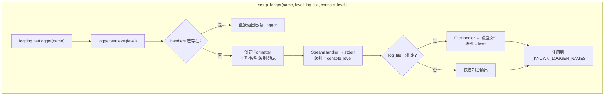
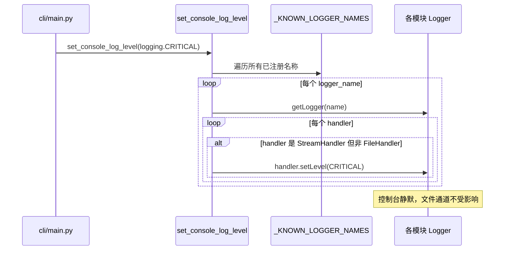
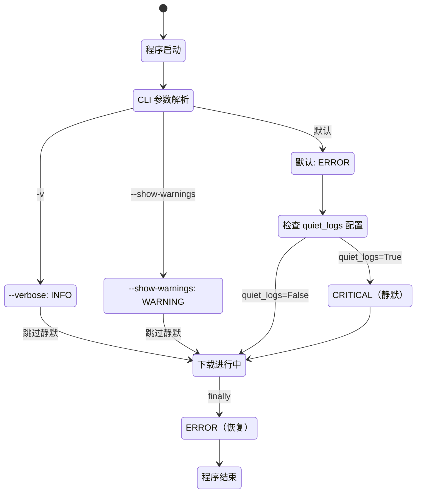

本项目基于 Python 标准 `logging` 库构建了一套轻量、统一的日志体系，并通过 CLI 参数与配置文件协同控制日志的输出行为。一个核心设计动机是解决 **Rich 进度条与 `logging.StreamHandler` 同时写入 `stderr` 时的画面冲突**——当大量日志在进度条更新期间涌入，Rich 会反复触发全量重绘，导致终端出现重复的进度块。为此，系统引入了「静默模式」机制，在进度展示运行期间将控制台日志级别提升至 `CRITICAL`，下载完成后再恢复至 `ERROR`。本文将从日志创建、全局级别调控、静默模式触发链路三个层面展开分析。

Sources: [logger.py](utils/logger.py#L1-L53), [main.py](cli/main.py#L1-L257), [default_config.py](config/default_config.py#L35-L37)

## 日志创建器：`setup_logger` 的双通道设计

`setup_logger` 是项目中所有模块获取 Logger 实例的唯一入口，定义在 [utils/logger.py](utils/logger.py#L9-L42) 中。每次调用时会创建一个命名 Logger 并将其名称注册到模块级集合 `_KNOWN_LOGGER_NAMES`，供后续 `set_console_log_level` 全局调控使用。



该函数支持**双通道输出**：控制台通道（`StreamHandler`，输出到 `sys.stderr`）与可选的文件通道（`FileHandler`）。两个通道共享相同的格式模板 `"%(asctime)s - %(name)s - %(levelname)s - %(message)s"`，但**级别独立配置**——控制台默认 `ERROR`，文件通道跟随 `level` 参数（默认 `INFO`）。这意味着即使控制台处于静默状态，只要指定了 `log_file` 且文件通道级别为 `INFO`，所有 INFO 及以上的日志仍会被写入磁盘。

一个关键设计细节是 `logger.propagate = False`（[第 17 行](utils/logger.py#L17)），这确保每个命名 Logger 独立管理自身的 Handler 列表，不会将日志事件向上传播至根 Logger，从而避免重复输出。

Sources: [logger.py](utils/logger.py#L9-L42)

## 全局级别调控：`set_console_log_level` 的广播机制

`set_console_log_level`（[第 45-52 行](utils/logger.py#L45-L52)）实现了**对所有已知 Logger 的控制台 Handler 级别的批量修改**。它遍历 `_KNOWN_LOGGER_NAMES` 中记录的每一个 Logger，逐个筛选出 `StreamHandler`（排除 `FileHandler`），统一设置新级别。



这种设计保证了**文件日志通道完全不受控制台静默的影响**——在排查下载异常时，即使终端干干净净，磁盘上的日志文件可能已经记录了完整的 WARNING/ERROR/INFO 信息。需要注意的是，`ConfigLoader` 使用的是 `logging.getLogger("ConfigLoader")`（[第 13 行](config/config_loader.py#L13)）而非 `setup_logger`，因此它不在 `_KNOWN_LOGGER_NAMES` 的管控范围内，其日志级别不受静默模式影响。

Sources: [logger.py](utils/logger.py#L45-L52), [config_loader.py](config/config_loader.py#L13)

## 模块级 Logger 分布

全项目共 19 个模块通过 `setup_logger` 创建了各自的命名 Logger，覆盖了从 CLI 入口到底层存储的完整调用链路。下表按功能域分类列出：

| 功能域 | Logger 名称 | 所在文件 | 主要日志用途 |
|--------|------------|---------|------------|
| **CLI 入口** | `CLI` | [cli/main.py](cli/main.py#L17) | 致命错误、异常栈追踪 |
| **认证** | `CookieManager` | [auth/cookie_manager.py](auth/cookie_manager.py#L8) | Cookie 验证相关 |
| **认证** | `MsTokenManager` | [auth/ms_token_manager.py](auth/ms_token_manager.py#L15) | msToken 生成与管理 |
| **URL 解析** | `URLParser` | [core/url_parser.py](core/url_parser.py#L6) | 不支持的 URL 类型错误 |
| **API 客户端** | `APIClient` | [core/api_client.py](core/api_client.py#L20) | 请求失败、重试、签名降级、浏览器兜底 |
| **下载器工厂** | `DownloaderFactory` | [core/downloader_factory.py](core/downloader_factory.py#L14) | 不支持的 URL 类型错误 |
| **基础下载器** | `BaseDownloader` | [core/downloader_base.py](core/downloader_base.py#L18) | 资产下载进度、去重跳过、错误详情 |
| **视频下载** | `VideoDownloader` | [core/video_downloader.py](core/video_downloader.py#L6) | 视频特定下载逻辑 |
| **音乐下载** | `MusicDownloader` | [core/music_downloader.py](core/music_downloader.py#L14) | 音乐详情获取、已存在跳过 |
| **合集下载** | `MixDownloader` | [core/mix_downloader.py](core/mix_downloader.py#L9) | 合集详情与分页 |
| **用户下载** | `UserDownloader` | [core/user_downloader.py](core/user_downloader.py#L9) | 用户信息获取、模式分发 |
| **策略（基类）** | `UserModeStrategy` | [core/user_modes/base_strategy.py](core/user_modes/base_strategy.py#L12) | 分页受限、数据缺失警告 |
| **策略（帖子）** | `PostUserModeStrategy` | [core/user_modes/post_strategy.py](core/user_modes/post_strategy.py#L8) | API 缺失、分页提前终止 |
| **策略（收藏）** | `CollectUserModeStrategy` | [core/user_modes/collect_strategy.py](core/user_modes/collect_strategy.py#L8) | API 方法缺失 |
| **策略（收藏合集）** | `CollectMixUserModeStrategy` | [core/user_modes/collect_mix_strategy.py](core/user_modes/collect_mix_strategy.py#L8) | API 方法缺失 |
| **转写管理** | `TranscriptManager` | [core/transcript_manager.py](core/transcript_manager.py#L13) | API 调用失败、格式不支持 |
| **文件管理** | `FileManager` | [storage/file_manager.py](storage/file_manager.py#L10) | 文件路径构建、下载 |
| **元数据** | `MetadataHandler` | [storage/metadata_handler.py](storage/metadata_handler.py#L10) | Manifest 写入 |
| **重试** | `RetryHandler` | [control/retry_handler.py](control/retry_handler.py#L5) | 重试退避 |
| **队列** | `QueueManager` | [control/queue_manager.py](control/queue_manager.py#L5) | 并发任务调度 |

这些 Logger 的命名遵循 **类名即 Logger 名** 的直觉映射，使得在日志文件中通过 `%(name)s` 字段即可精确追溯事件来源。

Sources: [logger.py](utils/logger.py#L5-L6), [downloader_base.py](core/downloader_base.py#L18), [api_client.py](core/api_client.py#L20)

## 静默模式的触发链路

静默模式是日志系统与 [Rich 进度条（ProgressDisplay）](25-rich-jin-du-tiao-progressdisplay-de-jiao-hu-she-ji) 交互的关键桥梁。整个控制流在 [cli/main.py](cli/main.py#L128-L206) 中实现，分为三个阶段：

### 阶段一：CLI 参数解析与初始级别设置

```python
# cli/main.py 第 237-242 行
if args.verbose:
    set_console_log_level(logging.INFO)
elif args.show_warnings:
    set_console_log_level(logging.WARNING)
else:
    set_console_log_level(logging.ERROR)
```

在 `main()` 函数中，根据命令行参数设置**初始控制台级别**。三个互斥的日志级别对应三种诊断深度：

| CLI 参数 | 控制台级别 | 效果 |
|---------|-----------|------|
| `-v` / `--verbose` | `INFO` | 显示所有 INFO/WARNING/ERROR 日志，适合调试 |
| `--show-warnings` | `WARNING` | 仅显示 WARNING 及以上，轻度诊断 |
| （默认） | `ERROR` | 仅显示 ERROR，干净终端 |

### 阶段二：下载期间提升至 CRITICAL

```python
# cli/main.py 第 176-182 行
quiet_by_config = _as_bool(progress_config.get("quiet_logs", True), default=True)
quiet_progress_logs = quiet_by_config and not (args.verbose or args.show_warnings)
if quiet_progress_logs:
    # Progress 运行期间若有大量错误日志会触发 rich 反复重绘，导致屏幕出现重复块。
    # 默认静默控制台日志，下载完成后再恢复。
    set_console_log_level(logging.CRITICAL)
```

`quiet_progress_logs` 的判断逻辑为：**配置中 `progress.quiet_logs` 为 `True`（默认值）且用户未通过 `--verbose` 或 `--show-warnings` 显式要求查看日志**。当条件满足时，控制台级别被提升至 `CRITICAL`，实际上等同于完全静默——因为项目代码中没有任何 `logger.critical()` 调用。

### 阶段三：下载完成后恢复至 ERROR

```python
# cli/main.py 第 205-206 行
finally:
    display.stop_download_session()
    if quiet_progress_logs:
        set_console_log_level(logging.ERROR)
```

在 `try/finally` 块的清理阶段，控制台级别恢复至 `ERROR`，确保下载汇总信息中可能出现的错误日志能够正常显示。



Sources: [main.py](cli/main.py#L176-L206), [main.py](cli/main.py#L237-L242), [default_config.py](config/default_config.py#L35-L37)

## `quiet_logs` 配置项详解

`quiet_logs` 是 `progress` 配置字典下的布尔开关，定义在 [default_config.py](config/default_config.py#L35-L37) 中：

```yaml
progress:
  quiet_logs: true   # 默认值
```

| 属性 | 说明 |
|-----|------|
| 配置路径 | `progress.quiet_logs` |
| 默认值 | `true` |
| 类型 | 布尔值（支持字符串 `"true"`/`"false"`/`"1"`/`"0"` 的宽容解析） |
| 作用范围 | 仅影响控制台 StreamHandler，不影响 FileHandler |
| 生效条件 | 用户未通过 `-v` 或 `--show-warnings` 显式请求日志输出 |

当开发者需要在不修改 CLI 参数的前提下观察下载过程中的实时日志（例如在 Docker 容器中调试），只需在 `config.yml` 中设置 `quiet_logs: false` 即可解除静默。测试文件 [test_config_loader.py](tests/test_config_loader.py#L212-L245) 验证了该配置的默认启用与可覆盖行为，同时 [第 266-280 行](tests/test_config_loader.py#L266-L280) 确认了多个 `ConfigLoader` 实例之间的 `quiet_logs` 值不会互相泄漏（通过 `deepcopy(DEFAULT_CONFIG)` 保证）。

Sources: [default_config.py](config/default_config.py#L35-L37), [test_config_loader.py](tests/test_config_loader.py#L212-L280)

## 日志级别的语义约定

项目中各模块在日志级别的使用上遵循一致的语义约定，开发者在添加新日志语句时可参照此规范：

| 级别 | 语义 | 典型场景 |
|------|------|---------|
| `DEBUG` | 开发诊断信息 | 请求重试延迟详情（[api_client.py:221](core/api_client.py#L221)）、进度更新失败（[downloader_base.py:92](core/downloader_base.py#L92)）、`suppress_error=True` 时的静默失败 |
| `INFO` | 正常业务流程节点 | 资产下载完成（[downloader_base.py:446](core/downloader_base.py#L446)）、本地已存在跳过（[music_downloader.py:98](core/music_downloader.py#L98)）、内容被过滤并重试（[api_client.py:339](core/api_client.py#L339)） |
| `WARNING` | 非致命异常、降级路径 | 分页数据缺失（[base_strategy.py:54](core/user_modes/base_strategy.py#L54)）、签名算法降级（[api_client.py:179](core/api_client.py#L179)）、浏览器兜底启动（[api_client.py:527](core/api_client.py#L527)） |
| `ERROR` | 操作失败、无法继续 | URL 解析失败（[url_parser.py:14](core/url_parser.py#L14)）、HTTP 请求失败（[api_client.py:206](core/api_client.py#L206)）、下载器未找到（[downloader_factory.py:55](core/downloader_factory.py#L55)） |

值得注意的一个模式是 `APIClient._request_json` 中的 `suppress_error` 参数（[第 206 行](core/api_client.py#L206)与[第 227 行](core/api_client.py#L227)）——当调用方预期某个 API 端点可能返回错误（如尝试性请求）时，传入 `suppress_error=True` 可将 `logger.error` 降级为 `logger.debug`，避免在正常流程中产生误导性的 ERROR 日志。

Sources: [api_client.py](core/api_client.py#L206-L228), [downloader_base.py](core/downloader_base.py#L90-L115), [base_strategy.py](core/user_modes/base_strategy.py#L54)

## 相关页面

- [Rich 进度条（ProgressDisplay）的交互设计](25-rich-jin-du-tiao-progressdisplay-de-jiao-hu-she-ji) — 静默模式正是为保护 Rich 进度条的渲染稳定性而设计
- [配置文件详解：config.yml 全字段说明与典型场景示例](3-pei-zhi-wen-jian-xiang-jie-config-yml-quan-zi-duan-shuo-ming-yu-dian-xing-chang-jing-shi-li) — `progress.quiet_logs` 字段的配置上下文
- [命令行参数与运行模式](4-ming-ling-xing-can-shu-yu-yun-xing-mo-shi) — `--verbose` 与 `--show-warnings` 参数的完整说明
- [默认配置字典（default_config）全字段释义](24-mo-ren-pei-zhi-zi-dian-default_config-quan-zi-duan-shi-yi) — `progress` 配置块中所有字段的详细释义