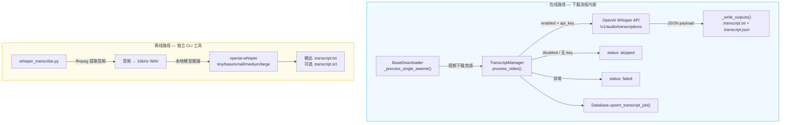
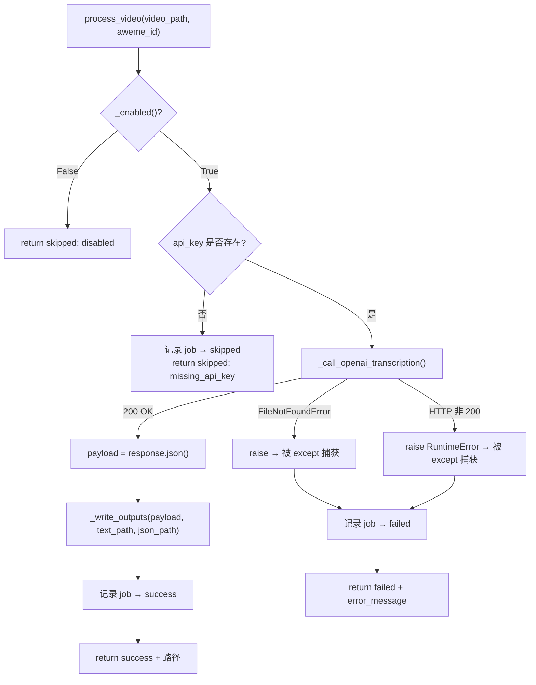

本页深入剖析抖音批量下载工具中的**视频转写子系统**。该子系统提供两条互补的转写路径：其一是内嵌于下载流程的 `TranscriptManager`，通过 OpenAI Whisper API 在线完成语音转文字；其二是独立的 CLI 工具 `whisper_transcribe`，调用本地 Whisper 模型离线批量转录。两条路径共享相同的输出命名约定（`*.transcript.txt` / `*.transcript.json`），但定位、依赖和适用场景截然不同。

Sources: [transcript_manager.py](core/transcript_manager.py#L1-L260), [whisper_transcribe.py](cli/whisper_transcribe.py#L1-L507), [default_config.py](config/default_config.py#L38-L46)

## 系统定位与整体架构

视频转写功能被设计为下载流程的**可选后处理阶段**——当 `config.yml` 中 `transcript.enabled` 为 `true` 时，`BaseDownloader` 在完成视频文件写入和元数据清单生成之后，自动将视频文件送入 `TranscriptManager.process_video()` 进行在线转录。这一设计将转写逻辑从下载主流程中彻底解耦：转写失败不会影响视频文件本身的成功下载，且转写结果会持久化到 SQLite 的 `transcript_job` 表中以支持后续追溯和重试。

离线路径 `whisper_transcribe.py` 则是一个完全独立的命令行工具，面向那些需要对已下载视频进行二次批量转录的场景，支持更丰富的输出格式（SRT 字幕）和繁简转换。



Sources: [downloader_base.py](core/downloader_base.py#L427-L443), [transcript_manager.py](core/transcript_manager.py#L91-L160), [whisper_transcribe.py](cli/whisper_transcribe.py#L269-L366)

## TranscriptManager 类设计

### 构造函数与依赖注入

`TranscriptManager` 采用构造函数注入模式，接收三个外部依赖：

| 参数 | 类型 | 用途 |
|------|------|------|
| `config` | `ConfigLoader` | 读取 `transcript` 配置段，控制开关、模型、API 凭证等 |
| `file_manager` | `FileManager` | 提供 `base_path` 用于计算输出目录的相对路径映射 |
| `database` | `Database` (可选) | 将转写任务状态持久化到 `transcript_job` 表 |

`database` 参数被标记为 `Optional`，当未提供时，`_record_job()` 方法直接返回不做任何操作。这一设计使得 `TranscriptManager` 在无数据库环境（如单元测试中只验证文件输出）下仍可正常工作。

Sources: [transcript_manager.py](core/transcript_manager.py#L17-L25), [transcript_manager.py](core/transcript_manager.py#L244-L245)

### 配置读取方法族

类内部通过一组私有方法将配置字典映射为类型安全的返回值，每个方法都带有合理的默认值和防御性处理：

| 方法 | 配置键 | 默认值 | 说明 |
|------|--------|--------|------|
| `_enabled()` | `transcript.enabled` | `False` | 转写功能总开关 |
| `_model()` | `transcript.model` | `gpt-4o-mini-transcribe` | OpenAI 转写模型名称 |
| `_response_formats()` | `transcript.response_formats` | `["txt", "json"]` | 输出格式列表，自动归一化为小写 |
| `_resolve_api_key()` | `transcript.api_key_env` / `transcript.api_key` | `OPENAI_API_KEY` / `""` | API 密钥解析，优先环境变量 |
| `_api_url()` | `transcript.api_url` | OpenAI 默认端点 | API 地址，支持自定义代理 |

`_response_formats()` 包含两层防御：首先检查配置值是否为列表类型，若非列表则回退到默认值 `["txt", "json"]`；然后对每个元素执行 `strip().lower()` 归一化，最后过滤空字符串。这意味着即使用户配置了 `["TXT", " Json ", ""]`，也会被正确归一化为 `["txt", "json"]`。

`_resolve_api_key()` 实现了**环境变量优先**策略：先从 `api_key_env` 指定的环境变量名（默认 `OPENAI_API_KEY`）读取，仅当环境变量为空时才回退到配置文件中的 `api_key` 明文值。这一设计让生产环境可以通过环境变量注入密钥，避免在配置文件中明文存储。

Sources: [transcript_manager.py](core/transcript_manager.py#L27-L59)

### 输出路径解析机制

输出路径的解析是 `TranscriptManager` 中设计较为精巧的部分。`resolve_output_dir()` 方法根据 `output_dir` 配置项的值产生两种行为：

**模式一 — 同目录输出**（`output_dir` 为空）：转写文件直接输出到视频文件所在目录。例如视频位于 `Downloaded/author/post/demo.mp4`，则转写结果输出到同一目录。

**模式二 — 镜像目录结构输出**（`output_dir` 非空）：以 `output_dir` 为新根目录，保留视频相对于 `FileManager.base_path` 的路径层级。例如 `output_dir` 设为 `./Transcripts`，视频路径为 `Downloaded/author/post/2026-02-18_demo/x.mp4`，则输出目录为 `Transcripts/author/post/2026-02-18_demo/`。

镜像解析的核心逻辑是：计算 `video_dir` 相对于 `file_manager.base_path` 的相对路径，然后拼接到 `output_root` 上。当相对路径计算失败时（例如视频不在 `base_path` 下），方法会优雅降级到同目录输出并记录警告日志。

`build_output_paths()` 在 `resolve_output_dir()` 的基础上创建目录（`mkdir -p`），并按 `{stem}.transcript.txt` / `{stem}.transcript.json` 的命名规范返回两个 `Path` 对象。

Sources: [transcript_manager.py](core/transcript_manager.py#L61-L89)

## 核心流程：process_video() 详解

`process_video()` 是转写子系统的主入口，由 `BaseDownloader._process_single_aweme()` 在视频下载完成后调用。整个流程可分解为四个阶段：



**阶段一 — 前置检查**：调用 `_enabled()` 判断功能开关，若未启用则立即返回 `{"status": "skipped", "reason": "disabled"}`，不产生任何数据库记录。

**阶段二 — 凭证校验**：通过 `_resolve_api_key()` 获取 API 密钥。若密钥为空，虽然状态为 `skipped`，但会通过 `_record_job()` 写入一条数据库记录（`skip_reason: "missing_api_key"`），便于运维排查配置问题。

**阶段三 — API 调用**：`_call_openai_transcription()` 构造 `multipart/form-data` 请求发送到 OpenAI 端点。请求体包含 `model`、`response_format: "json"`，以及可选的 `language` 参数（由 `language_hint` 配置驱动）。视频文件通过流式读取打开，`aiohttp.ClientSession` 设置 600 秒（10 分钟）的超时阈值，足以应对长视频的转录需求。

**阶段四 — 结果持久化**：成功时调用 `_write_outputs()` 按配置的格式列表分别写入文本和 JSON 文件，然后通过 `_record_job()` 记录成功状态。任何异常都会被捕获并记录为 `failed` 状态，确保不会因转写错误中断整个下载流程。

Sources: [transcript_manager.py](core/transcript_manager.py#L91-L160), [transcript_manager.py](core/transcript_manager.py#L176-L216)

### API 调用实现细节

`_call_openai_transcription()` 的实现值得关注的技术细节：

**Content-Type 猜测**：静态方法 `_guess_video_content_type()` 根据文件后缀映射 MIME 类型，支持 `.mp4`、`.m4a`、`.wav`、`.mp3` 四种常见格式，未知格式统一使用 `application/octet-stream`。这确保了 OpenAI API 能正确解析上传的音视频文件。

**文件读取方式**：视频文件通过 `with video_path.open("rb") as f` 以二进制模式打开，然后将文件对象直接传给 `FormData.add_field()`。`aiohttp` 会自动处理流式上传，无需将整个文件加载到内存中。

**响应校验**：API 返回的 HTTP 状态码首先被检查，非 200 时读取完整响应体并抛出 `RuntimeError`，其中包含状态码和响应正文，便于调试。通过状态码校验后，还会验证响应 JSON 是否为 `dict` 类型，防止异常格式的响应导致后续处理出错。

Sources: [transcript_manager.py](core/transcript_manager.py#L176-L229)

## 与 BaseDownloader 的集成

`TranscriptManager` 的实例化发生在 `BaseDownloader.__init__()` 中，通过构造函数注入 `config`、`file_manager` 和 `database` 三个依赖。这意味着每个下载器实例都持有一个完整的转写管理器，但转写行为完全由配置驱动——默认配置下 `enabled: False`，`process_video()` 会在第一行检查就返回。

实际的调用点位于 `_process_single_aweme()` 方法中，紧跟在元数据清单（manifest）写入之后，且**仅对视频类型**（`media_type == "video"`）且视频文件路径非空的资产触发转写。图文（`images`）和音乐（`music`）类型被自然排除。

转写结果的处理遵循**不阻塞**原则：`skipped` 和 `failed` 状态仅记录日志（分别为 `info` 和 `warning` 级别），不会抛出异常或影响下载主流程的返回值。这种容错设计确保即使 OpenAI API 不可用，下载任务仍能正常完成。

Sources: [downloader_base.py](core/downloader_base.py#L67-L69), [downloader_base.py](core/downloader_base.py#L427-L443)

## 数据库持久化：transcript_job 表

### 表结构与索引设计

`Database.initialize()` 中创建了 `transcript_job` 表，其完整结构如下：

| 字段 | 类型 | 说明 |
|------|------|------|
| `id` | INTEGER PK | 自增主键 |
| `aweme_id` | TEXT NOT NULL | 抖音视频唯一标识 |
| `video_path` | TEXT NOT NULL | 视频文件绝对路径 |
| `transcript_dir` | TEXT | 转写文件输出目录 |
| `text_path` | TEXT | 纯文本转写文件路径 |
| `json_path` | TEXT | JSON 转写文件路径 |
| `model` | TEXT NOT NULL | 使用的转写模型名称 |
| `status` | TEXT NOT NULL | 任务状态：`success` / `failed` / `skipped` |
| `skip_reason` | TEXT | 跳过原因：`disabled` / `missing_api_key` |
| `error_message` | TEXT | 失败时的错误信息 |
| `created_at` | INTEGER | 首次创建的 Unix 时间戳 |
| `updated_at` | INTEGER | 最后更新的 Unix 时间戳 |

表上定义了 `UNIQUE(aweme_id, video_path, model)` 约束和两个索引（`idx_transcript_aweme_id`、`idx_transcript_status`），支持按视频查询单条记录和按状态批量筛选两种常见查询模式。

### Upsert 语义

`upsert_transcript_job()` 利用 SQLite 的 `ON CONFLICT ... DO UPDATE` 语法实现了幂等的写入操作。当同一视频（相同 `aweme_id` + `video_path` + `model` 组合）被多次处理时，后续执行会更新除 `created_at` 之外的所有字段，包括 `status`、`skip_reason`、`error_message` 等。这意味着：

- 首次因 `missing_api_key` 被跳过的视频，在补充 API Key 后重新下载时会更新为新的状态
- 失败后重试成功的视频，其记录会从 `failed` 更新为 `success`
- `created_at` 保持首次插入的时间，`updated_at` 始终更新为当前时间戳，形成自然的审计轨迹

`get_transcript_job()` 按 `updated_at DESC, id DESC` 排序返回最新一条记录，使得调用方总是能获取到最近一次的转写状态。

Sources: [database.py](storage/database.py#L54-L70), [database.py](storage/database.py#L75-L76), [database.py](storage/database.py#L143-L212)

## 配置详解

### config.yml 中的 transcript 段

以下是 `transcript` 配置段的完整字段说明，附带各字段的取值范围与典型用法：

```yaml
transcript:
  enabled: false                    # 总开关，设为 true 方可激活在线转写
  model: gpt-4o-mini-transcribe     # OpenAI 模型名称，支持 gpt-4o-transcribe 等
  output_dir: ""                    # 留空=与视频同目录；设路径=镜像目录结构
  response_formats:                 # 输出格式列表
    - txt
    - json
  api_url: https://api.openai.com/v1/audio/transcriptions  # API 端点
  api_key_env: OPENAI_API_KEY       # 环境变量名（优先读取）
  api_key: ""                       # 明文密钥（环境变量为空时的备选）
  language_hint: ""                 # 可选，提示语言如 "zh"、"en"
```

**典型的生产配置示例**——启用转写并将结果输出到独立目录：

```yaml
transcript:
  enabled: true
  model: gpt-4o-mini-transcribe
  output_dir: "./Transcripts"
  response_formats:
    - txt
    - json
  api_key_env: OPENAI_API_KEY
  language_hint: "zh"
```

**使用兼容 API 端点的配置**——当使用 Azure OpenAI 或第三方代理时：

```yaml
transcript:
  enabled: true
  api_url: "https://your-proxy.example.com/v1/audio/transcriptions"
  api_key_env: CUSTOM_API_KEY
```

Sources: [default_config.py](config/default_config.py#L38-L46), [config.example.yml](config.example.yml#L44-L53)

### 配置字段解析逻辑对照

| 配置键 | 读取方法 | 默认值 | 类型转换/防御处理 |
|--------|----------|--------|-------------------|
| `enabled` | `_enabled()` | `False` | `bool()` 包裹 |
| `model` | `_model()` | `gpt-4o-mini-transcribe` | `str().strip()` |
| `output_dir` | `resolve_output_dir()` 内联 | `""` | `str().strip()` |
| `response_formats` | `_response_formats()` | `["txt", "json"]` | 列表类型检查 + 元素归一化 |
| `api_url` | `_api_url()` | OpenAI 默认端点 | `str().strip()`，空值回退 |
| `api_key_env` | `_resolve_api_key()` | `OPENAI_API_KEY` | `str().strip()` |
| `api_key` | `_resolve_api_key()` | `""` | `str().strip()` |
| `language_hint` | `_call_openai_transcription()` 内联 | `""` | `str().strip()`，非空才发送 |

Sources: [transcript_manager.py](core/transcript_manager.py#L27-L59), [transcript_manager.py](core/transcript_manager.py#L182-L190)

## 离线 CLI 工具：whisper_transcribe.py

### 工具定位与依赖

`whisper_transcribe.py` 是一个完全独立于主下载流程的命令行工具，位于 `cli/` 目录下，需要单独安装依赖：`openai-whisper`（模型推理）和 `ffmpeg`（音频提取）。该工具不在 `requirements.txt` 中声明，属于可选的高级扩展工具。

工具的处理管线包含四个步骤：**提取音频**（ffmpeg 转 16kHz 单声道 WAV）→ **Whisper 推理**（本地 GPU/CPU 模型）→ **繁简转换**（可选 OpenCC）→ **文件写入**（TXT/SRT）。

Sources: [whisper_transcribe.py](cli/whisper_transcribe.py#L1-L16)

### 命令行参数

| 参数 | 缩写 | 默认值 | 说明 |
|------|------|--------|------|
| `--dir` | `-d` | `./Downloaded` | 扫描目录，递归查找所有 `.mp4` 文件 |
| `--file` | `-f` | 无 | 单个视频文件路径 |
| `--model` | `-m` | `base` | Whisper 模型：`tiny`/`base`/`small`/`medium`/`large` |
| `--language` | `-l` | `zh` | 语言代码 |
| `--srt` | 无 | 关闭 | 同时输出 SRT 字幕文件 |
| `--skip-existing` | 无 | 关闭 | 跳过已有 `.transcript.txt` 的视频 |
| `--sc` | 无 | 关闭 | 繁体转简体（需安装 OpenCC） |
| `--output` | `-o` | 无 | 输出目录，默认与视频同目录 |

Sources: [whisper_transcribe.py](cli/whisper_transcribe.py#L398-L419)

### 路径安全处理

`_safe_stem()` 函数处理抖音下载中常见的特殊文件名问题：移除换行符、替换 Windows 不允许的字符（`<>:"/\|?*#`）、合并连续空格和下划线、截断超过 150 个字符的文件名。`transcribe_file()` 还会在处理前将视频复制到临时目录（`tempfile.mkdtemp`），避免原路径中的特殊字符导致 ffmpeg 或文件写入失败，处理完成后自动清理临时目录。

Sources: [whisper_transcribe.py](cli/whisper_transcribe.py#L252-L299)

### 进度展示

工具内嵌了 `TranscribeDisplay` 类，基于 Rich 库实现与主项目风格一致但配色不同的进度展示。每个文件经历 4 个阶段的进度条（提取音频 → 识别 → 转换 → 保存），整体进度条实时统计成功/失败/跳过的计数。处理结束后输出汇总表格，包含总数、成功率等统计信息。

Sources: [whisper_transcribe.py](cli/whisper_transcribe.py#L58-L209)

## 两条路径的对比分析

| 维度 | TranscriptManager（在线） | whisper_transcribe.py（离线） |
|------|---------------------------|-------------------------------|
| **触发方式** | 下载流程自动触发 | 手动运行 CLI 命令 |
| **模型位置** | OpenAI 云端 API | 本地 GPU/CPU |
| **依赖** | `aiohttp` + API Key | `openai-whisper` + `ffmpeg` |
| **输出格式** | TXT + JSON | TXT + SRT |
| **网络需求** | 必须联网 | 无需网络 |
| **成本** | 按 API 调用计费 | 免费（仅计算资源） |
| **延迟** | 受网络和 API 响应影响 | 受本地硬件性能影响 |
| **并发支持** | 异步 I/O，天然并发 | 同步串行处理 |
| **数据库记录** | 自动持久化到 `transcript_job` | 无 |
| **适用场景** | 日常下载时自动转录 | 对已有视频批量二次处理 |
| **长视频支持** | 600 秒 API 超时上限 | 仅受本地磁盘和内存限制 |
| **繁简转换** | 不支持 | 通过 OpenCC 支持 |

Sources: [transcript_manager.py](core/transcript_manager.py#L1-L260), [whisper_transcribe.py](cli/whisper_transcribe.py#L1-L507)

## 测试覆盖

`test_transcript_manager.py` 提供了四个测试用例，覆盖了核心配置读取和路径解析行为：

- **`test_transcript_default_disabled`**：验证默认配置下转写功能处于关闭状态，且 API URL 指向 OpenAI 默认端点
- **`test_transcript_skip_when_missing_api_key`**：验证 API Key 缺失时返回 `skipped` 状态，且数据库中记录了正确的 `skip_reason`
- **`test_transcript_output_dir_defaults_to_video_dir`**：验证 `output_dir` 为空时，输出目录即为视频文件所在目录
- **`test_transcript_output_dir_mirrors_video_tree`**：验证镜像目录结构的正确计算，包括多级子目录的相对路径映射

测试中使用了 `_FakeDatabase` 桩类来替代真实的 `Database`，仅记录 `upsert_transcript_job()` 的调用参数，使断言能验证写入的 `status` 和 `skip_reason` 字段。

Sources: [test_transcript_manager.py](tests/test_transcript_manager.py#L1-L100)

---

**相关阅读**：转写子系统的配置加载机制在 [配置加载器的合并策略与环境变量覆盖](23-pei-zhi-jia-zai-qi-de-he-bing-ce-lue-yu-huan-jing-bian-liang-fu-gai) 中有详细说明；数据库的表结构和索引设计参见 [SQLite 数据库设计与去重、增量下载支持](20-sqlite-shu-ju-ku-she-ji-yu-qu-zhong-zeng-liang-xia-zai-zhi-chi)；转写在下载流程中的调用位置可参考 [基础下载器（BaseDownloader）的资产下载与去重逻辑](9-ji-chu-xia-zai-qi-basedownloader-de-zi-chan-xia-zai-yu-qu-zhong-luo-ji)。