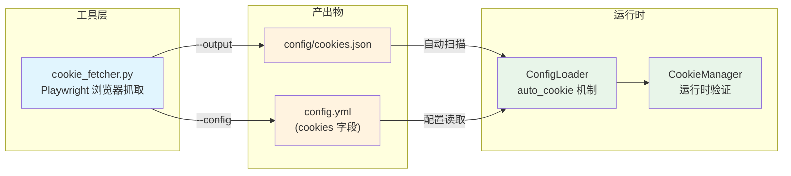
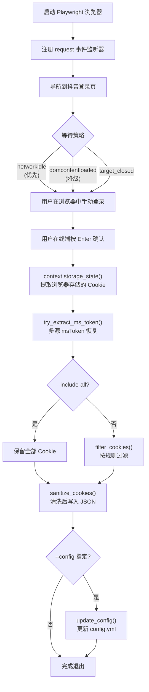

`tools/cookie_fetcher.py` 是一个基于 **Playwright** 的独立命令行工具，通过启动真实浏览器引导用户手动完成抖音登录，随后自动捕获、过滤并持久化认证所需的 Cookie。它不属于主程序运行时链路，而是一个**离线辅助工具**——主程序的 Cookie 获取方式详见 [Cookie 获取与认证配置](5-cookie-huo-qu-yu-ren-zheng-pei-zhi)，抓取结果可被配置加载器自动消费。

Sources: [cookie_fetcher.py](tools/cookie_fetcher.py#L1-L373)

## 模块定位与架构角色

在整体架构中，`cookie_fetcher` 位于"工具层"（`tools/` 包），与主下载流程**解耦**。它产出的 `config/cookies.json` 文件被 [配置加载器的合并策略与环境变量覆盖](23-pei-zhi-jia-zai-qi-de-he-bing-ce-lue-yu-huan-jing-bian-liang-fu-gai) 中的 `_load_auto_cookies()` 方法自动扫描并加载，形成"抓取 → 持久化 → 自动消费"的完整闭环。

Sources: [cookie_fetcher.py](tools/cookie_fetcher.py#L1-L14), [config_loader.py](config/config_loader.py#L188-L224)



**依赖声明**方面，Playwright 被放置在 `pyproject.toml` 的可选依赖组 `[browser]` 中，而非核心依赖。这意味着不使用此工具的用户无需安装 Playwright，降低了主程序的安装门槛。

Sources: [pyproject.toml](pyproject.toml#L34-L37)

## 核心工作流程

`cookie_fetcher` 的执行流程可划分为五个阶段：**浏览器启动 → 请求监听 → 等待登录 → Cookie 提取 → 持久化输出**。

Sources: [cookie_fetcher.py](tools/cookie_fetcher.py#L78-L158)



### 阶段一：浏览器启动与事件监听

`capture_cookies()` 函数首先尝试导入 `playwright.async_api`。若导入失败（即用户未安装 Playwright），会打印错误提示并返回退出码 `1`，而非抛出异常。浏览器通过 `browser_factory.launch(headless=args.headless)` 启动，默认为**有头模式**（headless=False），因为需要用户手动完成登录交互。

在浏览器上下文中，`_on_request` 回调被注册到 `page.on("request")` 事件上，它的职责是在用户登录过程中**被动收集**所有请求中的 Cookie 头和 URL 查询参数中的 msToken 值，为后续的 msToken 恢复提供备用数据源。

Sources: [cookie_fetcher.py](tools/cookie_fetcher.py#L78-L113)

### 阶段二：页面导航与降级策略

页面导航由 `goto_with_fallback()` 实现，采用**两级降级策略**：

| 优先级 | `wait_until` 策略 | 超时时间 | 说明 |
|--------|-------------------|---------|------|
| 1（优先） | `networkidle` | 300 秒 | 等待网络完全空闲，适用于静态页面 |
| 2（降级） | `domcontentloaded` | 300 秒 | 仅等待 DOM 加载完成，适用于持续发起请求的站点 |
| 特殊 | `target_closed` | — | 浏览器/页面被关闭，直接继续当前状态 |
| 特殊 | `timeout` | — | 两级均超时，继续执行不中断 |

抖音首页会持续发起 WebSocket 长连接和轮询请求，`networkidle` 条件可能永远无法满足，因此降级到 `domcontentloaded` 是**必要的兼容手段**。

Sources: [cookie_fetcher.py](tools/cookie_fetcher.py#L161-L209)

### 阶段三：等待用户登录确认

`wait_for_login_confirmation()` 采用**并发双任务**设计：页面导航在 `asyncio.create_task` 中异步执行，同时主线程通过 `asyncio.to_thread(input_func)` 阻塞等待用户在终端按下 Enter 键。这种设计确保了：导航等待不会阻塞终端输入，用户按下 Enter 后导航任务会被主动取消。

Sources: [cookie_fetcher.py](tools/cookie_fetcher.py#L211-L231)

### 阶段四：Cookie 提取与 msToken 恢复

用户确认登录后，调用 `context.storage_state()` 获取浏览器存储的所有 Cookie，并过滤域名为 `douyin.com` 的条目。随后进入 `try_extract_ms_token()` 的**多源恢复流程**——msToken 是抖音 API 请求的关键参数，但它不一定以标准 Cookie 形式存在于 `storage_state` 中，因此需要从多个备用来源提取：

Sources: [cookie_fetcher.py](tools/cookie_fetcher.py#L124-L136)

| 优先级 | 来源 | 提取方式 |
|--------|------|----------|
| 1 | 已有 Cookie | `cookies.get("msToken")` |
| 2 | 观察到的 URL 查询参数 | `observed_mstokens` 列表（逆序遍历） |
| 3 | 观察到的请求 Cookie 头 | `parse_cookie_header` + `extract_ms_token_from_text` |
| 4 | `document.cookie` | 页面 JS 执行环境 |
| 5 | localStorage / sessionStorage | 遍历包含 "mstoken" 的键 |

`extract_ms_token_from_text()` 函数通过三种正则模式（Cookie 赋值格式、JSON 双引号格式、JSON 单引号格式）从任意文本中提取 msToken 值，并自动处理 URL 编码。

Sources: [cookie_fetcher.py](tools/cookie_fetcher.py#L234-L333)

## Cookie 过滤机制

当未指定 `--include-all` 参数时，`filter_cookies()` 会按预定义的键名白名单过滤 Cookie，只保留与抖音认证和反爬虫相关的条目：

Sources: [cookie_fetcher.py](tools/cookie_fetcher.py#L336-L348)

| 分类 | 键名 | 用途 |
|------|------|------|
| **必需**（REQUIRED） | `msToken`, `ttwid`, `odin_tt`, `passport_csrf_token` | API 请求签名的核心 Cookie |
| **建议**（SUGGESTED） | 上述 + `sid_guard`, `sessionid`, `sid_tt` | 会话级认证 Cookie |
| **辅助键**（AUXILIARY） | `_waftokenid`, `s_v_web_id`, `__ac_nonce`, `__ac_signature`, `UIFID` 等 | WAF 验证、设备指纹 |
| **辅助前缀**（PREFIXES） | `__security_mc_*`, `bd_ticket_guard_*`, `_bd_ticket_crypt_*` | 安全校验相关动态键名 |

过滤函数内置一个**安全回退**：若过滤后结果为空（说明所有 Cookie 都不在白名单中），则返回原始未过滤的完整集合，避免意外丢失数据。

Sources: [cookie_fetcher.py](tools/cookie_fetcher.py#L15-L32), [cookie_fetcher.py](tools/cookie_fetcher.py#L336-L348)

## 命令行接口

`cookie_fetcher` 通过 `python -m tools.cookie_fetcher` 执行，支持以下参数：

Sources: [cookie_fetcher.py](tools/cookie_fetcher.py#L39-L75)

| 参数 | 类型 | 默认值 | 说明 |
|------|------|--------|------|
| `--url` | `str` | `https://www.douyin.com/` | 打开的登录页面地址 |
| `--browser` | `chromium`/`firefox`/`webkit` | `chromium` | Playwright 浏览器引擎 |
| `--headless` | `flag` | `False` | 是否无头模式（手动登录不建议开启） |
| `--output` | `Path` | `config/cookies.json` | Cookie JSON 文件输出路径 |
| `--config` | `Path` | 无 | 可选，同时更新 config.yml 中的 cookies 字段 |
| `--include-all` | `flag` | `False` | 保留全部 Cookie 而非按白名单过滤 |

### 典型用法

**仅导出 JSON 文件**（适合配合 `auto_cookie: true` 使用）：

```bash
python -m tools.cookie_fetcher
```

**同时更新 config.yml**（直接注入到配置文件）：

```bash
python -m tools.cookie_fetcher --config config.yml
```

**指定 Firefox 浏览器和自定义输出路径**：

```bash
python -m tools.cookie_fetcher --browser firefox --output /path/to/cookies.json
```

Sources: [cookie_fetcher.py](tools/cookie_fetcher.py#L366-L373), [README.md](README.md#L85)

## 输出格式与消费链路

### JSON 输出

默认输出到 `config/cookies.json`，格式为扁平键值对：

```json
{
  "msToken": "...",
  "ttwid": "...",
  "odin_tt": "...",
  "passport_csrf_token": "...",
  "sessionid": "..."
}
```

Sources: [cookie_fetcher.py](tools/cookie_fetcher.py#L145-L148)

### config.yml 更新

当指定 `--config` 参数时，`update_config()` 会读取现有 YAML 配置、将 `cookies` 字段替换为抓取结果、再写回文件。此操作使用 `yaml.safe_load` 和 `yaml.safe_dump`，**不会破坏**配置文件中的其他字段。

Sources: [cookie_fetcher.py](tools/cookie_fetcher.py#L351-L363)

### 自动消费机制

配置加载器在读取 Cookie 时，若 `config.yml` 中设置 `cookies: auto` 或 `auto_cookie: true`，会自动扫描以下路径（按优先级）：

1. `config/config/cookies.json`（相对于配置文件目录）
2. `config/.cookies.json`
3. `config/cookies.json`（相对于当前工作目录）
4. `.cookies.json`（相对于当前工作目录）

这正是 `cookie_fetcher` 默认输出路径 `config/cookies.json` 的设计意图——抓取后无需额外配置即可被主程序自动加载。

Sources: [config_loader.py](config/config_loader.py#L166-L224)

## Cookie 清洗工具函数

`cookie_fetcher` 依赖 `utils/cookie_utils.py` 中的两个工具函数对所有 Cookie 进行清洗：

**`sanitize_cookies()`**：遍历所有键值对，过滤掉非字符串键名、包含非法字符（RFC 6265 定义的 token 分隔符）的键名，以及空键名。值被统一转换为字符串并去除首尾空白。此函数在整个项目中被多处复用，包括 `CookieManager` 和 `ConfigLoader`。

**`parse_cookie_header()`**：将浏览器请求中的 `Cookie:` 头字符串解析为键值对字典，按 `;` 分割后逐一提取，同样通过 `is_valid_cookie_name()` 验证键名合法性。

Sources: [cookie_utils.py](utils/cookie_utils.py#L1-L46)

## 完整性校验与警告

`capture_cookies()` 在写入 Cookie 后，会检查是否包含全部 **REQUIRED_KEYS**（`msToken`、`ttwid`、`odin_tt`、`passport_csrf_token`）。若发现缺失，会打印 `[WARN]` 警告信息，但**不会中断执行**——缺失的 Cookie 可能导致后续 API 请求失败，但用户可能有意只抓取部分 Cookie 用于测试。

Sources: [cookie_fetcher.py](tools/cookie_fetcher.py#L151-L153)

值得注意的是，`cookie_fetcher` 的 REQUIRED_KEYS 与 [CookieManager](auth/cookie_manager.py) 的 `validate_cookies()` 所需的 `required_keys` 略有不同——前者包含 `msToken`，后者不包含（因为 msToken 可通过 [短链解析与 msToken 自动生成机制](13-duan-lian-jie-xi-yu-mstoken-zi-dong-sheng-cheng-ji-zhi) 自动生成）。`cookie_fetcher` 将 msToken 列为必需是为了在抓取阶段尽量收集完整，而非运行时强制要求。

Sources: [cookie_manager.py](auth/cookie_manager.py#L46-L59)

## 测试设计

`tests/test_cookie_fetcher.py` 使用两个模拟对象 `FakePage` 和 `SlowPage` 来验证核心逻辑，无需安装真实的 Playwright 浏览器：

| 测试用例 | 验证内容 |
|----------|----------|
| `test_goto_with_fallback_when_networkidle_timeout` | networkidle 超时后降级到 domcontentloaded |
| `test_goto_with_fallback_raises_non_timeout_errors` | 非超时异常直接向上传播 |
| `test_goto_with_fallback_handles_target_closed` | 浏览器关闭错误返回 `target_closed` |
| `test_goto_with_fallback_returns_timeout_when_fallback_also_times_out` | 两级均超时返回 `timeout` |
| `test_wait_for_login_confirmation_returns_without_waiting_navigation` | 用户按 Enter 后取消导航任务 |
| `test_try_extract_ms_token_from_observed_headers` | 从观察到的 Cookie 头中提取 msToken |
| `test_extract_ms_token_from_text_supports_json_and_query_formats` | 支持 URL 查询参数和 JSON 两种格式 |
| `test_filter_cookies_keeps_waf_and_fingerprint_keys_but_drops_unrelated_keys` | 白名单过滤保留安全键、丢弃无关键 |

Sources: [test_cookie_fetcher.py](tests/test_cookie_fetcher.py#L1-L170)

## 延伸阅读

- [Cookie 获取与认证配置](5-cookie-huo-qu-yu-ren-zheng-pei-zhi)：主程序的 Cookie 配置全流程
- [配置加载器的合并策略与环境变量覆盖](23-pei-zhi-jia-zai-qi-de-he-bing-ce-lue-yu-huan-jing-bian-liang-fu-gai)：`auto_cookie` 机制的完整实现细节
- [短链解析与 msToken 自动生成机制](13-duan-lian-jie-xi-yu-mstoken-zi-dong-sheng-cheng-ji-zhi)：当 msToken 未被抓取时的自动补救方案
- [分页受限时的浏览器兜底采集机制](16-fen-ye-shou-xian-shi-de-liu-lan-qi-dou-di-cai-ji-ji-zhi)：另一处使用 Playwright 的浏览器自动化场景