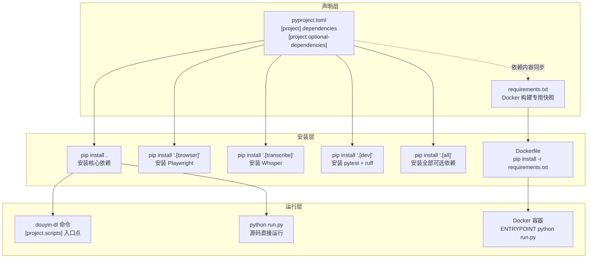

`pyproject.toml` 是 Python 项目现代配置的核心文件，它将构建系统声明、项目元数据、依赖声明、工具链配置统一收归到一个地方。本文将以本项目的 `pyproject.toml` 为蓝本，逐段拆解每个配置节的含义与设计意图，帮助你理解"为什么这样配"以及"如何用 pip 安装不同的依赖组合"。同时，我们也会看到 `requirements.txt`、`Dockerfile` 等外围文件如何与 `pyproject.toml` 协同工作，共同构成完整的依赖管理体系。

Sources: [pyproject.toml](pyproject.toml#L1-L69)

## 整体结构一览

`pyproject.toml` 采用 **TOML 格式**（Tom's Obvious Minimal Language），以"节（section）"为单位组织配置。本项目共包含以下六个配置节：

| 配置节 | 用途 | 面向角色 |
|---|---|---|
| `[build-system]` | 声明构建工具及版本要求 | 打包/发布者 |
| `[project]` | 项目名称、版本、作者、许可证等元数据 | 所有用户 |
| `[project.optional-dependencies]` | 按场景分组的可选依赖 | 按需安装的用户 |
| `[project.scripts]` | 注册命令行入口点 | CLI 用户 |
| `[tool.pytest.ini_options]` | pytest 测试框架配置 | 开发者 |
| `[tool.ruff]` / `[tool.ruff.lint]` | Ruff 代码检查与格式化配置 | 开发者 |

这六节从"构建"到"运行"再到"开发质量"，覆盖了项目全生命周期的配置需求。

Sources: [pyproject.toml](pyproject.toml#L1-L69)

## 构建系统声明（[build-system]）

```toml
[build-system]
requires = ["setuptools>=68.0", "wheel"]
build-backend = "setuptools.build_meta"
```

**`requires`** 列出构建本项目时必须先安装的工具——这里指定了 **setuptools ≥ 68.0** 和 **wheel**。setuptools 是 Python 生态最经典的打包后端，68.0 版本开始对 PEP 621（即 `[project]` 节的标准化写法）提供了完善支持；wheel 则用于生成 `.whl` 二进制分发包，大幅加快安装速度。

**`build-backend`** 告诉 `pip` 或 `build` 工具："请调用 `setuptools.build_meta` 来执行打包逻辑"。这是 [PEP 517](https://peps.python.org/pep-0517/) 定义的标准接口，意味着你无需自己编写 `setup.py`，一切打包行为都由 setuptools 通过读取 `pyproject.toml` 自动完成。

Sources: [pyproject.toml](pyproject.toml#L1-L3)

## 项目元数据（[project]）

### 基本信息

```toml
[project]
name = "douyin-downloader"
version = "2.0.0"
description = "Douyin batch downloader with no-watermark support"
readme = "README.md"
license = {text = "MIT"}
requires-python = ">=3.8"
```

- **`name`**：包在 PyPI 上的唯一标识符，安装时使用 `pip install douyin-downloader`。
- **`version`**：遵循语义化版本（SemVer），当前为 `2.0.0`，与根目录 `__init__.py` 中的 `__version__` 保持一致。
- **`description`**：一行简短描述，显示在 PyPI 搜索结果和 `pip show` 输出中。
- **`readme`**：指定 `README.md` 作为项目长描述，打包后其内容会渲染到 PyPI 项目页面。
- **`license`**：MIT 许可证，与项目根目录的 [LICENSE](LICENSE) 文件一致。
- **`requires-python`**：声明最低 Python 版本为 **3.8**，低于此版本的 Python 执行 `pip install` 时会直接报错。

Sources: [pyproject.toml](pyproject.toml#L5-L11), [__init__.py](__init__.py#L1-L2)

### Trove 分类器（classifiers）

```toml
classifiers = [
    "Development Status :: 4 - Beta",
    "Intended Audience :: End Users/Desktop",
    "License :: OSI Approved :: MIT License",
    "Programming Language :: Python :: 3",
    "Programming Language :: Python :: 3.8",
    "Programming Language :: Python :: 3.9",
    "Programming Language :: Python :: 3.10",
    "Programming Language :: Python :: 3.11",
    "Programming Language :: Python :: 3.12",
    "Topic :: Multimedia :: Video",
]
```

classifiers 是 PyPI 的标准分类标签体系（又称 **Trove Classifiers**），用于帮助用户在 PyPI 上按条件筛选项目。这里声明了：

- **开发阶段**：`4 - Beta`，表示功能基本完备但仍在迭代。
- **目标受众**：`End Users/Desktop`，说明这是一个面向终端用户的桌面工具。
- **兼容 Python 版本**：3.8 到 3.12 共五个版本。
- **主题领域**：`Multimedia :: Video`，归入多媒体视频类别。

这些分类器不影响实际的安装行为，但在 PyPI 的搜索与分类展示中非常重要。

Sources: [pyproject.toml](pyproject.toml#L12-L23)

## 核心依赖（dependencies）

```toml
dependencies = [
    "aiohttp>=3.9.0",
    "aiofiles>=23.2.1",
    "aiosqlite>=0.19.0",
    "rich>=13.7.0",
    "pyyaml>=6.0.1",
    "python-dateutil>=2.8.2",
    "gmssl>=3.2.2",
]
```

这 7 个包是项目运行的**最小必要依赖**——执行 `pip install douyin-downloader` 时会自动安装。每个依赖对应项目中一个明确的功能域：

| 依赖包 | 最低版本 | 在项目中的用途 |
|---|---|---|
| **aiohttp** | ≥ 3.9.0 | 异步 HTTP 客户端，用于请求抖音 API、下载视频/图片资源 |
| **aiofiles** | ≥ 23.2.1 | 异步文件读写，避免磁盘 I/O 阻塞事件循环 |
| **aiosqlite** | ≥ 0.19.0 | 异步 SQLite 操作，支撑下载历史去重与增量下载 |
| **rich** | ≥ 13.7.0 | 终端富文本渲染，提供进度条、彩色输出、表格等交互体验 |
| **pyyaml** | ≥ 6.0.1 | 解析 `config.yml` 配置文件 |
| **python-dateutil** | ≥ 2.8.2 | 灵活的日期时间解析，处理抖音 API 返回的时间字段 |
| **gmssl** | ≥ 3.2.2 | 国密 SM3 哈希算法，参与 X-Bogus 签名计算 |

**版本约束策略**：所有依赖均采用 `>=` 下界约束（而非固定版本 `==`），兼顾"确保最低功能可用"与"允许用户安装已修复 bug 的较新版本"。

Sources: [pyproject.toml](pyproject.toml#L24-L32)

## 可选依赖组（[project.optional-dependencies]）

```toml
[project.optional-dependencies]
browser = [
    "playwright>=1.40.0",
]
transcribe = [
    "openai-whisper>=20231117",
]
dev = [
    "pytest>=7.0",
    "pytest-asyncio>=0.21",
    "ruff>=0.4.0",
]
all = [
    "douyin-downloader[browser,transcribe,dev]",
]
```

可选依赖将"不是所有人都需要"的功能拆分为独立组，用户可按需安装。这体现了**关注点分离**的设计原则——核心下载功能保持轻量，而浏览器自动化、语音转写、开发测试等较重的能力则作为可选扩展。

| 依赖组 | 包含内容 | 使用场景 | 安装命令 |
|---|---|---|---|
| `browser` | Playwright 浏览器自动化 | Cookie 自动抓取、浏览器兜底采集 | `pip install ".[browser]"` |
| `transcribe` | OpenAI Whisper 语音识别 | 视频转写（生成字幕/文字稿） | `pip install ".[transcribe]"` |
| `dev` | pytest、pytest-asyncio、ruff | 编写和运行测试、代码检查 | `pip install ".[dev]"` |
| `all` | 引用上述三组的并集 | 一次性安装所有可选能力 | `pip install ".[all]"` |

注意 `all` 组使用了 **PEP 508 扩展语法** `douyin-downloader[browser,transcribe,dev]` 来引用其他组，避免了手动重复列出每个包。这是 `pyproject.toml` 中管理复合依赖组的标准做法。

Sources: [pyproject.toml](pyproject.toml#L34-L48)

### 可选依赖与代码中的对应关系

可选依赖在代码层面通过 **延迟导入（lazy import）** 模式实现——只有实际使用某功能时才尝试 import，未安装则给出友好提示而非崩溃：

- `browser` 组 → [tools/cookie_fetcher.py](tools/cookie_fetcher.py) 中的 Playwright 调用，用于自动化获取 Cookie。
- `transcribe` 组 → [cli/whisper_transcribe.py](cli/whisper_transcribe.py) 中的 Whisper 模型调用，用于视频语音转文字。
- `dev` 组 → [tests/](tests/) 目录下的全部测试文件依赖 pytest 和 pytest-asyncio 框架运行。

## 命令行入口点（[project.scripts]）

```toml
[project.scripts]
douyin-dl = "cli.main:main"
```

这一行注册了一个名为 `douyin-dl` 的**命令行工具**。安装完成后，用户在终端输入 `douyin-dl` 就等同于执行 `from cli.main import main; main()`。pip 会在虚拟环境的 `bin/` 目录下自动生成一个可执行的 wrapper 脚本，无需手动添加 PATH。

等号右侧的 `"cli.main:main"` 遵循 `模块路径:函数名` 的格式——**模块**是 `cli.main`，**可调用对象**是该模块中的 `main()` 函数。这个函数内部使用 `argparse` 解析命令行参数，然后调用 `asyncio.run()` 启动异步主流程。

此外，项目根目录的 [run.py](run.py) 提供了另一种直接运行方式（`python run.py`），它手动设置 `sys.path` 后导入并调用同一个 `main()` 函数。两者殊途同归，`pyproject.toml` 的入口点更适合 pip 安装后的标准化使用，而 `run.py` 更适合开发阶段直接从源码运行。

Sources: [pyproject.toml](pyproject.toml#L50-L51), [run.py](run.py#L1-L14), [cli/main.py](cli/main.py#L221-L233)

## 包发现配置（[tool.setuptools.packages.find]）

```toml
[tool.setuptools.packages.find]
include = ["cli*", "core*", "auth*", "config*", "control*", "storage*", "utils*", "tools*"]
```

setuptools 打包时需要知道"哪些目录是 Python 包"。默认行为是自动发现所有含 `__init__.py` 的目录，但本项目通过 `include` 显式列出了 **8 个顶层包**：

`cli`、`core`、`auth`、`config`、`control`、`storage`、`utils`、`tools`

这确保了：
- **根目录的 `__init__.py` 不会被当作包**——它只是存放 `__version__` 的辅助文件，不参与打包。
- **`tests` 目录不会被打入发布包**——测试代码属于开发阶段资产，不应出现在最终用户的安装中。
- **`img`、`.zread` 等非代码目录被排除**——它们不包含 `__init__.py`，且不在 include 列表中。

这种显式声明的策略比隐式自动发现更安全，能有效避免将不必要的文件打包进分发包。

Sources: [pyproject.toml](pyproject.toml#L53-L54)

## 开发工具配置

### pytest 配置

```toml
[tool.pytest.ini_options]
asyncio_mode = "auto"
asyncio_default_fixture_loop_scope = "function"
pythonpath = ["."]
testpaths = ["tests"]
```

- **`asyncio_mode = "auto"`**：pytest-asyncio 的自动模式——所有 `async def` 测试函数无需手动添加 `@pytest.mark.asyncio` 装饰器即可被自动识别为异步测试，大幅减少样板代码。
- **`asyncio_default_fixture_loop_scope = "function"`**：每个测试函数获得独立的事件循环，避免测试间的状态污染。
- **`pythonpath = ["."]`**：将项目根目录加入 Python 搜索路径，使测试可以直接 `import cli`、`import core` 等顶层包，无需额外的 `conftest.py` 路径设置。
- **`testpaths = ["tests"]`**：限定 pytest 只在 `tests/` 目录下查找测试文件，加快发现速度。

Sources: [pyproject.toml](pyproject.toml#L56-L60)

### Ruff 配置

```toml
[tool.ruff]
target-version = "py38"
line-length = 100

[tool.ruff.lint]
select = ["E", "F", "W", "I"]
ignore = ["E501"]
```

Ruff 是一个用 Rust 编写的极速 Python 代码检查与格式化工具。本项目的配置含义：

- **`target-version = "py38"`**：语法兼容性以 Python 3.8 为下界，确保不使用更高版本独有的语法糖。
- **`line-length = 100`**：每行最大 100 字符，比 PEP 8 的 79 字符更宽松，适合现代宽屏开发环境。
- **`select = ["E", "F", "W", "I"]`**：启用的规则集——`E`（pycodestyle 错误）、`F`（pyflakes 错误）、`W`（pycodestyle 警告）、`I`（import 排序）。
- **`ignore = ["E501"]`**：忽略"行过长"规则 E501——因为 Ruff 的 formatter 会自动处理行宽，不需要 lint 重复告警。

Sources: [pyproject.toml](pyproject.toml#L62-L69)

## requirements.txt 与 Dockerfile 的协同角色

### requirements.txt：Docker 构建专用

```
aiohttp>=3.9.0
aiofiles>=23.2.1
aiosqlite>=0.19.0
rich>=13.7.0
pyyaml>=6.0.1
python-dateutil>=2.8.2
gmssl>=3.2.2
```

你会发现 `requirements.txt` 的内容与 `pyproject.toml` 中的 `dependencies` **完全一致**。这不是冗余，而是为 Docker 构建场景服务的。来看 [Dockerfile](Dockerfile) 的关键步骤：

```dockerfile
COPY requirements.txt .
RUN pip install --no-cache-dir -r requirements.txt
COPY . .
```

Docker 构建采用**分层缓存**策略——只有当某一层的内容发生变化时，该层及其后续层才会重新构建。如果直接 `COPY . .` 后再 `pip install .`，那么每次代码变动都会导致依赖层缓存失效，每次都要重新下载全部依赖包。而将 `requirements.txt` 单独 COPY 并先安装，则只有在依赖声明变化时才重新安装，代码层面的修改不会触发依赖重装，**大幅缩短 Docker 构建时间**。

### .dockerignore：排除无关文件

```
.git
__pycache__
*.pyc
*.egg-info
dist
build
.pytest_cache
.ruff_cache
Downloaded
*.db
.cookies.json
config.yml
```

[.dockerignore](.dockerignore) 确保 Docker 构建上下文中不包含版本控制目录、缓存文件、构建产物、下载数据、数据库文件和敏感配置。这不仅缩小了构建上下文的体积（加速 `docker build` 的"Sending build context"阶段），也避免了将用户隐私数据意外打包进镜像。

Sources: [requirements.txt](requirements.txt#L1-L8), [Dockerfile](Dockerfile#L1-L20), [.dockerignore](.dockerignore#L1-L17)

## 依赖管理全景流程

下图展示了从声明依赖到最终运行的完整数据流：



**关键洞察**：`pyproject.toml` 是依赖的**单一事实来源**，`requirements.txt` 是为了 Docker 构建优化而维护的**镜像副本**。如果你修改了 `pyproject.toml` 中的 `dependencies`，**务必同步更新** `requirements.txt`，否则 Docker 构建将使用过时的依赖列表。

Sources: [pyproject.toml](pyproject.toml#L24-L32), [requirements.txt](requirements.txt#L1-L8), [Dockerfile](Dockerfile#L1-L20)

## 快速参考：常用命令

| 场景 | 命令 |
|---|---|
| 开发安装（可编辑模式 + 全部依赖） | `pip install -e ".[all]"` |
| 仅安装核心依赖 | `pip install .` |
| 安装并支持浏览器 Cookie 抓取 | `pip install ".[browser]"` |
| 安装并支持视频转写 | `pip install ".[transcribe]"` |
| 运行测试 | `pytest` |
| 代码检查 | `ruff check .` |
| Docker 构建 | `docker build -t douyin-downloader .` |
| 从源码直接运行（无需安装） | `python run.py` |

## 延伸阅读

- 如需了解 Docker 构建的完整细节，请参阅 [Docker 容器化部署](30-docker-rong-qi-hua-bu-shu)。
- 关于 pytest 配置与测试体系的深入讲解，请参阅 [测试体系：pytest 异步测试与核心模块覆盖](31-ce-shi-ti-xi-pytest-yi-bu-ce-shi-yu-he-xin-mo-kuai-fu-gai)。
- 如需了解项目整体架构与各模块关系，请参阅 [整体架构：模块划分与数据流全景](6-zheng-ti-jia-gou-mo-kuai-hua-fen-yu-shu-ju-liu-quan-jing)。