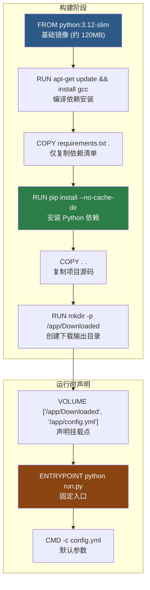
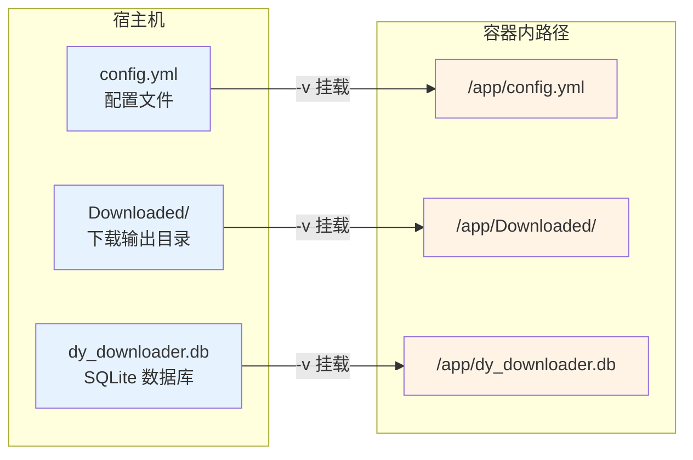

本文档详细解析抖音批量下载工具的 **Docker 容器化部署方案**——从 Dockerfile 的分层设计逻辑、构建上下文过滤策略，到运行时的卷挂载与配置注入机制。读完本页，你将理解容器内每一条指令的意图，并能够独立完成从镜像构建到生产运行的完整流程。

Sources: [Dockerfile](Dockerfile#L1-L19), [.dockerignore](.dockerignore#L1-L17)

## Dockerfile 分层设计解析

项目的 Dockerfile 仅用 19 行便完成了从基础镜像到运行入口的全部定义，其精简程度源于对「每一层只做一件事」原则的严格遵循。下面的流程图展示了完整的构建阶段与运行阶段：



Sources: [Dockerfile](Dockerfile#L1-L19)

### 基础镜像与编译依赖

**`FROM python:3.12-slim`** 选择了 Debian-based 的精简镜像，相比完整的 `python:3.12` 镜像（约 1GB），slim 变体仅保留 Python 运行时的最小依赖集，体积控制在约 120MB。这一选择的关键考量是：项目的 [requirements.txt](requirements.txt#L1-L8) 中包含 `gmssl>=3.2.2`——一个国密算法库，其安装过程需要 C 编译器参与构建本地扩展模块。

因此第二层通过 `apt-get install -y --no-install-recommends gcc` 安装 gcc，同时紧接 `rm -rf /var/lib/apt/lists/*` 清理 APT 缓存，避免缓存残留在最终镜像层中。`--no-install-recommends` 参数确保只安装 gcc 本身而不引入推荐的额外包，进一步压缩镜像体积。

Sources: [Dockerfile](Dockerfile#L1-L7), [requirements.txt](requirements.txt#L1-L8)

### 依赖安装与镜像缓存优化

Dockerfile 将 `COPY requirements.txt .` 和 `RUN pip install` 放在 `COPY . .`（项目源码复制）之前，这是一项经典的 **Docker 层缓存优化**策略。其工作原理如下表所示：

| 触发条件 | 重建范围 | 说明 |
|---------|---------|------|
| 仅修改 `core/` 下源码 | 仅重建 `COPY . .` 及其后的层 | 依赖安装层命中缓存，省去 pip install 耗时 |
| 修改 `requirements.txt` | 从 pip install 层开始全部重建 | 所有依赖重新下载 |
| 修改 `Dockerfile` 前序指令 | 全部重建 | 基础镜像层变动导致全部失效 |

`pip install --no-cache-dir` 参数禁止 pip 将下载的包缓存到本地，因为 Docker 层本身已经充当了缓存角色——在镜像中保留 pip 缓存只会无谓地增大镜像体积。

Sources: [Dockerfile](Dockerfile#L8-L10)

### 入口点与默认参数

```dockerfile
ENTRYPOINT ["python", "run.py"]
CMD ["-c", "config.yml"]
```

这里采用了 **ENTRYPOINT + CMD 分离模式**。`ENTRYPOINT` 定义了不可变的应用入口——[run.py](run.py#L1-L14)，它负责将项目根目录加入 `sys.path` 并调用 [cli/main.py](cli/main.py#L221-L256) 中的 `main()` 函数。`CMD` 提供默认参数 `-c config.yml`，这意味着：

- 直接运行 `docker run douyin-downloader` → 执行 `python run.py -c config.yml`
- 覆盖参数 `docker run douyin-downloader -c custom.yml -t 8` → 执行 `python run.py -c custom.yml -t 8`

Sources: [Dockerfile](Dockerfile#L18-L19), [run.py](run.py#L1-L14), [cli/main.py](cli/main.py#L221-L243)

## 构建上下文过滤（.dockerignore）

Docker 构建时，整个项目目录作为「构建上下文」发送给 Docker 守护进程。[.dockerignore](.dockerignore#L1-L17) 文件定义了排除规则，其设计意图分为三类：

| 排除规则 | 意图 |
|---------|------|
| `.git`, `.github`, `.omx` | 版本控制和 CI 配置，运行时无需 |
| `__pycache__`, `*.pyc`, `*.pyo`, `*.egg-info`, `dist`, `build`, `.pytest_cache`, `.ruff_cache` | Python 编译产物和开发工具缓存 |
| `Downloaded`, `*.db`, `.cookies.json`, `config.yml` | **运行时数据**——下载文件、数据库、Cookie 和配置文件 |

最后一类尤其关键：`config.yml` 和 `.cookies.json` 包含用户的认证凭据，`.dockerignore` 确保它们**绝对不会**被打包进镜像。这些文件必须在容器运行时通过卷挂载注入，这是容器化部署的核心安全原则。

Sources: [.dockerignore](.dockerignore#L1-L17)

## 卷挂载与数据持久化

Dockerfile 中声明了两个卷：`VOLUME ["/app/Downloaded", "/app/config.yml"]`。容器内的关键路径如下：



Sources: [Dockerfile](Dockerfile#L16-L16), [config/default_config.py](config/default_config.py#L1-L55)

### 必需挂载项

| 容器路径 | 宿主机来源 | 说明 |
|---------|-----------|------|
| `/app/config.yml` | 你的配置文件 | 包含 URL 列表、Cookie、代理等所有配置。容器启动时 [ConfigLoader](config/config_loader.py#L16-L36) 读取此文件 |
| `/app/Downloaded` | 下载输出目录 | [FileManager](storage/file_manager.py#L13-L24) 将视频、图片等资产写入此目录。如不挂载，容器删除后数据丢失 |

### 可选挂载项

| 容器路径 | 对应配置 | 说明 |
|---------|---------|------|
| `/app/dy_downloader.db` | `database_path` | SQLite 数据库文件，用于去重和增量下载。默认配置下 [Database](storage/database.py#L7-L19) 在 `/app/` 目录创建此文件。若需要持久化数据库，必须额外挂载 |

Sources: [storage/file_manager.py](storage/file_manager.py#L22-L24), [storage/database.py](storage/database.py#L7-L19), [config/default_config.py](config/default_config.py#L33-L34)

## 环境变量配置注入

除了通过 `config.yml` 挂载配置外，项目还支持通过 Docker 环境变量覆盖部分配置项。[ConfigLoader._load_env_config](config/config_loader.py#L53-L69) 方法在加载 YAML 配置后，检测以下环境变量并以更高的优先级合并到配置中：

| 环境变量 | 覆盖字段 | 类型 | Docker 用法示例 |
|---------|---------|------|----------------|
| `DOUYIN_COOKIE` | `cookie` | 字符串 | `-e DOUYIN_COOKIE="msToken=xxx; ttwid=yyy"` |
| `DOUYIN_PATH` | `path` | 字符串 | `-e DOUYIN_PATH="/data/output"` |
| `DOUYIN_THREAD` | `thread` | 整数 | `-e DOUYIN_THREAD=8` |
| `DOUYIN_PROXY` | `proxy` | 字符串 | `-e DOUYIN_PROXY="http://proxy:7890"` |

**优先级顺序**：`default_config` → `config.yml` → 环境变量。这意味着环境变量拥有最高优先级，适合在 CI/CD 管道或 Docker Compose 中动态注入敏感信息（如 Cookie）。

Sources: [config/config_loader.py](config/config_loader.py#L53-L69)

## 完整部署流程

### 标准构建与运行

```bash
# 1. 构建镜像
docker build -t douyin-downloader:2.0 .

# 2. 准备配置文件（首次部署）
#    请参考 [配置文件详解](3-pei-zhi-wen-jian-xiang-jie-config-yml-quan-zi-duan-shuo-ming-yu-dian-xing-chang-jing-shi-li) 编写 config.yml
#    至少需要配置 link（下载链接）和 cookies（认证凭据）

# 3. 运行容器
docker run --rm \
  -v $(pwd)/config.yml:/app/config.yml:ro \
  -v $(pwd)/Downloaded:/app/Downloaded \
  douyin-downloader:2.0
```

> `--rm` 参数确保容器退出后自动清理。`:ro` 标记将 config.yml 挂载为只读，防止容器内进程意外修改配置。

Sources: [Dockerfile](Dockerfile#L1-L19), [README.md](README.md#L90-L95)

### 通过命令行参数覆盖

由于 Dockerfile 采用 ENTRYPOINT + CMD 模式，你可以直接在 `docker run` 末尾追加参数来覆盖默认行为：

```bash
# 追加下载 URL，并发设为 8
docker run --rm \
  -v $(pwd)/config.yml:/app/config.yml:ro \
  -v $(pwd)/Downloaded:/app/Downloaded \
  douyin-downloader:2.0 \
  -u "https://www.douyin.com/video/7604129988555574538" \
  -t 8

# 使用详细日志模式
docker run --rm \
  -v $(pwd)/config.yml:/app/config.yml:ro \
  -v $(pwd)/Downloaded:/app/Downloaded \
  douyin-downloader:2.0 -v
```

这些参数由 [argparse](cli/main.py#L222-L233) 解析，完整参数列表参见 [命令行参数与运行模式](4-ming-ling-xing-can-shu-yu-yun-xing-mo-shi)。

Sources: [cli/main.py](cli/main.py#L221-L243)

### 通过环境变量注入配置

当不方便挂载配置文件时，可以利用环境变量传递关键参数：

```bash
docker run --rm \
  -e DOUYIN_COOKIE="msToken=xxx; ttwid=yyy; odin_tt=zzz" \
  -e DOUYIN_PROXY="http://host.docker.internal:7890" \
  -e DOUYIN_THREAD=10 \
  -v $(pwd)/config.yml:/app/config.yml:ro \
  -v $(pwd)/Downloaded:/app/Downloaded \
  douyin-downloader:2.0 \
  -u "https://www.douyin.com/user/MS4wLjABAAAAxxxx"
```

> **注意**：即使通过环境变量注入 Cookie，仍需挂载一个包含 `link` 字段的最小 `config.yml`，除非你同时使用 `-u` 参数传入下载链接。

Sources: [config/config_loader.py](config/config_loader.py#L53-L69)

### Docker Compose 编排

对于需要定期运行或管理多个下载任务配置的场景，Docker Compose 是更优的编排方案。以下是一个参考配置：

```yaml
# docker-compose.yml
version: "3.8"

services:
  douyin-downloader:
    build: .
    image: douyin-downloader:2.0
    container_name: douyin-dl
    volumes:
      - ./config.yml:/app/config.yml:ro
      - ./Downloaded:/app/Downloaded
      - ./data:/app/dy_downloader.db  # 持久化数据库
    environment:
      - DOUYIN_PROXY=http://host.docker.internal:7890
    # 如需定时执行，取消注释以下行并按需调整 cron 表达式
    # restart: "no"
    # labels:
    #   - "ofelia.enabled=true"
    #   - "ofelia.job-exec.douyin-dl.schedule=0 0 */6 * * *"
    #   - "ofelia.job-exec.douyin-dl.command=python run.py -c config.yml"
```

运行方式：

```bash
# 构建并运行
docker compose up --build

# 后台运行
docker compose up -d --build
```

Sources: [Dockerfile](Dockerfile#L1-L19), [config/default_config.py](config/default_config.py#L33-L34)

## 容器内运行时行为要点

### 网络与代理

容器默认使用 bridge 网络模式。如果宿主机运行了代理服务，需使用 `host.docker.internal`（Docker Desktop 环境）或宿主机的实际 IP 地址来访问代理。配置方式有两种：

- 在 `config.yml` 中设置 `proxy: "http://host.docker.internal:7890"`
- 通过环境变量 `-e DOUYIN_PROXY=http://host.docker.internal:7890`

[API 客户端](core/api_client.py#L46-L47) 在创建 `aiohttp` 会话时会读取此代理配置。

Sources: [core/api_client.py](core/api_client.py#L46-L47)

### 浏览器兜底的限制

项目的浏览器兜底功能依赖 [Playwright](tools/cookie_fetcher.py)，而当前 Dockerfile **并未安装 Playwright 及 Chromium**。这意味着在容器环境中：

- `browser_fallback.enabled: true` 的 `headless: false` 模式不可用（容器无图形界面）
- `auto_cookie: true` 的自动获取 Cookie 功能不可用
- 建议**在容器外**预先获取 Cookie 并写入 `config.yml`，再挂载到容器中

如需在容器中启用浏览器兜底，需在 Dockerfile 中追加以下内容：

```dockerfile
RUN pip install playwright>=1.40.0 && \
    python -m playwright install chromium --with-deps
```

并将 `browser_fallback.headless` 设为 `true`。

Sources: [pyproject.toml](pyproject.toml#L34-L37), [config/default_config.py](config/default_config.py#L48-L54)

### 数据库持久化

默认配置下 SQLite 数据库文件路径为 `dy_downloader.db`，位于 `/app/` 目录下。[Database](storage/database.py#L7-L19) 模块使用 `aiosqlite` 进行异步读写。如果不额外挂载此文件，容器删除后去重记录和下载历史将丢失。建议通过卷挂载将其持久化到宿主机：

```bash
docker run --rm \
  -v $(pwd)/config.yml:/app/config.yml:ro \
  -v $(pwd)/Downloaded:/app/Downloaded \
  -v $(pwd)/data/dy_downloader.db:/app/dy_downloader.db \
  douyin-downloader:2.0
```

Sources: [storage/database.py](storage/database.py#L7-L19), [config/default_config.py](config/default_config.py#L33-L34)

## 常见问题与排查

| 问题现象 | 可能原因 | 解决方案 |
|---------|---------|---------|
| `Config file not found: config.yml` | 未挂载配置文件 | 添加 `-v $(pwd)/config.yml:/app/config.yml` |
| Cookie 无效/下载失败 | Cookie 过期或挂载路径错误 | 确认 `config.yml` 中 `cookies` 字段有效，参见 [Cookie 获取与认证配置](5-cookie-huo-qu-yu-ren-zheng-pei-zhi) |
| 下载文件在容器重启后消失 | 未挂载 Downloaded 目录 | 添加 `-v $(pwd)/Downloaded:/app/Downloaded` |
| 网络连接超时 | 容器无法访问抖音服务器 | 配置代理 `-e DOUYIN_PROXY=http://host.docker.internal:7890` |
| pip install 失败（gmssl 编译错误） | 基础镜像缺少编译工具 | 确认 Dockerfile 中 `apt-get install gcc` 未被删除 |
| 容器运行后立即退出 | 配置文件中 `link` 列表为空 | 确保 `config.yml` 包含至少一个下载链接，或使用 `-u` 参数传入 |

Sources: [cli/main.py](cli/main.py#L128-L156), [Dockerfile](Dockerfile#L5-L7)

## 镜像体积与优化参考

当前 Dockerfile 构建的镜像预估体积如下：

| 层 | 估算增量 | 累计 |
|---|---------|------|
| python:3.12-slim 基础镜像 | ~120 MB | 120 MB |
| gcc 安装（含 apt 缓存清理） | ~30 MB | 150 MB |
| pip install（7 个包） | ~50 MB | 200 MB |
| 项目源码复制 | ~1 MB | ~201 MB |

> **优化方向**：若需进一步压缩镜像，可考虑使用 **多阶段构建**——在构建阶段安装 gcc 并编译依赖，在最终阶段仅复制编译产物到纯 slim 镜像中。这样可以将 gcc 从最终镜像中完全移除，预计节省约 30MB。但鉴于当前镜像体积已在可接受范围，项目选择了更简洁的单阶段方案。

Sources: [Dockerfile](Dockerfile#L1-L19), [requirements.txt](requirements.txt#L1-L8)

---

**阅读进阶**：理解容器化部署后，建议继续阅读以下页面以完善全局认知：
- [项目打包配置（pyproject.toml）与依赖管理](29-xiang-mu-da-bao-pei-zhi-pyproject-toml-yu-yi-lai-guan-li)——了解镜像中安装的每个依赖包的用途
- [配置文件详解](3-pei-zhi-wen-jian-xiang-jie-config-yml-quan-zi-duan-shuo-ming-yu-dian-xing-chang-jing-shi-li)——掌握挂载到容器中的配置文件全字段含义
- [Cookie 获取与认证配置](5-cookie-huo-qu-yu-ren-zheng-pei-zhi)——容器部署前必须完成的认证准备工作
- [测试体系](31-ce-shi-ti-xi-pytest-yi-bu-ce-shi-yu-he-xin-mo-kuai-fu-gai)——了解项目的质量保障机制