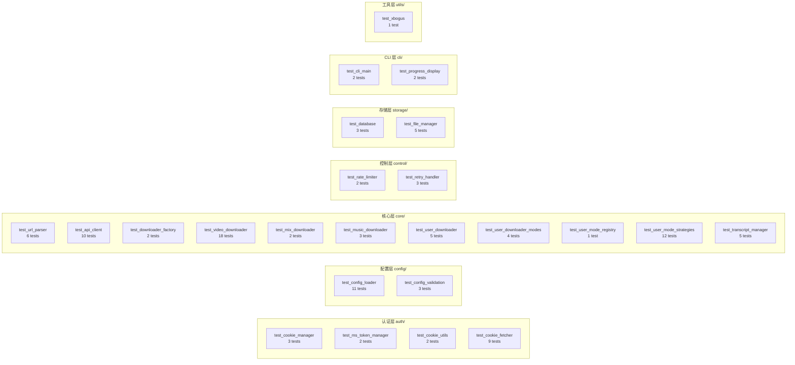

本项目采用 **pytest + pytest-asyncio** 构建了一套以异步测试为核心的自动化测试体系，覆盖了从 URL 解析、API 签名、下载器路由到策略模式、数据持久化等关键路径。全部 24 个测试文件共约 121 个测试用例、3,700 余行代码，形成了对生产代码的系统性验证网络。本文将从框架配置、异步测试模式、隔离策略、Mock 技巧四个维度进行架构级解析，并以模块覆盖全景图收尾。

Sources: [pyproject.toml](pyproject.toml#L56-L61)

## 测试框架与构建配置

项目在 `[tool.pytest.ini_options]` 中声明了三个关键配置：

| 配置项 | 值 | 作用 |
|---|---|---|
| `asyncio_mode` | `"auto"` | 自动识别 `async def test_` 为协程测试，无需显式标记 |
| `asyncio_default_fixture_loop_scope` | `"function"` | 每个测试函数拥有独立事件循环，避免状态泄漏 |
| `pythonpath` | `["."]` | 将项目根目录加入 Python 路径，测试直接 `from core.xxx import` |

测试依赖声明在 `dev` 可选依赖组中，通过 `pip install -e ".[dev]"` 一键安装 pytest ≥ 7.0 和 pytest-asyncio ≥ 0.21：

```toml
[project.optional-dependencies]
dev = [
    "pytest>=7.0",
    "pytest-asyncio>=0.21",
    "ruff>=0.4.0",
]
```

Sources: [pyproject.toml](pyproject.toml#L34-L48), [pyproject.toml](pyproject.toml#L56-L61)

## 异步测试的两种执行模式

项目中异步测试存在两种并行的执行模式，它们的选择取决于测试的复杂度和依赖深度：

**模式一：`@pytest.mark.asyncio` 装饰器 + 原生 `await`**。这是主推的写法，pytest-asyncio 提供独立事件循环，可直接 `await` 被测协程。API 客户端的分页标准化测试就是典型示例——`await client.get_user_post(...)` 的返回值可以直接在断言中使用：

```python
@pytest.mark.asyncio
async def test_get_user_post_returns_normalized_dto(monkeypatch):
    client = DouyinAPIClient({"msToken": "token-1"})
    # ... monkeypatch 替换 _request_json ...
    data = await client.get_user_post("sec-1", max_cursor=0, count=20)
    assert data["items"] == [{"aweme_id": "111"}]
    assert data["has_more"] is True
```

**模式二：`asyncio.run()` 手动驱动**。当测试需要构造复杂的手工 Fake 对象（如策略模式中的 `_Downloader` 仿制品），或需要更细粒度控制事件循环生命周期时采用。六种下载策略的测试大量使用此模式：

```python
def test_like_strategy_collects_items_from_api():
    strategy = LikeUserModeStrategy(_Downloader())
    items = asyncio.run(strategy.collect_items("sec_uid_x", {"uid": "uid-1"}))
    assert [item["aweme_id"] for item in items] == ["111"]
```

两种模式的核心差异在于**事件循环所有权**：`@pytest.mark.asyncio` 由框架管理循环的创建与销毁，`asyncio.run()` 则由测试自行控制。在实际项目中，简单异步调用场景倾向于模式一，需要嵌套多层手工 Mock 的场景倾向于模式二。

Sources: [test_api_client.py](tests/test_api_client.py#L163-L191), [test_user_mode_strategies.py](tests/test_user_mode_strategies.py#L24-L42)

## 测试隔离策略：tmp_path + 手工 Fake 类

项目**没有使用 conftest.py 共享 fixture**，而是采用每个测试文件自包含的方式组织辅助代码。这种设计选择使得每个测试文件都是一个独立的、可独立运行的验证单元。

### 文件系统隔离

所有涉及文件 I/O 的测试都依赖 pytest 内置的 `tmp_path` fixture，确保测试之间零干扰。数据库测试直接在临时目录创建 SQLite 文件，文件管理器测试同样如此：

```python
@pytest.mark.asyncio
async def test_database_aweme_lifecycle(tmp_path):
    db_path = tmp_path / "test.db"
    database = Database(str(db_path))
    await database.initialize()
    # ... 完整的 CRUD 生命周期验证 ...
    await database.close()
```

配置加载器测试则在 `tmp_path` 下创建临时 `config.yml` 文件，并可能同时创建 `config/cookies.json` 模拟自动 Cookie 读取场景。

Sources: [test_database.py](tests/test_database.py#L9-L42), [test_config_loader.py](tests/test_config_loader.py#L63-L92)

### 手工 Fake 类体系

项目形成了三类可复用的手工 Fake 对象，它们在多个测试文件中以相似模式反复出现：

| Fake 类 | 职责 | 典型出现位置 |
|---|---|---|
| `_FakeConfig` / 内联 Config | 模拟配置字典的 `get()` 接口 | test_user_downloader.py, test_user_mode_strategies.py |
| `_NoopRateLimiter` | 立即返回的空限速器，消除测试中的等待 | test_user_mode_strategies.py |
| `_FakeAPIClient` | 返回预设分页数据，记录调用参数 | test_user_downloader.py, test_user_downloader_modes.py |

值得注意的是，这些 Fake 类**没有跨文件复用**（项目无 conftest.py），而是每个测试文件独立定义自己的版本。这是一种有意的架构选择——每个测试文件通过自定义 Fake 精确控制它所需要的行为子集，避免共享 fixture 的隐式耦合。

Sources: [test_user_downloader.py](tests/test_user_downloader.py#L19-L58), [test_user_mode_strategies.py](tests/test_user_mode_strategies.py#L11-L21)

## Mock 技巧全景：monkeypatch、AsyncMock 与 Fake 三件套

### monkeypatch：方法替换与环境变量控制

`monkeypatch` 是项目中最核心的 Mock 工具，承担三种职责：

**1. 替换模块级属性**——API 客户端签名测试通过替换整个类来模拟签名行为：

```python
def test_build_signed_path_prefers_abogus(monkeypatch):
    monkeypatch.setattr(api_module, "BrowserFingerprintGenerator", _FakeFp)
    monkeypatch.setattr(api_module, "ABogus", _FakeABogus)
```

**2. 替换实例方法**——下载器测试通过 `monkeypatch.setattr` 替换被测对象的方法（如 `_should_download`、`_download_aweme_assets`），将网络 I/O 和文件系统操作短路为确定性返回值：

```python
monkeypatch.setattr(downloader, "_should_download", _always_true)
monkeypatch.setattr(downloader, "_download_aweme_assets", _always_true)
```

**3. 控制环境变量**——配置加载器测试通过 `monkeypatch.setenv("DOUYIN_THREAD", "8")` 验证环境变量覆盖逻辑。

Sources: [test_api_client.py](tests/test_api_client.py#L23-L46), [test_user_downloader.py](tests/test_user_downloader.py#L131-L154)

### unittest.mock：HTTP 响应模拟

`AsyncMock` 和 `MagicMock` 主要出现在需要精确模拟 HTTP 响应的场景——文件管理器的原子下载测试和视频下载器的资产下载测试。以下模式在项目中反复出现：

```python
mock_response = AsyncMock()
mock_response.status = 200
mock_response.content_length = len(content)

async def iter_chunked(size):
    yield content

mock_response.content = MagicMock()
mock_response.content.iter_chunked = iter_chunked
```

这个模式模拟了 `aiohttp.ClientResponse` 的分块读取接口，使得测试可以在不启动真实 HTTP 服务器的情况下验证下载逻辑（包括原子写入、大小校验、临时文件清理等）。

Sources: [test_file_manager.py](tests/test_file_manager.py#L43-L71)

### 绑定方法替换技巧

当需要替换实例的**实例方法**时（而非模块级函数），项目使用 `.__get__()` 描述符协议将普通函数绑定为绑定方法。这在视频下载器和音乐下载器测试中广泛使用：

```python
async def _fake_download_with_retry(self, _url, save_path, _session, **_kwargs):
    saved_paths.append(save_path)
    return True

downloader._download_with_retry = _fake_download_with_retry.__get__(
    downloader, VideoDownloader
)
```

`__get__(downloader, VideoDownloader)` 将普通异步函数转换为绑定方法，使得 `self` 参数正确指向被替换的实例。

Sources: [test_video_downloader.py](tests/test_video_downloader.py#L170-L176), [test_music_downloader.py](tests/test_music_downloader.py#L43-L51)

## 模块覆盖全景：24 个测试文件 × 7 个架构层

以下全景图展示了测试文件与生产模块的对应关系：



### 测试文件规模与复杂度分布

| 测试文件 | 行数 | 测试重点 | 主要 Mock 手段 |
|---|---|---|---|
| test_video_downloader.py | 741 | 视频资产下载、图文处理、Manifest 写入 | `monkeypatch` + `__get__` 绑定 |
| test_user_mode_strategies.py | 524 | 六种策略的分页、展开、去重、限数逻辑 | 手工 Fake 类 + `asyncio.run` |
| test_api_client.py | 373 | 签名路由、分页标准化、浏览器兜底 | `monkeypatch` 模块替换 |
| test_config_loader.py | 327 | 合并策略、Cookie 自动读取、别名归一化 | `tmp_path` + `monkeypatch.setenv` |
| test_user_downloader.py | 270 | 浏览器兜底采集、进度报告 | 手工 Fake API Client |
| test_user_downloader_modes.py | 227 | 多模式组合、跨模式去重、权限校验 | 手工 Fake 类 |
| test_cookie_fetcher.py | 169 | Playwright 页面导航、登录等待、Token 提取 | FakePage/SamplePage |
| test_music_downloader.py | 166 | 音乐资产下载、URL 扩展名推断、降级策略 | `monkeypatch` + `__get__` 绑定 |
| test_database.py | 119 | SQLite CRUD、连接复用并发安全 | `monkeypatch` + `tmp_path` |
| test_cli_main.py | 104 | 短链解析→下载器创建完整链路 | `monkeypatch` 模块级替换 |
| test_file_manager.py | 99 | 原子下载、大小校验、路径构建 | `AsyncMock` HTTP 响应模拟 |
| test_transcript_manager.py | 99 | API Key 缺失跳过、输出目录映射 | 手工 FakeDatabase |

Sources: [tests/](tests/)（全目录结构）

## 关键测试场景解析

### 场景一：API 客户端的 AID 候选重试

视频详情接口存在内容过滤风险——某些 AID 参数可能返回 `filter_reason`。测试验证了自动切换到下一个 AID 候选的重试逻辑：

```python
async def _fake_request_json(path, params, **kwargs):
    aid = params.get("aid")
    if aid == client._DETAIL_AID_CANDIDATES[0]:
        return {"aweme_detail": None, "filter_detail": {"filter_reason": "images_base"}}
    return {"aweme_detail": {"aweme_id": "123", "aweme_type": 68}, "status_code": 0}
```

测试断言 `call_count == 2`，确认第一次被过滤后确实触发了第二次请求。

Sources: [test_api_client.py](tests/test_api_client.py#L312-L350)

### 场景二：跨模式去重验证

用户下载器支持组合模式（如同时下载 post + like），需要跨模式去重。测试通过共享 `aweme_id` 的 Fake 数据验证了去重逻辑：

```python
# post 返回 [111, 222]，like 返回 [222, 333]
result = asyncio.run(downloader.download({"sec_uid": "sec_uid_x"}))
assert result.total == 3  # 去重后仅 3 条（111, 222, 333）
```

Sources: [test_user_downloader_modes.py](tests/test_user_downloader_modes.py#L128-L148)

### 场景三：SQLite 连接复用的并发安全性

数据库层需要保证在并发调用 `_get_conn()` 时只创建一个连接。测试通过 `asyncio.gather` 同时发起两个 `_get_conn()` 调用，配合 Fake 连接验证了连接单例语义：

```python
conn_a, conn_b = await asyncio.gather(database._get_conn(), database._get_conn())
assert conn_a is conn_b
assert connect_calls == [str(tmp_path / "test.db")]  # 仅创建一次
```

Sources: [test_database.py](tests/test_database.py#L90-L119)

### 场景四：配置别名归一化

`mix` 和 `allmix` 是同一概念的历史别名，配置加载器需要处理冲突归一化。测试使用 `@pytest.mark.parametrize` 覆盖了五种别名组合场景：

```python
@pytest.mark.parametrize(
    "number_cfg,increase_cfg,expected_mix_number,expected_mix_increase,expect_warning",
    [
        ({"mix": 9}, {"mix": True}, 9, True, False),
        ({"allmix": 7}, {"allmix": True}, 7, True, False),
        ({"mix": 5, "allmix": 3}, {"mix": False, "allmix": True}, 5, False, True),
        ...
    ],
)
```

Sources: [test_config_loader.py](tests/test_config_loader.py#L283-L328)

## 进度条测试的仿制品设计

进度条测试采用了精巧的仿制品（Test Double）设计：`_FakeProgress` 类模拟了 Rich 库的 `Progress` 对象，将所有 `add_task`、`update`、`advance`、`remove_task` 调用记录到可查询的字典结构中。`_FakeProgressContext` 则模拟了上下文管理器协议。这使得测试可以在完全不依赖 Rich 渲染的情况下验证进度计数逻辑：

```python
display.advance_item("success", "a1")
display.advance_item("failed", "a2")
assert fake_progress.tasks[overall_task_id]["completed"] == 2
```

Sources: [test_progress_display.py](tests/test_progress_display.py#L6-L46)

## 架构特征总结与扩展建议

本测试体系具有三个鲜明的架构特征：

**自包含原则**——无 conftest.py、无共享 fixture，每个测试文件是完全独立的验证单元。这在重构时降低了级联失败的风险，但也意味着 Fake 类存在一定的代码重复。

**深 Mock 策略**——通过 `monkeypatch` 在实例方法级别进行替换，使得每个测试可以精确控制被测方法的依赖图，在无需启动真实 HTTP 服务器、无需真实数据库的前提下验证业务逻辑。

**异步优先**——121 个测试中有超过 70% 涉及异步代码，通过 `asyncio_mode = "auto"` 和 `asyncio.run()` 双模式覆盖了全部异步路径，与生产代码的异步架构保持一致。

如果需要扩展测试覆盖，建议关注以下方向：

- 使用 `@pytest.fixture` 将高频 Fake 对象（如 `_NoopRateLimiter`、`_FakeConfig`）收敛到 conftest.py 中，减少样板代码
- 为签名算法模块（`utils/abogus.py`）补充测试，当前仅 `xbogus.py` 有覆盖
- 考虑引入 pytest-cov 生成覆盖率报告，量化覆盖缺口

Sources: [tests/](tests/)（全目录结构）

## 相关阅读

- 测试中频繁验证的 API 签名机制详见 [抖音 API 客户端的请求封装与分页标准化](11-dou-yin-api-ke-hu-duan-douyinapiclient-de-qing-qiu-feng-zhuang-yu-fen-ye-biao-zhun-hua) 和 [X-Bogus 与 A-Bogus 签名算法原理](12-x-bogus-yu-a-bogus-qian-ming-suan-fa-yuan-li)
- 策略模式测试的背景知识参见 [六种下载模式策略](15-liu-chong-xia-zai-mo-shi-ce-lue-post-like-mix-music-collect-collectmix) 和 [UserDownloader 与 UserModeRegistry 的设计](14-userdownloader-yu-usermoderegistry-de-she-ji)
- 数据库测试验证的持久化逻辑参见 [SQLite 数据库设计与去重、增量下载支持](20-sqlite-shu-ju-ku-she-ji-yu-qu-zhong-zeng-liang-xia-zai-zhi-chi)
- 项目打包配置中的测试依赖声明参见 [项目打包配置与依赖管理](29-xiang-mu-da-bao-pei-zhi-pyproject-toml-yu-yi-lai-guan-li)