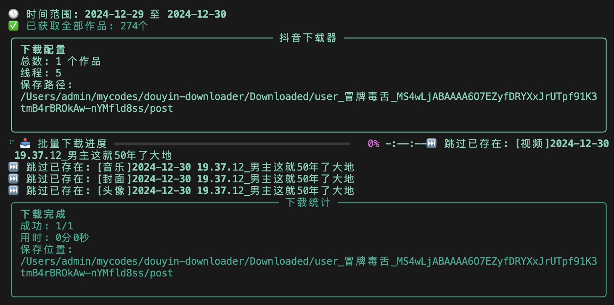
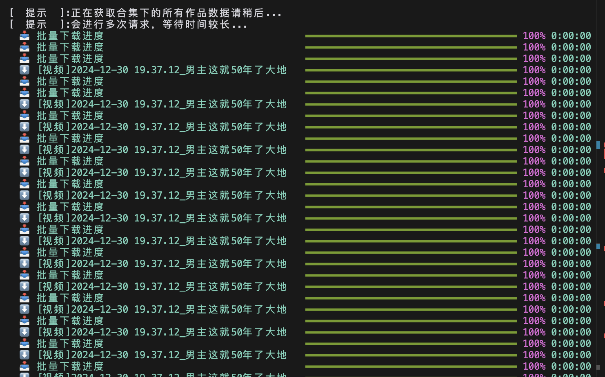
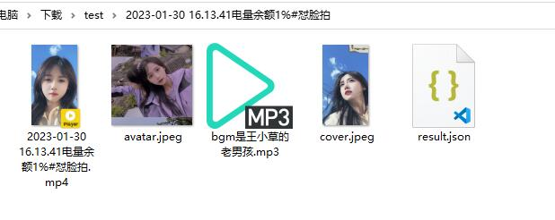

# DouYin Downloader

<a href="https://trendshift.io/repositories/13156" target="_blank"></a>

DouYin Downloader 是一个用于批量下载抖音内容的工具。基于抖音 API 实现，支持命令行参数或 YAML 配置文件方式运行，可满足大部分抖音内容的下载需求。

## ✨ 项目特点

- **多种内容支持**
  - 视频、图集、音乐、直播信息下载
  - 支持个人主页、作品分享、直播、合集、音乐集合等多种链接
  - 支持去水印下载
  
- **批量下载能力**
  - 多线程并发下载
  - 支持多链接批量下载
  - 自动跳过已下载内容
  
- **灵活配置**
  - 支持命令行参数和配置文件两种方式
  - 可自定义下载路径、线程数等
  - 支持下载数量限制
  
- **增量更新**
  - 支持主页作品增量更新
  - 支持数据持久化到数据库
  - 可根据时间范围过滤


<!-- 刘涵潇项目介绍 -->
# Project Background
1. Market Level
The Booming Development of the Short Video Industry
In recent years, the short video industry has witnessed explosive growth. As a globally renowned short video platform, TikTok (known as Douyin in China) has attracted hundreds of millions of users worldwide with its rich and diverse content and powerful social interaction features. A large number of users browse, create, and share videos on TikTok every day, making it a vast treasure trove of content.
The Increasing Demand for Content Dissemination
With the popularization of short videos, the dissemination and sharing of content have become increasingly important. Whether it is individual users who want to save their favorite videos or enterprises and media institutions that need to obtain high-quality content from TikTok for secondary creation and dissemination, there is a strong demand for convenient download tools.

2. User Level
For individual users, there are many interesting and valuable video contents on TikTok, such as funny skits, food preparation tutorials, and travel landscapes. They hope to save these liked contents to their local devices for easy viewing at any time and sharing with friends. However, the TikTok platform itself does not support batch downloading and watermark removal functions, which brings many inconveniences to users when saving content. 

3. Technical Level 
Advancements in Video Processing Technology
In recent years, remarkable progress has been made in video processing technology. Algorithms for video decoding, encoding, and watermark removal have been continuously optimized and improved. These technological advancements make it possible to develop a tool that can download and remove watermarks from videos efficiently and with high quality.
The Popularization of Mobile Devices
The popularization of smartphones and tablet computers has provided a broad market space for the development and application of TikTok download tools. Users can use the download tool anytime and anywhere on their mobile devices to conveniently and quickly obtain and save TikTok content.

# Introduction to the Main Features of the Project
1. Watermark Removal Features
Video Watermark Removal
It adopts advanced image recognition and processing algorithms to intelligently identify the location and characteristics of watermarks in TikTok videos and accurately remove them. After watermark removal, the video picture is clear and natural, without black edges, blurriness, or other flaws, ensuring the visual enjoyment of the video.

2. Picture Watermark Removal in Albums
For the watermarks on pictures in TikTok albums, the tool can quickly locate and remove them. While removing the watermarks, it protects the key information and details of the photos to ensure the integrity and aesthetics of the pictures.

3. Personalized Features
Custom Settings
It allows users to customize download parameters according to their own needs. For example, users can set the default download path, choose whether to automatically overwrite files with the same name, and adjust the number of download threads. Users can also set batch naming rules, such as naming by video title, release time, or serial number, making file naming more standardized and orderly.
Favorites Function
Users can add videos, albums, and other content of interest to the favorites folder for quick subsequent downloading or viewing. The favorites folder supports classified management. Users can create different favorite folders to classify and store different types of materials.

4. Search and Recommendation Features
Search Function
It provides a powerful search function. Users can search for videos, music, and other content on TikTok through keywords. The search results will display relevant information such as the video title, author, and release time, facilitating users to quickly find the required content.
Recommendation Function
Based on users' download history, browsing records, and collection preferences, it recommends relevant TikTok content to users. The recommended content is updated in real-time, providing users with a personalized content discovery experience and helping them find more videos and music that match their interests.

# Project Advantages
1. User Experience Level
Free of charge and ad-free: Users can enjoy the service without spending a penny and being disturbed by annoying ads.

Simple and convenient operation: The user interface is designed to be intuitive, enabling users to complete download tasks quickly and easily.
 
Comprehensive functions: It offers a wide range of features, including video download, picture watermark removal in albums, personalized settings, search, and recommendation, meeting various user needs.
 
Advanced watermark removal technology: Utilizing state-of-the-art image recognition and processing algorithms, it can accurately identify and remove watermarks from videos and pictures while maintaining high-quality output.
 
High-efficiency download capability: With optimized download algorithms and support for multi-threaded downloading, it can significantly improve download speed and stability.

2. Market Competitiveness Level
Differentiated functions: Compared with other similar tools on the market, it stands out with its unique combination of features and superior performance, providing users with a more comprehensive and high-quality service experience.
 
Good user reputation: Positive feedback and high praise from a large number of users have been received, which helps to attract more new users through word-of-mouth promotion.
 
Continuous updating and optimization: The development team is committed to continuously improving and upgrading the product based on user feedback and market changes, ensuring that it remains at the forefront of the industry.

3. Commercial Potential Level
Diverse potential profit models: In addition to the free basic functions, it can explore various commercial opportunities, such as offering premium membership services with additional features, advertising cooperation, and content monetization, to achieve sustainable business development.
 
Wide application scenario expansion: It can be applied in various fields, such as personal entertainment, education and training, marketing and promotion, etc., expanding its user base and market space.
 
4. Cross-Platform Compatibility
Some download tools can cover multiple operating systems, such as Windows and Mac, and some also support mobile devices, meeting the device requirements of different users and providing a seamless user experience across different platforms.

5. Safe and Reliable
After strict virus detection and security verification, it ensures that users will not be threatened by security risks during use. Moreover, most of them are green and free, not occupying too many system resources, ensuring the smooth operation of the user's device.

6. Convenient for Collection and Analysis
It is convenient for TikTok fans to collect their favorite videos for offline viewing. It also provides convenience for video editors who need to obtain materials from TikTok and data analysts who study TikTok trends. It helps them quickly collect the required materials and data.

# Future Plans of the Project
1. Enhance Download Functions
Support More Platforms: In addition to Douyin, gradually support content downloads from other mainstream short - video platforms such as Kuaishou and Bilibili, so as to meet users' needs for one - stop acquisition of multi - platform video resources.
Optimize Download Speed and Stability: Continuously optimize the download algorithm and network connection to increase the download speed and reduce the download failure rate. Especially in poor network environments, stable downloads can still be guaranteed.

2. Improve Watermark Removal Functions
Enhance Watermark Removal Effect: Constantly improve the watermark removal algorithm to enable it to more accurately identify and remove various complex watermark patterns while ensuring that the quality of videos and pictures is not affected.
Support Custom Watermark Removal Areas: Allow users to manually select the position and scope of the watermarks to be removed, further improving the flexibility and accuracy of watermark removal.

3. Optimize Interface Design
Comprehensively redesign the interface of the download tool. Adopt a simple and intuitive design style and simplify the operation process. When new users use it for the first time, they can quickly get started within 1 minute through guided animations and prompts. Add personalized skin settings, enabling users to choose different theme colors and interface layouts according to their preferences and create an exclusive download experience.

## 🚀 Getting Started <!-- by 李镭雨 -->
## 🚀 快速开始

### Installation

1. 安装 Python 依赖：
```bash
pip install -r requirements.txt
```
如果在安装过程中遇到网络问题，导致下载缓慢或失败，您可以尝试使用国内的镜像源，例如使用清华大学的镜像源：
```bash
pip install -r requirements.txt -i https://pypi.tuna.tsinghua.edu.cn/simple
```
若出现 Permission denied 权限错误（常见于 Linux 和 macOS 系统），可以在命令前添加 sudo 提升权限，但请注意，这可能需要您输入系统密码：
```bash
sudo pip install -r requirements.txt
```
If you encounter network issues during the installation process that result in slow or failed downloads, you can try using domestic mirror sources, such as Tsinghua University's mirror source:
```bash
pip install -r requirements.txt -i https://pypi.tuna.tsinghua.edu.cn/simple
```
If a Permission denied error occurs (common in Linux and macOS systems), you can add sudo before the command to elevate permissions, but please note that this may require you to enter your system password:
```bash
sudo pip install -r requirements.txt
```

2. Copy Config File：
```bash
cp config.example.yml config.yml
```

### 配置

编辑 `config.yml` 文件，设置：
- 下载链接
- 保存路径
- Cookie 信息（从浏览器开发者工具获取）
- 其他下载选项

### 运行

**方式一：使用配置文件（推荐）**
```bash
python DouYinCommand.py
```

**方式二：使用命令行**
```bash
python DouYinCommand.py -C True -l "抖音分享链接" -p "下载路径"
```

## 使用交流群


## 使用截图






## 📝 支持的链接类型

- 作品分享链接：`https://v.douyin.com/xxx/`
- 个人主页：`https://www.douyin.com/user/xxx`
- 单个视频：`https://www.douyin.com/video/xxx`
- 图集：`https://www.douyin.com/note/xxx`
- 合集：`https://www.douyin.com/collection/xxx`
- 音乐原声：`https://www.douyin.com/music/xxx`
- 直播：`https://live.douyin.com/xxx`

## 🛠️ 高级用法

### 命令行参数

基础参数：
```
-C, --cmd            使用命令行模式
-l, --link          下载链接
-p, --path          保存路径
-t, --thread        线程数（默认5）
```

下载选项：
```
-m, --music         下载音乐（默认True）
-c, --cover         下载封面（默认True）
-a, --avatar        下载头像（默认True）
-j, --json          保存JSON数据（默认True）
```

更多参数说明请使用 `-h` 查看帮助信息。

### 示例命令

1. 下载单个视频：
```bash
python DouYinCommand.py -C True -l "https://v.douyin.com/xxx/"
```

2. 下载主页作品：
```bash
python DouYinCommand.py -C True -l "https://v.douyin.com/xxx/" -M post
```

3. 批量下载：
```bash
python DouYinCommand.py -C True -l "链接1" -l "链接2" -p "./downloads"
```

更多示例请参考[使用示例文档](docs/examples.md)。

## 📋 注意事项

1. 本项目仅供学习交流使用
2. 使用前请确保已安装所需依赖
3. Cookie 信息需要自行获取
4. 建议适当调整线程数，避免请求过于频繁

## 🤝 贡献

欢迎提交 Issue 和 Pull Request。

## 📜 许可证

本项目采用 [MIT](LICENSE) 许可证。

## 🙏 鸣谢

- [TikTokDownload](https://github.com/Johnserf-Seed/TikTokDownload)
- 本项目使用了 ChatGPT 辅助开发，如有问题请提 Issue

## 📊 Star History

[](https://star-history.com/#jiji262/douyin-downloader&Date)


# License

[MIT](https://opensource.org/licenses/MIT) 

<!-- 邹爱华主要功能使用教程 -->
（one） Configuration file format
Process: By creating and editing the config. yml configuration file, it is easy to manage download parameters.
Basic configuration: Set download link, save path, and download options (such as music, cover, avatar, etc.).
Download link: Supports work links or user homepage links.
Save Path: Specify the storage directory for the downloaded file.
Download options: You can choose whether to download music, cover, avatar, and save JSON data.
Time range filtering: Only download works within a specific time range.
Incremental Update: Supports incremental updates for publishing works, collections, etc.
Quantity limit: Limit the number of downloaded works, such as the latest 10 released works.
This is a complete configuration file and instructions of the Tiktok video download tool. Let me analyze the functions and implementation logic of each part in detail:
#Download link
link:
- " https://v.douyin.com/xxxxx/ # Work Link
- " https://www.douyin.com/user/xxxxx # User homepage
#Save Path
path: "./downloads"
#Download Options
Music: true # Download video soundtrack (MP3 format)
Cover: true # Download video cover (JPG/PNG)
Avatar: true # Download author avatar (valid in user homepage mode)
JSON: true # Save video metadata (author information, publication time, etc.)
Execute the following command:
python DouYinCommand.py
#Time range filtering
Only download works within the specified time range
Start_time: "2023-01-01" # Start time
End_time: "2023-12-31" # End time
#Or use 'now' to indicate the current time
end_time: "now"
#Incremental update
increase:
Post: true # Skip downloaded published works
Like: false # Always download liked works (without checking for duplicates)
Mix: true # Skip downloaded collection content
#Quantity restriction strategy
number:
Post: 10 # Retrieve 10 items in reverse order of publication time
Like: 5 # Download up to 5 like works
Mix: 3 # Only 3 videos per collection
（two） Command line mode
Single video: Download a single work.
User homepage: Download works posted or liked by users, supporting simultaneous downloading of multiple types.
Collection: Download the specified collection or all collections of the user.
Custom save options: You can set not to download music, cover art, or customize the save path.
Batch Download: Supports multi link batch download and multi-threaded acceleration.
#Download a single video
python DouYinCommand.py -C True -l " https://v.douyin.com/xxxxx/ "
Download user homepage works
#Download and publish works
python DouYinCommand.py -C True -l " https://www.douyin.com/user/xxxxx " -M post
#Download and like works
python DouYinCommand.py -C True -l " https://www.douyin.com/user/xxxxx " -M like
#Simultaneously download, publish, and like works
python DouYinCommand.py -C True -l " https://www.douyin.com/user/xxxxx " -M post -M like
Download Collection
#Download a single collection
python DouYinCommand.py -C True -l " https://www.douyin.com/collection/xxxxx "
#Download all user collections
python DouYinCommand.py -C True -l " https://www.douyin.com/user/xxxxx " -M mix
Customize save options
#Do not download music and covers
Python DouYinCommander. py - C True - l "Link" - m False - c False
#Customize save path
Python DouYinCommand. py - C True - l "Link" - p "./mydownloads
Batch download
#Download multiple links
Python DouYinCommander. py - C True - l "Link 1" - l "Link 2" - l "Link 3"
#Using multithreading
Python DouYinCommander. py - C True - l "Link" - t 10
（three）. Advanced usage
Cookie settings: Resolve access restriction issues.
Database support: Enable the database to support incremental updates.
Folder style: Control whether to create separate folders for each work.
Cookie settings: (Anti crawling)
#Cookie settings
If you encounter access restrictions, you can set cookies:
#Configuration file format:
cookies:
MsToken: "xxx" # Dynamic Token
Ttwid: "xxx" # Device Fingerprint
Odin_tt: "xxx" # User ID
#Command line method:
Python DouYinCommand. py - C True - l "Link" - cookie "msToken=xxx;  ttwid=xxx; "
#Database support
#Enable database to support incremental updates:
database: true
#Folder Style
#Control file saving structure:
Folderstyle: true # Create a separate folder for each work