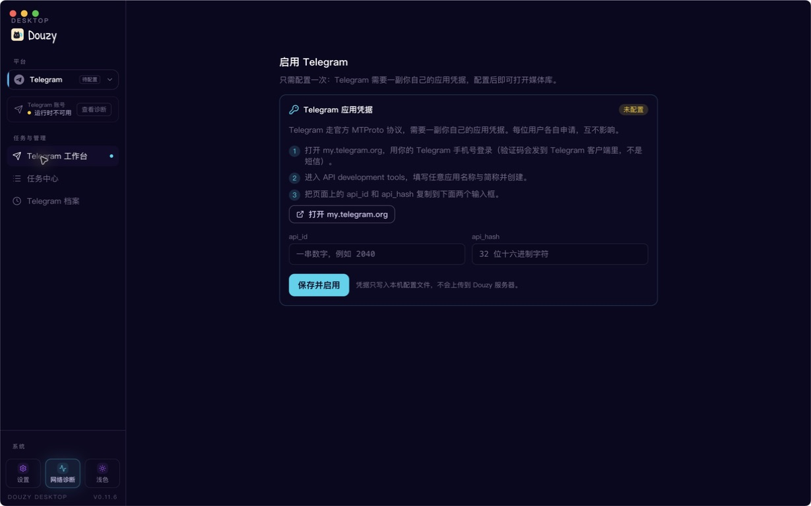
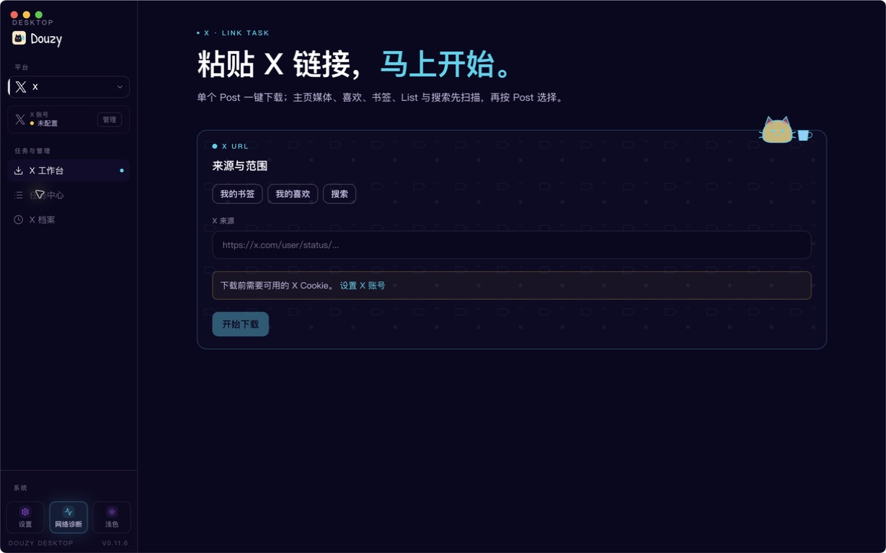

# 抖音下载器（Douyin Downloader）

<p align="center">
  
</p>

**简体中文** · [English](README.md)

下载抖音无水印视频和图文。日常使用选 **Douzy 桌面版**，脚本集成选 **Python 命令行版**。

## Douzy 桌面版

支持 **抖音、TikTok、YouTube、Telegram、X**。粘贴链接下载，查看任务进度，管理本地作品档案。

**[下载 Windows / macOS 版](https://github.com/jiji262/douyin-downloader/releases)**

平台功能由已启用的插件或本机组件提供，部分批量与高级功能需要激活。

| 平台 | 内容 |
|:---|:---|
| 抖音 | 视频、图文、主页、合集；关注、订阅、收藏与喜欢 |
| TikTok | 公开视频、图集与主页 |
| YouTube | 视频、Shorts、频道、播放列表；音频与字幕 |
| Telegram | 有权访问的聊天、群组与频道媒体；需配置并登录 |
| X | 帖子、主页媒体、自己的书签与喜欢；需配置账号 Cookie |

| **抖音** | **TikTok** | **YouTube** |
|:---:|:---:|:---:|
| [](img/desktop/001.png) | [](img/desktop/002.png) | [](img/desktop/003.png) |
| **Telegram 接入** | **X** | **平台切换** |
| [](img/desktop/004.png) | [](img/desktop/005.png) | [](img/desktop/006.png) |

_截图来自 macOS 上的 Douzy 0.11.6；Telegram 展示配置前的接入页。点击图片可放大。_

## 命令行版现状

命令行版仅支持**抖音**，提供批量下载、日期筛选、失败重试、下载历史，以及可选的评论采集、视频转写和完成通知。

> **下载限制：** 抖音接口风控目前阻止 CLI 下载单个视频／图文、合集、音乐、喜欢和收藏。主页作品可尝试 Playwright 浏览器兜底，但不保证成功。日常下载建议使用 **Douzy**。

更新 Cookie 或反复重试不能解决这类风控。直播录制属于实验功能；HLS 源仅保存播放列表，不是可直接播放的视频。

## 快速开始

需要 **Python 3.9+**，支持 Windows、macOS 和 Linux。使用前请先阅读上方 CLI 限制。

### 1. 安装

```bash
git clone https://github.com/jiji262/douyin-downloader.git
cd douyin-downloader
python -m pip install -r requirements.txt
python -m pip install playwright
python -m playwright install chromium
```

### 2. 配置并登录

将 [config.example.yml](config.example.yml) 复制为 `config.yml`：

```bash
cp config.example.yml config.yml
python -m tools.cookie_fetcher --config config.yml
```

Windows PowerShell 请用 `Copy-Item config.example.yml config.yml` 复制文件。在浏览器中登录抖音，再回到终端按 Enter 保存 Cookie。

把 `config.yml` 中的示例 `link` 换成目标博主主页，保留已保存的 Cookie，按需修改以下字段：

```yaml
link:
  - https://www.douyin.com/user/YOUR_SEC_UID
path: ./Downloaded/
mode: [post]
number:
  post: 10                 # 0 表示不限数量
increase:
  post: true              # 跳过已下载作品
redownload_missing_files: true
```

### 3. 运行

```bash
python run.py -c config.yml
```

全部参数见 `python run.py --help`。

| 参数 | 用途 |
|:---|:---|
| `-c, --config` | 配置文件 |
| `-u, --url` | 追加链接，不会替换配置中的链接；可重复使用 |
| `-p, --path` | 下载目录 |
| `-t, --thread` | 并发下载数 |
| `-v, --verbose` | 详细日志 |

## 常用配置

完整配置与示例见 **[config.example.yml](config.example.yml)**。

| 配置 | 用途 |
|:---|:---|
| `number.post` | 下载数量；`0` 表示不限 |
| `start_time` / `end_time` | 日期范围（`YYYY-MM-DD`），包含结束日期当天 |
| `video_quality` | 默认 `highest`；`original` 尝试原片，失败时回退 |
| `increase.post` | `true` 跳过已下载作品；`false` 重下并覆盖当前筛选范围内的文件 |
| `redownload_missing_files` | 默认 `true`：文件缺失时补下；设为 `false` 后，有有效数据库记录的作品仍会跳过 |

增量下载会检查磁盘上的非空主媒体文件。需要重新下载时，将 `increase.post` 设为 `false`，**无需清空数据库**。`like`、`mix`、`music` 也有对应开关。

<details>
<summary>更多命令</summary>

```bash
# 热搜榜、关键词搜索 → JSONL
python run.py --hot-board 30
python run.py --search "猫咪" --search-max 50

# 可选 REST API 服务
python -m pip install fastapi uvicorn
python run.py --serve --serve-port 8000
```

评论采集、视频转写、完成通知和直播录制均在 [config.example.yml](config.example.yml) 中配置。

</details>

## 常见问题

**Cookie 失效？** 重新运行 `python -m tools.cookie_fetcher --config config.yml`。

**主页只获取到少量作品？** 保持 `browser_fallback.enabled: true`、`headless: false`，在浏览器中自行完成验证；当前风控仍可能阻止下载。

**需要查看日志？** 运行 `python run.py -c config.yml -v`。

## 开发

```bash
python -m pip install -e ".[dev]"
python -m pytest tests/
ruff check .
```

## 社区与许可

[QQ 交流群](https://qm.qq.com/q/8wrCzYyLHa) · [LINUX DO](https://linux.do/) · [MIT 许可证](LICENSE)


仅用于学习和个人数据管理。请遵守版权、隐私与平台规则，并自行承担使用责任；平台变化可能影响功能可用性。

## Star History

[查看 GitHub Star History](https://www.star-history.com/?repos=jiji262%2Fdouyin-downloader&type=date&legend=top-left)
